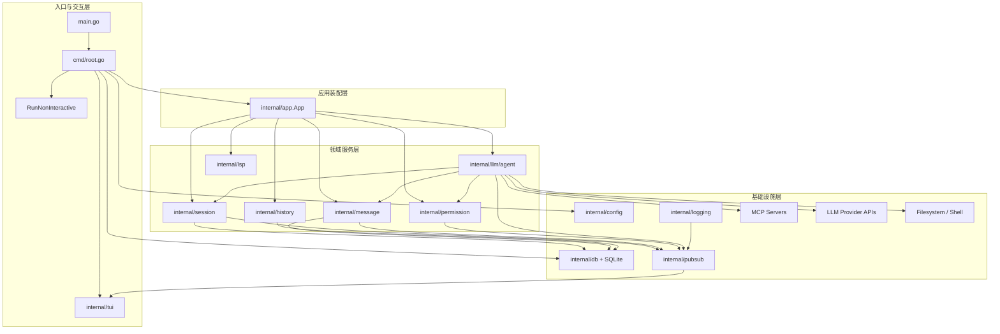
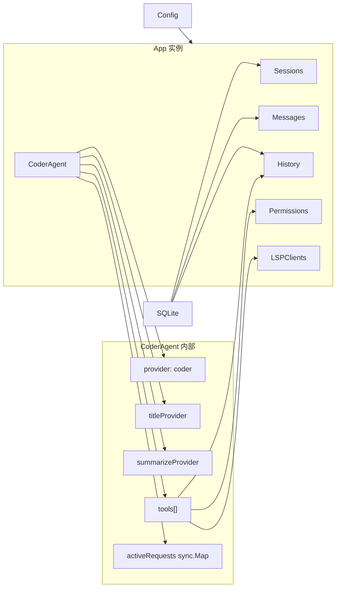
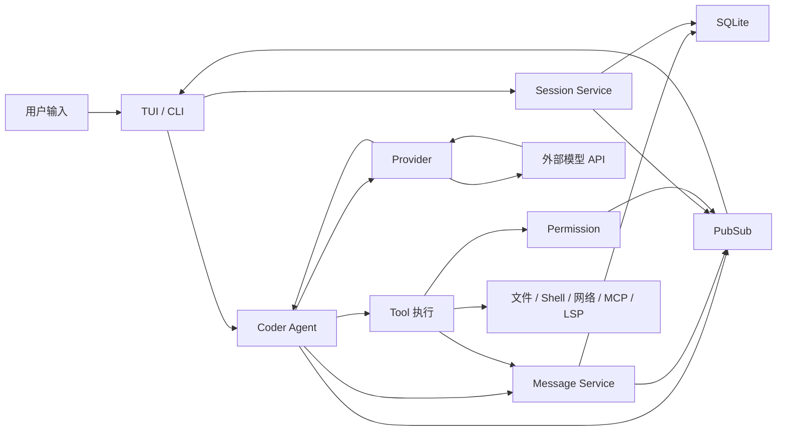

# OpenCode 系统架构总览：面试官追问版

本文不是普通“架构介绍”，而是按资深 Agent 工程师 / Google 风格系统设计面试的视角来拆 `opencode`：

- 它为什么这么分层
- 每一层解决什么非显然问题
- 面试官会怎么追问
- 哪些地方是强设计，哪些地方是未来演进点

---

## 1. 一句话定义

`opencode` 是一个终端型 Agent Runtime，不是一个聊天 UI。

它的核心不是“有个大模型”，而是：

- 用 `Session` 管状态边界
- 用 `Agent` 管控制循环
- 用 `Tool` 管动作空间
- 用 `Provider` 管多模型接入
- 用 `Permission` 管副作用风险
- 用 `SQLite` 管持久化事实
- 用 `PubSub + TUI` 管交互与观测

如果面试里你只能说“它是一个基于 Go 的终端 AI 助手”，这个层级还不够。

---

## 2. 总体分层图

### 2.1 图后结论

这张图最重要的不是“有哪些模块”，而是它展示了 3 件事：

1. Agent 并不直接等于模型，模型 API 只是 Agent 的一个依赖
2. 运行时状态不在 UI 里，而在领域服务层和 DB 里
3. UI 通过 PubSub 订阅系统事件，而不是直接操控业务对象

### 2.2 面试官会追问什么

- 为什么 `App` 单独存在，而不是直接在 `cmd/root.go` 里 new 所有服务？
- 为什么 `TUI` 不直接调用 `session/message/permission`？
- 为什么 `Provider` 不放进 `config` 层？
- 为什么 `MCP` 被放在基础设施依赖，而不是领域层？

### 2.3 好答案应该怎么答

- `App` 是装配边界，不是业务边界；它降低入口层复杂度
- `TUI` 订阅事件而不是侵入逻辑，有利于未来替换 UI 或跑 headless
- `Provider` 是执行适配层，属于 runtime，不只是配置
- `MCP` 在运行时像外部能力注入，所以画在基础设施依赖更合理

### 2.4 反模式

典型错误设计是：

- CLI 入口直接 new 一堆对象并互相传来传去
- UI 直接操作 DB
- Provider 和模型配置散落在业务代码里
- Tool 系统绕开 Agent 直接被 UI 调

这些设计短期能跑，长期会不可维护。

---

## 3. 分层为什么合理

### 3.1 入口层

入口极薄，只做：

- 启动
- 参数解析
- 模式切换
- panic 兜底

这类设计的工程含义是：把“如何启动系统”和“系统如何工作”分开。

#### 面试追问

- 为什么这不是过度抽象？

#### 回答

因为 runtime 本身已经足够复杂，入口再背业务逻辑只会让耦合失控。对于长期演进的 Agent 系统，薄入口几乎是必需的。

### 3.2 App 装配层

`App` 是装配中心，而不是业务中心。它只负责把：

- Session
- Message
- History
- Permission
- Agent
- LSP

连起来。

#### 面试追问

- 为什么不引入完整 DI 容器？

#### 回答

当前系统规模下，`App.New` 已经足够表达依赖关系。引入更重 DI 框架不一定带来净收益。这里体现的是克制，而不是“不会做架构”。

### 3.3 领域服务层

这是最值得学习的一层，因为 Agent 工程真正的复杂性都在这里：

- `agent` 解决控制循环
- `session` 解决状态边界
- `message` 解决结构化事实持久化
- `permission` 解决副作用治理
- `history` 解决回滚与审计
- `lsp` 解决代码语义增强

#### 面试追问

- 为什么 `history` 不并进 `message`？

#### 回答

因为它们表达的是两种不同事实：

- `message` 是交互事实
- `history` 是文件版本事实

把它们揉在一起会污染边界。

### 3.4 基础设施层

这一层并不“次要”，它决定系统能否实际运转：

- `config` 决定角色-模型路由
- `db` 决定运行事实能否持久化
- `provider` 决定多模型能否统一接入
- `pubsub` 决定 UI 能否解耦

#### 面试追问

- 为什么 `pubsub` 值得单独抽出来？

#### 回答

因为它把“状态变化”从“状态读取”中解耦了。对 TUI 这类持续刷新界面，这种设计远优于到处传回调或共享可变对象。

---

## 4. 核心运行时对象图

### 4.1 这张图真正揭示了什么

最重要的点有三个：

1. 一个主 Agent 持有多个 Provider，不是单一模型实例
2. Agent 不仅依赖工具，还依赖取消注册表 `activeRequests`
3. Tool 不是直接面向 UI，而是面向权限、历史、LSP 这些系统级能力

### 4.2 面试官会追问什么

- 为什么 `titleProvider` 和 `summarizeProvider` 不复用主 provider？
- 为什么 `activeRequests` 选择 `sync.Map`，不是普通 map + mutex？
- 为什么 LSP client map 放在 `App` 而不是 `Tool` 内部？

### 4.3 答案要点

- 不同角色的目标函数不同，所以 provider 不应强耦合
- `sync.Map` 适合并发读多、键动态的取消注册场景，虽然不一定是唯一选择
- LSP 是跨多个工具共享的运行时资源，应作为上层注入，而不是分散复制

### 4.4 这里隐藏的高级问题

这张图还能引出一个经典问题：

“如果要把 `opencode` 变成多租户或服务端 Agent 平台，这些对象应该如何重新分层？”

答案通常包括：

- `App` 从进程级转为 tenant/session scoped container
- `activeRequests` 从本地内存转成更可观测的 request registry
- `LSPClients` 变成 workspace-scoped pool

---

## 5. 为什么这不是“一个模型 + 一个 prompt”

这句话非常重要，但在深水区版本里，要把它说得更严谨。

### 5.1 少了哪些层就不能叫成熟 Agent

至少少不了：

1. 控制循环
2. 状态持久化
3. 动作平面
4. 权限治理
5. 失败处理
6. 观测与审计
7. 上下文压缩
8. 成本统计

`opencode` 之所以值得学习，是因为这些层都已经显式存在。

### 5.2 面试追问

- 如果一个系统有 prompt、有 function calling、有 shell tool，它就算 Agent 吗？

### 5.3 更好的回答

未必。要看它有没有：

- 任务级状态边界
- 可持续的控制循环
- 副作用治理
- 可解释的完成判定
- 失败后还能追溯

很多 demo 只解决了“会调工具”，没解决“系统是否可信”。

---

## 6. 数据流总览

### 6.1 图后结论

这张图最应该让你意识到：

- 用户输入先进入 runtime，而不是直接进入模型
- 模型输出也不会直接展示给用户，而是会先穿过 Tool、Message、Session、PubSub 这些层
- Agent 系统里的“输入输出”本质上是有执行副作用的 dataflow

### 6.2 面试追问

- 为什么 `TUI` 同时连到 `Session` 和 `Agent`？
- 为什么 Tool 结果还要再进入 Message，而不是只返回给 Agent 内存里用？
- 为什么 `Provider` 和 `Tool` 是串行关系，不是并行关系？

### 6.3 答案要点

- TUI 既要操控会话，也要发起请求，这是两类不同职责
- ToolResult 入 Message 是为了持久化、回放、Provider 再注入和 UI 呈现
- 当前设计中工具调用是推理后的执行动作，因此串行更利于一致性

---

## 7. 子系统职责表

| 子系统 | 目录 | 主要职责 | 高级视角下的真正意义 |
| --- | --- | --- | --- |
| CLI | `cmd/` | 启动、参数解析、模式切换 | 控制平面入口 |
| App | `internal/app` | 服务装配、非交互运行、LSP 生命周期 | 本地运行时容器 |
| Agent | `internal/llm/agent` | 推理编排、工具循环、摘要、标题、成本 | 控制循环核心 |
| Models | `internal/llm/models` | 模型元数据注册 | 资源目录与能力账本 |
| Provider | `internal/llm/provider` | 适配多厂商 API | 模型执行适配层 |
| Prompt | `internal/llm/prompt` | 组装系统提示词 | 行为约束注入层 |
| Tools | `internal/llm/tools` | 文件读写、命令执行、检索、补丁等 | 动作空间定义层 |
| Session | `internal/session` | 会话生命周期与成本统计 | 状态边界与归因边界 |
| Message | `internal/message` | 消息结构持久化 | 运行事实层 |
| Permission | `internal/permission` | 工具审批 | 风险治理层 |
| History | `internal/history` | 文件改动留痕 | 回滚与审计层 |
| LSP | `internal/lsp` | 诊断与代码理解 | 语义增强层 |
| TUI | `internal/tui` | 交互界面、事件展示 | 人类控制台 |

---

## 8. 这套架构最强的地方

### 8.1 真正把运行时边界立住了

不是简单把模型接进终端，而是把：

- Session
- Message
- Permission
- History
- Cost
- Cancel

都做成了显式能力。

### 8.2 多角色、多 Provider 路由很自然

这让 `opencode` 具备很好的演化性：

- 可以按角色换模型
- 可以按环境换 Provider
- 可以把高成本与低成本角色分开

### 8.3 安全策略相对克制

尤其是“子代理只读”这件事，很能体现工程判断力。

---

## 9. 这套架构的主要短板

### 9.1 缺少显式 control-plane 级治理

对于个人 CLI 足够，但若走向团队级系统，会缺：

- 策略引擎
- 任务调度层
- 系统级 replay
- 分层 eval
- 预算与 SLA

### 9.2 控制循环的收敛策略还偏轻

当前更依赖模型和用户取消，而不是系统强约束：

- 没有显式最大工具轮数
- 没有重复调用检测
- 没有完成质量分级

### 9.3 记忆治理还在第一阶段

有会话历史和摘要，但还没有：

- 长期用户记忆
- 项目结构记忆
- 任务经验记忆
- 记忆召回评估

---

## 10. 面试官可能会让你现场改进什么

### 问题 1

“如果要防止无限工具循环，你会把逻辑加在哪一层？”

好答案：

- 主要加在 `agent.processGeneration`
- 配套加在日志和 UI 展示层
- 不建议放进单个 Tool 或单个 Provider

### 问题 2

“如果要把它改成团队级产品，第一步改哪里？”

好答案：

- 先补控制平面和策略治理
- 再补评测与回放
- 最后才是多代理并发写入

### 问题 3

“如果要支持 server mode，而不是本地 CLI，哪些对象要重构？”

好答案：

- `App` 生命周期
- `activeRequests`
- `LSPClients`
- `Permission` 响应通道
- 本地文件与 shell 执行边界

---

## 11. 最终评价

从深水区学习材料的角度看，`opencode` 最大的价值不是“它已经完美”，而是：

- 它已经把一个真实 Agent runtime 的骨架做出来了
- 它的边界足够清晰，适合反复追问
- 它还有足够多的空白，适合训练系统判断

如果你能把这一篇的每个小节都转化成自己的面试回答，并且能指出对应源码位置，你已经不只是会“使用 Agent”，而是在形成 Agent 架构能力。
