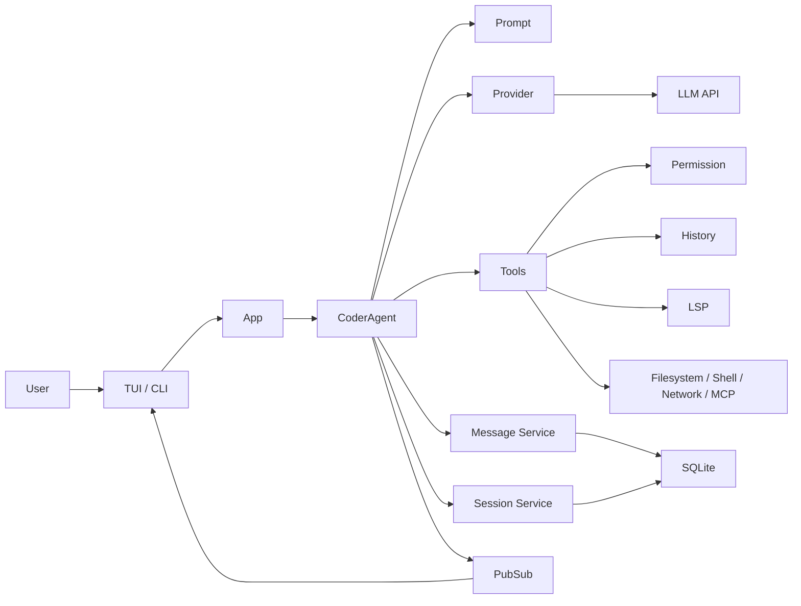
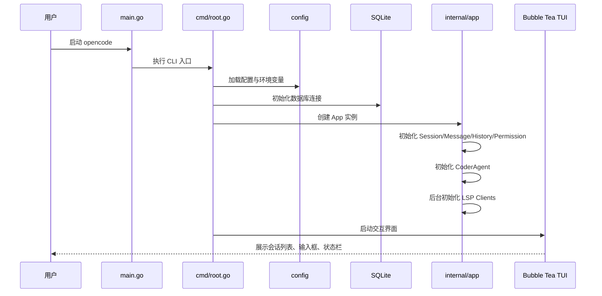
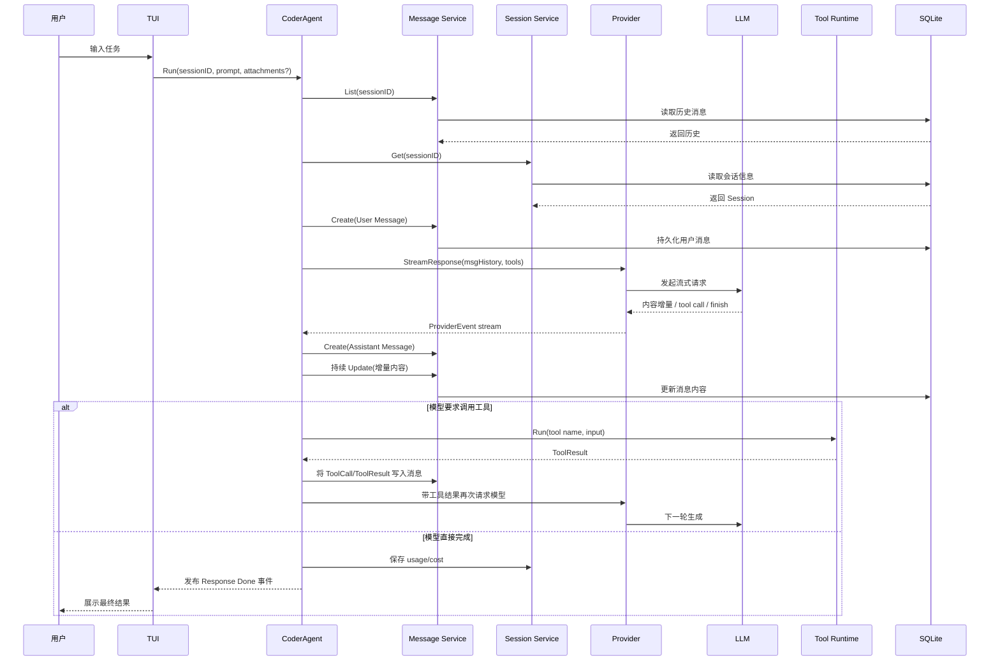
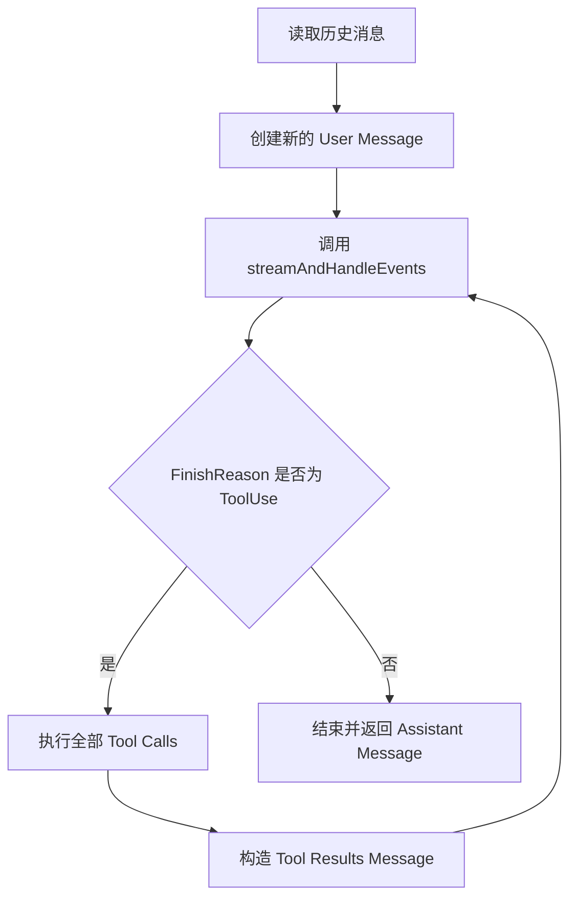
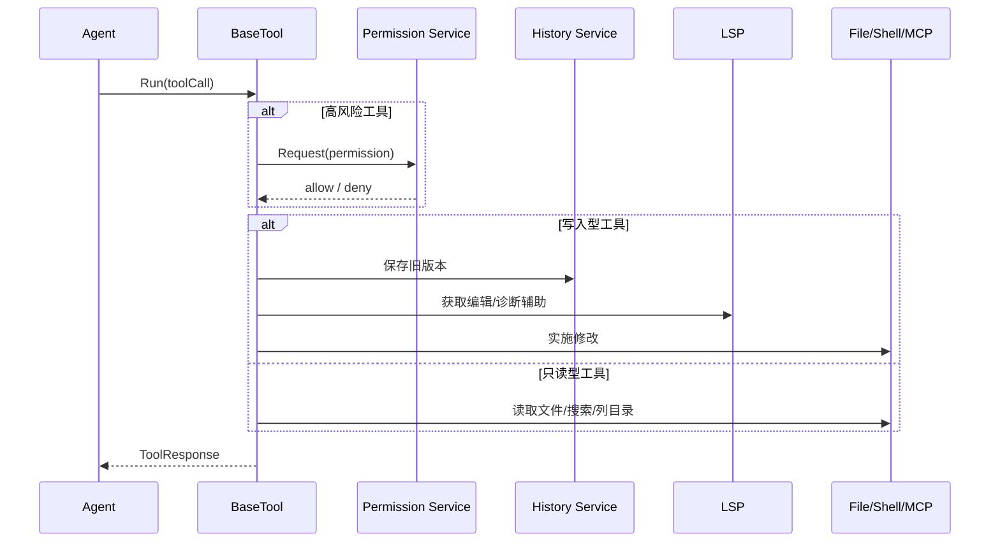
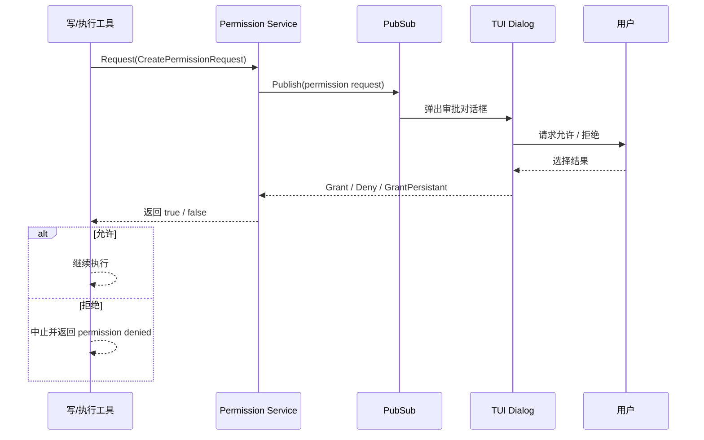
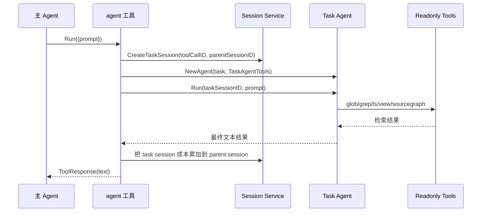
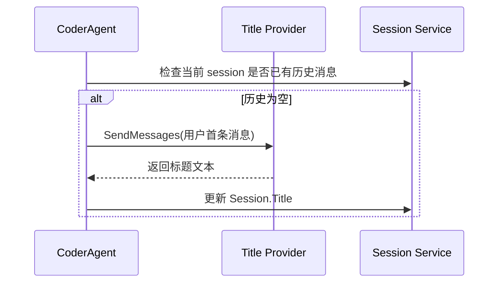
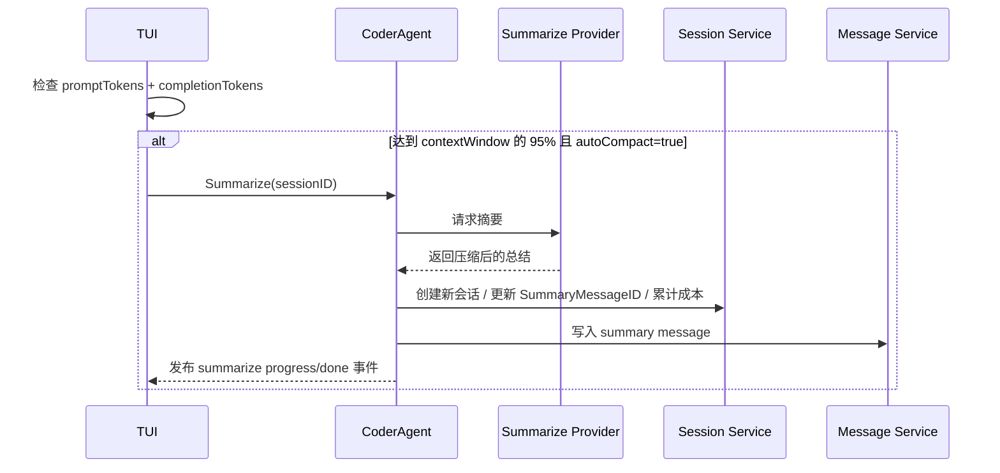
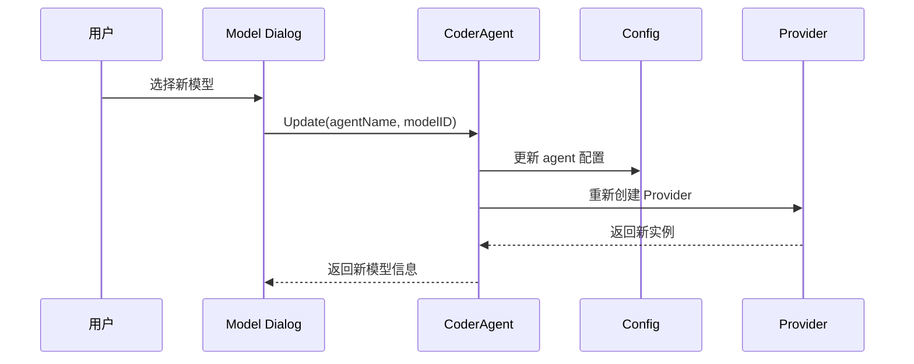

# OpenCode 模块调用流程与时序图：面试官追问版

这一篇不只是讲“流程怎么走”，而是把每张时序图后面最该追问的系统设计问题也写出来：

- 为什么这样走
- 哪一步最容易坏
- 一致性问题在哪里
- 如果要进化成生产级系统，应该怎么改

---

## 1. 总体模块调用关系

### 面试官追问

- 为什么 `Prompt` 不在 `Provider` 里构造？
- 为什么 `Tools` 不直接被 `TUI` 调？
- 为什么 `Message` 和 `Session` 分开存，而不是一个大表？

### 设计取舍

- Prompt 归 Agent 控制，说明行为边界属于 runtime，而不是模型 SDK 层
- Tool 归 Agent 控制，避免 UI 绕过权限和状态边界
- Message 和 Session 分开，利于持久化、聚合和成本归因

### 反模式

- UI 直接跑 shell
- Provider 直接拼 prompt
- 工具不走统一消息结构

---

## 2. 启动流程

### 2.1 启动顺序

### 设计取舍

- LSP 后台初始化，而不是阻塞启动，优先保证系统可用性
- App 统一装配，而不是让入口层承担依赖图
- TUI 最后启动，说明 UI 是 runtime 的消费者，不是核心逻辑承载者

### 面试官追问

- 如果 LSP 初始化失败，系统应该 degrade 还是 fail fast？
- 如果 DB 初始化失败，是否允许只读/临时会话模式？
- 如果配置里模型不可用，默认路由应在启动时报错还是自动兜底？

### 高级回答方向

`opencode` 当前总体偏向“尽可能启动起来”，这是一个 CLI 产品常见的务实选择。但如果是企业级服务端系统，部分依赖可能需要更明确的 health-state 暴露和 degraded mode 管理。

---

## 3. 用户发起一次请求的主时序

### 这张图的关键认知

这是一个“持久化驱动的控制循环”，不是单纯的内存内推理循环。

也就是说：

- 历史消息先落库
- Assistant message 先创建，再增量更新
- ToolCall 和 ToolResult 都写进消息结构
- usage 和 cost 最终回写 session

这意味着系统在任何时点都更容易 replay 和解释自己做过什么。

### 面试官追问

- 为什么 assistant message 要先创建一个空壳再持续 update？
- 如果流式请求中途失败，DB 中的 assistant message 算什么状态？
- 如果 tool 执行成功但回写 message 失败，会怎样？
- 是否存在 usage 已累计但消息未完整写入的窗口？

### 设计难点

这条链路里最经典的不是模型本身，而是“一致性窗口”：

- 模型流式响应和消息持久化不是同一个原子事务
- Tool 执行与 ToolResult 回写也不是同一事务
- 成本统计与最终完成状态也不是同一事务

这就是为什么 Agent 系统很难简单地用“请求成功/失败”二元论来描述。

### 如何继续演进

可以增加：

- 更显式的 message state
- execution step id
- completion quality state
- partial-failure tracing

---

## 4. Agent 内部推理循环

### 为什么这是最核心的图

因为它定义了 Agent 的最小行为闭环：

- observe
- infer
- act
- observe again

如果一个候选人看不出这是个控制循环，只把它当“调用一次 LLM，再执行函数”，那还停留在 function-calling 使用层。

### 面试官追问

- 如果 `D` 永远是是，会怎么办？
- `E` 里多个 tool call 是否应该并行？
- `F` 为什么要单独构造成 message，而不是内存变量？

### 设计取舍

- 当前设计偏向简单和一致性，而不是极致吞吐
- Tool results 被消息化，是为了 replay、provider 兼容和 UI 呈现
- 多个 tool call 理论上有并行空间，但要考虑依赖关系和顺序语义

### 反模式

- 不设任何循环熔断
- ToolResult 只存在内存，不落库
- 让 tool 直接把文本塞给用户，而不走下一轮推理

---

## 5. Tool 调用流程

### 5.1 工具调用时序图

### 面试官追问

- 为什么权限检查在 Tool 层，而不是 Agent 层？
- 为什么 `history` 是工具依赖，不是 Agent 依赖？
- 为什么只读工具不走权限系统？

### 好答案

- 权限判断应贴近副作用发生点，Tool 层最清楚动作语义
- `history` 只对写入动作有意义，不该污染整个 Agent
- 只读工具默认放行是体验与安全的平衡，但如果面向企业环境，也可能需要路径级读权限控制

### 这里隐藏的经典设计题

“如果一个命令工具既能读又能写，如何分类？”

好回答不是二选一，而是：

- 让工具声明 action class
- 权限系统按 action class 判断
- 最终风险分类不只看工具名，看具体参数与路径

---

## 6. 工具分类与主子代理边界

主代理默认工具：

- `bash`
- `edit`
- `fetch`
- `glob`
- `grep`
- `ls`
- `sourcegraph`
- `view`
- `patch`
- `write`
- `agent`
- 动态 MCP 工具
- 可选 `diagnostics`

子代理默认工具：

- `glob`
- `grep`
- `ls`
- `sourcegraph`
- `view`

### 面试官追问

- 为什么不让子代理有 `bash`？
- 如果你想做并发 patch lane，子代理还只读吗？
- `agent` 工具是子代理 runtime 还是任务外包接口？

### 标准级回答

当前设计把子代理定义为 research-only lane，这样：

- 风险最小
- 并发最容易做
- 主代理仍然拥有最终执行控制权

如果未来要升级为并行实现系统，必须补：

- ownership
- merge protocol
- path-scoped permission

否则直接让子代理写，是典型事故前奏。

---

## 7. 权限审批流程

### 为什么这张图重要

因为它说明 `opencode` 没把模型直接暴露给本地副作用，而是加了一层 human-in-the-loop 风险闸门。

### 面试官追问

- 为什么授权是 session-scoped，而不是 user-global？
- 为什么 persistent grant 要看 path 和 action，而不是只看 tool name？
- 如果用户长时间不响应审批，请求该如何处理？

### 高级回答方向

- Session-scoped 能控制 blast radius
- path + action 比 tool name 更接近真实风险模型
- 对长期未响应请求，未来可以设计 timeout / pending state / async resume

### 反模式

- 工具自行弹窗审批
- 授权不带路径粒度
- 允许一次授权覆盖全部未来会话

---

## 8. 子 Agent 调用流程

### 关键点

- 子代理是独立 session
- 子代理结果被压缩为单次返回
- 成本仍然回归父 session

### 面试官追问

- 为什么子代理 session id 直接使用 toolCallID？
- 为什么子代理是 stateless，不能持续通信？
- 子代理成本为什么回收到父 session？

### 答案要点

- 用 toolCallID 能天然关联这次代理外包调用
- stateless 降低了编排复杂度和上下文管理难度
- 成本回归父 session，才能从用户任务视角算总成本

### 演进问题

如果未来想支持多轮子代理协作，就必须新设计：

- agent mailbox
- agent graph
- task ownership
- cancellation propagation

---

## 9. 标题生成流程

### 面试官追问

- 为什么标题生成异步？
- 如果标题生成失败，是否应该影响主请求？
- 为什么标题单独有 provider，而不是主模型顺手生成？

### 回答

- 异步是因为它不是 critical path
- 标题失败不应阻断主任务
- 标题角色目标函数和成本模型完全不同，应单独路由

这正体现了“角色拆分”的工程价值。

---

## 10. 自动摘要压缩流程

### 这张图真正说明什么

自动摘要不是“模型突然想起该总结了”，而是 runtime policy。

这意味着：

- 触发条件是系统定义的
- 摘要是受控动作
- 上下文压缩是平台能力，不是模型美德

### 面试官追问

- 为什么阈值是 95%？
- 为什么在 TUI 里触发，而不是 Agent 内部自己触发？
- 如果摘要质量差，后续任务劣化怎么办？

### 高级回答

- 95% 是启发式阈值，不是理论最优
- 放在 TUI 触发，是当前架构中的务实实现；更平台化的未来版本可以下沉到 runtime core
- 摘要质量问题需要单独 eval 与可回放机制，不应盲信

### 演进方向

- task-aware compaction
- summary quality eval
- tool-result selective retention
- dynamic thresholding

---

## 11. 模型切换流程

### 面试官追问

- 运行中切模型，当前未完成请求怎么办？
- 只换 coder 模型，summary/title/task 是否要联动？
- 切换模型后，历史消息的兼容性是否有风险？

### 好回答

- 通常只对后续请求生效，不打断当前执行中的 request
- 不同角色是否联动，取决于产品策略；当前系统更偏角色独立
- 历史消息是统一结构，因此 Provider 侧要承担兼容转换

---

## 12. 这组时序图最值得学的 5 个结论

1. Agent 系统的关键不是“模型在哪”，而是“控制循环在哪”
2. 副作用执行必须被权限和历史系统包住
3. ToolResult 回注入是闭环成立的核心
4. 摘要和标题这类辅助动作最好脱离主 critical path
5. 子代理的能力边界决定了系统未来的复杂度上限

---

## 13. 如果你要把这篇用于面试训练

建议你对每张图都练 4 个回答：

1. 这张图在解决什么问题
2. 这张图里最容易出 bug 的点是什么
3. 这张图背后的主要取舍是什么
4. 如果要把它升级成团队级生产系统，你会先改哪里

如果你能对整篇每张图都这样回答，你就不是在“背流程”，而是在建立 Agent 系统设计能力。
