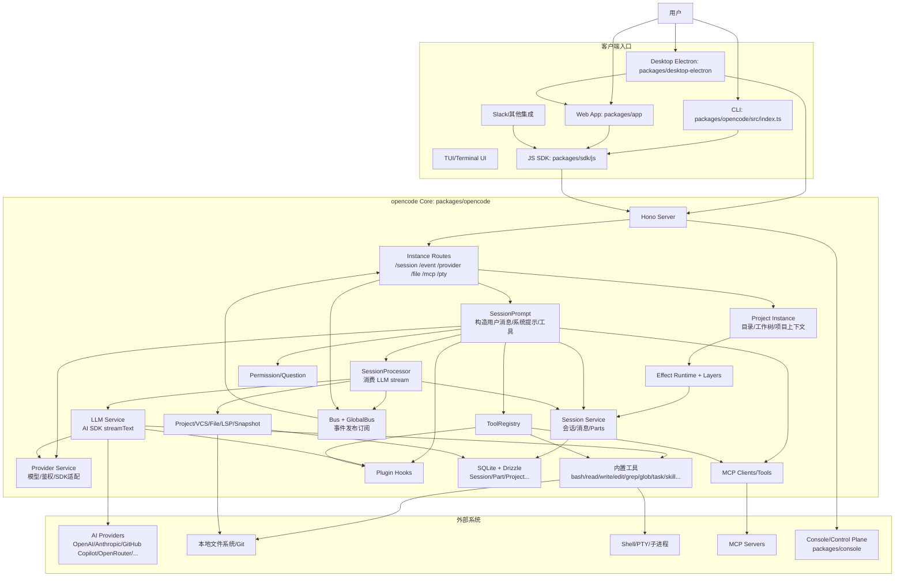
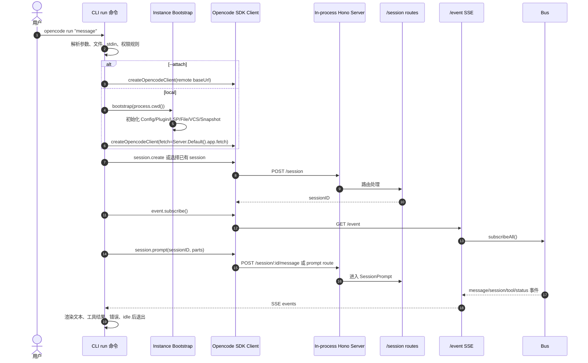
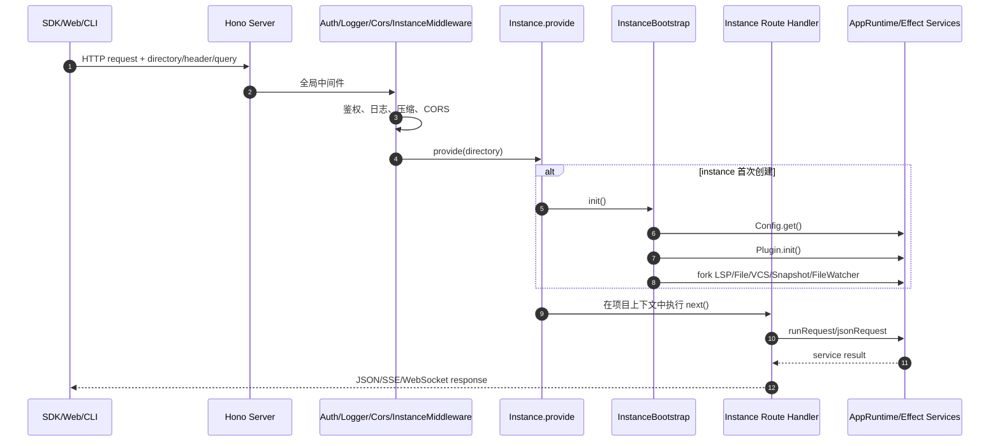
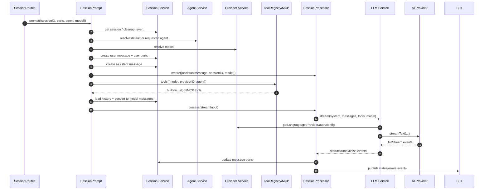
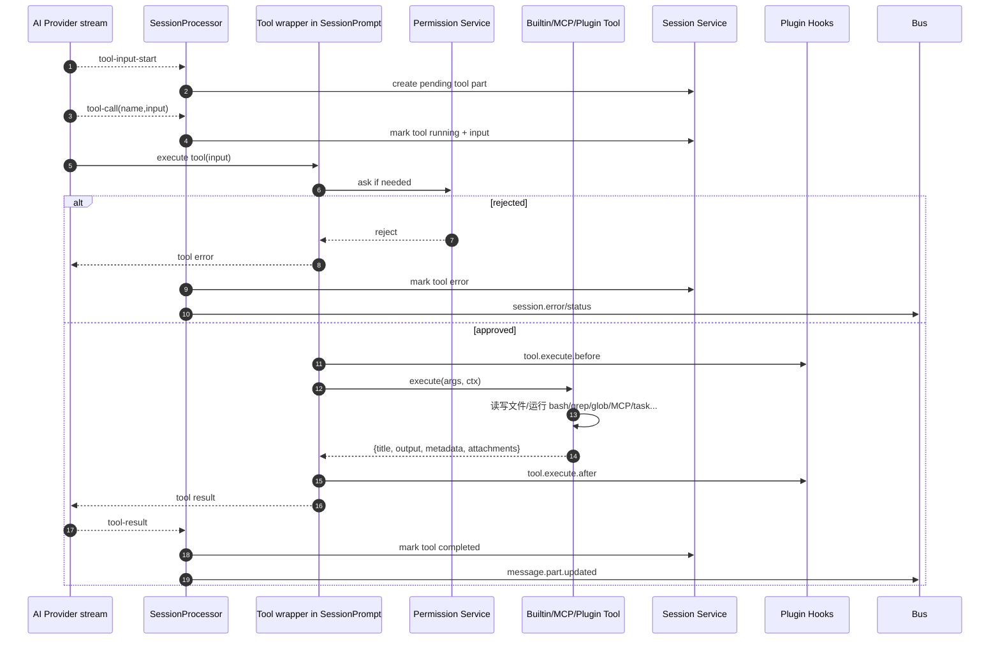
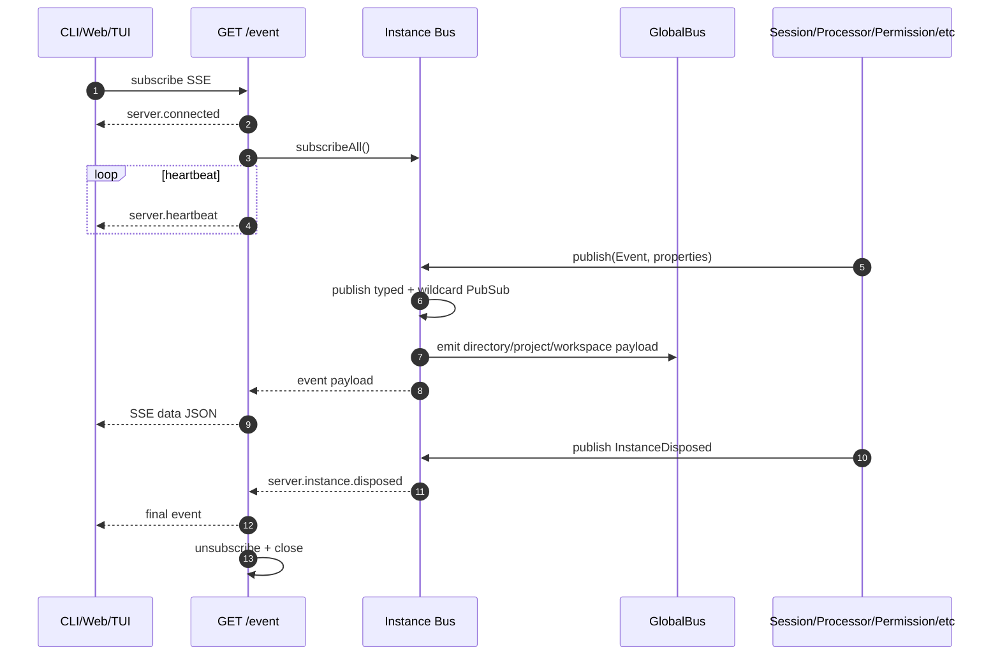
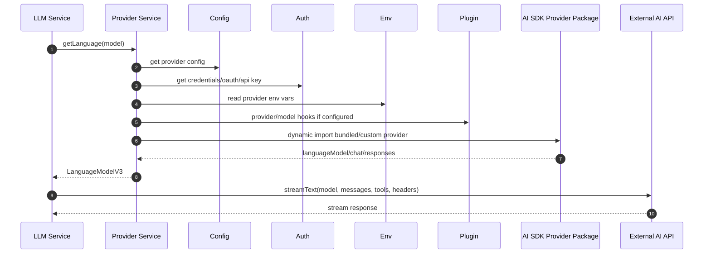
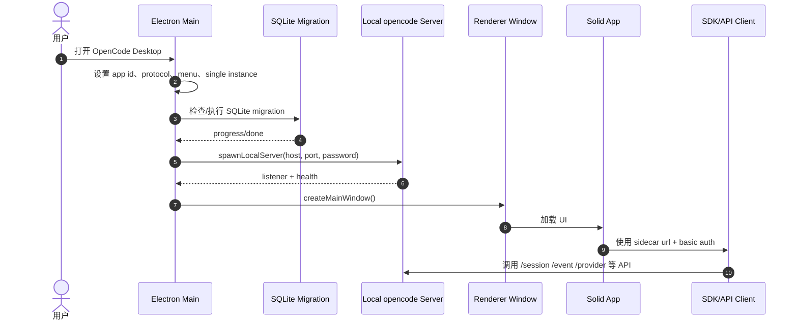
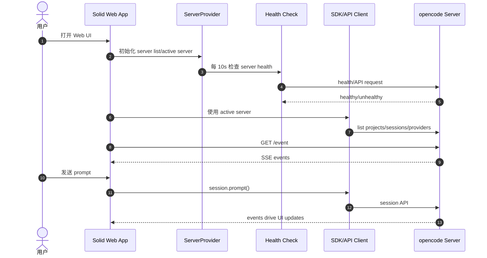
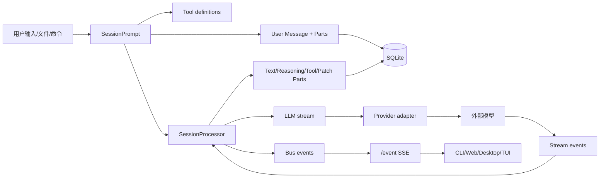

# opencode 架构图与时序图

本文基于当前代码结构整理，核心代码主要在 `packages/opencode/src`，外围包括 `packages/app`、`packages/desktop-electron`、`packages/sdk/js`、`packages/console/*`。

## 总体架构

## 组件职责

| 组件 | 主要职责 | 关键路径 |
|---|---|---|
| CLI | 命令解析、运行 `run/serve/web/session` 等命令 | `packages/opencode/src/index.ts`, `src/cli/cmd/*` |
| Server | Hono HTTP/SSE/WebSocket 服务，统一暴露 API | `src/server/server.ts`, `src/server/routes/instance/*` |
| Instance | 每个目录/项目的运行上下文，管理 project/worktree 生命周期 | `src/project/instance.ts`, `src/project/bootstrap.ts` |
| Session | 会话、消息、消息 part 的持久化和事件 | `src/session/session.ts`, `src/session/session.sql.ts` |
| SessionPrompt | 一轮用户输入的主编排：创建消息、解析 agent/model、准备 tools、启动 processor | `src/session/prompt.ts` |
| SessionProcessor | 消费 AI SDK stream，更新 text/reasoning/tool/patch parts，处理重试/压缩/错误 | `src/session/processor.ts` |
| LLM | 组装 system/messages/tools/headers/providerOptions，调用 `ai.streamText` | `src/session/llm.ts` |
| Provider | 模型发现、鉴权、provider SDK 动态加载和模型适配 | `src/provider/provider.ts` |
| ToolRegistry/Tools | 内置工具、插件工具、MCP 工具注册与执行 | `src/tool/registry.ts`, `src/tool/*.ts` |
| Bus | 实例级 PubSub + GlobalBus，把事件推送给 SSE/TUI/UI | `src/bus/index.ts`, `src/server/routes/instance/event.ts` |
| Storage | SQLite/Drizzle，存储 session/project/message parts | `src/storage/*`, `src/**/*.sql.ts` |
| Web/Desktop | Solid UI 和 Electron 宿主，连接本地/远端 opencode server | `packages/app`, `packages/desktop-electron` |
| SDK | 生成/封装 HTTP client/server，供 CLI/Web/外部集成使用 | `packages/sdk/js/src/v2` |

## CLI Run 时序

## Server/Instance 请求时序

## Session Prompt + LLM 主链路

## 工具调用时序

## 事件流时序

## Provider/模型解析时序

## Desktop 启动时序

## Web App 连接时序

## 数据流总结

## 关键架构边界

| 边界 | 当前设计 |
|---|---|
| 客户端到核心 | 全部尽量通过 HTTP/SSE SDK 访问，即使 CLI 本地 run 也用 in-process fetch 调 Server |
| 项目隔离 | `Instance.provide(directory)` 建立目录级上下文，`InstanceState` 管理每个实例服务状态 |
| 业务编排 | `SessionPrompt` 是一轮对话的入口编排，`SessionProcessor` 专注消费流事件 |
| 模型适配 | `Provider` 屏蔽不同 AI SDK provider、鉴权、模型配置差异 |
| 工具系统 | `ToolRegistry` 聚合内置工具、插件工具、MCP 工具，执行时统一走 permission/plugin/truncation |
| UI 更新 | 所有重要状态更新落库并发布 Bus 事件，再通过 SSE 推给客户端 |
| 扩展点 | Plugin hooks、MCP、Agent/Skill、Provider config 都是主要扩展面 |
