# Opencode 源码导读

## 概述

本文档为 `opencode` 项目的源码导读，通过时序图详细展示系统的整体架构、核心流程及关键模块的实现细节。

**源码路径**: `~/SourceCode/opencode/packages/opencode/src/`

---

## 一、整体架构概览

### 1.1 目录结构总览

```
packages/opencode/src/
├── agent/              # Agent 核心：角色定义、任务规划、工具调用
├── config/             # 配置系统：统一配置管理、多环境适配
├── tool/               # 工具系统：40+ 内置工具 + 插件工具注册
├── provider/           # Provider 层：LLM 模型路由、认证、成本治理
├── session/            # 会话管理：消息处理、上下文压缩、持久化
├── server/             # 服务端：HTTP API、WebSocket、事件流
├── plugin/             # 插件系统：Skill 加载、动态扩展
├── mcp/                # MCP 协议支持：外部能力桥接
├── permission/         # 权限治理：细粒度访问控制、审批流程
├── storage/            # 存储层：SQLite 数据库、迁移管理
├── util/               # 工具函数：通用工具、Error 处理
└── cli/                # CLI 入口：命令解析、UI 渲染
```

---

### 1.2 启动流程时序图

**用户视角**:
```
# 在终端输入命令
opencode run my-project
```

**本节读法**：先一张**总览图**给出从敲下命令到进程退出的全部 10 跳（标了 `[J1]`~`[J10]`），它相当于目录；再用 **B1~B5 五张分图**把每一段放大。分图之间首尾相接：每张图末尾的 Note 会写明"接 J 几、进哪张分图"。所有箭头都有源码对应，行号以当前分支 `trace_v1.14.22` 为准；未特殊说明时文件路径相对于 `packages/opencode/src/`。

#### 总览图：从 `opencode run` 到进程退出

```mermaid
sequenceDiagram
    autonumber
    participant User as 用户终端
    participant Idx as index.ts 进程入口
    participant Run as cli/cmd/run.ts
    participant Boot as bootstrap 实例层
    participant App as server.ts Hono 路由 进程内
    participant Prompt as prompt.ts 轮次引擎
    participant Proc as processor.ts + llm.ts
    participant Store as session.ts + sync 事件溯源

    User->>Idx: [J1] opencode run "..." 触发 cli.parse (index.ts:269)，先跑全局中间件 (index.ts:114-214)，再分派 RunCommand.handler (run.ts:395)
    Run->>Run: [J2] 参数整理 (:398-452) 后在 :811 分叉：attach 直连远端 execute (:820-821)，本地模式进 :825 bootstrap
    Run->>Boot: [J3] bootstrap(cwd, cb) → Instance.provide → InstanceBootstrap 按序拉起 Config → Plugin → 并行 7 服务 → Bus (project/bootstrap.ts:17-42)
    Boot-->>Run: cb() 在实例上下文中执行，结束后 finally Instance.dispose (cli/bootstrap.ts:14)
    Run->>App: [J4] cb 内 :827-830 构造 fetchFn（Request 直接喂 app.fetch，无网络）→ :831 createOpencodeClient → :832 execute(sdk)
    Run->>App: [J5] :773 调 session()（定义 :493）list/create/fork 会话（路由 session.ts:39/206/372）→ Session 服务 → 事件溯源落库
    Run->>App: [J6] :567 订阅 /event SSE，:571 定义 loop()、:781 后台启动（只渲染），:800 sdk.session.prompt 提交唯一一次用户输入
    App->>Prompt: [J7] POST /session/:id/prompt（路由 :851）→ SessionPrompt.prompt (prompt.ts:1583) → :1629 loop() → :1677 runLoop 每轮判定：退出 :1728、压缩 :1795-1800、subtask :1779
    Prompt->>Proc: [J8] :1935 handle.process (processor.ts:687) → :696 llm.stream (llm.ts:678 → AI SDK streamText :569)
    Proc->>Store: [J9] 各类 part 经 updateMessage/updatePart (session.ts:489/501) → SyncEvent.run (sync/index.ts:215) 同一事务 projector upsert (projectors.ts:96/136)
    Store-->>Run: [J10] 事务提交后 GlobalBus 广播 (sync/index.ts:152) → Bus.subscribeAll 转 SSE (event.ts:76) → run.ts loop() for await 消费渲染 (:575-656)
    Proc-->>Prompt: 一轮结束返回 "compact" / "stop" / "continue" (processor.ts:732-734)，runLoop 据此 continue 或 break
    Prompt-->>Run: runLoop 结束 → session.status 变 idle → CLI loop() break (:674-679)，:800 的 await prompt 也已拿到最终消息
    Run->>Idx: execute() 返回 → bootstrap finally dispose → cli.parse 结束 → index.ts:315 process.exit()
```

| 分图 | 覆盖跳跃 | 内容 | 关联小节 |
|---|---|---|---|
| B1 | J1-J3 | 进程入口、中间件、命令分派、实例引导 | 1.2.1 Config 初始化 |
| B2 | J4-J5 | 进程内通道、SDK/Hono、会话查询/创建与事件溯源 | 1.2.2 Session 启动流程 |
| B3 | J7 | 服务端对话入口与 runLoop 轮次引擎 | 2.3 上下文压缩 |
| B4 | J8-J9（推理侧） | 一轮流式推理、工具执行、权限往返 | 2.2 工具调用、6.1 权限审批 |
| B5 | J9-J10（存储侧）+ 收尾 | 落库、事件回流 SSE、CLI 渲染、进程退出 | 4.1 数据存储、5.1 事件总线 |

#### B1 进程启动与命令分派（J1-J3）

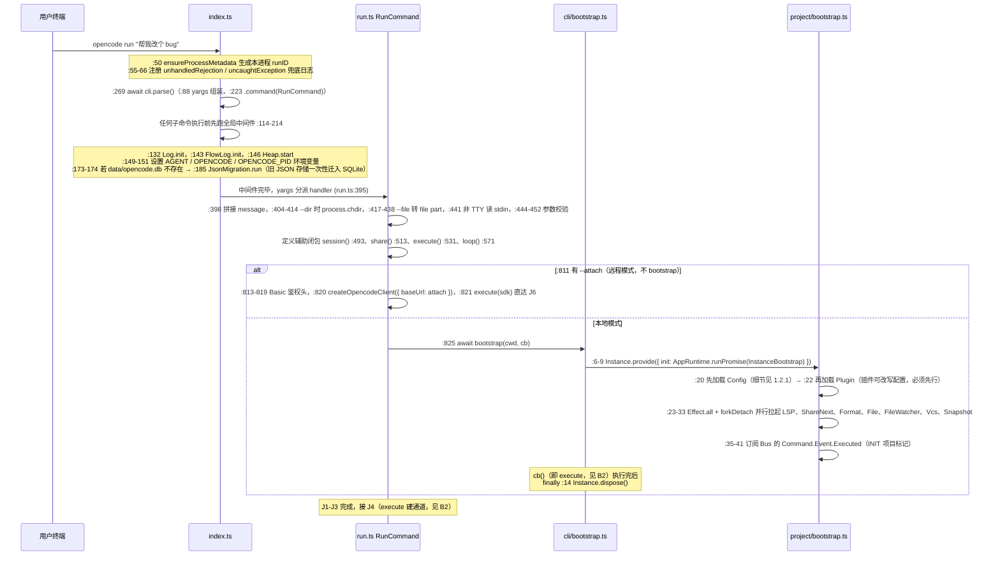

要点补充：

- 中间件是**所有子命令共用**的进程级初始化，此时还没有"项目实例"概念，只有日志与数据库迁移。
- `bootstrap()` 本身只有 14 行（cli/bootstrap.ts:5-18），真正的重活全在 `Instance.provide` 的依赖注入里：`init` 拉起实例、`fn` 在实例上下文中跑业务回调。
- `InstanceBootstrap`（project/bootstrap.ts:17-42）顺序是刻意的：**Config 最先（一切依赖它）→ Plugin 其次（插件会改配置）→ 其余服务并行 → Bus 订阅收尾**。

#### B2 进程内通道与会话落库（J4-J5）

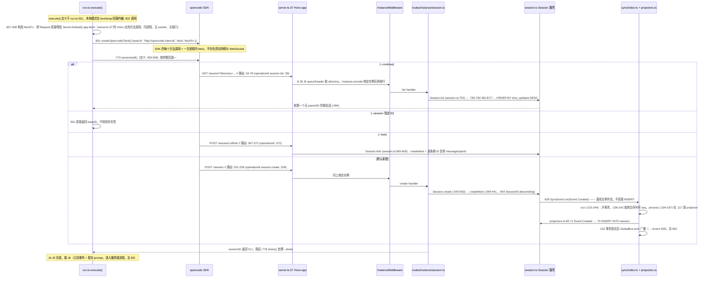

要点补充：

- **本地模式没有 server 进程**：`opencode run` 的"HTTP 调用"全部是进程内函数调用；只有 `--attach` 或 `opencode serve` 才是真的网络服务。
- **写路径统一走事件溯源**：任何创建/更新都是"发同步事件 → 同一事务里 projector 写表 → 提交后广播"，表只是事件流的投影（详见 1.2.2）。
- 事件回流通道是 **SSE**（`GET /event`，event.ts:14 路由、:44 streamSSE、:76 Bus.subscribeAll），不是 WebSocket。

#### B3 对话入口与 runLoop 轮次引擎（J7）

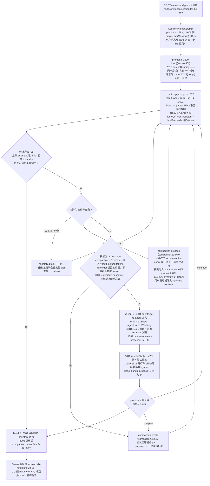

要点补充：

- 老图里的 `checkCompressionNeeded / countAllTokens / 100,000 硬编码 / generateSummary / truncateOlderMessages` 在这条链上**全部不存在**。真实的溢出判定只有两处：轮首的转折③（`isOverflow`，输入是上一轮 provider 报回来的 usage）和推理中途 finish-step 里的同款判定（processor.ts:499-508 置 `needsCompaction`，靠 `Stream.takeUntil`（processor.ts:700）提前掐断流）。
- 压缩**不删消息、不注入 system prompt**：`compaction.create` 只是插一条锚点 part，历史视图切换靠 `filterCompactedEffect`（prompt.ts:1691）按锚点过滤。

#### B4 一轮流式推理与工具执行（J8）

```mermaid
sequenceDiagram
    participant Prompt as prompt.ts runLoop 一轮
    participant Proc as processor.ts handle
    participant LLM as llm.ts + AI SDK
    participant Exec as 工具执行闭包（prompt.ts resolveTools 注册）
    participant Tools as tool/bash.ts 等具体工具
    participant Perm as permission/index.ts

    Prompt->>Proc: :1935 handle.process(streamInput)，进入 process（processor.ts:687）
    Proc->>LLM: :696 llm.stream（llm.ts:678）→ :688 run() → :569 AI SDK streamText（由 provider 适配器发真实 HTTP）
    Note over Proc: :698-701 fullStream 逐事件 Stream.tap(handleEvent :293)<br/>takeUntil(needsCompaction) 允许中途掐断
    loop 流事件逐个处理
        LLM-->>Proc: text-start :513（建 text part 并 updatePart 落库 :528）→ text-delta :531（updatePartDelta，只发 Bus 不落库，session.ts:702-711）→ text-end :544（plugin 后处理，最终 updatePart :563）
        LLM-->>Proc: tool-input-start :340 —— 建 pending 状态 tool part 并落库（:351-360）
        LLM-->>Proc: tool-call :375 —— updateToolCall 转 running（:381）；:403-427 若最近连续 3 次同工具同参数，触发 doom_loop 权限确认（permission.ask :420）
        Proc->>Exec: AI SDK 收到 tool-call 后自动调用工具的 execute(args, options) —— 该闭包在 resolveTools 里定义（prompt.ts:540-543）
        Exec->>Exec: :546 构造 ctx：metadata 回调 → updateToolCall（:509-522），ask 回调 → permission.ask（:523-531，规则集 = agent 权限 merge session 权限）；:563 plugin 钩子 tool.execute.before
        Exec->>Tools: :568 item.execute(args, ctx)，外面套 tool/tool.ts:119-181 的 wrap（:141-153 参数 zod 校验，:161-170 输出按 agent 配置截断）
        Tools->>Perm: 需授权时 ctx.ask → Permission.ask（permission/index.ts:269）：:324 建 Deferred 登记 pending，:326 bus.publish(permission.asked)，:328 挂起等待
        Perm-->>Tools: Permission.reply（:342）由 CLI/TUI 经 SDK 答复：:367-382 reject → Deferred.fail(RejectedError)，:388 once/always → Deferred.succeed（:409-414 always 还会放行同规则的其他挂起请求）
        Tools-->>Exec: ExecuteResult{title, metadata, output, attachments}。真实执行位置：bash 子进程 = bash.ts:584 spawner.spawn(cmd())（:384/:392 按平台选 shell），写文件 = write.ts:58-90（生成 diff → edit 权限 → fs.writeWithDirs），task = task.ts:107 建子会话 + :178 ops.prompt 递归回 J7
        Exec-->>Proc: :578 plugin 钩子 tool.execute.after，output 交回 AI SDK（自动包装成 tool-result 事件）
        LLM-->>Proc: tool-result :431 → completeToolCall（:217）把结果回填 tool part 并 updatePart 落库；tool-error :436 → failToolCall
        LLM-->>Proc: finish-step :455 —— :458 getUsage 计 tokens/cost 写回 message（:470-483），:473 step-finish part 落库（含 :476 snapshot.track 快照哈希），:499-508 若 isOverflow 置 needsCompaction
    end
    Proc-->>Prompt: :732-734 返回 "compact" / "stop" / "continue"（抛错路径 :712-727 先经 SessionRetry.policy 指数退避重试，仍失败则 :728 halt）
    Note over Perm: 权限往返也走 J10 回流：permission.asked 经 SSE 到 CLI，<br/>run 模式在 run.ts:683-702 处理——--dangerously-skip-permissions 自动回 once（:687-691），否则打印警告并自动回 reject（:693-701）；交互式批准是 TUI 的职责
```

要点补充：

- **工具执行不在 processor 的事件分支里**，而是 AI SDK 在 `streamText` 内部回调 `tool({ execute })`；processor 只观察 `tool-input-start / tool-call / tool-result / tool-error` 这些事件并维护 part 状态机（pending → running → completed/error）。
- 老图中的 `resolveToolFromResult / agent.ts:850 / checkFinalPermissions / tui/approval.tsx / spawnPty (pty.ts) / edit.ts:200 / "max 50 steps"` 均不存在：步数上限是 `agent.steps`（prompt.ts:1812，未配置则 Infinity），权限的真实入口只有一个——工具的 `ctx.ask` → `Permission.ask`。

#### B5 落库、事件回流与进程收尾（J9-J10）

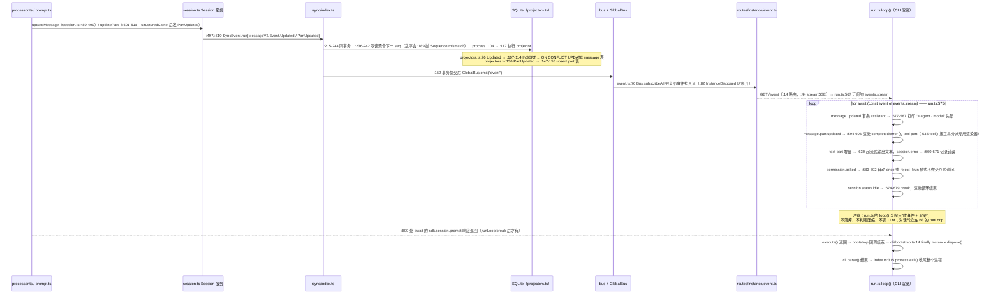

要点补充：

- **两条终点线**：CLI 的 `await sdk.session.prompt`（:800）等的是服务端 `runLoop` 的最终返回值；后台 `loop()`（:571）等的是 `session.status` idle。谁先结束都无所谓，`execute()` 返回后进程即走向 dispose + exit。
- **打字机效果不经过数据库**：流式增量走 `updatePartDelta` → `PartDelta` Bus 事件（session.ts:702-711，仅广播），完整 part 才经 `updatePart` 落事件流。


**关键文件与入口方法**（均为核实过的真实符号）:
- [`index.ts`](file:///Users/sunny/SourceCode/opencode/packages/opencode/src/index.ts): 进程入口——中间件 :114-214，注册命令 :223，`cli.parse()` :269，`process.exit()` :315
- [`cli/cmd/run.ts`](file:///Users/sunny/SourceCode/opencode/packages/opencode/src/cli/cmd/run.ts): `RunCommand`——handler :395，`session()` :493，`execute()` :531，渲染 `loop()` :571
- [`cli/bootstrap.ts`](file:///Users/sunny/SourceCode/opencode/packages/opencode/src/cli/bootstrap.ts): `bootstrap()` :5-18——`Instance.provide` 薄封装，finally dispose
- [`project/bootstrap.ts`](file:///Users/sunny/SourceCode/opencode/packages/opencode/src/project/bootstrap.ts): `InstanceBootstrap` :17-42——Config → Plugin → 并行服务 → Bus
- [`config/config.ts`](file:///Users/sunny/SourceCode/opencode/packages/opencode/src/config/config.ts): `Config` 服务 :301/:344，`loadConfig` :363，`loadInstanceState` :453-717（详见 1.2.1）
- [`session/prompt.ts`](file:///Users/sunny/SourceCode/opencode/packages/opencode/src/session/prompt.ts): `prompt` :1583，`runLoop` :1677，服务端 `loop` :2015，`resolveTools` :478
- [`session/processor.ts`](file:///Users/sunny/SourceCode/opencode/packages/opencode/src/session/processor.ts): `create` :150，`handleEvent` :293，`completeToolCall` :217，`process` :687
- [`session/session.ts`](file:///Users/sunny/SourceCode/opencode/packages/opencode/src/session/session.ts): `createNext` :394，`updateMessage` :489，`updatePart` :501，`updatePartDelta` :702，`list` :752
- [`sync/index.ts`](file:///Users/sunny/SourceCode/opencode/packages/opencode/src/sync/index.ts): `SyncEvent.run` :215，`process` :104（projector 调用 :117，提交后广播 :152）
- [`permission/index.ts`](file:///Users/sunny/SourceCode/opencode/packages/opencode/src/permission/index.ts): `ask` :269，`reply` :342，`evaluate` :215

---

#### 1.2.1 Config 如何初始化

B1 分图（J3）里 `project/bootstrap.ts` 第 20 行的 `yield* Config.Service.use((svc) => svc.get())` 只有一行，但它背后牵动了整套 Effect 依赖注入机制。这一小节结合 [`project/bootstrap.ts`](file:///Users/sunny/SourceCode/opencode/packages/opencode/src/project/bootstrap.ts)、[`config/config.ts`](file:///Users/sunny/SourceCode/opencode/packages/opencode/src/config/config.ts) 和 Effect 框架，把这条链讲透。

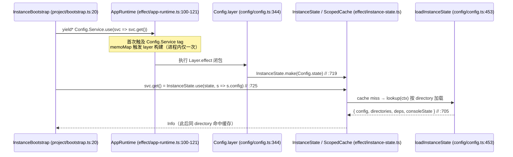

**① 触发点：为什么 bootstrap 第一件事就是 config**

`project/bootstrap.ts` 第 19 行的注释写明 "everything depends on config so eager load it for nice traces"。`Effect.gen` 里的 `yield* Config.Service.use((svc) => svc.get())` 只做两件事：向 Effect 上下文**要求** `Config.Service` 这个 tag，然后调用它的 `get()`。但正是这个 `yield*` 会连锁触发下面所有初始化。

**② Effect 依赖注入：Service 是 tag，Layer 是构造配方**

- [`config/config.ts`](file:///Users/sunny/SourceCode/opencode/packages/opencode/src/config/config.ts) 第 301 行：`class Service extends Context.Service<Service, Interface>()("@opencode/Config") {}`。按本仓库的模块规范（见 `packages/opencode/AGENTS.md`），Service 只是类型化的 Tag，`Interface`（第 290-299 行）声明 `get / getGlobal / update / invalidate / directories / waitForDependencies` 等方法。
- 第 344 行 `export const layer = Layer.effect(Service, Effect.gen(function* () {...}))` 才是实现：闭包里先 `yield*` 出 `AppFileSystem / Auth / Account / Env / Npm` 五个上游服务（第 347-351 行），然后**在闭包内定义** `loadFile`、`loadInstanceState`、缓存句柄等——这意味着这些变量天然成为"进程级单例"状态。
- 第 803-809 行 `defaultLayer = layer.pipe(Layer.provide(...))` 把五个上游依赖补齐，使 `Config.defaultLayer` 变成一个无剩余要求的完整配方。

**③ 装配：AppLayer + memoMap 决定 layer 闭包只跑一次**

[`effect/app-runtime.ts`](file:///Users/sunny/SourceCode/opencode/packages/opencode/src/effect/app-runtime.ts) 第 52-98 行把全部服务的 `defaultLayer`（含第 58 行的 `Config.defaultLayer`）`Layer.mergeAll` 成 `AppLayer`，第 100 行 `ManagedRuntime.make(AppLayer, { memoMap })`。关键是共享的 `memoMap`（`effect/memo-map.ts`）：Effect 构建 Layer 时按 memoMap 去重，所以 `config.ts:344` 的闭包**整个进程只执行一次**；`AppRuntime.runPromise(effect)`（第 108 行）会先经 `attach()`（第 102 行 → [`effect/run-service.ts`](file:///Users/sunny/SourceCode/opencode/packages/opencode/src/effect/run-service.ts) 第 26-36 行）把 ALS 里的 `Instance.current` 作为 `InstanceRef` 服务注入 fiber 上下文——这是后面"按目录取配置"的关键线索。`makeRuntime`（run-service.ts 第 38-52 行）是同一机制的单服务版封装。

**④ 上下文先行：Instance.provide 在 bootstrap 之前就绑定了 directory**

回看 B1（J3）：`cli/bootstrap.ts` 第 6-9 行的 `Instance.provide({ directory, init, fn })` 进入 [`project/instance.ts`](file:///Users/sunny/SourceCode/opencode/packages/opencode/src/project/instance.ts) 第 58-75 行——它先按 directory 查 `cache` Map（第 18、60-70 行，同目录复用实例），miss 时执行 `boot()`（第 25-46 行）：用 `Project.Service.fromDirectory` 解析出 `{ directory, worktree, project }`，然后第 41 行 `context.provide(ctx, async () => { await input.init?.() })` **把 ctx 压入 AsyncLocalStorage，才执行 `init = AppRuntime.runPromise(InstanceBootstrap)`**。所以 ① 里那次 `svc.get()` 运行时，`InstanceState.context`（[`effect/instance-state.ts`](file:///Users/sunny/SourceCode/opencode/packages/opencode/src/effect/instance-state.ts) 第 28-30 行：`(yield* InstanceRef) ?? Instance.current`）总能拿到当前目录。

**⑤ 双层缓存：进程级 global + 每目录 ScopedCache**

`Config.layer` 闭包内实际建立了**两层生命周期不同的缓存**：

- **全局层**：第 393-419 行 `loadGlobal` 依次合并全局目录的 `config.json`、`opencode.json`、`opencode.jsonc` 与 Codex 配置（第 402-416 行还会把 legacy TOML `config` 文件一次性迁移成 JSON）。第 421-429 行用 `Effect.cachedInvalidateWithTTL(..., Duration.infinity)` 包成 `cachedGlobal`——永久缓存、失败降级为 `{}`，并暴露 `invalidateGlobal` 句柄。
- **实例层**：第 719-723 行 `InstanceState.make<State>(Config.state)`。看 instance-state.ts 第 38-59 行：内部是 `ScopedCache.make({ lookup: () => init(yield* context) })`，**以 directory 为 key**；同一 closure 里第 50-53 行 `registerDisposer` 注册了"实例销毁 → `ScopedCache.invalidate(该目录)`"的回收钩子。这正是仓库 AGENTS.md 所说"per-directory state 用 InstanceState"的实现。
- 消费端：第 725-727 行 `get = InstanceState.use(state, s => s.config)`，即 `ScopedCache.get(cache, 当前目录)`（instance-state.ts 第 61-66 行）。因此 bootstrap.ts:20 那次 `get()` 是**本目录第一次真正加载**；之后 Config / Plugin / Provider / Agent 等所有 `yield* Config.Service` 方拿到的都是同一个 `Info` 对象。

**⑥ 真正的加载逻辑：loadInstanceState 的八类来源按序合并**

第 453-717 行，核心合并函数在第 489-492 行（`mergeConfigConcatArrays`，数组类字段做拼接、其余深合并，**后 merge 的覆盖先 merge 的**）。顺序即优先级：

1. 第 494-514 行：登录态中的 `wellknown` 类型 auth → 拉取 `${url}/.well-known/opencode` 企业远程配置；
2. 第 516-517 行：merge 全局配置（⑤ 的全局层）；
3. 第 519-522 行：`OPENCODE_CONFIG` 环境变量指定的文件；
4. 第 524-528 行：项目配置——`ConfigPaths.files("opencode", ctx.directory, ctx.worktree)` 从 cwd 向上走到 worktree 逐层找 `opencode.json` / `opencode.jsonc`；
5. 第 542-586 行：遍历各配置目录（`.opencode/` 等）：读目录内配置（544-551）、`ensureGitignore`（554，防依赖入库）、**fork 后台 `npm install @opencode-ai/plugin`**（556-577，fiber 收集进 `deps`）、加载 `command/`、`agent/`、`mode/`、自动发现 `plugin/` 目录（579-585）；
6. 第 588-596 行：`OPENCODE_CONFIG_CONTENT` 环境变量直接注入配置内容；
7. 第 598-635 行：当前登录账号活跃 org 的 Console 配置（顺带注入 `OPENCODE_CONSOLE_TOKEN`）；
8. 第 637-655 行：企业托管目录配置，最后是 macOS MDM 下发的 `.mobileconfig` 托管偏好——**最高优先级，覆盖一切**。

随后是归一化后处理：`mode` 展开成 `agent`（657-664）、`OPENCODE_PERMISSION` flag（666-668）、旧 `tools` 布尔开关翻译成 `permission` 规则（670-681）、`username` 默认取系统用户名（683）、`autoshare` 兼容（685-687）、自动压缩/prune 的 kill switch（689-694），最终返回 `{ config, directories, deps, consoleState }`（705-714）。

**⑦ 单个文件的解析管线：loadConfig**

上面每一路都汇入第 363-384 行的 `loadConfig`：`readConfigFile`（353-361，文件不存在返回 undefined 而非报错）→ `ConfigVariable.substitute` 展开 `{env:XX}` / `{file:XX}` 变量占位（368-372）→ `ConfigParse.jsonc` 支持注释与尾逗号的 JSONC 解析（373）→ `ConfigParse.schema(Info.zod, ...)` 用 zod 校验整份结构（374，`Info` schema 定义在第 104 行）→ `resolveLoadedPlugins` 解析插件引用（377）→ 若用户文件缺 `$schema` 字段，**自动把 `$schema` 写回磁盘**方便编辑器识别（378-382）。

**⑧ 配置是快照：变更即重建实例**

加载完成的 `Info` 不会被热更新。第 743-751 行 `update` 的做法是：把新配置写进实例目录的 `config.json`，然后 `Instance.dispose()` 销毁本实例；第 753-768 行 `invalidate` 先 `invalidateGlobal` 再 `disposeAll` 并通过 `GlobalBus` 广播 Disposed 事件。实例销毁时触发 ⑤ 注册的 disposer 清掉 ScopedCache 条目，下次访问自然用新文件重建——**"配置变更"在 opencode 里等价于"实例生命周期事件"**。

**⑨ 与 Plugin 的先后关系（呼应 project/bootstrap.ts 第 20/22 行、B1 分图的两个注释）**

`project/bootstrap.ts` 第 21-22 行的注释说明 Plugin 必须紧随 Config 之后初始化，因为插件可以改写配置。看 [`plugin/index.ts`](file:///Users/sunny/SourceCode/opencode/packages/opencode/src/plugin/index.ts) 的实现：其 `InstanceState.make`（第 111 行起）在第 132 行 `yield* config.get()` 命中 ⑤ 的同一份缓存，读取 `cfg.plugin_origins`（第 161 行）决定要加载哪些外部插件；且第 165 行在加载外部插件前先 `config.waitForDependencies()`——join ⑥ 第 5 步 fork 出去的 npm 安装 fiber，保证 `@opencode-ai/plugin` 依赖就绪。这条依赖链（Config 提供 plugin 清单 → plugin 依赖 npm 后台安装完成 → plugin 可能改写 config → 其余模块消费最终 config）正是 bootstrap 把两者排在最前、其他七个服务并行 fork 在后的完整原因。

---

#### 1.2.2 Session 启动流程（查询 / 创建 / 落库的完整链路）

1.2 主时序图中"Session 查询/创建"那一段，早期版本曾画成下面这样（现已按真实代码修正，这里保留原文作对照，因为"为什么它串不起来"恰好就是要讲清楚的东西）：

```
RunCmd->>SDK: createOpencodeClient()
SDK->>Server_Connect: connect to localhost:4434
Server_Connect-->>SDK: WebSocket connected
SDK->>Session_Query: GET /api/sessions
Session_Query->>DB_Query: SELECT * FROM sessions WHERE project_id=?
```

**先纠正：这一段有三处与真实代码不符，正是"串不起来"的根源**——① `createOpencodeClient()` 之后**不存在任何"建立连接"动作**，也没有 WebSocket；② 没有 `/api/sessions` 这个路径，真实路由是 `GET /session`；③ 创建会话时**没有一条直接的 `INSERT INTO session`**，落库走的是事件溯源（projector）。下面按真实代码把"从 CLI 拿到一个 sessionID"的每一步接起来。

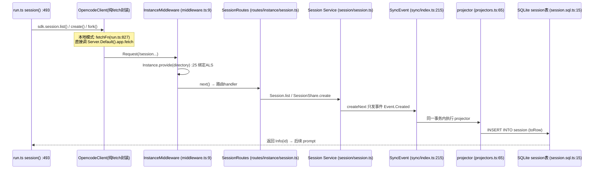

**① 第一跳：SDK 只是 fetch 的语法糖，"连接"根本不存在**

`createOpencodeClient(...)`（run.ts 第 820 行 attach 模式 / 第 831 行本地模式）不做任何 I/O，它返回的对象把 `sdk.session.list()` / `create()` / `fork()` 等方法翻译成对 `baseUrl` 的 fetch 请求。两种模式唯一的区别在这一跳的落点：

- **attach 模式**：fetch 真的走 HTTP 打到 `args.attach` 指向的远端 opencode server（可带 Basic 鉴权，run.ts 第 813-819 行）。
- **本地模式**：第 827-830 行传入的 `fetchFn` 把 `Request` 直接喂给 `Server.Default().app.fetch(request)`——这是 [`server/server.ts`](file:///Users/sunny/SourceCode/opencode/packages/opencode/src/server/server.ts) 第 37 行构造的 **Hono 应用对象的方法调用**，同进程、无 socket、无端口。旧版画法里的 `Server_Connect / WebSocket` 应理解为"进入 Hono 路由"这一件事。事件回流也用的是 SSE（`GET /event`，见 B5 分图），全链路没有 WebSocket。

**② 第二跳：请求进来先被 InstanceMiddleware 绑到实例上（这是链路不断的关键）**

`server.ts` 第 50、63 行在挂载实例路由之前 `.use(InstanceMiddleware())`；[`routes/instance/index.ts`](file:///Users/sunny/SourceCode/opencode/packages/opencode/src/server/routes/instance/index.ts) 第 58 行把 `/session` 前缀挂到 `SessionRoutes()`。[`instance/middleware.ts`](file:///Users/sunny/SourceCode/opencode/packages/opencode/src/server/routes/instance/middleware.ts) 第 11 行决定这个请求属于哪个项目：`c.req.query("directory") || c.req.header("x-opencode-directory") || process.cwd()`，然后第 25-31 行执行 `Instance.provide({ directory, init: () => AppRuntime.runPromise(InstanceBootstrap), fn: next })`。

这一步补齐了两个容易断层的地方：其一，CLI 本地模式（run.ts:825）和 HTTP 中间件走的是**同一个 `Instance.provide`**，而它在 `project/instance.ts` 第 60-70 行按 directory 查缓存——所以 prompt 请求到达路由时，实例早已 bootstrap 完毕，不会重复初始化；其二，`Instance.provide` 内部 `context.provide(ctx, ...)` 把实例放进 AsyncLocalStorage，后面的 handler 才能"凭空"拿到当前项目上下文（见 ③）。

**③ 第三跳：`GET /session` —— 图里那条 SELECT 语句的真实版本**

CLI 侧由 `--continue` 触发：run.ts 第 494 行 `(await sdk.session.list()).data?.find((s) => !s.parentID)?.id`。服务端 [`routes/instance/session.ts`](file:///Users/sunny/SourceCode/opencode/packages/opencode/src/server/routes/instance/session.ts) 第 34-78 行处理：`operationId: "session.list"`（第 39 行），query 校验 directory/roots/search/limit 等（第 51-63 行），第 67-75 行 `for await (const session of Session.list({...}))` 收集后 `c.json(sessions)`。

[`session/session.ts`](file:///Users/sunny/SourceCode/opencode/packages/opencode/src/session/session.ts) 第 752-795 行的 `list()` 是一个同步生成器：第 760 行 `Instance.project` **直接从 ALS 读当前项目**（这就是 ② 的意义），拼出条件 `eq(SessionTable.project_id, project.id)`（第 761 行）加上可选的 directory/roots/时间/title 过滤（第 763-779 行），第 783-790 行 `Database.use(db => db.select().from(SessionTable).where(...).orderBy(desc(time_updated)).limit(100).all())`——这才是图里 `SELECT * FROM sessions WHERE project_id=?` 的真身（表结构：`session/session.sql.ts` 第 15-45 行，`session` 表按 `project_id`/`workspace_id`/`parent_id` 建索引）。第 792-794 行逐行 `fromRow`（第 50-82 行）把 snake_case 行还原成驼峰 `Info`。

**④ 第四跳：`session()` 的三条路径——复用、fork、新建**

run.ts 第 493-506 行按参数分叉：

- **`--session <id>`**：第 494 行取 `args.session` 作 baseID，第 501 行直接返回——**不查询不校验**，若 ID 不存在，错误会推迟到发 prompt 时由服务端抛出（CLI 第 774-777 行兜底打印 "Session not found"）。
- **`--fork`**：第 496-499 行调 `sdk.session.fork({ sessionID: baseID })` → 服务端 fork 路由（routes 第 367-372 行，`operationId: "session.fork"`）→ `Session.fork`（session.ts 第 565-600 行）：先 `createNext` 造一个新壳（标题 `xxx (fork #n)`，第 108-116 行），再 `messages()` 读出旧会话全部消息（第 574 行），逐条换新 `MessageID.ascending()`、用 `idMap` 同步修正 assistant 对 user 消息的 `parentID`（第 582-588 行），每条 part 也换 `PartID` 后 `updatePart` 写入——整个过程复用 ⑤ 的事件管线，等于"重放出一份新副本"。
- **默认新建**：第 503-505 行 `sdk.session.create({ title: title(), permission: rules })`——`title()` 见第 480-484 行（`--title` 为空串时取 message 前 50 字符）；`rules` 见第 456-472 行：run 模式一次性会话默认 **deny** `question`/`plan_enter`/`plan_exit`（没有交互终端可以回答问题）。

**⑤ 第五跳：create 的真实落库方式——事件溯源（链路里最深的隐藏转折）**

`POST /session` 路由（routes 第 201-226 行）并不直接调 Session，而是 `SessionShare.Service.create`（[`share/session.ts`](file:///Users/sunny/SourceCode/opencode/packages/opencode/src/share/session.ts) 第 40-47 行）：先 `session.create(input)`，若建的是根会话且 auto-share 开启，再 fork 一个后台共享任务。

`Session.create`（session.ts 第 543-563 行）从 ALS 取 `directory`/`workspaceID`，交给 `createNext`（第 394-441 行）。`createNext` 只做两件事：

1. 第 403-417 行在**内存里**拼出完整 `Info`：`id: SessionID.descending()`（第 404 行——用降序 ID，保证新会话在按 ID 排序时天然排最前）、`slug`、`version`、`projectID: ctx.project.id`（来自 ② 绑定的实例）、默认标题 `createDefaultTitle`（第 42-46 行，"New session-时间戳"格式）。
2. 第 429 行 `SyncEvent.run(Event.Created, { sessionID, info })` 发布一个"同步事件"。

到这里 INSERT 还没发生。看 [`sync/index.ts`](file:///Users/sunny/SourceCode/opencode/packages/opencode/src/sync/index.ts) 第 215-244 行：`run()` 在**立即事务**里取该聚合根（sessionID）的下一个序号 seq（第 235-240 行，单写者 + 严格递增，设计说明见 `sync/README.md`），然后 `process()`（第 104-167 行）在同一个 `Database.transaction` 中先执行 `projector(tx, data)`（第 117 行）。而 `Session.Event.Created` 的 projector 注册在 [`session/projectors.ts`](file:///Users/sunny/SourceCode/opencode/packages/opencode/src/session/projectors.ts) 第 65-71 行：`db.insert(SessionTable).values(Session.toRow(data.info)).run()`——**真正的 INSERT 在这一行执行**。第 73-94 行是 Updated/Deleted 的投影（UPDATE/DELETE），消息与 part 的落库同理走 `MessageV2.Event.Updated`（第 96 行）、`PartUpdated`（第 136 行）。

一句话：**在 opencode 里，表数据只是事件流的投影；"创建会话"="发布 Created 事件"，写库是 projector 在同一事务内完成的副产品**。这同时解释了事务提交后 `process()` 第 141-164 行为什么要 `GlobalBus.emit`——同一份事件既驱动本地投影，又经 `/event` SSE 广播给所有订阅端。

**⑥ 收尾：拿到 sessionID 之后**

`session(sdk)` 返回 ID（run.ts 第 773 行）→ `share()`（第 778 行调用，定义第 513-526 行：查 `sdk.config.get()` 判断 share 策略，成功则打印 URL）→ 第 781 行启动 `loop()` 后台消费事件 → 第 800 行 `sdk.session.prompt(...)` 发出第一条用户消息，从 run.ts 第 800 行跳回 1.2 总览图 J7（路由 session.ts:851）继续走对话主循环。

**修正后的完整链路**：`session()`（run.ts:493）→ fetch（本地=进程内 `app.fetch`，run.ts:827）→ `InstanceMiddleware` 绑定实例（middleware.ts:11-31）→ `GET/POST /session` 路由（routes/instance/session.ts:34/201）→ `Session.list`（session.ts:752，ALS 读 project + drizzle SELECT）或 `SessionShare.create` → `Session.createNext` 发 `Event.Created`（session.ts:429）→ `SyncEvent.run` 立即事务取 seq（sync/index.ts:215）→ projector INSERT（projectors.ts:70）→ 事务提交后 GlobalBus 广播（sync/index.ts:152）→ sessionID 返回 CLI → `prompt` 进入对话循环。

---

## 二、核心功能模块时序图

### 2.1 消息处理与对话流程

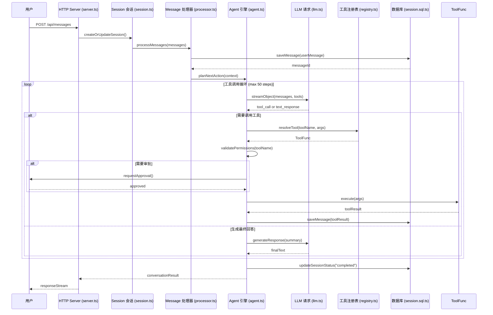

**关键文件与方法**:
- [session/session.ts](./docs/opencode/07-opencode-架构图与时序图.md): `createSession()` - 创建新会话，初始化状态机
- [session/processor.ts](./docs/opencode/15-opencode-流式事件、状态持久化与可观测审计.md): `processMessages()` - 消息预处理、截断、压缩
- [session/prompt.ts](./docs/opencode/08-opencode-上下文工程设计与实现.md): `buildPrompt()` - 构建完整 Prompt，包含历史消息、任务契约
- [agent/agent.ts](./docs/opencode/03-模块调用流程与时序图.md): `planAndAct()` - 规划 - 执行循环，决定下一步行动
- [session/llm.ts](./docs/opencode/20-opencode-模型参数分层与最终请求构建.md): `streamObject()` - 流式调用 LLM，解析 tool_call 或文本响应

---

### 2.2 工具调用与执行流程

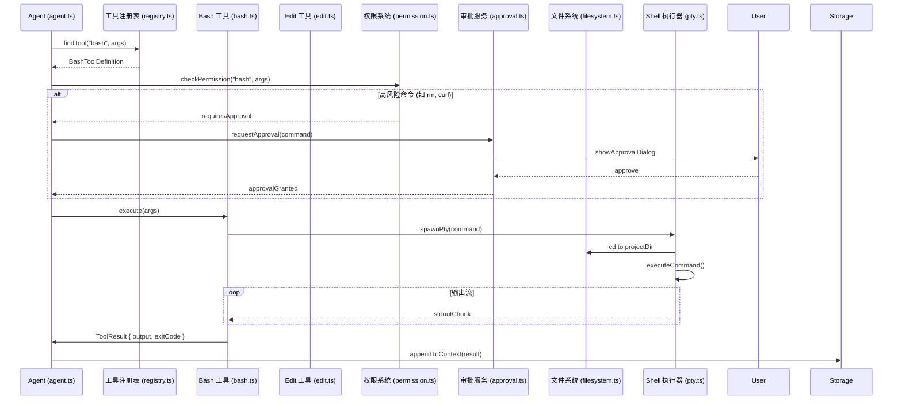

**关键文件与方法**:
- [tool/bash.ts](./docs/opencode/21-opencode-Shell 工具解析、审批与执行安全.md): `execute()` - 解析 bash 命令，检查风险，执行并返回结果
- [tool/edit.ts](./docs/opencode/18-opencode-文件变化追踪、快照与可逆修改.md): `applyEdit()` - 文件编辑，创建快照，应用 patch
- [permission/permission.ts](./docs/opencode/10-opencode-工具系统、能力边界与权限治理.md): `checkPermission()` - 检查权限规则，判断是否需要审批
- [pty/pty.ts](./docs/opencode/19-opencode-客户端事件驱动与运行时边界.md): `spawn()` - 使用 PTY 模拟终端，执行 shell 命令
- [tool/registry.ts](./docs/opencode/10-opencode-工具系统、能力边界与权限治理.md): [tools()` - 根据 Agent/Model 过滤可用工具集

---

### 2.3 上下文压缩与 Token 管理

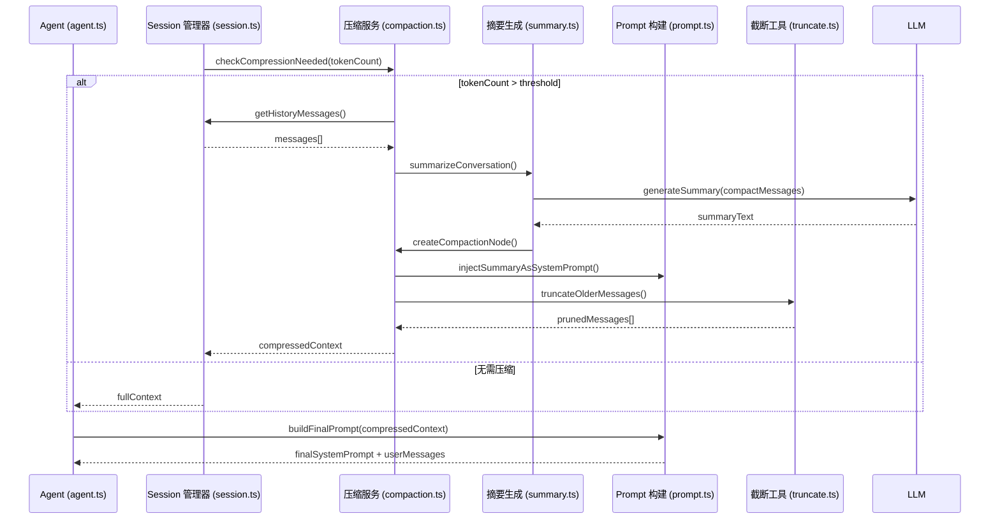

**关键文件与方法**:
- [session/compaction.ts](./docs/opencode/11-opencode-完成判定与验证闭环设计.md): `maybeCompress()` - 检测 Token 使用，触发压缩流程
- [session/summary.ts](./docs/opencode/08-opencode-上下文工程设计与实现.md): `generateSummary()` - 生成对话摘要，保留关键信息
- [session/prompt.ts](./docs/opencode/08-opencode-上下文工程设计与实现.md): `buildContextWithCompression()` - 构建带压缩的上下文
- [util/truncate.ts](./docs/opencode/08-opencode-上下文工程设计与实现.md): `truncateLines()` - 按行截断大文件内容，符合 GLOB 白名单限制

---

### 2.4 Provider 路由与模型选择

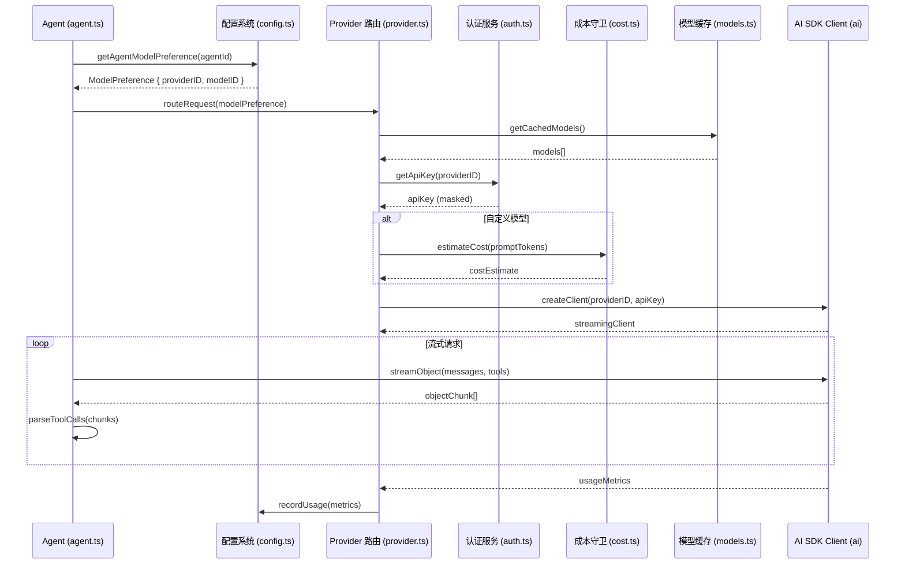

**关键文件与方法**:
- [provider/provider.ts](./docs/opencode/14-opencode-Provider 抽象与模型路由设计.md): `createProviderClient()` - 创建不同 Provider 的客户端
- [provider/transform.ts](./docs/opencode/14-opencode-Provider 抽象与模型路由设计.md): `transformMessages()` - 转换消息格式到各 Provider 规范
- [config/provider.ts](./docs/opencode/14-opencode-Provider 抽象与模型路由设计.md): `resolveProviderConfig()` - 解析 Provider 配置，获取 API Key
- [provider/models.ts](./docs/opencode/20-opencode-模型参数分层与最终请求构建.md): `fetchModels()` - 同步最新模型列表到 snapshot
- [provider/auth.ts](./docs/opencode/16-opencode-安全隔离、提示注入与扩展能力治理.md): `getOrRefreshToken()` - Token 刷新机制，保证认证连续

---

### 2.5 Plugin 与 Skill 加载流程

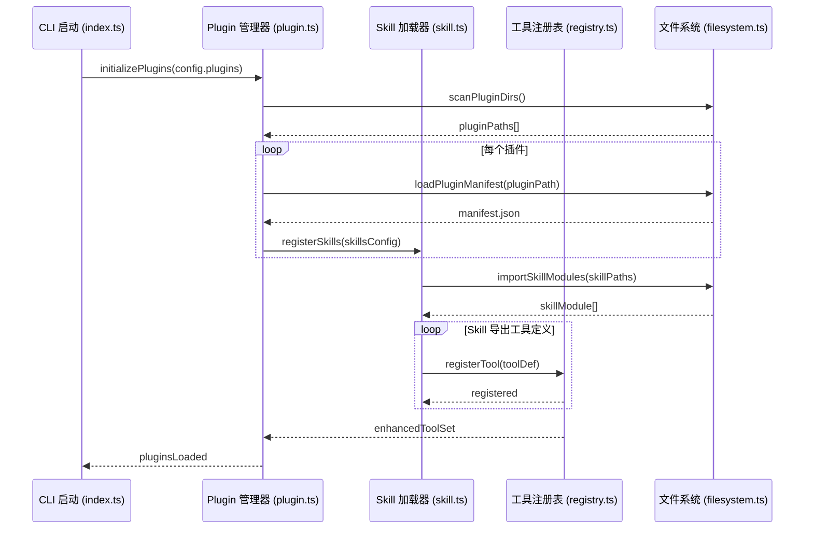

**关键文件与方法**:
- [plugin/plugin.ts](./docs/opencode/24-opencode-Skill 加载与行为注入设计.md): `loadPlugins()` - 扫描并加载插件，解析 manifest
- [skill/skill.ts](./docs/opencode/24-opencode-Skill 加载与行为注入设计.md): `registerSkill()` - 注册 Skill，绑定到 Agent
- [tool/skill.ts](./docs/opencode/24-opencode-Skill 加载与行为注入设计.md): `SkillTool.execute()` - 执行 Skill，注入自定义行为
- [plugin/manifest.ts](./docs/opencode/24-opencode-Skill 加载与行为注入设计.md): `parseManifest()` - 解析插件清单，验证 schema

---

## 三、跨模块协作模式

### 3.1 错误恢复与自我修正

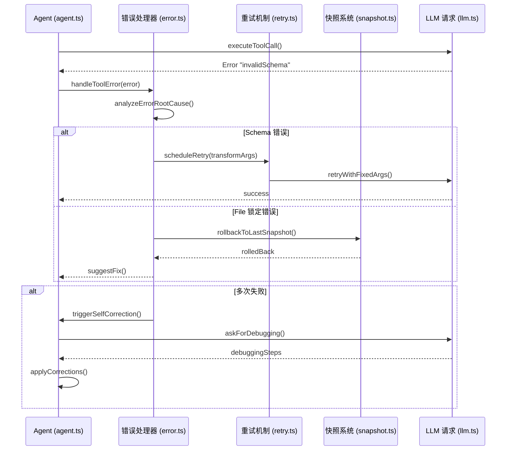

**关键文件与方法**:
- [util/error.ts](./docs/opencode/12-opencode-错误恢复与自我修正设计.md): `NamedError` - 命名错误类型，便于分类处理
- [session/retry.ts](./docs/opencode/12-opencode-错误恢复与自我修正设计.md): `handleRetries()` - 重试逻辑，指数退避策略
- [snapshot/snapshot.ts](./docs/opencode/18-opencode-文件变化追踪、快照与可逆修改.md): `createSnapshot()` - 创建文件快照，支持回滚
- [effect/effect.ts](./docs/opencode/12-opencode-错误恢复与自我修正设计.md): Effect.catchTag() - 基于 Effect 的类型安全错误处理

---

### 3.2 多 Agent 协作与子任务隔离

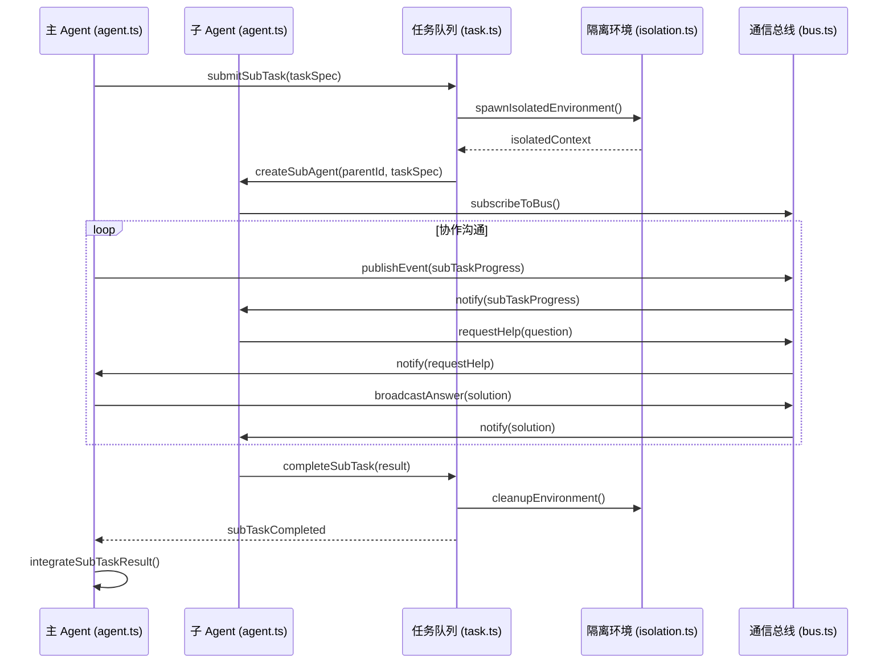

**关键文件与方法**:
- [session/task.ts](./docs/opencode/13-opencode-多 Agent 协作与子任务隔离设计.md): `submitSubTask()` - 提交子任务，创建独立任务上下文
- [bus/global.ts](./docs/opencode/13-opencode-多 Agent 协作与子任务隔离设计.md): `GlobalBus.publish()` - 发布事件到全局总线
- [control-plane/workspace.ts](./docs/opencode/13-opencode-多 Agent 协作与子任务隔离设计.md): `createIsolatedWorkspace()` - 创建隔离工作空间，防止状态污染
- [agent/agent.ts](./docs/opencode/03-模块调用流程与时序图.md): `spawnChildAgent()` - 启动子 Agent，传递权限和环境约束

---

### 3.3 MCP 工具集成

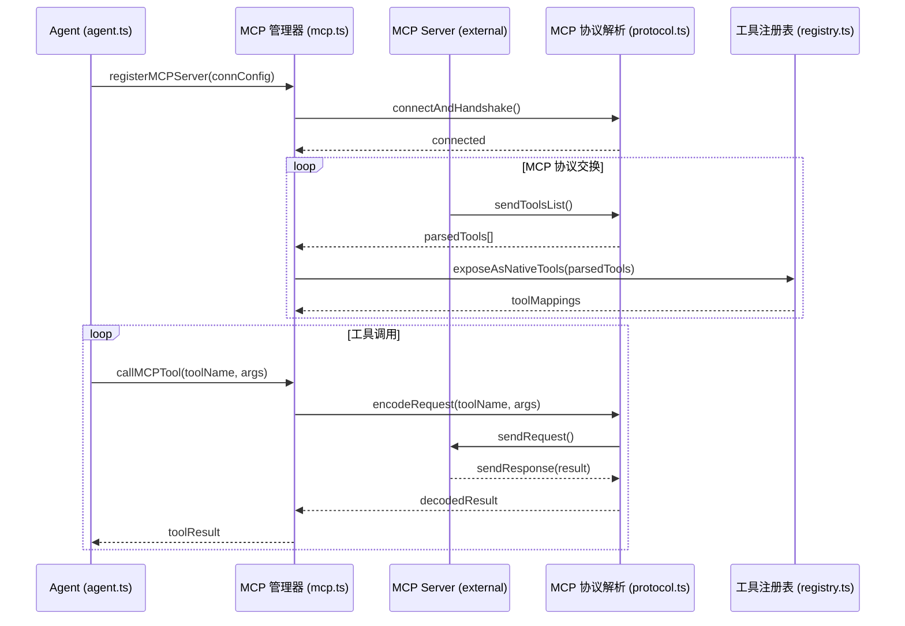

**关键文件与方法**:
- [mcp/mcp.ts](./docs/opencode/23-opencode-MCP 生命周期与外部能力治理.md): `connectMCPServer()` - 连接 MCP Server，握手并拉取工具列表
- [mcp/protocol.ts](./docs/opencode/23-opencode-MCP 生命周期与外部能力治理.md): `parseToolDefinitions()` - 解析 MCP 协议的工具定义
- [mcp/lifecycle.ts](./docs/opencode/23-opencode-MCP 生命周期与外部能力治理.md): `manageMCPLifecycle()` - MCP 工具的生命周期管理（创建、销毁、重启）
- [permission/mcp-permission.ts](./docs/opencode/10-opencode-工具系统、能力边界与权限治理.md): `validateMCPAccess()` - 验证 MCP 工具的访问权限

---

## 四、数据流向与持久化

### 4.1 会话数据存储

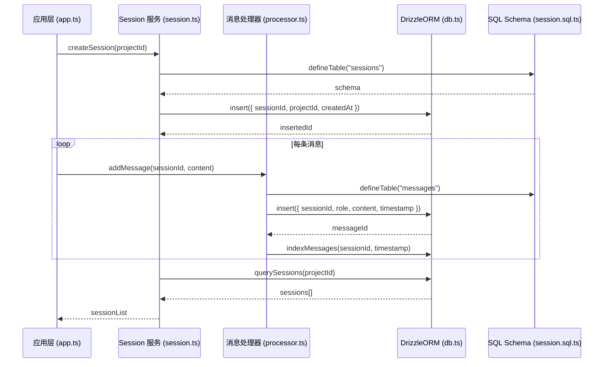

**关键文件与方法**:
- [storage/db.ts](./docs/opencode/15-opencode-流式事件、状态持久化与可观测审计.md): `initializeDatabase()` - 初始化 DrizzleORM 数据库连接
- [session/session.sql.ts](./docs/opencode/11-opencode-完成判定与验证闭环设计.md): SQL table definitions - 定义 SQLite 表的 DDL
- [migration/migration.ts](./docs/opencode/15-opencode-流式事件、状态持久化与可观测审计.md): `runMigration()` - 运行数据库迁移，确保 schema 一致

---

## 五、事件驱动架构

### 5.1 全局事件总线

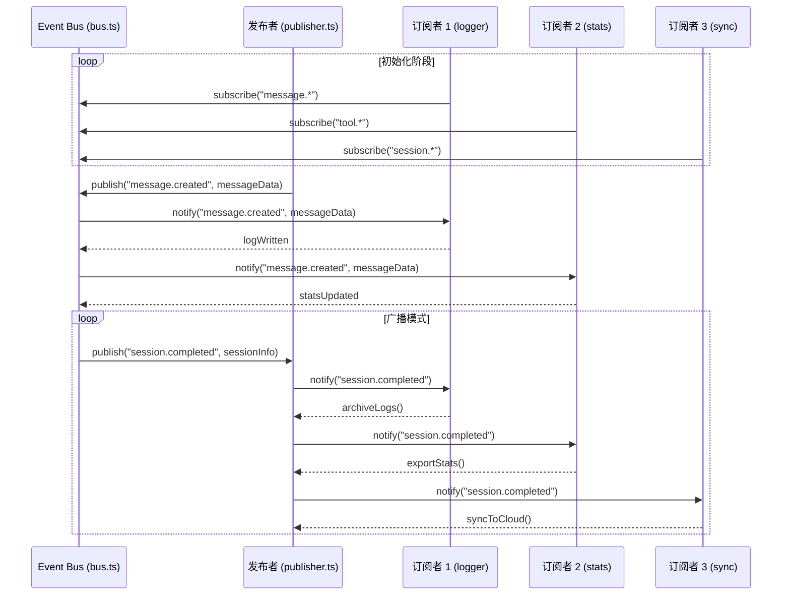

**关键文件与方法**:
- [bus/bus.ts](./docs/opencode/15-opencode-流式事件、状态持久化与可观测审计.md): `Bus.publish()` / `Bus.subscribe()` - 发布 / 订阅事件
- [server/event.ts](./docs/opencode/15-opencode-流式事件、状态持久化与可观测审计.md): EventStream - SSE 事件流，推送到客户端
- [util/logger.ts](./docs/opencode/15-opencode-流式事件、状态持久化与可观测审计.md): Logger.listen() - 监听日志事件并持久化
- [sync/sync.ts](./docs/opencode/15-opencode-流式事件、状态持久化与可观测审计.md): SyncService - 监听会话结束事件，触发云同步

---

## 六、安全性与权限控制

### 6.1 权限审批流程

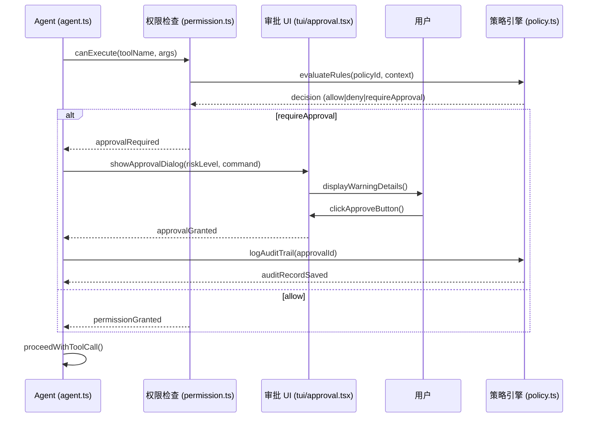

**关键文件与方法**:
- [permission/permission.ts](./docs/opencode/10-opencode-工具系统、能力边界与权限治理.md): `checkPermission()` - 检查单工具权限，返回决策结果
- [permission/policy.ts](./docs/opencode/10-opencode-工具系统、能力边界与权限治理.md): `evaluatePolicy()` - 基于规则的权限评估引擎
- [cli/tui/attach.tsx](./docs/opencode/10-opencode-工具系统、能力边界与权限治理.md): ApprovalDialog - TUI 审批对话框组件
- [config/permission.ts](./docs/opencode/10-opencode-工具系统、能力边界与权限治理.md): `loadPermissionRules()` - 从配置文件加载权限规则

---

## 七、总结与建议

### 7.1 学习路径建议

1. **第一阶段：入门级**
   - 阅读 [`src/index.ts`](file:///Users/sunny/Documents/Study/agent_study/packages/opencode/src/index.ts) 了解启动流程
   - 阅读 [`src/cli/cmd/run.ts`](file:///Users/sunny/Documents/Study/agent_study/packages/opencode/src/cli/cmd/run.ts) 理解命令解析
   - 时序图参考：**第 1.2 节 - 启动流程**

2. **第二阶段：基础核心**
   - 深入 [`src/config/config.ts`](file:///Users/sunny/Documents/Study/agent_study/packages/opencode/src/config/config.ts) 掌握配置系统
   - 研读 [`src/tool/registry.ts`](file:///Users/sunny/Documents/Study/agent_study/packages/opencode/src/tool/registry.ts) 理解工具注册机制
   - 时序图参考：**第 2.1 节 - 消息处理流程**

3. **第三阶段：高级特性**
   - 研读 [`src/session/compaction.ts`](file:///Users/sunny/Documents/Study/agent_study/packages/opencode/src/session/compaction.ts) 掌握上下文压缩
   - 分析 [`src/agent/agent.ts`](file:///Users/sunny/Documents/Study/agent_study/packages/opencode/src/agent/agent.ts) 理解规划 - 执行循环
   - 时序图参考：**第 2.3 节 - 上下文压缩**、**第 2.5 节 - MCP 集成**

4. **第四阶段：架构师视角**
   - 系统分析 [`src/effect/`](file:///Users/sunny/Documents/Study/agent_study/packages/opencode/src/effect/) 模块的事件驱动架构
   - 研究 [`src/control-plane/`](file:///Users/sunny/Documents/Study/agent_study/packages/opencode/src/control-plane/) 的多 Agent 协同机制
   - 时序图参考：**第 3.2 节 - 多 Agent 协作**

### 7.2 核心设计模式

- **依赖注入模式**: 通过 Effect Context 实现模块解耦
- **责任链模式**: 权限检查 → 审批流程 → 工具执行
- **观察者模式**: 全局事件总线通知各订阅者
- **策略模式**: Provider 路由根据配置选择最优模型
- **备忘录模式**: 快照系统保存会话状态供回滚使用

### 7.3 性能优化点

- **流式处理**: 所有 LLM 请求均采用流式，减少首字延迟
- **缓存策略**: 模型列表、API Token 等高频数据采用内存缓存
- **批量操作**: 数据库插入采用事务批量写入，降低 I/O 次数
- **异步并发**: 多个工具调用采用并行 Promise.all 加速执行

---

## 附录：重要索引

### A. 关键 Service 注册表

| Service | 文件位置 | 主要职责 |
|---------|---------|---------|
| `Config.Service` | `config/config.ts` | 配置管理 |
| `Agent.Service` | `agent/agent.ts` | Agent 核心 |
| `ToolRegistry.Service` | `tool/registry.ts` | 工具注册与分发 |
| `Provider.Service` | `provider/provider.ts` | LLM 路由 |
| `Session.Service` | `session/session.ts` | 会话管理 |
| `Plugin.Service` | `plugin/plugin.ts` | 插件管理 |
| `Permission.Service` | `permission/permission.ts` | 权限控制 |

### B. 数据库核心 Schema

| 表名 | 字段示例 | 用途 |
|------|---------|------|
| `sessions` | id, project_id, created_at | 会话元数据 |
| `messages` | id, session_id, role, content | 消息记录 |
| `snapshots` | id, session_id, file_path, content_hash | 文件快照 |
| `audit_logs` | id, action, user_id, timestamp | 审计日志 |

### C. 常用命令映射

| CLI 命令 | 对应文件 | 说明 |
|---------|---------|------|
| `opencode run` | `cli/cmd/run.ts` | 启动对话 |
| `opencode agent` | `cli/cmd/agent.ts` | Agent 管理 |
| `opencode providers` | `cli/cmd/providers.ts` | 模型管理 |
| `opencode mcp` | `cli/cmd/mcp.ts` | MCP 配置 |

---

**文档版本**: v1.0  
**最后更新**: 2026 年 9 月 20 日  
**维护者**: Agent Study Team
