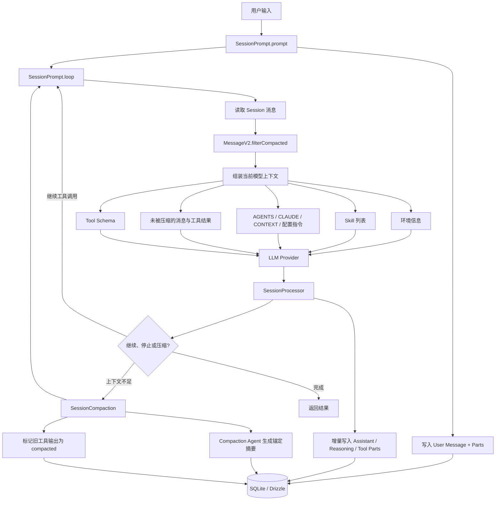

# OpenCode 短期记忆与长期记忆设计分析

本文结合两部分材料：

- 企业级 Agent 设计文档：`/Users/dongxg/Documents/agent_study/企业AGENT设计.md`
- OpenCode 当前仓库源码，重点参考已同步的 `origin/dev`（`2cda629c8`）中的 `packages/opencode/src`

本文回答一个核心问题：OpenCode 如何保存、组织、压缩、恢复和重新注入上下文，以及它与企业级 Agent 所说的“短期记忆、工作记忆、用户记忆、组织记忆、情景记忆、程序记忆”分别是什么关系。

## 先说结论

OpenCode 当前实现的记忆能力可以概括为：

> **持久化会话记录 + 运行时工作状态 + 上下文压缩摘要 + 项目指令文件 + 计划/工具产物。**

它已经较好地解决了编码 Agent 的“当前任务连续性”和“长对话不超过模型上下文窗口”问题，但它还不是一个完整的企业级长期记忆平台：

- 有明确的会话级短期记忆。
- 有任务级工作记忆的若干实现：计划文件、Todo、子 Agent 会话、工具结果和压缩摘要。
- 有跨进程持久化的会话历史，具备情景记忆的雏形。
- 有基于 `AGENTS.md`、`CLAUDE.md`、`CONTEXT.md` 和配置指令的项目知识注入。
- 某些模型 Prompt 约定了 `.github/instructions/memory.instruction.md` 作为用户偏好文件，但这不是一个独立的 Memory Service，也不是由运行时统一管理的长期记忆库。
- 没有看到完整的用户记忆、组织记忆、向量记忆、记忆检索、记忆权限、记忆过期和记忆投毒防护体系。

因此，OpenCode 当前更准确的定位是：

> **一个以 Session 为核心、以文件和工具为扩展、带自动 Compaction 的编码 Agent Runtime。**

而不是：

> **一个已经完成企业级长期记忆治理的通用 Agent 平台。**

## 一、企业级记忆模型与 OpenCode 的映射

企业设计文档中的记忆分层是：

| 企业级记忆层 | 典型内容 | 企业级用途 | OpenCode 对应实现 | 完整度 |
|---|---|---|---|---|
| 短期记忆 | 当前对话、最近工具结果 | 连续完成当前任务 | Session 消息、Parts、当前 Agent Loop 的 `msgs` | 已实现 |
| 工作记忆 | 当前任务状态、中间结果、待办 | 任务恢复和流程推进 | `SessionRunState`、Todo、Plan 文件、工具状态、子 Session | 部分实现 |
| 用户记忆 | 用户偏好、习惯、常用约定 | 个性化 | `beast.txt` 中约定的 `memory.instruction.md` | Prompt 约定，运行时弱 |
| 组织记忆 | 制度、流程、项目规则 | 业务一致性 | `AGENTS.md`、`CLAUDE.md`、`CONTEXT.md`、配置指令 | 文件注入已实现，治理较弱 |
| 情景记忆 | 历史任务、历史结果 | 复盘和跨任务参考 | SQLite 中的 Session/Message/Part 历史 | 持久化有，自动检索弱 |
| 程序记忆 | 可复用流程、技能、工具规则 | 稳定执行 | Agent 配置、Skills、Commands、Tools、Prompt 模板 | 已实现，但不是自动学习 |
| 语义记忆 | 从历史事实抽取出的可检索知识 | 跨会话事实复用 | 没有独立 Memory Service 或向量索引 | 未完整实现 |

最重要的区别是：

> **OpenCode 保存了很多历史，但“保存历史”不等于“拥有长期记忆”。**

长期记忆至少还需要：事实抽取、结构化存储、权限过滤、相关性检索、来源追踪、过期删除和冲突解决。

## 二、整体架构：记忆不是一个模块，而是三条链路

OpenCode 的记忆相关能力分散在三条链路中：

1. **Session 链路**：保存用户消息、助手消息、推理、工具调用和工具结果。
2. **Prompt 链路**：每次调用模型前重新组装环境、技能、项目指令、历史消息和工具定义。
3. **Compaction 链路**：当历史过长或模型上下文溢出时，把旧历史压缩为锚定摘要，并保留近期上下文。



这里有一个容易误解的点：模型并不是直接“从数据库中记住一切”。正确过程是：

1. 数据库保存历史。
2. 当前轮次读取历史。
3. `filterCompacted` 对历史做可见性投影。
4. Prompt 层把投影后的内容转换成模型消息。
5. Provider 将其发送给模型。

数据库是事实存储，Prompt 是上下文构建器，模型上下文窗口才是模型这一轮真正能看到的内容。

## 三、短期记忆：当前会话的工作上下文

### 3.1 用户输入首先变成持久化消息

入口在 `packages/opencode/src/session/prompt.ts` 的 `SessionPrompt.prompt`：

1. 读取 Session。
2. 清理可能存在的 revert 状态。
3. 调用 `createUserMessage` 创建用户消息和 Parts。
4. 通过 `Session.updateMessage`、`Session.updatePart` 写入存储。
5. 进入 `SessionPrompt.loop`。

消息模型在 `packages/opencode/src/session/message-v2.ts` 中定义，主要内容包括：

- `User`：用户输入、模型、Agent、结构化输出要求、工具开关。
- `Assistant`：模型输出、父消息、使用的模型、Token、成本、结束原因。
- `TextPart`：文本内容。
- `ReasoningPart`：推理内容或模型 reasoning 内容。
- `ToolPart`：工具名称、调用 ID、输入、运行状态、输出和元数据。
- `FilePart`：附件或工具产生的文件/图片。
- `SubtaskPart`：子 Agent 任务。
- `CompactionPart`：上下文压缩标记、是否自动压缩、近期尾部起点。
- `StepStartPart` / `StepFinishPart`：一步 Agent 执行的快照、Token、成本和结束信息。

这意味着 OpenCode 的短期记忆不是一个简单的字符串数组，而是一个可恢复的结构化事件/消息记录。

### 3.2 当前轮次的内存工作区

`SessionPrompt.runLoop` 每次循环都会：

1. 设置 Session 为 busy。
2. 调用 `MessageV2.filterCompactedEffect(sessionID)` 获取当前可见历史。
3. 找到最近的 User、Assistant、已完成 Assistant，以及待处理的 Compaction/Subtask。
4. 判断上一个 Assistant 是否已经完成。
5. 解析 Agent、模型和工具。
6. 调用 `SessionProcessor` 执行本轮模型流。
7. 根据结果决定退出、继续工具调用、执行子任务或创建压缩任务。

其中 `msgs` 是当前循环的工作上下文；它属于内存中的临时投影，但每次工具调用和模型事件又会被写回 SQLite。因此它同时具备：

- **快速访问**：当前循环直接使用内存对象。
- **可恢复**：进程中断后，已完成的消息和工具结果通常可以从存储重建。
- **可裁剪**：模型请求前可以过滤掉旧的压缩区段和过大的工具结果。

### 3.3 运行时状态不是长期记忆

`packages/opencode/src/session/run-state.ts` 中的 `SessionRunState` 保存每个 Session 的 Runner：

- 当前 Session 是否 busy。
- 当前任务的取消句柄。
- 当前执行是否已经有 Runner。
- Session 结束或实例销毁时如何取消任务。

`SessionProcessor` 还保存本轮执行中的临时字段，例如：

- 当前 Assistant 消息。
- 工具调用表。
- 当前文本块。
- reasoning 累积状态。
- 是否被权限阻塞。
- 是否需要压缩。
- 快照信息。

这些内容是“工作内存”，不是长期记忆。它们用于保证当前 Agent Loop 正确运行，不能作为跨进程、跨实例的用户事实来源。

## 四、OpenCode 如何把短期记忆发送给模型

每次模型调用前，`SessionPrompt.runLoop` 会并行准备四类上下文：

```text
SystemPrompt.skills(agent)
SystemPrompt.environment(model)
Instruction.system()
MessageV2.toModelMessagesEffect(msgs, model)
```

随后合并为：

```text
system = environment + skills + instructions + structured-output rules
messages = historical model messages + optional last-step reminder
tools = current agent tools + MCP tools + optional structured output tool
```

这就是 OpenCode 的“上下文装配”阶段。

### 4.1 环境上下文

`packages/opencode/src/session/system.ts` 注入：

- 当前模型 ID。
- 工作目录。
- Workspace 根目录。
- 是否 Git 仓库。
- 当前平台。
- 当前日期。

它属于每一轮都会重新计算的运行时上下文，不是记忆。

### 4.2 Skill 上下文

`SystemPrompt.skills(agent)` 根据当前 Agent 权限列出可用 Skills，并告诉模型：遇到匹配任务时通过 Skill 工具加载具体工作流。

Skill 更接近企业设计文档中的“程序记忆”：它是可复用的外部化流程和知识，而不是模型自己积累的经验。

### 4.3 项目指令上下文

`packages/opencode/src/session/instruction.ts` 负责寻找和加载指令文件：

- 项目级 `AGENTS.md`。
- 项目级 `CLAUDE.md`，除非被禁用。
- 兼容性的 `CONTEXT.md`。
- 全局配置目录下的 `AGENTS.md`。
- 用户配置的本地路径。
- 用户配置的 HTTP/HTTPS 指令来源。

它还会针对被读取的文件，沿目录向上查找附近的指令文件，并通过 `claims` 防止同一 Assistant 消息重复注入。

这部分是 OpenCode 最接近“项目长期记忆”的设计，但它有明确边界：

- 内容由人维护。
- 内容是显式文件，不是模型自动总结出的事实。
- 没有内置的向量检索和语义召回。
- 文件本身的权限和敏感性治理主要依赖文件系统、配置和工具权限。

### 4.4 历史消息上下文

`MessageV2.toModelMessagesEffect` 把内部结构化消息转换成 Provider 可接受的模型消息。转换时会处理：

- 用户文本。
- Assistant 文本和 reasoning。
- 工具调用与工具结果的对应关系。
- 图片、PDF 等媒体附件。
- 已完成、运行中、失败的工具状态。
- 不同 Provider 的消息格式差异。

因此，模型看到的不是数据库原始 JSON，而是经过 Provider 适配的消息序列。

## 五、上下文压缩：OpenCode 的核心短期记忆设计

### 5.1 为什么需要压缩

模型上下文窗口是有限的。长时间编码任务会不断增加：

- 用户消息。
- 模型回答。
- reasoning。
- 工具调用。
- 工具输出。
- 文件附件。
- 错误与重试信息。

如果把全部原始历史每次都发给模型，最终会遇到：

- Provider 请求过大。
- Token 成本升高。
- 延迟增加。
- 旧工具输出挤占新问题空间。
- 模型注意力被低价值细节稀释。

### 5.2 压缩触发条件

正常 Agent Loop 在发现上一轮 Assistant 已完成后，会调用：

```text
SessionCompaction.isOverflow({ tokens, model })
```

如果 Token 使用达到模型可用上下文限制，创建一个 `CompactionPart`。在流式处理过程中，如果 Provider 或模型返回上下文溢出，`SessionProcessor` 将结果标记为需要压缩，Loop 也会进入同一条压缩路径。

因此有两种主要触发方式：

1. **主动阈值触发**：根据已使用 Token 判断即将超过窗口。
2. **Provider 溢出触发**：请求已经被 Provider 判定过大。

### 5.3 压缩不是删除，而是创建一条新的可见性边界

`SessionCompaction.create` 会写入：

1. 一条新的 synthetic user message。
2. 一个 `CompactionPart`。

这条 Part 保存：

- 是否自动压缩。
- 是否由于 overflow 触发。
- `tail_start_id`：压缩后要保留的近期消息起点。

原始历史仍然可以留在数据库中，但 `MessageV2.filterCompacted` 会根据已完成的压缩记录，只把以下内容暴露给模型：

- 锚定摘要。
- 压缩边界之后的近期消息。
- 必要的最新工具调用结果。

所以 Compaction 的核心不是物理删除，而是：

> **保留完整审计历史，同时构建一个更小的模型上下文视图。**

### 5.4 如何选择保留内容

当前算法有几个关键策略：

- 默认保留最近若干轮，默认值为 `tail_turns = 2`。
- 近期保留预算默认为可用上下文的一部分，并限制在约 2,000 到 8,000 Token 范围内。
- 如果完整保留最近一轮超过预算，会继续在这一轮内部寻找可切分位置。
- 如果无法找到合适切分点，保留策略会回退并记录日志。
- 历史内容先排除已经完成的压缩区段，再做 Token 估算。
- 发送给摘要模型时会去除媒体，并将工具输出限制到 `TOOL_OUTPUT_MAX_CHARS`。

可以把它抽象成：

```text
可见历史 = 锚定摘要 + 最近 N 轮 + 必要的当前任务上下文
```

### 5.5 摘要 Prompt 的结构

`packages/opencode/src/session/compaction.ts` 中定义了固定结构：

```text
## Goal
## Constraints & Preferences
## Progress
### Done
### In Progress
### Blocked
## Key Decisions
## Next Steps
## Critical Context
## Relevant Files
```

摘要要求：

- 保留所有章节，即使章节为空。
- 使用简短列表，而不是长篇叙述。
- 尽量保留准确的文件路径、命令、错误字符串和标识符。
- 如果已有旧摘要，则以旧摘要为锚点进行更新。
- 保留仍然有效的信息。
- 删除已经过时的信息。
- 合并新事实。
- 不要告诉模型用户正在经历一次压缩。

这是一种“锚定摘要”设计，而不是每次从零摘要。它更像企业设计文档中的工作记忆 checkpoint：

```text
旧摘要 + 新增历史
       ↓
更新后的摘要
```

### 5.6 自动继续

压缩完成后，如果允许自动继续，OpenCode 会写入一个 synthetic user message：

```text
Continue if you have next steps, or stop and ask for clarification if you are unsure how to proceed.
```

这样模型会在“摘要 + 最近上下文”的基础上继续执行，而不是直接把摘要当作最终回答。

如果是因为大媒体附件导致 overflow，系统会额外告诉模型媒体已经从上下文中移除，并建议用户使用更小或更少的附件。

### 5.7 工具输出裁剪

除了摘要，还有一条更轻量的压缩路径：`SessionCompaction.prune`。

它会从历史尾部向前查看旧工具调用：

- 跳过最近两轮。
- 跳过已经被标记为 compacted 的工具结果。
- 跳过受保护的工具，例如 `skill`。
- 当累计工具输出超过保护阈值后，标记较老的工具输出为 compacted。
- 只有被裁剪的输出超过最小收益阈值时才真正更新。

这不是删除工具调用记录，而是给旧工具 Part 打上 `state.time.compacted` 标记，使它在后续模型上下文转换中可以被压缩或省略。

## 六、长期记忆：OpenCode 已经有什么，缺什么

### 6.1 SQLite 会话历史：持久化的情景记忆

`packages/opencode/src/session/session.sql.ts` 定义了核心表：

- `session`：会话、项目、工作区、父会话、目录、权限、归档和摘要统计。
- `message`：User/Assistant 消息元数据。
- `part`：文本、工具、文件、压缩、子任务等消息组成部分。
- `todo`：Session 级任务列表。
- `session_entry`：较新的事件/条目投影结构。

这使得 OpenCode 具备：

- 退出后继续查看历史。
- 重启后恢复 Session。
- Fork 会话。
- 建立父子 Session 关系。
- 重新生成模型可见上下文。
- 导出会话和审计工具轨迹。

但它还不是完整的长期记忆，因为默认行为不是：

```text
新问题
  -> 对所有历史 Session 做语义检索
  -> 找出相关事实
  -> 过滤权限
  -> 注入模型上下文
```

它更接近：

```text
当前 Session
  -> 读取当前 Session 的历史
  -> 过滤压缩区段
  -> 继续当前会话
```

也就是说，Session 历史主要是“按会话访问”，而不是“按语义跨会话访问”。

### 6.2 项目指令文件：显式组织/项目记忆

企业文档中的组织记忆通常包括制度、流程、项目规则和业务约束。OpenCode 用文件来承载其中一部分：

- `AGENTS.md`：给编码 Agent 的项目级指令。
- `CLAUDE.md`：兼容的项目指令来源。
- `CONTEXT.md`：旧版兼容文件。
- 配置中的 `instructions`：额外本地文件或远程 URL。

优势：

- 人可读。
- Git 可审计。
- 可随项目版本演进。
- 不依赖向量数据库。
- 适合编码规范、测试命令、目录说明和安全约束。

局限：

- 不能自动从所有会话中抽取新事实。
- 文件过大时会增加每次 Prompt 成本。
- 没有统一的租户、角色、敏感级别和保留策略。
- HTTP 指令来源需要额外考虑可信度和 Prompt Injection。

### 6.3 用户偏好文件：存在 Prompt 约定，但不是完整功能

`packages/opencode/src/session/prompt/beast.txt` 中包含一个 Memory 约定：

- 用户偏好可以存放在 `.github/instructions/memory.instruction.md`。
- 文件需要以特定 YAML front matter 开头。
- 当用户明确要求“记住某件事”时，Agent 可以更新该文件。

这说明 OpenCode 有“用户记忆”的产品意图，但要准确区分三件事：

1. 这是模型 Prompt 中的行为指导。
2. 它依赖模型自行判断何时读取和修改文件。
3. `Instruction.systemPaths` 默认加载的文件集合主要是 `AGENTS.md`、`CLAUDE.md`、`CONTEXT.md` 和配置项；`memory.instruction.md` 并不是独立的内置 Memory Service 自动加载路径。

所以它更像“文件化的显式用户记忆约定”，而不是运行时保证的长期记忆系统。

要让这类记忆稳定工作，至少要满足以下条件之一：

- 将该路径加入 `instructions` 配置，让 Instruction Service 每轮加载。
- 让模型通过 `read` 工具主动读取它。
- 增加专门的 memory 工具和 memory service。

### 6.4 Plan、Todo 与任务状态：工作记忆的外部化

企业设计文档明确提出“工作记忆”和“任务状态”应该持久化，而不是只留在一次模型上下文里。OpenCode 已经有多种外部化方式：

- Plan Agent 把计划写到 `.opencode/plans` 或全局 plans 目录。
- Todo 工具把当前任务拆成待办项。
- `TaskTool` 创建子 Session，并通过 `parentID` 建立父子关系。
- 子任务可以返回 `task_id`，后续继续同一个子 Agent Session。
- 子 Session 的工具结果会通过 Task Tool 输出回父 Session。

这部分是 OpenCode 最接近“Durable Workflow”的地方，但它仍然与企业级工作流引擎有差距：

- 没有完整的 DAG 状态机作为唯一事实来源。
- 没有统一的任务预算、重试、补偿和审批状态模型。
- 部分流程状态仍然保存在消息和 Prompt 约定中。

### 6.5 Session Summary：任务结果摘要，不等同于长期知识

`packages/opencode/src/session/summary.ts` 的 `SessionSummary` 主要计算代码变更摘要：

- 文件增加数量。
- 删除数量。
- 变更文件数。
- Snapshot Diff。

它保存的是本次编码任务的结果摘要，适合作为 UI 展示、会话概览和后续查看入口，不是面向跨任务问答的通用知识记忆。

## 七、两条重要流程

### 7.1 普通多轮对话/编码流程

```mermaid
sequenceDiagram
    autonumber
    participant User as 用户
    participant Prompt as SessionPrompt
    participant Session as Session Service
    participant DB as SQLite
    participant Loop as Agent Loop
    participant Proc as SessionProcessor
    participant LLM as LLM Provider
    participant Tool as Tool Runtime

    User->>Prompt: 提交问题
    Prompt->>Session: createUserMessage
    Session->>DB: 保存 User Message + Parts
    Prompt->>Loop: run(sessionID)
    Loop->>DB: 读取当前 Session 消息
    Loop->>Loop: filterCompacted
    Loop->>Prompt: 组装 env + skills + instructions + history
    Prompt->>LLM: system + messages + tool schemas
    LLM-->>Proc: 流式文本 / reasoning / tool call
    Proc->>DB: 增量保存 Assistant / Tool Parts
    Proc->>Tool: 执行工具
    Tool-->>Proc: 工具结果 / 错误 / 权限请求
    Proc->>DB: 保存工具结果
    Proc-->>Loop: continue
    Loop->>DB: 重新读取最新消息
    Loop->>LLM: 携带工具结果再次调用
    LLM-->>Proc: 最终回答
    Proc->>DB: 保存完成状态、Token、成本
    Loop-->>User: 返回结果
```

关键点：每个工具调用完成后，下一轮不是依赖模型“脑中记住工具结果”，而是把 Tool Part 重新转成模型消息。

### 7.2 上下文溢出与锚定摘要流程

```mermaid
sequenceDiagram
    autonumber
    participant Loop as Agent Loop
    participant Proc as SessionProcessor
    participant Comp as SessionCompaction
    participant DB as SQLite
    participant Sum as Compaction Agent
    participant LLM as 原始 Agent

    Loop->>Proc: 处理当前模型流
    Proc-->>Loop: needsCompaction / compact
    Loop->>Comp: create()
    Comp->>DB: 写入 synthetic User + CompactionPart
    Loop->>Comp: process()
    Comp->>DB: 读取历史
    Comp->>Comp: 找到历史压缩摘要
    Comp->>Comp: 选择 head 与 recent tail
    Comp->>Comp: 去除媒体、限制旧工具输出
    Comp->>Sum: 发送历史 + 锚定摘要 Prompt
    Sum-->>Comp: 结构化 Markdown 摘要
    Comp->>DB: 保存 summary=true 的 Assistant
    Comp->>DB: 更新 tail_start_id
    Comp->>Loop: continue
    Loop->>DB: filterCompacted
    DB-->>Loop: 摘要 + 近期尾部
    Loop->>LLM: 使用压缩后的上下文继续
```

## 八、OpenCode 与企业级设计文档的关键差距

企业设计文档要求长期记忆具备生命周期和治理能力。对照源码，主要差距如下：

| 能力 | 企业级要求 | OpenCode 当前情况 | 风险/影响 |
|---|---|---|---|
| 记忆分层 | 短期、工作、用户、组织、情景、程序分离 | 主要围绕 Session、文件、Prompt、Tools 组合 | 边界不完全清晰 |
| 事实抽取 | 从对话中抽取稳定事实 | 没有通用自动抽取链路 | 用户偏好不会可靠自动沉淀 |
| 跨会话检索 | 按用户问题召回相关历史记忆 | 主要按当前 Session 读取 | 新会话难以复用旧会话事实 |
| 语义索引 | Embedding、关键词、Hybrid、Rerank | 未发现内置 Memory Index | 历史规模增大后检索能力不足 |
| 权限 | 租户、用户、角色、数据级 ACL | 有工具/Agent/Session 权限，但没有独立记忆 ACL | 不能直接满足企业记忆隔离 |
| 来源追踪 | 记忆必须有来源、版本和证据 | 消息和工具轨迹可追踪，抽象记忆不存在 | 语义记忆难以解释 |
| 生命周期 | TTL、删除、过期、撤回同意 | Session 可删除/归档，记忆文件依赖文件管理 | 缺少统一保留策略 |
| 记忆投毒 | 不可信内容隔离、写入审核 | 指令文件和远程指令可以进入 Prompt | 需要额外信任边界 |
| 冲突解决 | 新旧事实冲突时按来源、时间、置信度处理 | 没有统一事实模型 | 可能把旧规则继续注入模型 |
| 审计 | 记录谁写入、谁读取、为何使用 | Session/Tool 轨迹较强，Memory 读写审计不独立 | 无法单独审计记忆生命周期 |
| 成本 | 记忆检索、缓存、Token 预算可控 | Compaction 和工具截断已解决一部分 | 长期知识系统仍需独立预算 |

## 九、最容易混淆的五个概念

### 9.1 数据库历史不是模型记忆

SQLite 中有全部消息，并不意味着每次请求模型都看到全部消息。真正决定模型上下文的是：

```text
数据库历史
  -> filterCompacted
  -> MessageV2.toModelMessagesEffect
  -> Provider 消息转换
  -> 模型上下文
```

### 9.2 Compaction 摘要不是永久用户画像

压缩摘要服务的目标是让当前编码任务继续进行。它主要记录：

- 当前目标。
- 已完成工作。
- 当前进度。
- 下一步。
- 关键错误。
- 相关文件。

它不是用于跨项目、跨用户沉淀“用户习惯”的用户画像。

### 9.3 `AGENTS.md` 不是自动学习出来的组织记忆

它是人维护的项目规则。它具备版本控制优势，但不具备自动事实提取、冲突消解和生命周期治理。

### 9.4 Runtime State 不是可恢复状态

`SessionRunState`、`SessionProcessor` 中的 Map 和 Runner 主要存在于进程内。真正可以跨重启恢复的是已经写入 Session/Message/Part/文件的状态。

### 9.5 Session Summary 不是 RAG

Session Summary 记录代码差异和任务概况，但没有对历史 Session 进行 embedding、召回、重排和引用生成。

## 十、如果把 OpenCode 演进为企业级记忆系统

建议保留 OpenCode 现有 Session/Compaction 设计，把长期记忆作为独立服务，不要把所有内容继续塞进 Session 消息。

### 10.1 增加 Memory Service

建议定义统一记忆记录：

```yaml
memory:
  id: mem_123
  tenant_id: tenant_a
  user_id: user_42
  project_id: project_x
  scope: user | project | organization | task
  type: preference | fact | procedure | episode
  content: "项目使用 Bun，测试必须从 packages/opencode 目录运行"
  source:
    kind: explicit_user | instruction_file | session_summary | tool_result
    session_id: ses_123
    message_id: msg_456
    file_path: packages/opencode/AGENTS.md
  confidence: 0.96
  sensitivity: internal
  status: active
  created_at: 2026-09-09T00:00:00Z
  expires_at: null
  version: 3
```

字段重点不是 `content`，而是：

- 谁的记忆。
- 哪个租户和项目。
- 记忆属于哪一层。
- 从哪里来。
- 是否经过用户确认。
- 何时过期。
- 是否允许当前 Agent 使用。
- 是否允许导出和删除。

### 10.2 写入策略

不要让模型自动把所有对话写入长期记忆。可以采用三档策略：

| 写入来源 | 默认策略 |
|---|---|
| 用户明确说“请记住” | 允许写入，展示待保存内容并可编辑 |
| 项目规则文件 | 作为项目知识，不自动提升为用户记忆 |
| 模型推断出的偏好 | 先进入候选区，要求确认或达到高置信度后写入 |
| 工具结果 | 默认是任务事实，除非明确标记为可长期复用 |
| 压缩摘要 | 只用于当前 Session，不能自动升级为全局长期记忆 |

### 10.3 检索策略

新问题进入时，建议采用：

```text
用户问题
  -> 意图/任务类型判断
  -> 生成记忆查询
  -> 先做租户/用户/项目 ACL 过滤
  -> 关键词 + 向量 Hybrid Retrieval
  -> 时间、来源、置信度、新鲜度重排
  -> 选择少量记忆
  -> 注入 <trusted_memory> 区域
  -> 保留来源和版本引用
```

权限过滤必须在把内容交给模型之前完成，而不是让模型自己判断“这条记忆能不能看”。

### 10.4 与现有 Compaction 的边界

建议边界如下：

```text
Session Message / Part
  = 当前会话的完整事实和审计记录

Compaction Summary
  = 当前 Session 的短期/工作记忆压缩视图

Memory Service
  = 经过筛选、授权、溯源、生命周期治理的跨会话长期记忆

RAG / Knowledge Service
  = 外部知识源和组织知识，不等同于用户记忆
```

不能把 Compaction Summary 直接当作 Memory Service 的替代品，因为：

- 它有 Session 范围。
- 它可能包含临时状态。
- 它没有独立 ACL。
- 它没有统一过期策略。
- 它主要为继续当前任务而优化。

## 十一、一个完整示例：用户连续两天修复同一项目问题

### 第一天：当前 Session 内

用户说：

```text
修复登录接口的超时问题，并确保测试通过。
```

OpenCode 的短期记忆过程：

1. 保存用户消息。
2. 模型调用 `glob`、`grep`、`read`、`bash` 等工具。
3. 每次工具结果保存为 Tool Part。
4. 模型基于工具结果继续推理。
5. 修改代码并运行测试。
6. Assistant 消息保存 Token、成本、结束原因和代码快照。
7. Session Summary 保存本次变更 diff 概况。

如果历史过长：

1. 创建 CompactionPart。
2. 压缩旧对话为 Goal/Progress/Files 等摘要。
3. 保留近期两轮和必要工具结果。
4. 模型从摘要继续完成任务。

### 第二天：重新打开相同 Session

OpenCode 可以读取该 Session 的持久化消息和 Parts，重新构建当前上下文。如果仍在同一 Session 中，昨天的历史通常可以继续参与对话，但已经压缩的细节只会以摘要和近期尾部形式进入模型。

### 第二天：新建一个 Session

新 Session 默认不会自动把昨天所有 Session 的历史做语义召回。模型可以：

- 读取项目中的 `AGENTS.md` 等指令文件。
- 使用文件搜索和代码搜索工具重新调查。
- 读取用户配置的 instruction 文件。
- 如果用户明确要求，读取约定的 memory 文件。

但它不会自动拥有一个完整的“昨天任务事实库”。这正是 OpenCode 与企业级长期记忆平台的主要差异。

## 十二、最终判断

从架构角度，OpenCode 的设计是合理且务实的：

- 用结构化 Session 记录保持可恢复性。
- 用 Message/Part 记录工具调用和中间结果。
- 用 Agent Loop 支撑多步执行。
- 用 Compaction 把长历史压缩为可继续执行的锚定摘要。
- 用项目指令文件承载稳定、显式、可审计的项目知识。
- 用 Plan、Todo、子 Session 外化工作记忆。

但如果按照企业设计文档的标准，OpenCode 仍应补充一个明确的长期记忆层：

```text
Memory Service
  ├── 用户记忆
  ├── 项目记忆
  ├── 组织记忆
  ├── 情景记忆
  ├── 程序记忆
  ├── ACL 与租户隔离
  ├── 来源与版本
  ├── 过期、删除和撤回
  ├── Hybrid Retrieval
  ├── 记忆写入审批
  └── 记忆投毒检测
```

最合适的演进方向不是替换现有 Session，而是采用分层模型：

```text
当前轮次：内存工作状态
当前 Session：Message / Part 持久化历史
长任务：Compaction Summary + Plan + Todo
项目级：AGENTS.md / CLAUDE.md / 配置指令
跨会话：受治理的 Memory Service
组织知识：带 ACL 和引用的 RAG / Knowledge Service
```

## 十三、源码索引

重点源码位置：

- `packages/opencode/src/session/prompt.ts`：用户输入、上下文组装、Agent Loop、工具循环、压缩触发。
- `packages/opencode/src/session/compaction.ts`：Token 溢出判断、近期尾部选择、锚定摘要、工具结果裁剪、自动继续。
- `packages/opencode/src/session/message-v2.ts`：消息和 Part 类型、数据库读取、模型消息转换、压缩历史过滤。
- `packages/opencode/src/session/session.ts`：Session/Message/Part 持久化接口、父子 Session、Plan 路径、Session Summary。
- `packages/opencode/src/session/session.sql.ts`：SQLite 中 Session、Message、Part、Todo、SessionEntry、Permission 表。
- `packages/opencode/src/session/instruction.ts`：项目/全局/远程指令文件发现与注入。
- `packages/opencode/src/session/system.ts`：环境信息和 Skills Prompt。
- `packages/opencode/src/session/run-state.ts`：进程内 Runner、busy 状态和取消。
- `packages/opencode/src/session/processor.ts`：流式模型事件、工具状态、错误、重试和 compaction 信号。
- `packages/opencode/src/session/summary.ts`：代码变更摘要和 Snapshot Diff。
- `packages/opencode/src/agent/agent.ts`：Agent 定义、权限、主 Agent、子 Agent、compaction/title/summary Agent。
- `packages/opencode/src/tool/task.ts`：子 Agent Session、父子任务和任务恢复。
- `packages/opencode/src/session/prompt/beast.txt`：部分模型使用的用户记忆文件约定。