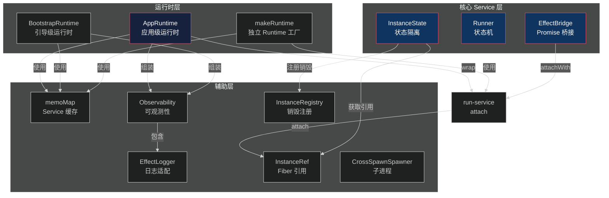
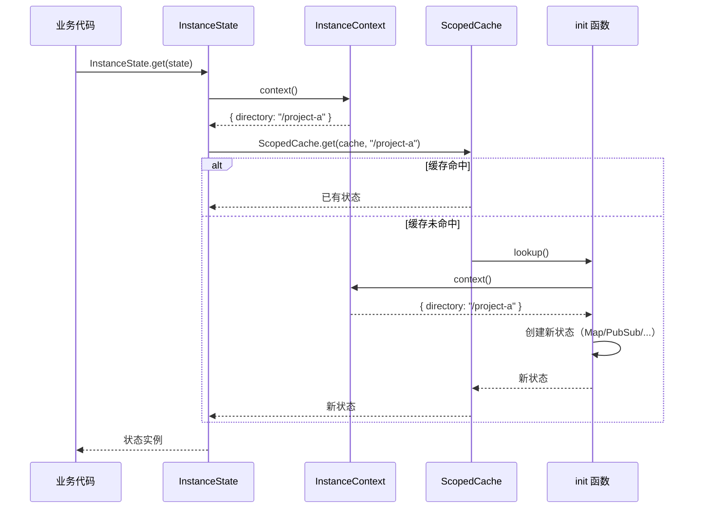
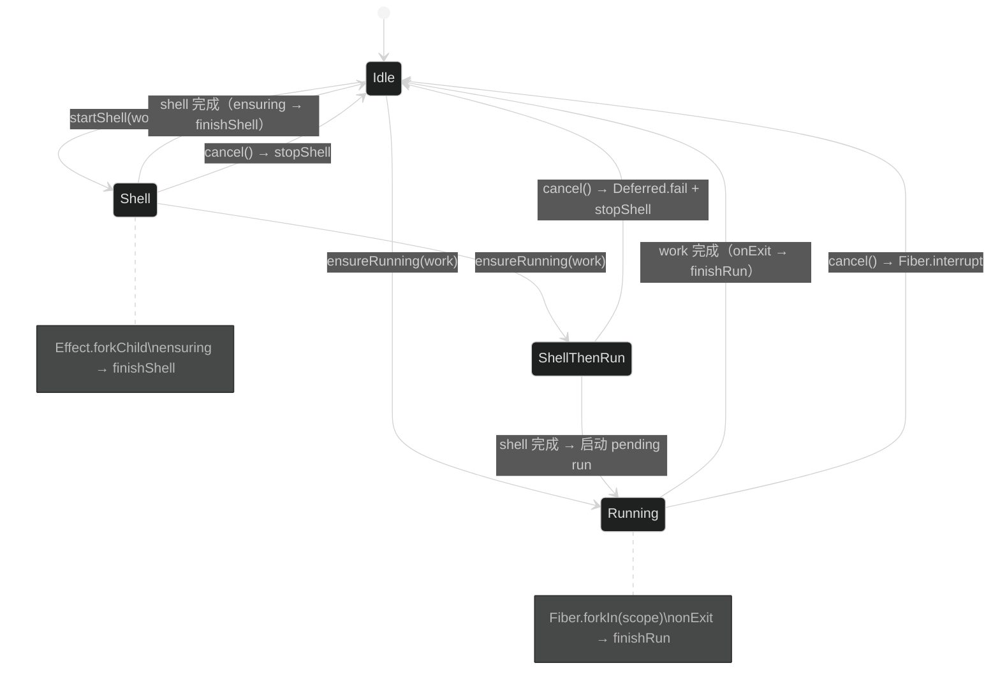
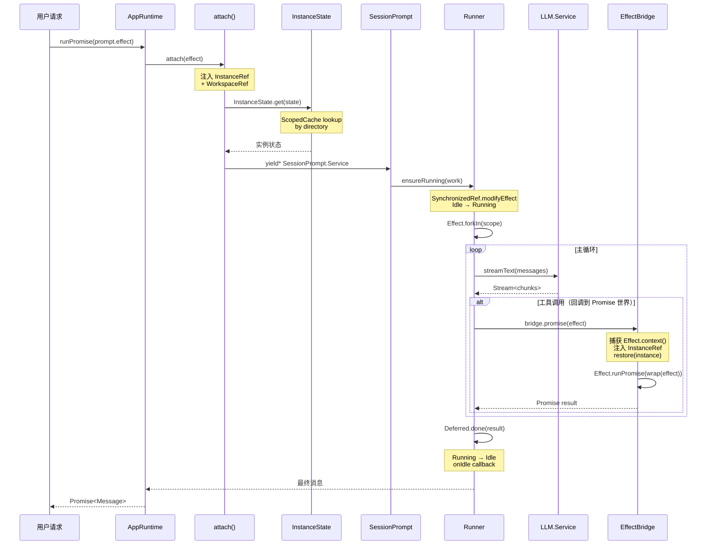
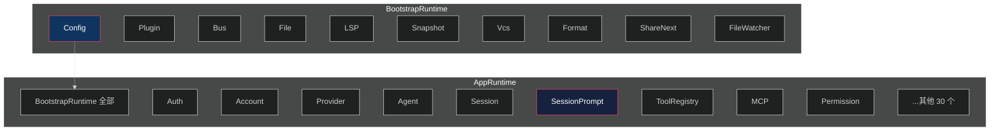

# OpenCode 中的 Effect 框架深度解析

> 本文档聚焦 `packages/opencode/src/effect/` 目录，系统解读 OpenCode 如何使用 [Effect](https://effect.website) 框架构建可扩展、类型安全、资源自管理的后端架构。

---

## 一、为什么用 Effect？

OpenCode 是一个复杂的 AI 编程助手，涉及大量异步操作：LLM 流式调用、工具执行、事件发布/订阅、文件操作、子进程管理、数据库读写等。Effect 框架提供了以下核心能力来解决这些挑战：

| 挑战 | Effect 方案 | OpenCode 应用 |
|------|------------|--------------|
| **依赖注入** | `Context.Service` + `Layer` | 全部 40+ 个 Service |
| **资源生命周期** | `Scope` 自动释放 | 数据库连接、PubSub、MCP 客户端 |
| **并发控制** | `Fiber` + `Deferred` | 会话执行状态机 `Runner` |
| **流式处理** | `Stream` | LLM 流式响应、事件订阅 |
| **错误处理** | `Cause` + `Exit` + typed errors | 精确的错误分类与重试 |
| **可观测性** | `Logger` + Tracing | OTLP 导出、结构化日志 |
| **状态隔离** | `ScopedCache` | `InstanceState` 按工作目录隔离 |

---

## 二、Effect 核心概念速览

在深入 OpenCode 源码前，先理解 Effect 的几个核心概念。

### 2.1 Effect<A, E, R>

`Effect` 是一个描述"做什么"的值，不立即执行。三个类型参数：

- **A**：成功时的返回值类型
- **E**：失败时的错误类型
- **R**：运行所需的环境依赖

```typescript
// 一个需要 Config.Service 的 Effect，成功返回 string，失败返回 ConfigError
const getApiKey: Effect.Effect<string, ConfigError, Config.Service> = Effect.gen(function* () {
  const config = yield* Config.Service
  return config.apiKey
})
```

### 2.2 Context.Service — 依赖注入

```typescript
// 1. 定义 Service 标识
class MyService extends Context.Service<MyService, MyInterface>()("@my/MyService") {}

// 2. 定义 Interface
interface MyInterface {
  readonly doSomething: () => Effect.Effect<string>
}

// 3. 创建 Layer（实现 Service）
const layer = Layer.effect(
  MyService,
  Effect.gen(function* () {
    // 可以 yield* 其他 Service 作为依赖
    const dep = yield* OtherService
    return MyService.of({ doSomething: () => Effect.succeed("hello") })
  }),
)

// 4. 使用时 yield* 获取 Service
const program = Effect.gen(function* () {
  const svc = yield* MyService
  return yield* svc.doSomething()
}).pipe(Effect.provide(layer))  // 提供实现
```

### 2.3 Layer — 依赖图构建

`Layer` 是 Service 的"工厂"，可以组合成依赖图：

```typescript
// 合并多个 Layer
const AppLayer = Layer.mergeAll(
  Config.defaultLayer,
  Bus.defaultLayer,
  Session.defaultLayer,
)

// 依赖关系：SessionLayer 需要 BusLayer
const sessionLayer = Layer.effect(Session.Service, Effect.gen(function* () {
  const bus = yield* Bus.Service  // 声明依赖
  // ...
})).pipe(Layer.provide(Bus.layer))  // 提供依赖
```

### 2.4 Scope — 资源安全

任何在 `Scope` 中创建的资源，在 Scope 关闭时自动释放：

```typescript
Effect.gen(function* () {
  // 这个 PubSub 在 Scope 关闭时自动 shutdown
  const pubsub = yield* PubSub.unbounded<string>()

  // 注册自定义清理逻辑
  yield* Effect.addFinalizer(() => Effect.sync(() => {
    console.log("清理资源")
  }))

  return pubsub
})
```

### 2.5 ManagedRuntime — 运行时

```typescript
// 创建一个托管运行时
const runtime = ManagedRuntime.make(AppLayer)

// 在 Effect 世界外执行
const result = await runtime.runPromise(program)
```

---

## 三、Effect 模块全景

```
packages/opencode/src/effect/
├── index.ts              # 模块出口（re-export）
├── memo-map.ts           # Layer 共享缓存（跨 Runtime 复用 Service 实例）
├── runtime.ts            # 通用 Runtime 工厂函数
├── app-runtime.ts        # ★ 应用级 Runtime（组装全部 Service）
├── bootstrap-runtime.ts # 引导级 Runtime（最小 Service 子集）
├── run-service.ts        # Service → Runtime 桥接（带实例上下文）
├── bridge.ts             # Effect ↔ Promise 桥接（带实例恢复）
├── instance-ref.ts       # Fiber 级别的实例引用
├── instance-registry.ts  # 实例销毁回调注册表
├── instance-state.ts     # ★ 实例级状态隔离（ScopedCache）
├── runner.ts             # ★ 并发状态机（Deferred + Fiber）
├── logger.ts             # Effect Logger 适配
├── observability.ts      # OTLP 日志/追踪导出
└── cross-spawn-spawner.ts # Effect 子进程平台适配
```

### 模块关系图



---

## 四、应用运行时（`app-runtime.ts`）

这是整个 OpenCode 的运行时入口。它将所有 Service 的 Layer 组装成一个全局依赖图，并暴露 `runSync`/`runPromise`/`runFork` 等方法让外部调用。

### 4.1 AppLayer 组装

```typescript
// app-runtime.ts
export const AppLayer = Layer.mergeAll(
  Npm.defaultLayer,
  AppFileSystem.defaultLayer,
  Bus.defaultLayer,
  Auth.defaultLayer,
  Account.defaultLayer,
  Config.defaultLayer,
  // ... 共 40+ 个 Service Layer
  SessionShare.defaultLayer,
).pipe(Layer.provideMerge(Observability.layer))  // 注入可观测性
```

`Layer.mergeAll` 将所有独立 Layer 合并；`Layer.provideMerge` 在外层包裹 Observability Layer。

### 4.2 Runtime 创建

```typescript
const rt = ManagedRuntime.make(AppLayer, { memoMap })
```

`memoMap` 是一个全局共享的 Layer 缓存，确保同一个 Layer 在不同 Runtime 之间只创建一次 Service 实例：

```typescript
// memo-map.ts
export const memoMap = Layer.makeMemoMapUnsafe()
```

### 4.3 Runtime 接口

```typescript
export const AppRuntime: Runtime = {
  runSync(effect)   { return rt.runSync(wrap(effect)) },
  runPromise(effect){ return rt.runPromise(wrap(effect)) },
  runFork(effect)   { return rt.runFork(wrap(effect)) },
  dispose: () => rt.dispose(),
}
```

其中 `wrap` 调用 `attach`，将当前线程的实例上下文（`Instance.current`）注入到 Effect 中：

```typescript
const wrap = (effect) => attach(effect) as never
// run-service.ts
export function attach(effect) {
  return attachWith(effect, {
    instance: Instance.current,     // 当前工作目录上下文
    workspace: WorkspaceContext.workspaceID,  // 当前工作空间 ID
  })
}
```

---

## 五、实例状态隔离（`instance-state.ts`）

这是 OpenCode Effect 架构中**最精妙的设计**。它确保每个工作目录（项目）有完全独立的状态，互不干扰。

### 5.1 问题

OpenCode 支持同时操作多个项目。如果 `Bus`、`SessionStatus`、`ToolRegistry` 等使用全局单例，不同项目的状态会互相污染。

### 5.2 解决方案

用 `ScopedCache`，以**工作目录路径**为 key 缓存每个实例的状态：

```typescript
export const make = <A>(init: (ctx: InstanceContext) => Effect.Effect<A>) =>
  Effect.gen(function* () {
    const cache = yield* ScopedCache.make({
      capacity: Number.POSITIVE_INFINITY,  // 无限缓存
      lookup: () => Effect.gen(function* () {
        return yield* init(yield* context)  // 获取当前实例上下文后初始化
      }),
    })
    // 注册销毁回调
    const off = registerDisposer((directory) =>
      Effect.runPromise(ScopedCache.invalidate(cache, directory))
    )
    yield* Effect.addFinalizer(() => Effect.sync(off))
    return { [TypeId]: TypeId, cache }
  })
```

### 5.3 工作流程



### 5.4 实际使用示例

以 `SessionStatus` 为例：

```typescript
// session/status.ts
const layer = Layer.effect(Service, Effect.gen(function* () {
  const bus = yield* Bus.Service

  // 状态隔离！每个工作目录有独立的 Map
  const state = yield* InstanceState.make(
    Effect.fn("SessionStatus.state")(() => Effect.succeed(new Map<SessionID, Info>()))
  )

  const get = Effect.fn("SessionStatus.get")(function* (sessionID) {
    const data = yield* InstanceState.get(state)  // 获取当前实例的 Map
    return data.get(sessionID) ?? { type: "idle" }
  })

  const set = Effect.fn("SessionStatus.set")(function* (sessionID, status) {
    const data = yield* InstanceState.get(state)
    yield* bus.publish(Event.Status, { sessionID, status })
    data.set(sessionID, status)
  })

  return Service.of({ get, list, set })
}))
```

### 5.5 API 汇总

| 函数 | 签名 | 作用 |
|------|------|------|
| `make(init)` | `(ctx) => Effect<A>` → `Effect<InstanceState<A>>` | 创建实例隔离状态 |
| `get(self)` | `InstanceState<A>` → `Effect<A>` | 获取当前实例的状态 |
| `use(self, f)` | `(InstanceState<A>, A→B)` → `Effect<B>` | 获取状态并映射 |
| `has(self)` | `InstanceState<A>` → `Effect<boolean>` | 检查当前实例是否有状态 |
| `invalidate(self)` | `InstanceState<A>` → `Effect<void>` | 使当前实例状态失效 |
| `bind(fn)` | 普通函数 → 绑定实例上下文的函数 | 在 Promise 回调中恢复实例 |
| `context` | `Effect<InstanceContext>` | 获取当前实例上下文 |
| `directory` | `Effect<string>` | 获取当前工作目录 |

---

## 六、并发状态机（`runner.ts`）

`Runner` 管理单个会话的执行生命周期，是一个基于 Effect `Fiber` + `Deferred` 构建的有限状态机。

### 6.1 四种状态

```typescript
type State<A, E> =
  | { _tag: "Idle" }                                              // 空闲
  | { _tag: "Running"; run: RunHandle<A, E> }                     // 正在执行主循环
  | { _tag: "Shell"; shell: ShellHandle<A, E> }                  // 正在执行 Shell 模式
  | { _tag: "ShellThenRun"; shell: ShellHandle; run: PendingHandle }  // Shell 完成后接续主循环
```

### 6.2 状态转换图



### 6.3 核心设计：SynchronizedRef

整个状态机围绕一个 `SynchronizedRef`（线程安全的可变引用）构建：

```typescript
const ref = SynchronizedRef.makeUnsafe<State<A, E>>({ _tag: "Idle" })
```

所有状态变更通过 `SynchronizedRef.modify` / `modifyEffect` 原子操作完成，确保并发安全。

### 6.4 Deferred — 一次性同步原语

`Deferred` 类似 Promise，但可在 Effect 世界中 await：

```typescript
// ensureRunning 的核心逻辑
const ensureRunning = (work) =>
  SynchronizedRef.modifyEffect(ref, function* (st) {
    switch (st._tag) {
      case "Running":
      case "ShellThenRun":
        // 已有运行中的任务，等待它完成
        return [Deferred.await(st.run.done), st]

      case "Shell": {
        // Shell 进行中，排入等待队列
        const run = {
          id: next(),
          done: yield* Deferred.make<A, E | Cancelled>(),
          work,
        }
        return [Deferred.await(run.done), { _tag: "ShellThenRun", shell: st.shell, run }]
      }

      case "Idle": {
        // 空闲，立即启动
        const done = yield* Deferred.make<A, E | Cancelled>()
        const run = yield* startRun(work, done)
        return [Deferred.await(done), { _tag: "Running", run }]
      }
    }
  }).pipe(
    Effect.flatten,
    // 取消时触发 onInterrupt
    Effect.catch(e => e instanceof Cancelled ? onInterrupt : Effect.fail(e))
  )
```

### 6.5 Fiber 管理

```typescript
const startRun = (work, done) =>
  Effect.gen(function* () {
    const id = next()
    const fiber = yield* work.pipe(
      Effect.onExit((exit) => finishRun(id, done, exit)),  // 完成时回调
      Effect.forkIn(scope),  // 在指定 Scope 内 fork
    )
    return { id, done, fiber }
  })
```

- `Effect.forkIn(scope)`：在指定 Scope 内创建 Fiber，Scope 关闭时自动中断
- `Effect.onExit`：注册完成回调，无论成功/失败都触发 `finishRun`
- `Effect.forkChild`：创建子 Fiber，父 Fiber 中断时子 Fiber 也中断

### 6.6 Cancelled 错误类型

```typescript
export class Cancelled extends Schema.TaggedErrorClass<Cancelled>()("RunnerCancelled", {}) {}
```

取消操作通过 `Deferred.fail(done, new Cancelled())` 传播，调用方通过 `Effect.catch` 捕获并触发 `onInterrupt` 回调。

### 6.7 在 OpenCode 中的使用

`Runner` 被 `SessionRunState` 使用，每个 SessionID 对应一个独立的 Runner：

```typescript
// session/run-state.ts（简化）
const runners = new Map<SessionID, Runner>()

const ensureRunning = (sessionID, work) => {
  let runner = runners.get(sessionID)
  if (!runner) {
    runner = Runner.make(scope, { onIdle: () => publishIdle(sessionID) })
    runners.set(sessionID, runner)
  }
  return runner.ensureRunning(work)
}
```

---

## 七、Effect ↔ Promise 桥接（`bridge.ts`）

当代码需要在 Effect 世界和 Promise 世界之间穿越时（如 MCP SDK 回调、AI SDK 回调），使用 `EffectBridge`。

### 7.1 接口

```typescript
interface Shape {
  readonly promise: <A, E, R>(effect: Effect.Effect<A, E, R>) => Promise<A>
  readonly fork: <A, E, R>(effect: Effect.Effect<A, E, R>) => Fiber.Fiber<A, E>
}
```

### 7.2 实现核心

```typescript
export function make(): Effect.Effect<Shape> {
  return Effect.gen(function* () {
    const ctx = yield* Effect.context()       // 捕获当前 Effect 上下文
    const instance = (yield* InstanceRef) ?? Instance.current
    const workspace = (yield* WorkspaceRef) ?? WorkspaceContext.workspaceID
    const attach = (effect) => attachWith(effect, { instance, workspace })
    const wrap = (effect) => attach(effect).pipe(Effect.provide(ctx)) as Effect.Effect<A, E, never>

    return {
      promise: (effect) =>
        restore(instance, workspace, () => Effect.runPromise(wrap(effect))),
      fork: (effect) =>
        restore(instance, workspace, () => Effect.runFork(wrap(effect))),
    }
  })
}
```

关键点：
1. **捕获上下文**：`Effect.context()` 捕获当前 Fiber 的全部 Service 依赖
2. **注入引用**：`attachWith` 将 `InstanceRef` 和 `WorkspaceRef` 注入 Effect
3. **恢复实例**：`restore()` 使用 `Instance.restore` / `WorkspaceContext.restore` 恢复 AsyncLocalStorage 上下文

### 7.3 使用场景

```typescript
// 在 MCP SDK 的回调中调用 OpenCode 的 Effect 代码
const bridge = yield* EffectBridge.make()

// bridge.promise 可以在非 Effect 回调中使用
const mcpClient = createMCPClient({
  onProgress: (progress) => bridge.promise(
    Effect.gen(function* () {
      const bus = yield* Bus.Service
      yield* bus.publish(ProgressEvent, { ... })
    })
  )
})
```

---

## 八、实例引用与注册表

### 8.1 InstanceRef / WorkspaceRef（`instance-ref.ts`）

这两个是 **Fiber 级别**的 Context Reference，用于在 Effect Fiber 间传递实例上下文：

```typescript
export const InstanceRef = Context.Reference<InstanceContext | undefined>(
  "~opencode/InstanceRef",
  { defaultValue: () => undefined }
)

export const WorkspaceRef = Context.Reference<WorkspaceID | undefined>(
  "~opencode/WorkspaceRef",
  { defaultValue: () => undefined }
)
```

与 `Instance.current`（基于 AsyncLocalStorage）的区别：

| 机制 | 实现 | 作用域 | 适用场景 |
|------|------|--------|---------|
| `Instance.current` | AsyncLocalStorage | Node.js 异步链 | Promise 回调 |
| `InstanceRef` | Effect Fiber Context | 单个 Effect Fiber | Effect 内部 fork |

`InstanceState.bind()` 方法优先使用 `Instance.bind`（AsyncLocalStorage），如果不可用则降级到 `InstanceRef`：

```typescript
export const bind = (fn) => {
  try { return Instance.bind(fn) }  // 优先 AsyncLocalStorage
  catch (err) {
    if (!(err instanceof LocalContext.NotFound)) throw err
  }
  // 降级到 Fiber Context
  const fiber = Fiber.getCurrent()
  const ctx = fiber ? Context.getReferenceUnsafe(fiber.context, InstanceRef) : undefined
  if (!ctx) return fn
  return (...args) => Instance.restore(ctx, () => fn(...args))
}
```

### 8.2 InstanceRegistry（`instance-registry.ts`）

全局注册表，管理实例销毁时的清理回调：

```typescript
const disposers = new Set<(directory: string) => Promise<void>>()

export function registerDisposer(disposer) {
  disposers.add(disposer)
  return () => { disposers.delete(disposer) }
}

export async function disposeInstance(directory) {
  await Promise.allSettled([...disposers].map(d => d(directory)))
}
```

当用户关闭某个项目时，`disposeInstance(directory)` 被调用，所有通过 `registerDisposer` 注册的清理函数都会执行，使对应的 `ScopedCache` 条目失效。

---

## 九、独立 Runtime 工厂（`run-service.ts`）

有些 Service 需要自己的独立 Runtime（如 Bus 需要在全局注册事件回调，不依赖完整 AppLayer）。

### 9.1 makeRuntime

```typescript
export function makeRuntime<I, S, E>(service, layer) {
  let rt: ManagedRuntime | undefined
  const getRuntime = () => (rt ??= ManagedRuntime.make(
    Layer.provideMerge(layer, Observability.layer),
    { memoMap }
  ))

  return {
    runSync: (fn) => getRuntime().runSync(attach(service.use(fn))),
    runPromise: (fn) => getRuntime().runPromise(attach(service.use(fn))),
    runFork: (fn) => getRuntime().runFork(attach(service.use(fn))),
    // ...
  }
}
```

特点：
- **懒初始化**：首次调用时才创建 Runtime
- **attach 注入**：每次执行都通过 `attach` 注入当前实例上下文
- **memoMap 共享**：使用全局 `memoMap`，确保 Service 实例跨 Runtime 复用

### 9.2 使用示例

```typescript
// bus/index.ts
export const make = (service, layer) => makeRuntime(service, layer)

// 在非 Effect 代码中使用
const busRuntime = makeRuntime(Bus.Service, Bus.defaultLayer)
busRuntime.runPromise(svc => svc.publish(Event, data))
```

---

## 十、可观测性（`observability.ts`）

### 10.1 双模式设计

```typescript
export const layer = !base
  ? EffectLogger.layer                          // 无 OTLP 端点：仅本地日志
  : Layer.unwrap(Effect.gen(function* () {
      const trace = yield* Effect.promise(traces)
      return Layer.mergeAll(trace, logs())      // 有 OTLP：日志 + 追踪
    }))
```

### 10.2 资源信息

```typescript
export function resource() {
  return {
    serviceName: "opencode",
    serviceVersion: InstallationVersion,
    attributes: {
      "deployment.environment.name": InstallationChannel,
      "opencode.client": Flag.OPENCODE_CLIENT,
      "opencode.process_role": processMetadata.processRole,
      "opencode.run_id": processMetadata.runID,
      "service.instance.id": processID,
    },
  }
}
```

### 10.3 日志导出

通过 OTLP HTTP 协议导出到 OpenTelemetry 收集器：

```typescript
OtlpLogger.make({
  url: `${base}/v1/logs`,
  resource: resource(),
  headers,
})
```

### 10.4 追踪导出

```typescript
// 使用 AsyncLocalStorageContextManager 确保非 Effect 代码也能正确传递 trace context
const { AsyncLocalStorageContextManager } = await import("@opencode/context-async-hooks")
const mgr = new AsyncLocalStorageContextManager()
mgr.enable()
context.setGlobalContextManager(mgr)
```

---

## 十一、日志适配（`logger.ts`）

将 Effect 的 `Logger` 系统桥接到 OpenCode 自有的 `Log` 工具。

### 11.1 Logger 实现

```typescript
export const logger = Logger.make((opts) => {
  const extra = clean(opts.fiber.getRef(References.CurrentLogAnnotations))

  // 自动计算 logSpan 耗时
  for (const [key, start] of opts.fiber.getRef(References.CurrentLogSpans)) {
    extra[`logSpan.${key}`] = `${now - start}ms`
  }

  // 错误信息提取
  if (opts.cause.reasons.length > 0) {
    extra.cause = Cause.pretty(opts.cause)
  }

  // 按 service 字段路由到不同 logger
  const svc = extra.service
  const log = svc ? Log.create({ service: svc }) : Log.Default

  switch (opts.logLevel) {
    case "Debug": return log.debug(msg, extra)
    case "Warn": return log.warn(msg, extra)
    case "Error": return log.error(msg, extra)
    default: return log.info(msg, extra)
  }
})
```

### 11.2 Handle 接口

```typescript
const log = EffectLogger.create({ service: "session" })

// 在 Effect 中使用
yield* log.info("Session created", { sessionID: "abc123" })

// 链式添加上下文
const sessionLog = log.with({ sessionID: "abc123" })
yield* sessionLog.info("Processing message")
```

---

## 十二、引导运行时（`bootstrap-runtime.ts`）

### 12.1 最小 Service 子集

```typescript
export const BootstrapLayer = Layer.mergeAll(
  Config.defaultLayer,
  Plugin.defaultLayer,
  ShareNext.defaultLayer,
  Format.defaultLayer,
  LSP.defaultLayer,
  File.defaultLayer,
  FileWatcher.defaultLayer,
  Vcs.defaultLayer,
  Snapshot.defaultLayer,
  Bus.defaultLayer,
).pipe(Layer.provide(Observability.layer))
```

### 12.2 使用场景

`BootstrapRuntime` 用于不需要完整 Service 栈的场景，如 CLI 初始化阶段、配置解析阶段。它比 `AppRuntime` 轻量得多，只包含 10 个核心 Service。

---

## 十三、子进程 Spawner（`cross-spawn-spawner.ts`）

这是一个平台适配层，将 Effect 的 `ChildProcessSpawner` 接口适配到 `cross-spawn` 库。

### 13.1 核心功能

```typescript
// 将 Node.js 的 errno 映射为 Effect 的 PlatformError
const toTag = (err) => {
  switch (err.code) {
    case "ENOENT": return "NotFound"
    case "EACCES": return "PermissionDenied"
    case "EEXIST": return "AlreadyExists"
    // ...
  }
}

// 支持 PipedCommand（管道组合）
const flatten = (command) => {
  // 将 PipedCommand 展开为多个 StandardCommand + PipeOptions
}
```

### 13.2 Stream 集成

子进程的 stdout/stderr 被转换为 Effect `Stream`，可以与其他 Effect 操作组合：

```typescript
// 使用 Stream 处理子进程输出
const stream = pipe(stdout, Stream.chunks, Stream.map(Chunk.toArray))
```

---

## 十四、完整执行流程中的 Effect 角色



---

## 十五、Effect 使用模式总结

### 15.1 Service 定义模式

每个 OpenCode 模块都遵循统一模式：

```typescript
// 1. 定义 Interface
export interface Interface {
  readonly foo: () => Effect.Effect<string>
}

// 2. 定义 Service
export class Service extends Context.Service<Service, Interface>()("@opencode/Foo") {}

// 3. 定义 Layer
export const layer = Layer.effect(Service, Effect.gen(function* () {
  const dep = yield* OtherService       // 声明依赖
  const state = yield* InstanceState.make(...)  // 实例隔离状态

  const foo = Effect.fn("Foo.foo")(function* () {
    // 实现...
  })

  return Service.of({ foo })
}))

// 4. 导出 defaultLayer（提供依赖）
export const defaultLayer = layer.pipe(Layer.provide(OtherService.layer))

// 5. 导出命名空间
export * as Foo from "./foo"
```

### 15.2 InstanceState 使用模式

```typescript
// 在 Layer 中创建实例隔离状态
const state = yield* InstanceState.make(
  Effect.fn("MyService.state")(function* (ctx) {
    // ctx 是 InstanceContext，包含 directory 等
    const data = yield* Database.use((db) => db.select().from(...).all())
    return new Map(data.map(row => [row.id, row]))
  })
)

// 使用时获取当前实例的状态
const foo = Effect.fn("MyService.foo")(function* () {
  const map = yield* InstanceState.get(state)
  return map.get(id)
})
```

### 15.3 错误处理模式

```typescript
// 定义 tagged error
export class MyError extends Schema.TaggedErrorClass<MyError>()("MyError", {
  message: Schema.String,
}) {}

// 在 Effect 中抛出
const program = Effect.gen(function* () {
  if (!valid) yield* Effect.fail(new MyError({ message: "invalid" }))
})

// 捕获
program.pipe(
  Effect.catch(err => err instanceof MyError ? handleMyError(err) : Effect.fail(err))
)
```

### 15.4 事件发布模式

```typescript
const layer = Layer.effect(Service, Effect.gen(function* () {
  const bus = yield* Bus.Service
  const state = yield* InstanceState.make(...)

  const set = Effect.fn("MyService.set")(function* (value) {
    const data = yield* InstanceState.get(state)
    data.set(key, value)
    // 通过 Bus 广播事件
    yield* bus.publish(Event.Changed, { key, value })
  })

  return Service.of({ set })
})).pipe(Layer.provide(Bus.layer))
```

---

## 十六、Effect vs 传统方式对比

### 16.1 依赖注入对比

```typescript
// ❌ 传统方式：手动传递依赖
async function getSession(sessionID: string, deps: { db: Database, bus: Bus }) {
  const session = await deps.db.get(...)
  deps.bus.emit("session.updated", session)
  return session
}

// ✅ Effect 方式：自动注入
const getSession = Effect.fn("getSession")(function* (sessionID: string) {
  const db = yield* Database.Service      // 自动获取
  const bus = yield* Bus.Service          // 自动获取
  const session = yield* db.get(...)
  yield* bus.publish(Event.Updated, session)
  return session
})
```

### 16.2 资源管理对比

```typescript
// ❌ 传统方式：手动 try/finally
const pubsub = createPubSub()
try {
  await pubsub.publish(msg)
} finally {
  await pubsub.close()
}

// ✅ Effect 方式：Scope 自动管理
const pubsub = yield* PubSub.unbounded()  // 自动在 Scope 关闭时释放
yield* PubSub.publish(pubsub, msg)
// 无需 finally
```

### 16.3 并发控制对比

```typescript
// ❌ 传统方式：手写状态变量 + Promise
let isRunning = false
let pendingWork: Promise | null = null

async function run(work: () => Promise) {
  if (isRunning) {
    pendingWork = pendingWork ?? work()
    return pendingWork
  }
  isRunning = true
  try { await work() }
  finally { isRunning = false }
}

// ✅ Effect 方式：Runner 状态机
const runner = Runner.make(scope, { onIdle: ... })
const result = yield* runner.ensureRunning(Effect.gen(function* () { ... }))
// 自动处理排队、取消、状态转换
```

---

## 十七、关键设计决策解读

### 17.1 为什么用 ScopedCache 而不是 Map？

`ScopedCache` 相比普通 `Map` 的优势：
- **自动清理**：当 Scope 关闭时，相关缓存条目自动失效
- **并发安全**：`lookup` 函数在并发调用时只执行一次
- **集成 Effect**：自然融入 Effect 的资源管理系统

### 17.2 为什么用 SynchronizedRef 而不是 Ref？

`Runner` 使用 `SynchronizedRef` 而非 `Ref`：
- `Ref`：提供原子读写，但不支持 CAS 操作中的 Effect 副作用
- `SynchronizedRef`：支持在 `modify` 回调中执行 Effect（如 `Effect.forkIn`、`Deferred.make`）

### 17.3 为什么有两种 Runtime？



- **BootstrapRuntime**：CLI 解析参数阶段，只需配置、文件、LSP 等基础服务
- **AppRuntime**：完整运行时，包含所有 40+ Service，用于实际执行 AI 对话

---

## 十八、总结

OpenCode 的 Effect 架构可以概括为：

```
AppRuntime（全局运行时）
  └── AppLayer（40+ Service 的依赖图）
        ├── InstanceState（每个工作目录独立状态）
        │     └── ScopedCache（按 directory 隔离）
        ├── Runner（会话级状态机）
        │     └── SynchronizedRef + Deferred + Fiber
        ├── EffectBridge（Promise 世界桥接）
        │     └── Effect.context() + attach
        └── Observability（可观测性）
              └── OTLP Logger + Tracer
```

| 组件 | 解决的核心问题 | Effect 机制 |
|------|--------------|------------|
| `AppRuntime` | 全局依赖注入 | `ManagedRuntime` + `Layer.mergeAll` |
| `InstanceState` | 多项目状态隔离 | `ScopedCache` + `Effect.context()` |
| `Runner` | 会话并发控制 | `SynchronizedRef` + `Deferred` + `Fiber` |
| `EffectBridge` | Promise 回调中调用 Effect | `Effect.context()` + `Effect.runPromise` |
| `run-service` | 独立 Service Runtime | `makeRuntime` + `attach` |
| `memoMap` | Service 实例跨 Runtime 复用 | `Layer.makeMemoMapUnsafe` |
| `InstanceRef` | Fiber 间上下文传递 | `Context.Reference` |
| `InstanceRegistry` | 实例销毁清理 | `Set<Disposer>` |
