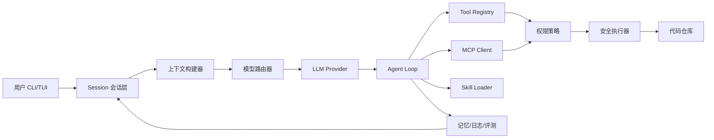
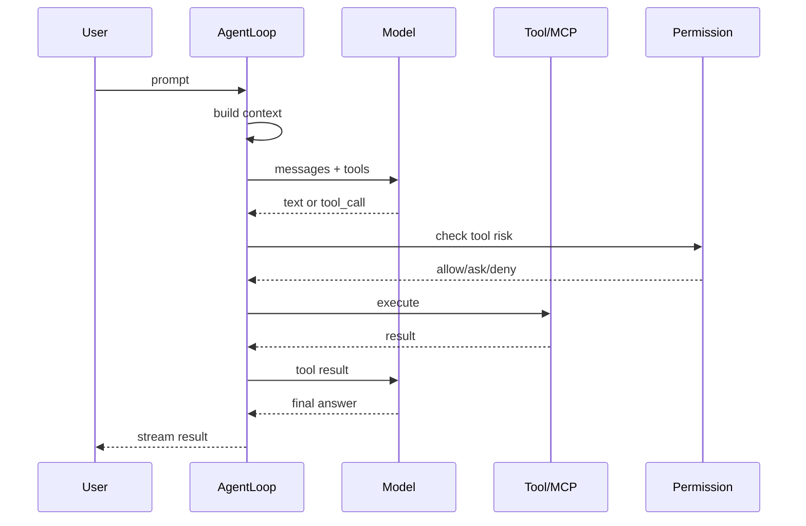
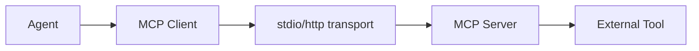
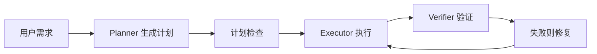
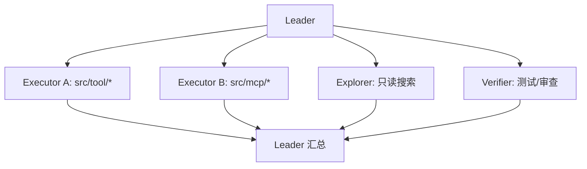
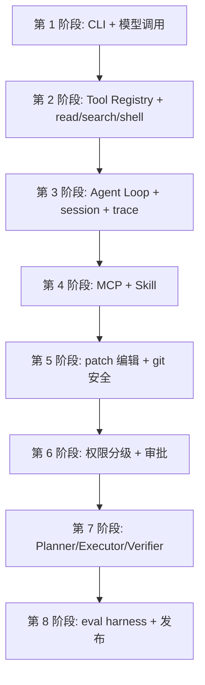
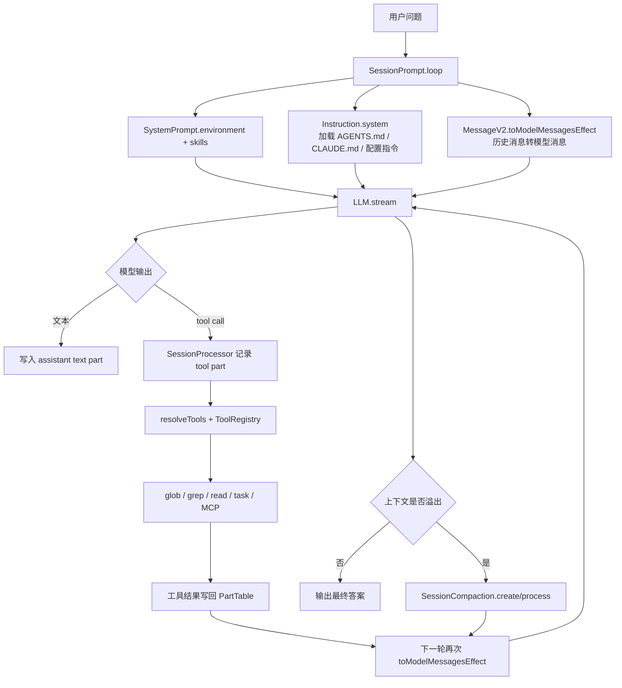
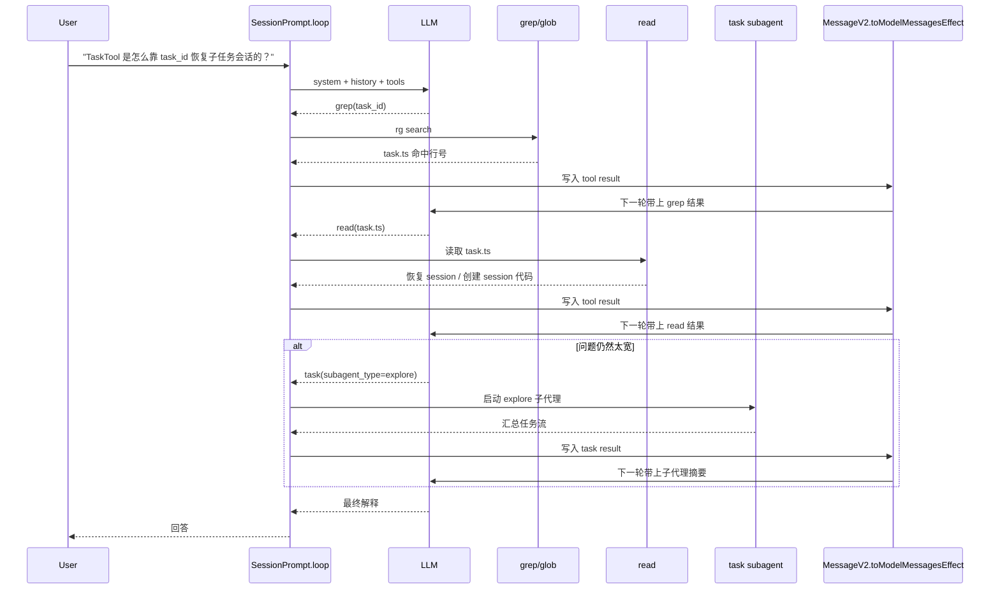

# opencode-agent 设计示例

本文是一份从 0 开发 AI 代码助手的分层示例集。目标不是复制 opencode 的全部实现，而是把一个代码助手会遇到的核心能力拆成可组合的设计积木：模型调用、工具调用、MCP、Skill、上下文、权限、反思、评测、日志和多 Agent 协作。

文档内示例以 TypeScript 为主，偏工程可落地。你可以把它当成一个逐步演化的蓝图：先做能跑的最小闭环，再加工具、权限、记忆、反思和评测。

> 重要：本文代码是教学骨架，用来说明模块边界和设计思路，不是可直接上线的安全完整实现。生产实现必须补齐路径 canonicalization、权限审批、命令 AST 分析、真实流式协议解析、输出截断、取消清理、审计日志、测试和 prompt injection 防护。

## 0. 总体架构



核心循环：



## 1. 最小项目骨架

推荐目录：

```text
my-agent/
  src/
    index.ts
    agent/loop.ts
    agent/context.ts
    agent/router.ts
    model/provider.ts
    tool/registry.ts
    tool/builtin.ts
    mcp/client.ts
    skill/loader.ts
    permission/policy.ts
    session/store.ts
    trace/logger.ts
    eval/harness.ts
  skills/
    code-review/SKILL.md
    planner/SKILL.md
  agent.config.json
```

统一类型：

```ts
export type Message =
  | { role: "system"; content: string }
  | { role: "user"; content: string }
  | { role: "assistant"; content: string; toolCalls?: ToolCall[] }
  | { role: "tool"; toolCallId: string; content: string }

export type ToolCall = {
  id: string
  name: string
  input: unknown
}

export type ToolResult = {
  ok: boolean
  output: string
  metadata?: Record<string, unknown>
}
```

## 2. 示例索引

| 层级 | 示例 | 主题 |
| --- | ---: | --- |
| 基础 | 1-12 | CLI、模型、流式输出、Tool、MCP、Skill |
| 工程化 | 13-24 | 上下文、会话、日志、编辑、Git、重试、取消 |
| 高级 Agent | 25-34 | 模型路由、角色、反思、验证、思维链替代、死循环防护 |
| 安全治理 | 35-40 | 权限分级、审批、策略引擎、沙箱、密钥、审计 |
| 评测上线 | 41-45 | 回归集、成本、观测、发布和插件化 |

## 基础层

### 示例 1: CLI 接收用户 prompt

目标：先做一个能接受输入的命令行入口。

```ts
import { parseArgs } from "util"
import { runAgent } from "./agent/loop"

const args = parseArgs({
  options: {
    model: { type: "string", default: "gpt-5.4" },
    cwd: { type: "string", default: process.cwd() },
  },
  allowPositionals: true,
})

await runAgent({
  prompt: args.positionals.join(" "),
  model: args.values.model!,
  cwd: args.values.cwd!,
})
```

设计要点：

- `cwd` 必须显式传入 Agent，不要在各模块里随便 `process.cwd()`。
- prompt 只是入口，真正的消息要经过 session、context、policy 统一包装。

### 示例 2: 最小模型调用

目标：封装 provider，避免业务代码直接依赖某个 SDK。

```ts
export type ModelRequest = {
  model: string
  messages: Message[]
  temperature?: number
}

export type ModelChunk =
  | { type: "text"; text: string }
  | { type: "tool_call"; call: ToolCall }
  | { type: "done" }

export interface ModelProvider {
  stream(input: ModelRequest): AsyncIterable<ModelChunk>
}
```

实现时可以接 OpenAI-compatible endpoint：

```ts
export function createOpenAICompatibleProvider(config: { baseURL: string; apiKey: string }): ModelProvider {
  return {
    async *stream(input) {
      const res = await fetch(`${config.baseURL}/chat/completions`, {
        method: "POST",
        headers: {
          authorization: `Bearer ${config.apiKey}`,
          "content-type": "application/json",
        },
        body: JSON.stringify({ model: input.model, messages: input.messages, stream: true }),
      })
      if (!res.ok) throw new Error(await res.text())
      // 教学简化：真实实现应解析 SSE/NDJSON 流，并把 tool_call、reasoning、finish 等事件逐条产出。
      yield { type: "text", text: await res.text() }
      yield { type: "done" }
    },
  }
}
```

### 示例 3: 流式输出到终端

目标：用户能实时看到模型输出。

```ts
export async function printStream(chunks: AsyncIterable<ModelChunk>) {
  for await (const chunk of chunks) {
    if (chunk.type === "text") process.stdout.write(chunk.text)
    if (chunk.type === "done") process.stdout.write("\n")
  }
}
```

建议：流式输出和事件日志分离。终端显示给人看，trace 日志给调试看。

### 示例 4: Tool Registry

目标：统一注册、查找、执行工具。

```ts
export type Tool<I = unknown> = {
  name: string
  description: string
  schema: unknown
  risk: "read" | "write" | "exec" | "network"
  run(input: I, ctx: ToolContext): Promise<ToolResult>
}

export class ToolRegistry {
  private tools = new Map<string, Tool>()

  register(tool: Tool) {
    this.tools.set(tool.name, tool)
  }

  get(name: string) {
    return this.tools.get(name)
  }

  list() {
    return [...this.tools.values()]
  }
}
```

### 示例 5: 实现 read_file 工具

目标：让 Agent 能读代码。

```ts
import fs from "fs/promises"
import path from "path"

export const readFileTool: Tool<{ path: string }> = {
  name: "read_file",
  description: "Read a UTF-8 file inside the workspace.",
  schema: {
    type: "object",
    properties: { path: { type: "string" } },
    required: ["path"],
  },
  risk: "read",
  async run(input, ctx) {
    const full = path.resolve(ctx.cwd, input.path)
    const root = path.resolve(ctx.cwd)
    if (full !== root && !full.startsWith(root + path.sep)) return { ok: false, output: "Path escapes workspace" }
    return { ok: true, output: await fs.readFile(full, "utf8") }
  },
}
```

### 示例 6: 实现 shell 工具

目标：允许模型执行命令，但必须受权限控制。

注意：下面只是最小形态。生产版 shell 工具应像 opencode 一样解析命令结构、识别文件操作、处理动态表达式、做 external directory 权限判断，并支持取消和输出截断。

```ts
import { spawn } from "child_process"

export const shellTool: Tool<{ command: string; timeoutMs?: number }> = {
  name: "shell",
  description: "Run a shell command in the workspace.",
  schema: {
    type: "object",
    properties: {
      command: { type: "string" },
      timeoutMs: { type: "number" },
    },
    required: ["command"],
  },
  risk: "exec",
  async run(input, ctx) {
    return new Promise((resolve) => {
      const child = spawn(ctx.shell, ["-lc", input.command], { cwd: ctx.cwd })
      const timer = setTimeout(() => child.kill("SIGTERM"), input.timeoutMs ?? 120_000)
      let output = ""
      child.stdout.on("data", (x) => (output += x))
      child.stderr.on("data", (x) => (output += x))
      child.on("close", (code) => {
        clearTimeout(timer)
        resolve({ ok: code === 0, output: output.slice(0, 100_000), metadata: { code } })
      })
    })
  },
}
```

### 示例 7: Tool Call Loop

目标：模型调用工具后，把结果喂回模型直到完成。

```ts
export async function runToolLoop(input: {
  provider: ModelProvider
  registry: ToolRegistry
  messages: Message[]
  ctx: ToolContext
}) {
  for (let step = 1; step <= 20; step++) {
    for await (const chunk of input.provider.stream({ model: input.ctx.model, messages: input.messages })) {
      if (chunk.type === "text") process.stdout.write(chunk.text)
      if (chunk.type !== "tool_call") continue

      const tool = input.registry.get(chunk.call.name)
      if (!tool) throw new Error(`Unknown tool: ${chunk.call.name}`)

      const decision = await input.ctx.permission.check(tool, chunk.call.input)
      if (decision.type === "deny") throw new Error(decision.reason)

      const result = await tool.run(chunk.call.input, input.ctx)
      input.messages.push({ role: "tool", toolCallId: chunk.call.id, content: JSON.stringify(result) })
    }
  }
  throw new Error("Agent exceeded max steps")
}
```

### 示例 8: 把工具 schema 暴露给模型

目标：provider 调用时附带工具描述。

```ts
export function toProviderTools(registry: ToolRegistry) {
  return registry.list().map((tool) => ({
    type: "function",
    function: {
      name: tool.name,
      description: tool.description,
      parameters: tool.schema,
    },
  }))
}
```

注意：schema 不只是类型约束，也是提示词的一部分。描述要写清楚什么时候用、什么时候不要用。

### 示例 9: MCP Client 基础连接

目标：把外部能力通过 MCP 接进来。

```ts
export type MCPServerConfig = {
  name: string
  command: string
  args: string[]
  env?: Record<string, string>
}

export interface MCPClient {
  listTools(): Promise<Array<{ name: string; description: string; inputSchema: unknown }>>
  callTool(name: string, input: unknown): Promise<ToolResult>
}
```

连接流程：



### 示例 10: 把 MCP Tool 适配成内置 Tool

目标：让 agent 不关心工具来自本地还是 MCP。

```ts
export async function registerMCPTools(registry: ToolRegistry, client: MCPClient, serverName: string) {
  for (const item of await client.listTools()) {
    registry.register({
      name: `mcp_${serverName}_${item.name}`,
      description: item.description,
      schema: item.inputSchema,
      risk: "network",
      run: (input) => client.callTool(item.name, input),
    })
  }
}
```

### 示例 11: Skill Loader

目标：让用户用 Skill 扩展行为，例如 code-review、planner、test-writer。

```ts
import fs from "fs/promises"
import path from "path"

export async function loadSkill(root: string, name: string) {
  const file = path.join(root, name, "SKILL.md")
  return {
    name,
    content: await fs.readFile(file, "utf8"),
  }
}
```

注入方式：

```ts
messages.push({
  role: "system",
  content: `当前已加载 skill: ${skill.name}\n\n${skill.content}`,
})
```

### 示例 12: Skill 自动匹配

目标：根据用户 prompt 选择可能的 skill。

```ts
const rules = [
  { pattern: /review|代码审查|code review/i, skill: "code-review" },
  { pattern: /plan|设计方案|规划/i, skill: "planner" },
  { pattern: /test|测试|单测/i, skill: "test-writer" },
]

export function matchSkills(prompt: string) {
  return rules.filter((rule) => rule.pattern.test(prompt)).map((rule) => rule.skill)
}
```

工程建议：自动匹配只做推荐，显式 `$skillName` 优先级最高。

## 工程化层

### 示例 13: 上下文构建器

目标：把系统提示、用户输入、仓库信息、skill、历史消息统一压成 messages。

```ts
export async function buildContext(input: {
  prompt: string
  cwd: string
  history: Message[]
  skills: Array<{ name: string; content: string }>
}) {
  return [
    { role: "system", content: "你是一个代码助手。先理解仓库，再修改代码，最后验证。" },
    { role: "system", content: `工作目录: ${input.cwd}` },
    ...input.skills.map((skill) => ({ role: "system" as const, content: `Skill ${skill.name}\n${skill.content}` })),
    ...input.history,
    { role: "user", content: input.prompt },
  ]
}
```

### 示例 14: Context Packer

目标：当上下文太长时选择最重要的信息。

```ts
export function packMessages(messages: Message[], maxChars: number) {
  const result: Message[] = []
  let used = 0
  for (const msg of [...messages].reverse()) {
    const size = JSON.stringify(msg).length
    if (used + size > maxChars) continue
    result.unshift(msg)
    used += size
  }
  return result
}
```

优先级建议：

| 优先级 | 内容 |
| --- | --- |
| 最高 | 当前用户 prompt、系统安全规则、已打开文件、错误日志 |
| 中 | 最近工具结果、当前 plan、相关 skill |
| 低 | 很早的闲聊、重复日志、长篇无关输出 |

### 示例 15: Session Store

目标：每次交互都有可追踪状态。

```ts
export type Session = {
  id: string
  cwd: string
  createdAt: number
  updatedAt: number
  messages: Message[]
  metadata: Record<string, unknown>
}

export interface SessionStore {
  get(id: string): Promise<Session>
  save(session: Session): Promise<void>
}
```

建议持久化：JSONL 先够用，后续再换 SQLite。

### 示例 16: JSONL 事件日志

目标：比普通日志更适合机器检索。

```ts
import fs from "fs/promises"

export async function writeEvent(file: string, event: Record<string, unknown>) {
  await fs.appendFile(
    file,
    JSON.stringify({
      time: new Date().toISOString(),
      ...event,
    }) + "\n",
  )
}
```

事件类型示例：

```text
session.started
model.request
model.delta
tool.request
tool.result
permission.ask
permission.deny
agent.loop_detected
```

### 示例 17: 人类可读 Flow Log

目标：调试时一眼看懂 agent 走到哪一步。

```ts
export function flow(step: string, data?: unknown) {
  console.error(`${new Date().toLocaleString()} ${step} ${data ? JSON.stringify(data) : ""}`)
}

flow("收到用户 prompt", { prompt })
flow("准备调用模型", { model, messageCount: messages.length })
flow("模型请求工具", { tool: call.name, input: call.input })
flow("工具执行完成", { ok: result.ok })
flow("模型输出最终答案")
```

### 示例 18: 日志包含脚本名和行号

目标：定位日志来自哪个模块。

```ts
export function callsite() {
  return new Error().stack
    ?.split("\n")
    .slice(2)
    .map((line) => line.trim())
    .find((line) => !line.includes("logger.ts"))
}

export function trace(message: string, data?: unknown) {
  console.error(JSON.stringify({ time: new Date().toISOString(), callsite: callsite(), message, data }))
}
```

### 示例 19: 可取消运行

目标：用户 Ctrl-C 或 UI cancel 时，工具和模型都能停。

```ts
export type RunContext = {
  abortSignal: AbortSignal
}

export async function withCancel<T>(work: (ctx: RunContext) => Promise<T>) {
  const controller = new AbortController()
  process.once("SIGINT", () => controller.abort())
  return work({ abortSignal: controller.signal })
}
```

### 示例 20: 模型请求重试

目标：处理 429、网络抖动、临时 5xx。

```ts
export async function retry<T>(fn: () => Promise<T>, max = 3) {
  let last: unknown
  for (let i = 0; i < max; i++) {
    try {
      return await fn()
    } catch (error) {
      last = error
      await new Promise((resolve) => setTimeout(resolve, 500 * 2 ** i))
    }
  }
  throw last
}
```

不要重试：权限拒绝、schema 错误、上下文超限、用户取消。

### 示例 21: 文件编辑使用 Patch

目标：避免模型直接重写大文件。

```ts
export const applyPatchTool: Tool<{ patch: string }> = {
  name: "apply_patch",
  description: "Apply a unified patch to workspace files.",
  schema: {
    type: "object",
    properties: { patch: { type: "string" } },
    required: ["patch"],
  },
  risk: "write",
  async run(input, ctx) {
    const decision = await ctx.permission.checkPatch(input.patch)
    if (decision.type !== "allow") return { ok: false, output: decision.reason }
    return ctx.patch.apply(input.patch)
  },
}
```

### 示例 22: Git 安全护栏

目标：避免误删用户改动。

```ts
export async function assertNoConflictingChanges(git: GitClient, files: string[]) {
  const status = await git.status()
  const dirty = status.changedFiles.filter((file) => files.includes(file) && !status.changedByAgent.includes(file))
  if (dirty.length > 0) {
    throw new Error(`这些文件已有非 agent 改动，不能覆盖: ${dirty.join(", ")}`)
  }
}
```

### 示例 23: Tool 输出截断和落盘

目标：避免超长日志塞爆上下文。

```ts
export async function normalizeToolOutput(output: string, artifactDir: string) {
  if (output.length <= 50_000) return { inline: output }
  const file = `${artifactDir}/${Date.now()}-tool-output.txt`
  await Bun.write(file, output)
  return {
    inline: output.slice(0, 50_000) + `\n\n[输出过长，完整内容已写入 ${file}]`,
    artifact: file,
  }
}
```

### 示例 24: 错误分类

目标：不同错误走不同恢复策略。

```ts
export type AgentError =
  | { type: "permission_denied"; message: string }
  | { type: "context_overflow"; message: string }
  | { type: "tool_failed"; tool: string; message: string }
  | { type: "model_failed"; retryable: boolean; message: string }
  | { type: "loop_detected"; message: string }
```

错误策略：

| 错误 | 策略 |
| --- | --- |
| permission_denied | 停止或请求用户确认 |
| context_overflow | 压缩上下文后重试 |
| tool_failed | 让模型读错误并修正参数 |
| model_failed retryable | 退避重试或切换模型 |
| loop_detected | 强制总结、停止工具调用 |

## 高级 Agent 层

### 示例 25: 模型路由器

目标：不同任务用不同模型。

```ts
export function routeModel(task: { kind: string; risk: "low" | "medium" | "high"; needsVision?: boolean }) {
  if (task.needsVision) return "gpt-5.4-vision"
  if (task.kind === "search" && task.risk === "low") return "gpt-5.3-codex-spark"
  if (task.kind === "review" || task.risk === "high") return "gpt-5.4"
  return "gpt-5.4-mini"
}
```

常见模型分工：

| 模型类型 | 用途 |
| --- | --- |
| fast/spark | 搜索、摘要、轻量分类 |
| mini/standard | 常规实现、工具参数修复 |
| frontier | 架构、复杂 debug、代码审查、安全策略 |

### 示例 26: Agent Role

目标：角色不是模型，而是模型加提示词、工具和权限的组合。

```ts
export type AgentRole = {
  name: "planner" | "executor" | "reviewer" | "verifier"
  model: string
  system: string
  allowedTools: string[]
  maxSteps: number
}
```

角色示例：

```ts
export const executorRole: AgentRole = {
  name: "executor",
  model: "gpt-5.4",
  system: "你负责直接修改代码。修改前先读相关文件，修改后运行验证。",
  allowedTools: ["read_file", "search", "apply_patch", "shell"],
  maxSteps: 30,
}
```

### 示例 27: Planner-Executor 分离

目标：复杂任务先规划，再执行，减少盲目改代码。



```ts
const plan = await runRole(plannerRole, [{ role: "user", content: prompt }])
const result = await runRole(executorRole, [{ role: "user", content: `按这个计划执行:\n${plan}` }])
const verdict = await runRole(verifierRole, [{ role: "user", content: `验证结果:\n${result}` }])
```

### 示例 28: 自我反思

目标：让模型在提交前检查自己的方案，但不要无限反思。

```ts
export async function reflectOnce(draft: string, context: string) {
  return runModel({
    model: "gpt-5.4",
    messages: [
      { role: "system", content: "你是严格审查者。只指出具体缺陷和修复建议。" },
      { role: "user", content: `上下文:\n${context}\n\n草稿:\n${draft}` },
    ],
  })
}
```

控制规则：

| 规则 | 原因 |
| --- | --- |
| 最多反思 1-2 次 | 防止拖慢和循环 |
| 只输出缺陷列表 | 避免重新生成整套方案 |
| 反思后必须执行验证 | 反思不是测试 |

### 示例 29: Verifier Agent

目标：把“是否完成”交给独立角色判断。

```ts
export async function verifyCompletion(input: { task: string; diff: string; testOutput: string }) {
  return runModel({
    model: "gpt-5.4-mini",
    messages: [
      { role: "system", content: "你是验收员。判断任务是否完成，只返回 JSON。" },
      { role: "user", content: JSON.stringify(input) },
    ],
  })
}
```

返回结构：

```json
{
  "passed": true,
  "findings": [],
  "missing_tests": ["未覆盖真实 MCP 服务"]
}
```

### 示例 30: “思维链”的工程实现

目标：实现可审计推理过程，但不要依赖模型输出隐藏 chain-of-thought。

推荐做法：让模型输出结构化工作记录，而不是完整内心推理。

```ts
type ReasoningTrace = {
  goal: string
  assumptions: string[]
  plan: string[]
  evidence: string[]
  nextAction: string
}

const system = `
输出可审计工作记录，不要输出隐藏思维链。
必须给出 goal, assumptions, plan, evidence, nextAction。
`
```

好处：

| 字段 | 作用 |
| --- | --- |
| assumptions | 暴露假设，方便纠错 |
| plan | 暴露执行路径 |
| evidence | 绑定工具结果和测试 |
| nextAction | 控制下一步，不让模型散 |

### 示例 31: 私有 Scratchpad

目标：让 Agent 内部记录临时状态，但最终只展示摘要。

```ts
export type Scratchpad = {
  facts: string[]
  decisions: string[]
  blockers: string[]
  toolHistory: Array<{ tool: string; ok: boolean; summary: string }>
}

export function summarizeScratchpad(pad: Scratchpad) {
  return [
    `事实: ${pad.facts.join("; ")}`,
    `决策: ${pad.decisions.join("; ")}`,
    `阻塞: ${pad.blockers.join("; ") || "无"}`,
  ].join("\n")
}
```

### 示例 32: 避免思考死循环

目标：检测模型重复调用同一工具或重复修改同一文件。

```ts
export function detectLoop(history: Array<{ action: string; inputHash: string }>) {
  const recent = history.slice(-6)
  const key = recent.map((x) => `${x.action}:${x.inputHash}`).join("|")
  return recent.length === 6 && new Set(recent.map((x) => `${x.action}:${x.inputHash}`)).size <= 2
}
```

触发后策略：

```ts
if (detectLoop(actionHistory)) {
  messages.push({
    role: "system",
    content: "检测到重复行为。停止继续调用同类工具，先总结已知事实，换一种验证路径。",
  })
}
```

### 示例 33: Step Budget

目标：所有 agent loop 都必须有预算。

```ts
export type Budget = {
  maxSteps: number
  maxToolCalls: number
  maxCostUsd: number
  deadlineMs: number
}

export function assertBudget(budget: Budget, used: { steps: number; toolCalls: number; costUsd: number; startedAt: number }) {
  if (used.steps > budget.maxSteps) throw new Error("Step budget exceeded")
  if (used.toolCalls > budget.maxToolCalls) throw new Error("Tool budget exceeded")
  if (used.costUsd > budget.maxCostUsd) throw new Error("Cost budget exceeded")
  if (Date.now() - used.startedAt > budget.deadlineMs) throw new Error("Time budget exceeded")
}
```

### 示例 34: 多 Agent 并行

目标：搜索、实现、验证可以并行，但写文件要分区。



```ts
await Promise.all([
  runRole(explorerRole, explorerTask),
  runRole(executorRole, toolTask),
  runRole(verifierRole, verificationTask),
])
```

关键约束：并行写文件必须有 disjoint write set。

## 安全治理层

### 示例 35: 权限分级

目标：不同工具风险走不同授权路径。

```ts
export type PermissionDecision =
  | { type: "allow" }
  | { type: "ask"; reason: string }
  | { type: "deny"; reason: string }

export function classifyTool(tool: Tool, input: unknown): "safe" | "review" | "danger" {
  if (tool.risk === "read") return "safe"
  if (tool.risk === "network") return "review"
  if (tool.risk === "write") return "review"
  return "danger"
}
```

### 示例 36: 权限矩阵

目标：把策略写成表，而不是散落在 if 里。

| 操作 | 默认策略 | 例子 |
| --- | --- | --- |
| 读工作区文件 | allow | `read_file src/index.ts` |
| 搜索代码 | allow | `rg pattern` |
| 写工作区文件 | ask/allow-by-config | `apply_patch` |
| 运行测试 | allow | `bun test` |
| 安装依赖 | ask | `bun install` |
| 删除文件 | ask/deny | `rm -rf` |
| 访问网络 | ask | HTTP API |
| 读密钥 | deny/ask | `.env`, auth 文件 |

### 示例 37: 策略引擎

目标：把命令解析成可判断的 action。

```ts
export function checkShell(command: string): PermissionDecision {
  if (/\brm\s+-rf\b/.test(command)) return { type: "deny", reason: "禁止递归强删" }
  if (/\b(git\s+reset\s+--hard|git\s+checkout\s+--)\b/.test(command)) {
    return { type: "ask", reason: "可能覆盖用户改动" }
  }
  if (/\b(bun|npm|pnpm)\s+install\b/.test(command)) return { type: "ask", reason: "会修改依赖" }
  return { type: "allow" }
}
```

### 示例 38: 审批队列

目标：TUI/CLI 可以暂停等待用户批准。

```ts
export type ApprovalRequest = {
  id: string
  tool: string
  input: unknown
  reason: string
}

export interface ApprovalStore {
  create(req: ApprovalRequest): Promise<void>
  wait(id: string): Promise<"approved" | "denied">
}
```

### 示例 39: 沙箱执行

目标：限制工具只能在 workspace 内执行。

```ts
import path from "path"

export function assertInsideWorkspace(cwd: string, target: string) {
  const full = path.resolve(cwd, target)
  if (!full.startsWith(path.resolve(cwd) + path.sep)) throw new Error("Path escapes workspace")
  return full
}
```

注意：路径限制不是完整安全沙箱。真正沙箱还需要进程隔离、网络控制、文件系统权限和资源限制。

### 示例 40: 密钥策略

目标：本地调试可选择不脱敏，但默认产品应该保护密钥。

```ts
const secretPattern = /(api[_-]?key|authorization|bearer|token|secret|password|cookie)/i

export function redact(key: string, value: unknown, raw = false) {
  if (raw) return value
  if (secretPattern.test(key)) return "[REDACTED]"
  return value
}
```

建议配置：

```text
AGENT_TRACE_RAW=1     # 个人本地深度调试
AGENT_TRACE_SCRUB=1   # 默认安全模式
```

## 评测和上线层

### 示例 41: 回归评测集

目标：每次改 agent loop 后跑固定任务。

```ts
export type EvalCase = {
  name: string
  prompt: string
  assert: (output: string, workspace: string) => Promise<void>
}

export const cases: EvalCase[] = [
  {
    name: "read-only-question",
    prompt: "解释 src/index.ts 的启动流程，不要修改文件",
    async assert(output) {
      if (!output.includes("启动")) throw new Error("missing startup explanation")
    },
  },
]
```

### 示例 42: 文件修改评测

目标：验证 agent 真的改对了代码。

```ts
export const addTestCase: EvalCase = {
  name: "add-unit-test",
  prompt: "给 add 函数补一个单元测试",
  async assert(_, workspace) {
    const test = await Bun.file(`${workspace}/src/add.test.ts`).text()
    if (!test.includes("expect")) throw new Error("test was not added")
  },
}
```

### 示例 43: 成本和延迟统计

目标：知道每轮 agent 花了多少 token、时间和钱。

```ts
export type Usage = {
  inputTokens: number
  outputTokens: number
  costUsd: number
  latencyMs: number
}

export function recordUsage(sessionID: string, usage: Usage) {
  console.error(JSON.stringify({ type: "usage", sessionID, ...usage }))
}
```

### 示例 44: 发布前 Checklist

目标：避免把半成品 agent 发给用户。

| 检查项 | 标准 |
| --- | --- |
| 基础对话 | 能回答普通问题 |
| 文件读取 | 能读指定文件且路径安全 |
| 文件修改 | 只改 workspace 内文件 |
| 工具调用 | schema 错误能恢复 |
| 权限 | 高风险命令会 ask/deny |
| 日志 | 能追踪 prompt、tool、model、error |
| 取消 | Ctrl-C 能停止 |
| 预算 | 超步数会停止 |
| 评测 | 回归集通过 |

### 示例 45: 插件化扩展

目标：第三方能力不改核心代码也能接入。

```ts
export type AgentPlugin = {
  name: string
  setup(api: {
    tools: ToolRegistry
    skills: { register(name: string, content: string): void }
    hooks: { on(event: string, fn: (payload: unknown) => void): void }
  }): Promise<void>
}
```

插件示例：

```ts
export const testPlugin: AgentPlugin = {
  name: "test-plugin",
  async setup(api) {
    api.tools.register({
      name: "run_tests",
      description: "Run project tests",
      schema: { type: "object", properties: {} },
      risk: "exec",
      run: (_, ctx) => ctx.shell.run("bun test"),
    })
  },
}
```

## 推荐开发路线



最小可用版本只需要：

```text
CLI
ModelProvider
ToolRegistry
read_file/search/shell/apply_patch
PermissionPolicy
AgentLoop
TraceLog
```

复杂版本再加入：

```text
MCP
Skill
Session DB
Context compaction
Model router
Planner/Executor/Verifier
Reflection
Loop detector
Approval queue
Eval harness
Plugin API
```

## 一个完整 Agent Loop 参考

```ts
export async function runAgent(input: {
  prompt: string
  cwd: string
  provider: ModelProvider
  registry: ToolRegistry
  permission: PermissionPolicy
  model: string
}) {
  const messages = await buildContext({
    prompt: input.prompt,
    cwd: input.cwd,
    history: [],
    skills: [],
  })

  const ctx: ToolContext = {
    cwd: input.cwd,
    model: input.model,
    shell: "zsh",
    permission: input.permission,
  }

  const history: Array<{ action: string; inputHash: string }> = []

  for (let step = 1; step <= 30; step++) {
    trace("会话循环开始", { step })

    for await (const chunk of input.provider.stream({ model: input.model, messages })) {
      if (chunk.type === "text") {
        process.stdout.write(chunk.text)
        continue
      }

      if (chunk.type === "done") return
      if (chunk.type !== "tool_call") continue

      const tool = input.registry.get(chunk.call.name)
      if (!tool) throw new Error(`Unknown tool: ${chunk.call.name}`)

      const action = { action: tool.name, inputHash: JSON.stringify(chunk.call.input) }
      history.push(action)
      if (detectLoop(history)) throw new Error("Loop detected")

      const decision = await input.permission.check(tool, chunk.call.input)
      if (decision.type === "deny") throw new Error(decision.reason)
      if (decision.type === "ask") throw new Error(`Need approval: ${decision.reason}`)

      trace("工具开始执行", { tool: tool.name, input: chunk.call.input })
      const result = await tool.run(chunk.call.input, ctx)
      trace("工具执行完成", { tool: tool.name, ok: result.ok })

      messages.push({
        role: "tool",
        toolCallId: chunk.call.id,
        content: JSON.stringify(result),
      })
    }
  }

  throw new Error("Agent exceeded max steps")
}
```

## 设计原则总结

| 原则 | 含义 |
| --- | --- |
| 工具统一抽象 | 本地工具、MCP、插件工具都进 ToolRegistry |
| 权限前置 | 工具执行前必须走 PermissionPolicy |
| 日志分层 | 人类可读 flow log + 机器可读 JSONL |
| 预算必备 | step、tool、时间、成本都要有限制 |
| 角色解耦 | planner、executor、verifier 分职责 |
| 反思有限 | 反思最多 1-2 次，不能替代测试 |
| 上下文可控 | 重要信息优先，超长输出落盘 |
| 评测先行 | 每次改 loop 都跑回归集 |

## opencode 里的 Agentic RAG 是怎么实现的

先下结论：`opencode` 当前的 Agentic RAG，核心不是“预先建一个向量库，再把 top-k 文档塞给模型”，而是：

1. 先注入运行环境和系统指令。
2. 让模型自己决定何时调用 `glob` / `grep` / `read` / `task`。
3. 工具把检索结果写回会话历史。
4. 下一轮把这些工具结果重新编码成 `ModelMessage[]` 再发给模型。
5. 如果上下文过长，再触发 compaction，把旧上下文压成摘要后继续检索。

也就是说，`opencode` 的 RAG 是一个 **Agent 驱动的、分步检索的、会话内增量构造上下文的检索系统**。它更接近“runtime retrieval loop”，而不是“静态知识库召回”。

### 1. 先看整体图



这个图里最关键的是两条回路：

- **检索回路**：模型发工具调用，工具结果写回会话，再进入下一轮模型推理。
- **压缩回路**：上下文超长时先 compact，再继续检索和推理。

### 2. 这套 RAG 的五个核心组件

| 组件 | 代码位置 | 作用 |
| --- | --- | --- |
| 系统指令召回 | `packages/opencode/src/session/instruction.ts` | 自动加载 `AGENTS.md`、`CLAUDE.md`、配置指令 |
| 检索工具 | `packages/opencode/src/tool/glob.ts` `grep.ts` `read.ts` `task.ts` | 文件召回、内容召回、精读、子代理检索 |
| 工具装配 | `packages/opencode/src/session/prompt.ts` `packages/opencode/src/tool/registry.ts` | 把工具变成模型可调用的 schema |
| 结果回灌 | `packages/opencode/src/session/message-v2.ts` | 把完成的工具结果重编码进下一轮 `ModelMessage[]` |
| Agent 循环 | `packages/opencode/src/session/processor.ts` `llm.ts` `prompt.ts` | 驱动多轮“检索 -> 理解 -> 再检索 -> 回答” |

---

## 真实实现 1：系统级检索不是向量召回，而是指令文件自动注入

很多人讲 RAG 时只想到“业务知识库”。但在 `opencode` 里，第一层 retrieval 是 **运行时指令检索**。

入口在 `packages/opencode/src/session/instruction.ts`：

```ts
const FILES = [
  "AGENTS.md",
  ...(Flag.OPENCODE_DISABLE_CLAUDE_CODE_PROMPT ? [] : ["CLAUDE.md"]),
  "CONTEXT.md",
]
```

系统会向上查找项目里的这些文件，再叠加全局配置里的指令文件：

```ts
const systemPaths = Effect.fn("Instruction.systemPaths")(function* () {
  const config = yield* cfg.get()
  const ctx = yield* InstanceState.context
  const paths = new Set<string>()

  if (!Flag.OPENCODE_DISABLE_PROJECT_CONFIG) {
    for (const file of FILES) {
      const matches = yield* fs.findUp(file, ctx.directory, ctx.worktree)
      if (matches.length > 0) {
        matches.forEach((item) => paths.add(path.resolve(item)))
        break
      }
    }
  }

  for (const file of globalFiles()) {
    if (yield* fs.existsSafe(file)) {
      paths.add(path.resolve(file))
      break
    }
  }
```

然后真正把内容读出来：

```ts
const system = Effect.fn("Instruction.system")(function* () {
  const config = yield* cfg.get()
  const paths = yield* systemPaths()
  const urls = (config.instructions ?? []).filter(
    (item) => item.startsWith("https://") || item.startsWith("http://"),
  )

  const files = yield* Effect.forEach(Array.from(paths), read, { concurrency: 8 })
  const remote = yield* Effect.forEach(urls, fetch, { concurrency: 4 })

  return [
    ...Array.from(paths).flatMap((item, i) => (files[i] ? [`Instructions from: ${item}\n${files[i]}`] : [])),
    ...urls.flatMap((item, i) => (remote[i] ? [`Instructions from: ${item}\n${remote[i]}`] : [])),
  ]
})
```

这一步的意义非常大：

- 它把“项目规则”当成第一类可检索知识。
- 它不是让模型靠记忆猜规范，而是把规范作为运行时上下文显式注入。
- 这一步其实已经是 RAG，只不过检索对象不是业务文档，而是 agent 运行规则。

---

## 真实实现 2：`read` 不是简单读文件，它会顺带召回附近指令

`read` 工具是 `opencode` 里最关键的“精读器”。它除了读文件，还会自动把和这个文件相邻的指令文件一起召回。

在 `packages/opencode/src/tool/read.ts`：

```ts
const loaded = yield* instruction.resolve(ctx.messages, filepath, ctx.messageID)
```

而 `instruction.resolve()` 的逻辑在 `packages/opencode/src/session/instruction.ts`：

```ts
const resolve = Effect.fn("Instruction.resolve")(function* (
  messages: MessageV2.WithParts[],
  filepath: string,
  messageID: MessageID,
) {
  const sys = yield* systemPaths()
  const already = extract(messages)
  const results: { filepath: string; content: string }[] = []
  const s = yield* InstanceState.get(state)
  const root = path.resolve(yield* InstanceState.directory)

  const target = path.resolve(filepath)
  let current = path.dirname(target)

  while (current.startsWith(root) && current !== root) {
    const found = yield* find(current)
    if (!found || found === target || sys.has(found) || already.has(found)) {
      current = path.dirname(current)
      continue
    }
```

也就是说，当模型读取某个文件时，系统会：

1. 从这个文件所在目录开始向上走。
2. 看旁边有没有 `AGENTS.md` / `CLAUDE.md` / `CONTEXT.md`。
3. 如果没注入过，就把这些指令追加到当前读取结果里。

这和传统 RAG 非常不同：

- 传统 RAG：先检索语义相似文档。
- `opencode`：先检索“和当前编辑对象邻近的操作规则”。

这是一个非常工程化的设计，因为代码任务里最重要的信息经常不是“语义最像的文档”，而是“这个目录下到底有没有特殊规矩”。

---

## 真实实现 3：召回主力是 `glob` + `grep` + `read`，底层用 ripgrep

### `glob`：先把候选文件集合找出来

`packages/opencode/src/tool/glob.ts`：

```ts
const files = yield* rg.files({ cwd: search, glob: [params.pattern], signal: ctx.abort }).pipe(
  Stream.mapEffect((file) =>
    Effect.gen(function* () {
      const full = path.resolve(search, file)
      const info = yield* fs.stat(full).pipe(Effect.catch(() => Effect.succeed(undefined)))
      const mtime =
        info?.mtime.pipe(
          Option.map((date) => date.getTime()),
          Option.getOrElse(() => 0),
        ) ?? 0
      return { path: full, mtime }
    }),
  ),
  Stream.take(limit + 1),
  Stream.runCollect,
  Effect.map((chunk) => [...chunk]),
)
```

特点：

- 不是自己写文件遍历，而是直接复用 `Ripgrep.Service`。
- 返回结果按 `mtime` 排序，最近改过的文件优先。
- 有 `limit` 和 `truncated`，防止一次塞太多。

### `grep`：在候选集合里做内容召回

`packages/opencode/src/tool/grep.ts`：

```ts
const result = yield* rg.search({
  cwd,
  pattern: params.pattern,
  glob: params.include ? [params.include] : undefined,
  file,
  signal: ctx.abort,
})
```

得到命中后，会保留路径、行号和文本：

```ts
const rows = result.items.map((item) => ({
  path: AppFileSystem.resolve(
    path.isAbsolute(item.path.text) ? item.path.text : path.join(cwd, item.path.text),
  ),
  line: item.line_number,
  text: item.lines.text,
}))
```

这一步很像传统 RAG 的“粗召回”：

- `glob` 先找文件范围。
- `grep` 再找命中文本位置。
- `read` 再做精读。

只是 `opencode` 没有把这三步固化成固定 pipeline，而是交给模型自己决定顺序和次数。

### `read`：最后做精读

`packages/opencode/src/tool/read.ts`：

```ts
const file = yield* Effect.promise(() =>
  lines(filepath, { limit: params.limit ?? DEFAULT_READ_LIMIT, offset: params.offset ?? 1 }),
)

let output = [`<path>${filepath}</path>`, `<type>file</type>`, "<content>\n"].join("\n")
output += file.raw.map((line, i) => `${i + file.offset}: ${line}`).join("\n")
```

这个输出很关键：

- 带绝对路径。
- 带行号。
- 长文件支持 `offset + limit` 分块续读。
- 输出是结构化的 `<path> / <type> / <content>`。

这意味着模型拿到的不是“模糊摘要”，而是 **可继续精确引用的源代码片段**。

---

## 真实实现 4：广义检索可以升级为 `task` 子代理检索

如果问题是开放式的、多轮的，`opencode` 不要求主模型自己反复 `glob` / `grep`，它可以直接调用 `task` 把搜索工作委托给子代理。

`packages/opencode/src/tool/task.ts`：

```ts
const parameters = z.object({
  description: z.string().describe("A short (3-5 words) description of the task"),
  prompt: z.string().describe("The task for the agent to perform"),
  subagent_type: z.string().describe("The type of specialized agent to use for this task"),
  task_id: z.string().optional(),
  command: z.string().optional(),
})
```

真正执行时，会创建或恢复一个子 session：

```ts
const taskID = params.task_id
const session = taskID
  ? yield* sessions.get(SessionID.make(taskID)).pipe(Effect.catchCause(() => Effect.succeed(undefined)))
  : undefined
const nextSession =
  session ??
  (yield* sessions.create({
    parentID: ctx.sessionID,
    title: params.description + ` (@${next.name} subagent)`,
```

然后把 prompt 投递给子代理：

```ts
const result = yield* ops.prompt({
  messageID,
  sessionID: nextSession.id,
  model: {
    modelID: model.modelID,
    providerID: model.providerID,
  },
  agent: next.name,
  tools: {
    ...(canTodo ? {} : { todowrite: false }),
    ...(canTask ? {} : { task: false }),
  },
  parts,
})
```

这就是 `opencode` 的一个关键“agentic”点：

- 检索不是只能靠主 agent。
- 广义探索可以被降级成一个专门的 explore/planner 子代理任务。
- 子代理的结果再作为工具输出回到主会话。

这个设计比“一个模型包打天下”稳得多，因为开放式搜索天然容易污染主上下文。

---

## 真实实现 5：工具结果不是临时字符串，而是会写入消息历史并参加下一轮推理

这一步是 `opencode` 的核心。很多所谓的 agent 框架只是在内存里拿到工具结果，然后临时拼接一个 prompt 再问模型。`opencode` 不是这样，它会把工具结果持久化成 `part`，再由 `MessageV2.toModelMessagesEffect()` 统一编码。

### 工具执行时先写入 `tool part`

在 `packages/opencode/src/session/processor.ts`：

```ts
const part = yield* session.updatePart({
  id: ctx.toolcalls[value.id]?.partID ?? PartID.ascending(),
  messageID: ctx.assistantMessage.id,
  sessionID: ctx.assistantMessage.sessionID,
  type: "tool",
  tool: value.toolName,
  callID: value.id,
  state: { status: "pending", input: {}, raw: "" },
} satisfies MessageV2.ToolPart)
```

真正调用后切到 `running`：

```ts
yield* updateToolCall(value.toolCallId, (match) => ({
  ...match,
  tool: value.toolName,
  state: {
    ...match.state,
    status: "running",
    input: value.input,
    time: { start: Date.now() },
  },
}))
```

完成后写回结果：

```ts
yield* session.updatePart({
  ...match.part,
  state: {
    status: "completed",
    input: match.part.state.input,
    output: output.output,
    metadata: output.metadata,
    title: output.title,
    time: { start: match.part.state.time.start, end: Date.now() },
    attachments: output.attachments,
  },
})
```

### 下一轮把这些结果重新编码给模型

在 `packages/opencode/src/session/message-v2.ts`：

```ts
if (part.type === "tool") {
  toolNames.add(part.tool)
  if (part.state.status === "completed") {
    const outputText = part.state.time.compacted
      ? "[Old tool result content cleared]"
      : truncateToolOutput(part.state.output, options?.toolOutputMaxChars)

    assistantMessage.parts.push({
      type: ("tool-" + part.tool) as `tool-${string}`,
      state: "output-available",
      toolCallId: part.callID,
      input: part.state.input,
      output,
    })
  }
}
```

最后统一转换成模型 SDK 要的消息格式：

```ts
return yield* Effect.promise(() =>
  convertToModelMessages(
    result.filter((msg) => msg.parts.some((part) => part.type !== "step-start")),
    {
      tools,
    },
  ),
)
```

这意味着：

- 工具结果不是一次性字符串。
- 它有状态机：`pending -> running -> completed/error`。
- 它是历史消息的一部分。
- 下一轮模型看到的是完整的 `tool-call -> tool-result` 对。

这正是 Agentic RAG 的关键：**retrieval 是会话状态的一部分，而不是 prompt 拼接小技巧。**

---

## 真实实现 6：主循环怎样把检索串起来

主循环在 `packages/opencode/src/session/prompt.ts`。

先解析本轮可用工具：

```ts
const tools = yield* resolveTools({
  agent,
  session,
  model,
  tools: lastUser.tools,
  processor: handle,
  bypassAgentCheck,
  messages: msgs,
})
```

再同时准备四类上下文：

```ts
const [skills, env, instructions, modelMsgs] = yield* Effect.all([
  sys.skills(agent),
  Effect.sync(() => sys.environment(model)),
  instruction.system().pipe(Effect.orDie),
  MessageV2.toModelMessagesEffect(msgs, model),
])
const system = [...env, ...(skills ? [skills] : []), ...instructions]
```

然后真正发给模型：

```ts
const result = yield* handle.process({
  user: lastUser,
  agent,
  permission: session.permission,
  sessionID,
  parentSessionID: session.parentID,
  system,
  messages: [...modelMsgs, ...(isLastStep ? [{ role: "assistant" as const, content: MAX_STEPS }] : [])],
  tools,
  model,
})
```

这三步非常重要：

1. `system`
   - 环境信息
   - skills
   - AGENTS/CLAUDE 等系统指令

2. `messages`
   - 用户历史
   - assistant 历史
   - 已完成的工具调用结果

3. `tools`
   - 当前 agent 有权调用的检索/编辑/执行工具

模型不是一次性拿到“所有知识”，而是在每一轮里根据已有上下文再决定是否继续检索。这就是它的 agentic 部分。

---

## 一个 opencode 仓库内的具体例子

下面不用外部案例，直接用这个仓库里一个真实会发生的问题：

> 用户问：`TaskTool` 是怎么靠 `task_id` 恢复子任务会话的？

### 第 1 轮：先做粗召回

模型很可能先发：

```text
grep(pattern="task_id", path="packages/opencode/src")
```

或：

```text
glob(pattern="**/task.ts", path="packages/opencode/src")
```

`grep` 命中后会返回类似：

```text
Found 3 matches
/Users/dongxg/SourceCode/opencode/packages/opencode/src/tool/task.ts:
  Line 24:   task_id: z
  Line 63:   const taskID = params.task_id
```

这一步的作用不是让模型直接回答，而是把候选位置缩到 `task.ts`。

### 第 2 轮：精读关键文件

接着模型再发：

```text
read(filePath="/Users/dongxg/SourceCode/opencode/packages/opencode/src/tool/task.ts")
```

如果它还要看子任务是怎么被上层驱动的，就会继续读：

```text
read(filePath="/Users/dongxg/SourceCode/opencode/packages/opencode/src/session/prompt.ts", offset=420, limit=260)
```

这样它拿到两段核心信息：

1. `task.ts` 里：

```ts
const taskID = params.task_id
const session = taskID
  ? yield* sessions.get(SessionID.make(taskID)).pipe(Effect.catchCause(() => Effect.succeed(undefined)))
  : undefined
```

2. 同一个文件里：

```ts
const nextSession =
  session ??
  (yield* sessions.create({
    parentID: ctx.sessionID,
    title: params.description + ` (@${next.name} subagent)`,
```

这两段组合起来，模型就能得出明确结论：

- 有 `task_id` 时优先恢复旧子 session。
- 没有时才新建。

### 第 3 轮：如果范围还不清楚，就升级成子代理检索

如果用户问的是更大的问题：

> `TaskTool`、`SessionPrompt`、`MessageV2`、`Processor` 四者如何配合？

那主模型可以直接发：

```text
task(
  description="trace task flow",
  prompt="Trace how TaskTool creates or resumes subtask sessions and how results return to parent context",
  subagent_type="explore"
)
```

这时 `opencode` 并不会让主会话直接塞进更多原始代码，而是：

1. 新建/恢复一个 explore 子 session。
2. 在子 session 里做多步检索。
3. 把最终摘要作为 `task` 工具输出写回主会话。

这就是“检索也能层级化”的 agentic RAG。

### 第 4 轮：结果回灌后再回答

一旦 `grep` / `read` / `task` 的结果都变成历史消息，`MessageV2.toModelMessagesEffect()` 会把它们编码成下一轮可见的工具结果。模型这时已经拥有：

- `task.ts` 的命中位置
- 关键实现片段
- 上层 `prompt.ts` 的调度信息
- 可能还有子代理给出的摘要

这时它才输出最终解释。

---

## 用 Mermaid 画出这个具体例子



---

## 为什么说它是 Agentic RAG，而不是普通 Tool Use

普通 Tool Use 只满足一件事：模型能调工具。

`opencode` 的实现更进一步：

1. **检索是分层的**
   - `instruction.system()` 检索项目规则
   - `glob` / `grep` 做粗召回
   - `read` 做精读
   - `task` 做子代理级探索

2. **检索结果进入正式历史**
   - 不是拼 prompt 字符串
   - 是落到 `ToolPart` 状态机里

3. **检索是多轮自适应的**
   - 模型先搜，再根据结果决定下一搜什么

4. **检索可以跨 agent**
   - 主 agent 不适合做开放式搜索时，可以让 explore 子代理接手

5. **检索受权限和上下文预算约束**
   - 每个工具都走 `ctx.ask`
   - 超长结果会 truncation
   - 超长上下文会 compaction

所以准确说，`opencode` 的 Agentic RAG 是：

> 一个以工具为检索器、以会话历史为中间存储、以多轮推理为控制器、以权限和压缩机制为护栏的运行时检索增强系统。

---

## 和经典向量 RAG 的差别

| 维度 | 经典向量 RAG | opencode 的 Agentic RAG |
| --- | --- | --- |
| 索引对象 | 文档 chunk | 文件树、源码、目录规则、子代理摘要 |
| 召回方式 | embedding similarity | `glob` / `grep` / `read` / `task` |
| 检索时机 | 通常在首轮前 | 每一轮都可能触发 |
| 控制器 | 预定义 pipeline | 模型自主决定下一步检索 |
| 中间状态 | 临时 prompt 拼接 | 正式消息历史 + tool part |
| 长上下文策略 | top-k / rerank | truncation + compaction + 续读 |

这张表背后的含义很重要：

- `opencode` 优先优化“代码仓库里的精确定位”。
- 它不试图用 embedding 替代代码理解。
- 它相信检索本身也应该是 agent 行为，而不是前置黑盒。

---

## 如果你要自己复刻 opencode 这一套，最不能省的代码

如果要复刻这套机制，下面四段代码最不能少：

1. **工具动态装配**
   文件：`packages/opencode/src/session/prompt.ts`

```ts
const tools = yield* resolveTools({
  agent,
  session,
  model,
  tools: lastUser.tools,
  processor: handle,
  bypassAgentCheck,
  messages: msgs,
})
```

2. **检索工具底层**
   文件：`packages/opencode/src/tool/grep.ts`

```ts
const result = yield* rg.search({
  cwd,
  pattern: params.pattern,
  glob: params.include ? [params.include] : undefined,
  file,
  signal: ctx.abort,
})
```

3. **工具结果回灌到历史**
   文件：`packages/opencode/src/session/processor.ts`

```ts
yield* session.updatePart({
  ...match.part,
  state: {
    status: "completed",
    input: match.part.state.input,
    output: output.output,
    metadata: output.metadata,
    title: output.title,
    time: { start: match.part.state.time.start, end: Date.now() },
    attachments: output.attachments,
  },
})
```

4. **历史转下一轮模型输入**
   文件：`packages/opencode/src/session/message-v2.ts`

```ts
assistantMessage.parts.push({
  type: ("tool-" + part.tool) as `tool-${string}`,
  state: "output-available",
  toolCallId: part.callID,
  input: part.state.input,
  output,
})
```

少掉任何一段，系统都退化：

- 没有 1：模型看不到工具。
- 没有 2：没有高质量召回。
- 没有 3：检索结果不能沉淀。
- 没有 4：下一轮推理吃不到前一轮检索成果。

---

## 最后一句话总结

`opencode` 里的 Agentic RAG，本质上是 **“模型驱动的代码检索工作流”**：

- 用 `AGENTS.md` / `CLAUDE.md` 做规则召回，
- 用 `glob` / `grep` 做候选召回，
- 用 `read` 做源码精读，
- 用 `task` 做子代理级探索，
- 用 `MessageV2.toModelMessagesEffect()` 把检索结果回灌给下一轮模型，
- 用 `compaction` 解决长上下文问题。

它不是一个抽象概念，而是一条在 `prompt.ts`、`processor.ts`、`message-v2.ts`、`instruction.ts`、`tool/*.ts` 里真正跑起来的闭环。
