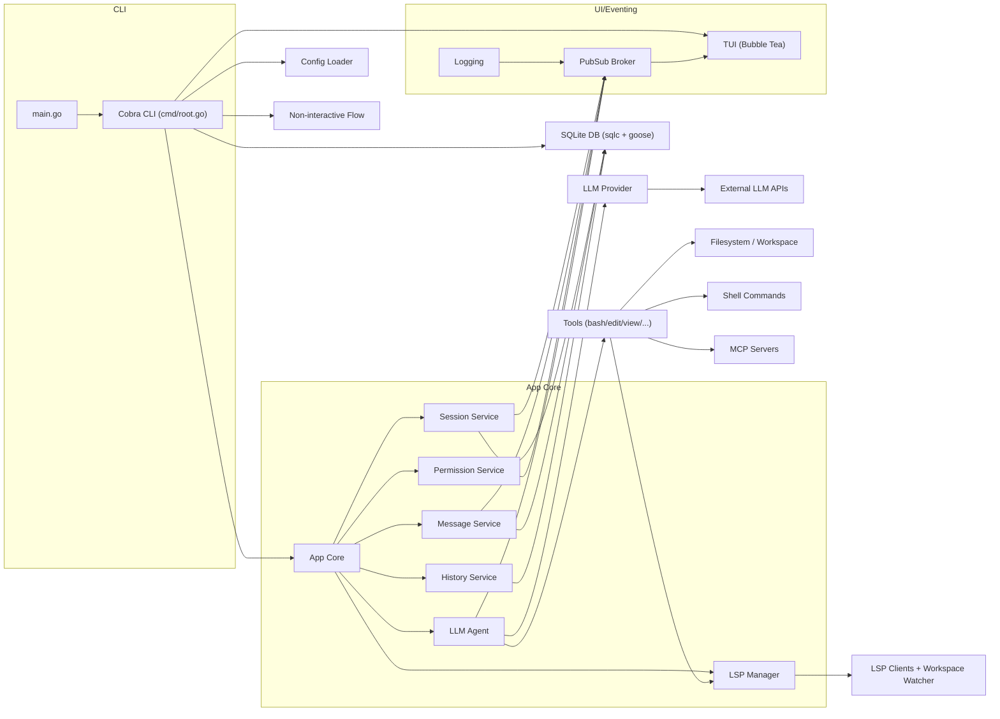

# OpenCode 意图识别、工具调用、上下文与提示词说明

本文基于当前仓库实现，对以下问题做出逐条说明：
1) 如何识别用户意图
2) 意图识别后如何选择工具与参数
3) 复杂问题如何多步推理
4) 推理不出来时如何处理
5) 如何获取用户问题上下文
6) 如何记住用户和项目内容
7) 复杂问题使用大模型时的提示词如何构建

## 0.架构图

下面是我基于代码快速探索后给出的架构概要和架构图。

**架构概览**
1. 入口是 `/Users/dongxg/SourceCode/opencode/main.go`，调用 `/Users/dongxg/SourceCode/opencode/cmd/root.go`（Cobra CLI）。
2. CLI 启动时加载配置 `/Users/dongxg/SourceCode/opencode/internal/config/config.go`，初始化 SQLite（sqlc + goose） `/Users/dongxg/SourceCode/opencode/internal/db/connect.go`，再创建 `App`。
3. `App` 负责组合核心服务：会话、消息、历史文件、权限、LLM Agent、LSP 客户端管理 `/Users/dongxg/SourceCode/opencode/internal/app/app.go`。
4. 交互模式启动 Bubble Tea TUI `/Users/dongxg/SourceCode/opencode/internal/tui/tui.go`，通过 pubsub 接收服务事件；非交互模式走 `RunNonInteractive`。
5. LLM Agent `/Users/dongxg/SourceCode/opencode/internal/llm/agent/agent.go` 通过 Provider 访问外部模型，执行工具（内置工具 + MCP 工具），工具可以访问文件系统、Shell、LSP 等。

**架构图（Mermaid）**

如果你希望我进一步细化某个层（例如 Tool 子系统、LSP 交互流程、数据库 schema），告诉我具体方向即可。

## 1. 意图识别：以 LLM 作为核心“意图解释器”
OpenCode 没有单独的“意图分类器”。用户输入作为一条 `message.User` 进入 LLM 的上下文，由 LLM 基于系统提示词和对话历史直接理解意图并生成响应或工具调用。

关键实现点：
- 系统提示词由 `prompt.GetAgentPrompt` 构建（`internal/llm/prompt/prompt.go`），对 coder/task/summarizer/title 不同角色生成不同 Prompt。
- 具体的 coder Prompt 在 `internal/llm/prompt/coder.go`，包含环境信息和 LSP 信息等。
- Agent 在 `internal/llm/agent/agent.go` 的 `Run`/`processGeneration` 中将用户输入与历史消息一起发送给 Provider。

结论：意图识别依赖 LLM 对自然语言的理解与系统提示词，不使用显式规则引擎或意图分类模型。

## 2. 工具选择与参数：LLM 通过工具 Schema 触发“函数调用”
OpenCode 的工具使用流程是“模型自行决定 + 运行工具 + 继续对话”的循环：

1) 工具由 `tools.BaseTool` 定义，每个工具通过 `ToolInfo` 描述参数 schema（`internal/llm/tools/tools.go`）。
2) Provider 把 `ToolInfo` 转换成模型支持的函数/工具 schema。以 OpenAI 为例，见 `internal/llm/provider/openai.go` 的 `convertTools`。
3) LLM 输出工具调用（tool call）和 JSON 参数。
4) Agent 执行工具（`internal/llm/agent/agent.go` 的 `streamAndHandleEvents`），再把工具结果追加到对话中。

参数如何传：
- 由工具 `Info()` 里的 JSON schema 定义。例如 `view` 工具参数在 `internal/llm/tools/view.go`：`file_path`, `offset`, `limit`。
- LLM 按 schema 生成 JSON 输入，工具在 `Run` 中 `json.Unmarshal` 解析参数。

权限控制：
- 重要工具（如 `bash`、`edit`、`write`）会发起权限请求，由 UI 允许/拒绝（`internal/permission/permission.go`）。
- 在 `agent.go` 中若权限被拒绝，会直接终止后续工具调用并返回错误。

结论：工具与参数不是“写死映射”，而是由 LLM 结合工具 schema 自主选择与填充。

## 3. 复杂问题的多步推理：通过“多轮工具调用循环”实现
复杂问题（例如“查找错误原因并修复”）需要多步：查文件 -> 看代码 -> 运行命令 -> 修改 -> 验证。

OpenCode 的实现机制：
- `agent.processGeneration` 中对 LLM 的输出做循环：只要 `FinishReason` 为 `tool_use`，就继续把工具结果加入历史再发下一轮（`internal/llm/agent/agent.go`）。
- 可以使用 `agent` 工具派生“子代理”（任务型 Agent）做大范围检索，工具定义见 `internal/llm/agent/agent-tool.go`。
- LSP 诊断可在工具输出中提供额外线索（`internal/llm/prompt/coder.go` 的 LSP 信息提示 + `internal/llm/tools/diagnostics.go`）。

结论：多步推理是通过“模型输出工具调用 + 工具结果回注入 + 再生成”的循环实现。

## 4. 推理不出来时的处理方式
当前实现没有额外的“回退推理器”，主要表现为：
- LLM 返回错误或无法完成任务时，Agent 直接返回错误事件（`internal/llm/agent/agent.go`）。
- 工具执行失败会把错误回传给模型作为下一轮输入，或直接中断。
- 权限被拒绝会导致工具调用中止并标记为 permission denied。

简言之：失败时不会自动切换策略；常见的行为是报错或要求用户提供更多上下文。

## 5. 上下文获取方式
OpenCode 的上下文来自多个层面：

1) 对话历史（核心）：
- 所有消息存入 SQLite（`internal/message/message.go`），Agent 每次运行会从 DB 拉取 session 的历史消息（`agent.processGeneration`）。

2) 项目上下文文件：
- `config.ContextPaths` 默认包含 `OpenCode.md`、`.cursorrules` 等路径（`internal/config/config.go`）。
- `prompt.GetAgentPrompt` 会读取这些文件并拼接进系统提示词（`internal/llm/prompt/prompt.go`）。

3) 环境信息：
- `CoderPrompt` 会自动注入工作目录、是否 git repo、平台、日期，并执行一次 `ls` 获取当前目录结构（`internal/llm/prompt/coder.go`）。

4) 文件内容、诊断与外部信息：
- 通过 tools（如 `view`、`grep`、`glob`、`bash`）按需读取文件或执行命令。
- LSP 诊断工具会提供 lint/typecheck 信息（`internal/llm/prompt/coder.go` + `internal/lsp/*`）。

结论：上下文来自“历史对话 + 项目约束文件 + 运行时环境 + 工具按需读取”。

## 6. 记忆与持久化能力
OpenCode 的“记忆”是持久化数据库 + 会话摘要，不是无限上下文。

- 对话与会话：存储在 SQLite（`internal/db/connect.go`, `internal/session/session.go`, `internal/message/message.go`）。
- 文件历史：修改前后内容存入历史表（`internal/history/file.go`）。
- 自动压缩：当 token 使用接近上下文上限时，会触发自动摘要（`internal/tui/tui.go`，`Agent.Summarize` 在 `internal/llm/agent/agent.go`）。
- 摘要 Prompt 在 `internal/llm/prompt/summarizer.go`。

限制：
- LLM 的上下文窗口有限，因此不会“记住所有细节”。
- 自动摘要会丢失细粒度信息，保留“继续对话所需”的核心内容。

结论：记忆可持久化、可回溯，但不能保证“始终记住所有内容”。

## 7. 复杂问题使用大模型时的提示词构建
提示词构建在 `createAgentProvider` 时完成：

- 入口：`createAgentProvider`（`internal/llm/agent/agent.go`）。
- 系统提示词来源：`prompt.GetAgentPrompt(agentName, provider)`，分别对应：
  - coder: `internal/llm/prompt/coder.go`
  - task: `internal/llm/prompt/task.go`
  - summarizer: `internal/llm/prompt/summarizer.go`
  - title: `internal/llm/prompt/title.go`
- 追加内容：
  - 项目上下文文件（`ContextPaths`）
  - 环境信息（工作目录、ls 结果、平台、日期）
  - LSP 诊断说明

最终发送给模型的是：
- system message（由以上 prompt 构建）
- 历史消息列表
- 工具 schema（函数调用）
- 可选的附件（二进制内容，如图片）

结论：提示词由“固定系统指令 + 动态环境信息 + 项目规则 + 历史对话”合成；不同 agent 有不同 prompt。

---

如果你希望补充“工具参数清单表格”、或想把这份文档拆分为多篇（如：工具系统、权限系统、上下文系统），告诉我目标结构即可。
