# OpenCode 源码全面导读

> 本文档基于 `packages/opencode/src` 源码，系统性地解读 OpenCode 的架构设计、核心模块和代码流程。

---

## 一、总体架构概览

OpenCode 是一个基于 Effect 框架构建的 AI 编程助手。它采用**客户端-服务端架构**，通过 HTTP API 对外提供服务，内部使用 Effect 的 Layer/Service 模式管理依赖注入。

### 1.1 顶层目录结构

```
packages/opencode/src/
├── index.ts              # 包入口
├── server/               # HTTP API 服务端
├── cli/                  # 命令行界面（TUI + 命令）
├── session/              # 会话核心：prompt 执行、LLM 调用、消息管理
├── provider/             # LLM 提供商抽象层（OpenAI/Anthropic/Google 等）
├── tool/                 # 内置工具集（bash/edit/read/grep/task 等）
├── agent/                # Agent 定义（primary/subagent）
├── config/               # 配置系统（opencode.json）
├── bus/                  # 事件总线（实例级 PubSub）
├── storage/              # 持久化层（SQLite + Drizzle ORM）
├── permission/           # 权限审批系统
├── mcp/                  # Model Context Protocol 客户端
├── plugin/               # 插件系统
├── snapshot/             # Git 快照与回滚
├── sync/                 # 事件溯源与同步
├── effect/               # Effect 基础设施
├── project/              # 项目实例管理
├── flag/                 # 环境变量与特性开关
├── lsp/                  # LSP 代码智能
├── skill/                # Skill 系统
├── shell/                # Shell 模式
└── util/                 # 通用工具
```

### 1.2 整体架构图

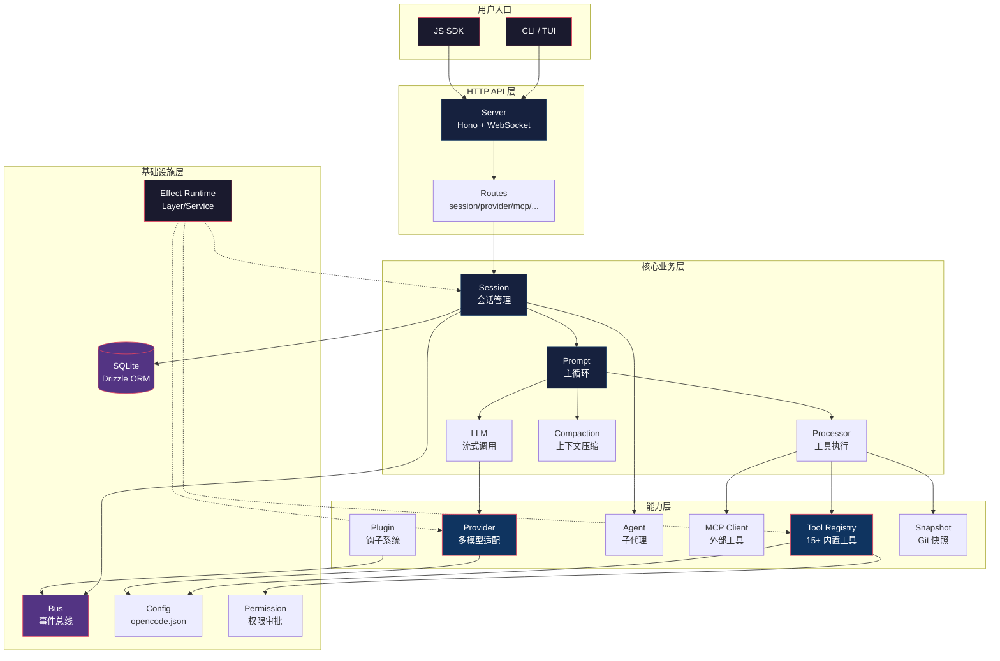

### 1.3 核心设计理念

| 设计理念 | 实现方式 | 关键文件 |
|---------|---------|---------|
| **依赖注入** | Effect 的 `Context.Service` + `Layer` | 所有模块的 `Service` + `layer` |
| **实例隔离** | `InstanceState` — 按工作目录隔离状态 | `effect/instance-state.ts` |
| **事件驱动** | `Bus` — 实例级 PubSub + 全局 EventEmitter | `bus/index.ts`, `bus/global.ts` |
| **流式处理** | Effect `Stream` — LLM 流式响应 | `session/llm.ts` |
| **类型安全** | Zod Schema + Effect Schema | 全局使用 |
| **插件化** | Hook 系统 + 动态加载 | `plugin/index.ts`, `plugin/loader.ts` |

---

## 二、Effect 基础设施层（`src/effect/`）

这是整个系统的基石。OpenCode 深度使用 [Effect](https://effect.website) 框架来管理副作用、依赖注入和资源生命周期。

### 2.1 InstanceState — 实例级状态隔离

**核心文件**: `effect/instance-state.ts`

`InstanceState` 是 OpenCode 最关键的基础设施之一。它确保每个工作目录（实例）有自己独立的状态副本，互不干扰。

```typescript
// 核心思路：用 ScopedCache 以 directory 为 key 缓存状态
export const make = <A>(init: (ctx: InstanceContext) => Effect.Effect<A>) =>
  Effect.gen(function* () {
    const cache = yield* ScopedCache.make({
      capacity: Number.POSITIVE_INFINITY,
      lookup: () => Effect.gen(function* () {
        return yield* init(yield* context)  // 获取当前实例上下文
      }),
    })
    // 注册销毁回调，实例释放时清理缓存
    const off = registerDisposer((directory) =>
      Effect.runPromise(ScopedCache.invalidate(cache, directory))
    )
    yield* Effect.addFinalizer(() => Effect.sync(off))
    return { [TypeId]: TypeId, cache }
  })
```

**工作原理**:
1. 当代码调用 `InstanceState.get(state)` 时，会先获取当前工作目录
2. 用目录路径作为 key 从 `ScopedCache` 中查找已有状态
3. 如果不存在，执行 `init` 函数创建新状态并缓存
4. 当实例被销毁时，对应的缓存条目自动清理

### 2.2 Runner — 任务状态机

**核心文件**: `effect/runner.ts`

`Runner` 管理单个会话的执行状态，是一个有限状态机：

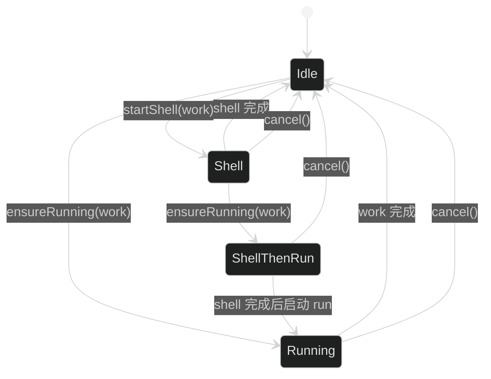

四种状态：
- **Idle**: 空闲，可以接受新任务
- **Running**: 正在执行主循环
- **Shell**: 正在执行 shell 模式任务
- **ShellThenRun**: shell 完成后自动接续主循环

### 2.3 EffectBridge — Effect 与 Promise 桥接

**核心文件**: `effect/bridge.ts`

在需要从 Effect 世界回调到 Promise 世界（如 MCP SDK 的回调）时使用。

### 2.4 其他 Effect 设施

| 文件 | 作用 |
|------|------|
| `app-runtime.ts` | 应用级 Effect Runtime |
| `bootstrap-runtime.ts` | 引导阶段 Runtime |
| `instance-ref.ts` | 实例上下文引用（Fiber 级别） |
| `instance-registry.ts` | 实例注册表（销毁回调管理） |
| `logger.ts` | Effect 日志器 |
| `run-service.ts` | 从 Service 创建独立 runtime |
| `observability.ts` | 可观测性（Trace/Metrics） |

---

## 三、配置系统（`src/config/`）

### 3.1 配置层级

OpenCode 支持多层级配置，从全局到项目：

```
全局配置 (~/.config/opencode/opencode.json)
    ↓ 合并
项目配置 (./opencode.json)
    ↓ 合并
命令行参数
```

**核心文件**: `config/config.ts`

配置结构包含：
- `model`: 默认模型
- `provider`: 各 LLM 提供商的认证配置
- `agent`: Agent 定义
- `mcp`: MCP 服务器配置
- `permission`: 权限规则
- `plugin_origins`: 插件来源
- `small_model`: 用于摘要等任务的轻量模型

### 3.2 配置模块组成

```
config/
├── config.ts          # 核心配置 Service
├── agent.ts           # Agent 配置（opencode.json 中的 agent 定义）
├── mcp.ts             # MCP 配置类型
├── permission.ts      # 权限配置
├── markdown.ts        # ConfigMarkdown — 从 Markdown 提取配置
└── ...
```

`Config.Service` 的核心接口：

```typescript
interface Interface {
  readonly get: () => Effect.Effect<Config.Info>       // 获取合并后的配置
  readonly directories: () => Effect.Effect<string[]>  // 配置文件搜索目录
  readonly waitForDependencies: () => Effect.Effect<void>
}
```

---

## 四、事件总线（`src/bus/`）

### 4.1 双层事件系统

OpenCode 有两层事件系统：

| 层级 | 实现 | 作用域 | 关键文件 |
|------|------|--------|---------|
| **实例级 Bus** | Effect PubSub | 单个工作目录 | `bus/index.ts` |
| **全局级 GlobalBus** | Node EventEmitter | 整个进程 | `bus/global.ts` |

### 4.2 Bus 服务设计

```typescript
// bus/index.ts
interface Interface {
  readonly publish: <D>(def: D, properties: ...) => Effect.Effect<void>
  readonly subscribe: <D>(def: D) => Stream.Stream<Payload<D>>
  readonly subscribeAll: () => Stream.Stream<Payload>
  readonly subscribeCallback: <D>(def: D, callback) => Effect.Effect<() => void>
  readonly subscribeAllCallback: (callback) => Effect.Effect<() => void>
}
```

**事件发布流程**:

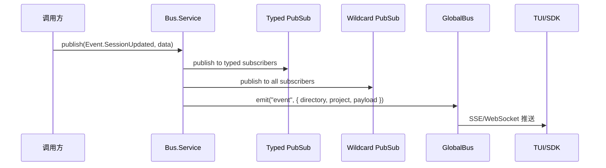

### 4.3 BusEvent 定义

`bus/bus-event.ts` 提供了类型安全的事件定义机制：

```typescript
// 定义事件
const SessionUpdated = BusEvent.define("session.updated", z.object({
  sessionID: z.string(),
  ...
}))

// 发布事件
yield* bus.publish(SessionUpdated, { sessionID: "..." })

// 订阅事件
const stream = bus.subscribe(SessionUpdated)
```

---

## 五、存储层（`src/storage/`）

### 5.1 SQLite + Drizzle ORM

**核心文件**: `storage/db.ts`, `storage/storage.ts`

OpenCode 使用 SQLite 作为本地数据库，通过 Drizzle ORM 进行类型安全的查询。

```
storage/
├── db.ts          # 数据库连接（区分 Bun/Node 环境）
├── db.bun.ts      # Bun SQLite 驱动
├── db.node.ts     # Node better-sqlite3 驱动
├── schema.ts      # Drizzle 表结构定义
├── schema.sql.ts  # SQL schema 生成
├── storage.ts     # 通用查询封装
└── json-migration.ts  # JSON → SQLite 迁移
```

### 5.2 核心数据表

| 表 | 用途 | 定义位置 |
|----|------|---------|
| `SessionTable` | 会话元数据 | `session/session.sql.ts` |
| `MessageTable` | 消息记录 | `session/session.sql.ts` |
| `PartTable` | 消息部件（text/tool/file） | `session/session.sql.ts` |
| `PermissionTable` | 权限审批记录 | `session/session.sql.ts` |
| `EventTable` | 同步事件 | `sync/event.sql.ts` |
| `EventSequenceTable` | 事件序列号 | `sync/event.sql.ts` |

### 5.3 Database 使用模式

```typescript
// 同步查询
const row = Database.use((db) =>
  db.select().from(SessionTable).where(eq(SessionTable.id, id)).get()
)

// 事务
Database.transaction((tx) => {
  tx.insert(MessageTable).values({...}).run()
  tx.insert(PartTable).values({...}).run()
}, { behavior: "immediate" })
```

---

## 六、会话核心（`src/session/`）

这是 OpenCode 最核心的模块，负责 AI 对话的完整生命周期。

### 6.1 模块组成

```
session/
├── session.ts          # 会话 CRUD
├── prompt.ts           # ★ 主循环核心（2080行）
├── llm.ts              # LLM 调用与流式处理
├── processor.ts        # 工具调用处理器
├── compaction.ts       # 上下文压缩
├── message-v2.ts       # 消息模型 V2
├── run-state.ts        # 运行状态管理
├── status.ts           # idle/busy/retry 状态
├── overflow.ts         # token 溢出检测
├── instruction.ts      # AGENTS.md 等指令文件
├── system.ts           # 系统提示词
├── revert.ts           # 回滚
├── summary.ts          # 会话摘要
├── session.sql.ts      # 数据库表定义
├── schema.ts           # ID 类型定义
└── prompt/             # 各模型系统提示词模板
    ├── anthropic.txt
    ├── gpt.txt
    ├── gemini.txt
    ├── default.txt
    ├── beast.txt       # GPT-4/o1/o3
    ├── codex.txt
    ├── kimi.txt
    └── trinity.txt
```

### 6.2 会话执行完整流程

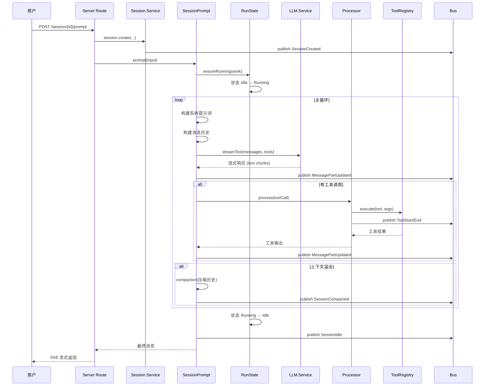

### 6.3 SessionPrompt 核心逻辑（`prompt.ts`）

`SessionPrompt` 是整个系统最核心的 Service，它编排了完整的 AI 对话循环：

```typescript
interface Interface {
  readonly prompt: (input: PromptInput) => Effect.Effect<MessageV2.WithParts>
  readonly loop: (input: LoopInput) => Effect.Effect<MessageV2.WithParts>
  readonly shell: (input: ShellInput) => Effect.Effect<MessageV2.WithParts>
  readonly command: (input: CommandInput) => Effect.Effect<MessageV2.WithParts>
  readonly cancel: (sessionID: SessionID) => Effect.Effect<void>
}
```

**依赖注入的 Service 列表**（展示了其复杂度）：

```typescript
const bus = yield* Bus.Service
const status = yield* SessionStatus.Service
const sessions = yield* Session.Service
const agents = yield* Agent.Service
const provider = yield* Provider.Service
const processor = yield* SessionProcessor.Service
const compaction = yield* SessionCompaction.Service
const plugin = yield* Plugin.Service
const permission = yield* Permission.Service
const mcp = yield* MCP.Service
const lsp = yield* LSP.Service
const registry = yield* ToolRegistry.Service
const truncate = yield* Truncate.Service
const instruction = yield* Instruction.Service
const state = yield* SessionRunState.Service
const revert = yield* SessionRevert.Service
const summary = yield* SessionSummary.Service
const sys = yield* SystemPrompt.Service
const llm = yield* LLM.Service
```

### 6.4 LLM 调用（`llm.ts`）

**核心文件**: `session/llm.ts`

LLM Service 封装了 AI SDK 的 `streamText` 调用：

```typescript
interface Interface {
  readonly stream: (input: {
    messages: ModelMessage[]
    tools: Record<string, Tool>
    system: string
    model: Provider.Model
    // ...
  }) => Effect.Effect<LLM.Result>
}
```

关键设计：
- 使用 Vercel AI SDK 的 `streamText` 进行流式调用
- 支持工具调用（function calling）
- 自动重试机制
- token 用量追踪

### 6.5 工具处理器（`processor.ts`）

```typescript
interface Interface {
  readonly process: (input: {
    toolCall: ToolCallPart
    message: MessageV2.WithParts
    // ...
  }) => Effect.Effect<ToolResult>
}
```

处理流程：
1. 解析工具调用参数
2. 权限检查（`Permission.ask`）
3. 执行工具（`Tool.execute`）
4. 截断输出（`Truncate.output`）
5. 插件钩子触发（`Plugin.trigger`）
6. 存储结果到数据库

### 6.6 上下文压缩（`compaction.ts`）

当对话历史超过模型的上下文窗口时，自动触发压缩：

```typescript
export const PRUNE_MINIMUM = 20_000   // 最小保留 token
export const PRUNE_PROTECT = 40_000   // 保护最近 token
const TOOL_OUTPUT_MAX_CHARS = 2_000   // 工具输出截断
```

压缩策略：
1. 检测 token 溢出（`overflow.ts`）
2. 保留最近的几轮对话（`DEFAULT_TAIL_TURNS = 2`）
3. 对历史工具输出进行截断
4. 用小模型生成结构化摘要（`SUMMARY_TEMPLATE`）
5. 发布 `SessionCompacted` 事件

### 6.7 消息模型 V2（`message-v2.ts`）

消息由多个 "Part" 组成，每个 Part 可以是不同类型：

```typescript
// 消息部件类型
type Part =
  | { type: "text", text: string }                          // 文本
  | { type: "tool", tool: string, state: ToolState }       // 工具调用
  | { type: "file", filename: string, mime: string, ... }  // 文件/图片
  | { type: "reasoning", text: string }                    // 推理过程
  | { type: "agent", name: string }                        // Agent 引用
```

### 6.8 运行状态管理（`run-state.ts`）

`SessionRunState` 管理每个会话的执行状态，内部使用 `Runner`：

```typescript
interface Interface {
  readonly assertNotBusy: (sessionID) => Effect.Effect<void>
  readonly cancel: (sessionID) => Effect.Effect<void>
  readonly ensureRunning: (sessionID, onInterrupt, work) => Effect.Effect<Message>
  readonly startShell: (sessionID, onInterrupt, work) => Effect.Effect<Message>
}
```

每个 sessionID 对应一个独立的 `Runner` 实例，存储在 `Map<SessionID, Runner>` 中。

### 6.9 会话状态（`status.ts`）

```typescript
type Info =
  | { type: "idle" }                              // 空闲
  | { type: "busy" }                              // 正在执行
  | { type: "retry", attempt: number, message: string, next: number }  // 重试中
```

状态变化通过 Bus 事件广播：`session.status` 和 `session.idle`。

### 6.10 指令系统（`instruction.ts`）

自动加载项目中的指令文件：
- `AGENTS.md`（项目根目录）
- `CLAUDE.md`（兼容 Claude Code）
- 全局 `~/.config/opencode/AGENTS.md`
- `~/.claude/CLAUDE.md`

还支持从 `read` 工具调用中提取已读文件路径，注入到后续对话上下文。

### 6.11 系统提示词（`system.ts`）

根据模型类型选择不同的系统提示词模板：

```typescript
function provider(model: Provider.Model) {
  if (model.api.id.includes("gpt-4") || model.api.id.includes("o1") || model.api.id.includes("o3"))
    return [PROMPT_BEAST]
  if (model.api.id.includes("gpt")) {
    if (model.api.id.includes("codex")) return [PROMPT_CODEX]
    return [PROMPT_GPT]
  }
  if (model.api.id.includes("gemini-")) return [PROMPT_GEMINI]
  if (model.api.id.includes("claude")) return [PROMPT_ANTHROPIC]
  if (model.api.id.toLowerCase().includes("kimi")) return [PROMPT_KIMI]
  return [PROMPT_DEFAULT]
}
```

环境信息注入：
```
<env>
  Working directory: /path/to/project
  Workspace root folder: /path/to/worktree
  Is directory a git repo: yes
  Platform: darwin
  Today's date: ...
</env>
```

---

## 七、工具系统（`src/tool/`）

### 7.1 工具注册表（`registry.ts`）

**核心文件**: `tool/registry.ts`

内置工具列表：

| 工具 ID | 功能 | 文件 |
|---------|------|------|
| `bash` | 执行 shell 命令 | `tool/bash.ts` |
| `read` | 读取文件 | `tool/read.ts` |
| `edit` | 精确编辑文件 | `tool/edit.ts` |
| `write` | 写入文件 | `tool/write.ts` |
| `glob` | 文件搜索 | `tool/glob.ts` |
| `grep` | 内容搜索 | `tool/grep.ts` |
| `task` | 子代理调用 | `tool/task.ts` |
| `webfetch` | 网页抓取 | `tool/webfetch.ts` |
| `websearch` | 网页搜索 | `tool/websearch.ts` |
| `codesearch` | 代码语义搜索 | `tool/codesearch.ts` |
| `todo` | 任务列表管理 | `tool/todo.ts` |
| `skill` | Skill 加载 | `tool/skill.ts` |
| `lsp` | LSP 代码导航 | `tool/lsp.ts` |
| `plan` | 计划模式 | `tool/plan.ts` |
| `question` | 用户提问 | `tool/question.ts` |
| `apply_patch` | 批量补丁（GPT 模型专用） | `tool/apply_patch.ts` |
| `invalid` | 无效工具占位 | `tool/invalid.ts` |

### 7.2 工具定义接口（`tool.ts`）

```typescript
namespace Tool {
  interface Def {
    id: string
    description: string
    parameters: z.ZodObject
    execute: (args, ctx: ToolContext) => Effect.Effect<ToolResult>
    formatValidationError?: (error) => string
  }
}
```

### 7.3 工具过滤逻辑

`registry.ts` 中的 `tools()` 方法根据模型动态过滤工具集：

```typescript
const filtered = (yield* all()).filter((tool) => {
  // Exa 搜索工具仅在 opencode provider 或启用 flag 时可用
  if (tool.id === CodeSearchTool.id || tool.id === WebSearchTool.id)
    return input.providerID === ProviderID.opencode || Flag.OPENCODE_ENABLE_EXA

  // GPT 模型使用 apply_patch 而非 edit/write
  const usePatch = input.modelID.includes("gpt-") && !input.modelID.includes("oss") && !input.modelID.includes("gpt-4")
  if (tool.id === ApplyPatchTool.id) return usePatch
  if (tool.id === EditTool.id || tool.id === WriteTool.id) return !usePatch

  return true
})
```

### 7.4 自定义工具加载

支持从项目目录加载自定义工具：

```typescript
const matches = dirs.flatMap((dir) =>
  Glob.scanSync("{tool,tools}/*.{js,ts}", { cwd: dir, absolute: true })
)
// 动态 import 每个文件
const mod = yield* Effect.promise(() => import(pathToFileURL(match).href))
```

---

## 八、Provider 提供商层（`src/provider/`）

### 8.1 架构设计

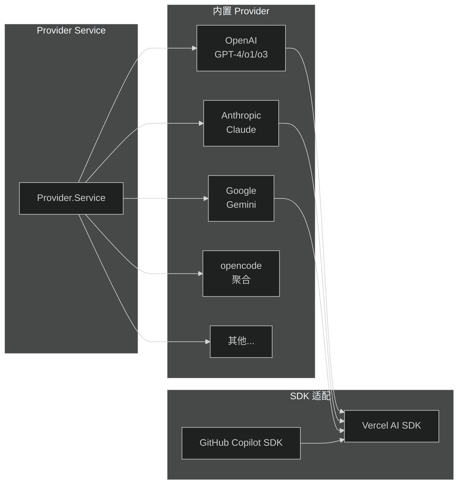

### 8.2 Provider Service

```typescript
interface Interface {
  readonly models: () => Effect.Effect<Provider.Model[]>
  readonly model: (providerID, modelID) => Effect.Effect<Provider.Model>
  readonly server: (providerID) => Effect.Effect<ProviderModel>
}
```

### 8.3 Model 抽象

```typescript
interface Model {
  providerID: string
  api: { id: string }
  limit: {
    context: number   // 上下文窗口
    input: number     // 输入限制
    output: number    // 输出限制
  }
  // ...
}
```

---

## 九、Agent 系统（`src/agent/`）

**核心文件**: `agent/agent.ts`

### 9.1 Agent 定义

```typescript
interface Info {
  name: string
  description: string
  mode: "primary" | "subagent"
  prompt: string         // 系统提示词
  tools: string[]       // 可用工具列表
  permission: string    // 权限规则集
  model?: { provider, model }  // 指定模型
}
```

### 9.2 Agent 类型

- **primary**: 主 Agent，用户直接交互
- **subagent**: 子 Agent，通过 `task` 工具调用

`task` 工具会根据 `describeTask()` 动态生成可用子 Agent 列表，并过滤权限不允许的 Agent。

---

## 十、权限系统（`src/permission/`）

### 10.1 权限模型

```typescript
type Action = "allow" | "deny" | "ask"

interface Rule {
  permission: string   // 工具名或通配符（如 "bash", "edit", "*"）
  pattern: string      // 路径/参数匹配模式（如 "/safe/*", "*"）
  action: Action
}
```

### 10.2 权限评估流程

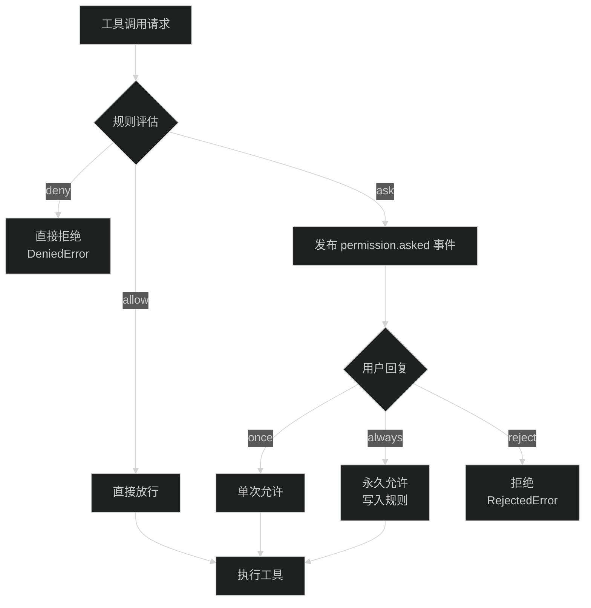

### 10.3 配置到规则集转换

```typescript
// config 中的 permission:
// { "bash": "allow", "edit": { "~/safe/*": "allow", "*": "ask" } }

// 转换为 ruleset:
[
  { permission: "bash", pattern: "*", action: "allow" },
  { permission: "edit", pattern: "~/safe/*", action: "allow" },
  { permission: "edit", pattern: "*", action: "ask" },
]
```

通配符规则排在前面（`*` < 特定规则），配合 `findLast` 实现特定规则覆盖通配符。

---

## 十一、MCP 客户端（`src/mcp/`）

### 11.1 MCP Service

**核心文件**: `mcp/index.ts`

支持两种连接方式：
- **local**: stdio 传输（本地进程）
- **remote**: HTTP/SSE 传输（远程服务器，支持 OAuth）

### 11.2 工具转换

MCP 工具定义会被转换为 AI SDK 的 `Tool` 类型：

```typescript
function convertMcpTool(mcpTool, client, timeout): Tool {
  return dynamicTool({
    description: mcpTool.description,
    inputSchema: jsonSchema(mcpTool.inputSchema),
    execute: async (args) => client.callTool({ name: mcpTool.name, arguments: args })
  })
}
```

工具名命名规则：`{sanitizedClientName}_{sanitizedToolName}`

### 11.3 OAuth 流程

远程 MCP 服务器支持 OAuth 认证：

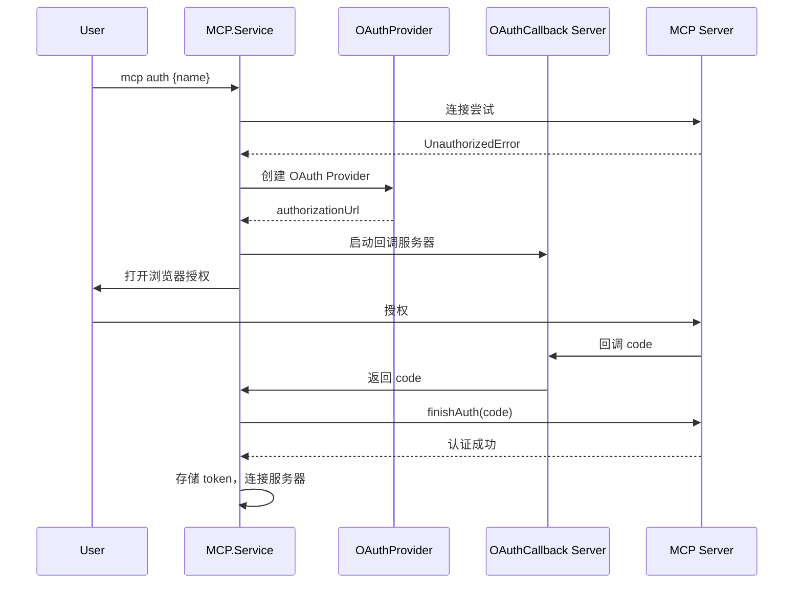

---

## 十二、插件系统（`src/plugin/`）

### 12.1 插件 Hook 系统

**核心文件**: `plugin/index.ts`

```typescript
interface Hooks {
  // 触发型 hook（可修改输出）
  "tool.definition"?: (input, output) => Promise<void>
  "llm.prefix"?: (input, output) => Promise<void>
  // ...
  
  // 事件 hook
  event?: (input: { event: any }) => Promise<void>
  
  // 配置 hook
  config?: (config: Config.Info) => Promise<void>
}
```

### 12.2 内置插件

```typescript
const INTERNAL_PLUGINS = [
  CodexAuthPlugin,        // OpenAI Codex 认证
  CopilotAuthPlugin,      // GitHub Copilot 认证
  GitlabAuthPlugin,       // GitLab 认证
  PoeAuthPlugin,          // Poe 认证
  CloudflareWorkersAuthPlugin,    // Cloudflare Workers AI 认证
  CloudflareAIGatewayAuthPlugin, // Cloudflare AI Gateway 认证
]
```

### 12.3 外部插件加载

```typescript
// 从 config.plugin_origins 加载
const loaded = yield* PluginLoader.loadExternal({
  items: cfg.plugin_origins,
  kind: "server",
  report: { start, missing, error }
})
```

### 12.4 插件加载器

**核心文件**: `plugin/loader.ts`, `plugin/shared.ts`, `plugin/install.ts`

插件加载流程：
1. 解析插件 specifier（`@scope/pkg@version`）
2. 安装到 `.opencode/plugins/`
3. 检查兼容性
4. 解析入口文件
5. 动态 import
6. 调用 `server(input, options)` 获取 hooks

---

## 十三、Snapshot 快照系统（`src/snapshot/`）

### 13.1 Git 快照管理

**核心文件**: `snapshot/index.ts`

利用 Git stash 机制实现工作区快照和回滚：

```typescript
interface Interface {
  readonly init: () => Effect.Effect<void>
  readonly cleanup: () => Effect.Effect<void>
  readonly track: () => Effect.Effect<string | undefined>  // 创建快照
  readonly patch: (hash: string) => Effect.Effect<Patch>   // 获取补丁
  readonly restore: (snapshot: string) => Effect.Effect<void>  // 恢复
  readonly revert: (patches: Patch[]) => Effect.Effect<void>    // 回退
  readonly diff: (hash: string) => Effect.Effect<string>
  readonly diffFull: (from, to) => Effect.Effect<FileDiff[]>
}
```

### 13.2 快照存储

快照存储在 `.opencode/snapshot/` 目录下，使用 Git stash 机制管理。每次工具执行前可以创建快照，失败时回滚。

---

## 十四、Sync 同步系统（`src/sync/`）

### 14.1 事件溯源

**核心文件**: `sync/index.ts`

Sync 系统实现了事件溯源（Event Sourcing）模式：

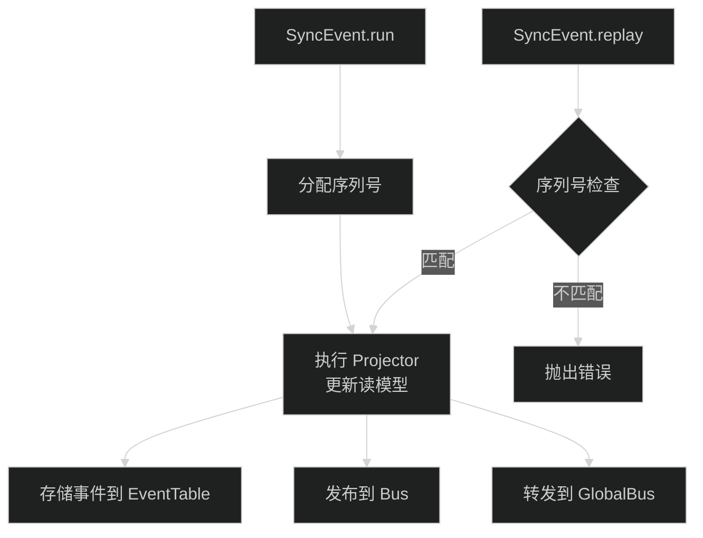

### 14.2 事件版本管理

```typescript
function define(input: {
  type: string          // 事件类型
  version: number       // 版本号
  aggregate: string     // 聚合字段名（如 sessionID）
  schema: ZodObject     // 数据 schema
  busSchema?: ZodObject // Bus 发布用的 schema
})
```

只允许发布最新版本的事件，但保留旧版本用于回放。

---

## 十五、HTTP API 服务端（`src/server/`）

### 15.1 服务端架构

**核心文件**: `server/server.ts`

使用 Hono 框架构建 HTTP API：

```typescript
const app = new Hono()

// 路由挂载
app.route("/session", SessionRoutes)
app.route("/provider", ProviderRoutes)
app.route("/mcp", MCPRoutes)
app.route("/config", ConfigRoutes)
app.route("/permission", PermissionRoutes)
// ...

// SSE 事件流
app.get("/event", (c) => ServerSentEvent.stream(c))

// WebSocket
app.get("/ws", WebSocketHandler)
```

### 15.2 路由结构

```
server/routes/
├── instance/           # 实例级路由
│   ├── session.ts      # 会话管理
│   ├── provider.ts     # 模型管理
│   ├── mcp.ts          # MCP 管理
│   ├── config.ts       # 配置管理
│   ├── permission.ts   # 权限管理
│   ├── event.ts        # 事件流 SSE
│   ├── file.ts         # 文件操作
│   ├── project.ts      # 项目管理
│   ├── pty.ts          # 终端
│   ├── question.ts     # 问答
│   ├── sync.ts         # 同步
│   ├── trace.ts        # 追踪
│   ├── tui.ts          # TUI 通信
│   ├── experimental.ts # 实验特性
│   └── httpapi/        # HTTP API 扩展
├── control/            # 控制面路由
├── global.ts           # 全局路由
└── ui.ts               # UI 静态资源
```

### 15.3 事件流（SSE）

**核心文件**: `server/routes/instance/event.ts`

通过 Server-Sent Events 向客户端推送实时事件：

```typescript
app.get("/event", (c) => {
  const stream = bus.subscribeAll()
  return ServerSentEvent.streamStream(c, stream, (payload) => ({
    event: payload.type,
    data: JSON.stringify(payload.properties)
  }))
})
```

---

## 十六、CLI 与 TUI（`src/cli/`）

### 16.1 命令行入口

```
cli/
├── cmd/
│   ├── cmd.ts          # 主命令入口
│   ├── serve.ts        # 启动服务端
│   ├── run.ts          # 非交互式运行
│   ├── tui/            # ★ TUI 交互界面（147文件）
│   ├── mcp.ts          # MCP 管理
│   ├── providers.ts    # Provider 管理
│   ├── agent.ts        # Agent 管理
│   ├── session.ts      # 会话管理
│   ├── models.ts       # 模型列表
│   ├── generate.ts     # 代码生成
│   ├── export.ts       # 导出
│   ├── import.ts       # 导入
│   ├── upgrade.ts      # 升级
│   ├── uninstall.ts    # 卸载
│   ├── stats.ts        # 统计
│   ├── github.ts       # GitHub 集成
│   ├── pr.ts           # PR 生成
│   ├── web.ts          # Web 模式
│   ├── acp.ts          # ACP 协议
│   ├── account.ts      # 账户管理
│   ├── plug.ts         # 插件管理
│   ├── db.ts           # 数据库管理
│   └── debug/          # 调试工具
```

### 16.2 TUI 架构

TUI 使用 [Ink](https://github.com/vadimdemedes/ink)（React for CLI）构建：

```
tui/
├── app.tsx             # 根组件
├── components/         # 可复用组件
├── views/              # 页面视图
├── hooks/              # 自定义 hooks
├── store/              # 状态管理
├── service/            # TUI 服务
├── theme/              # 主题
└── event.ts            # TUI 事件定义
```

---

## 十七、项目实例管理（`src/project/`）

### 17.1 Instance 概念

每个工作目录对应一个 `Instance`：

```typescript
interface InstanceContext {
  project: {
    id: string          // 项目 ID
    vcs: "git" | "none"
    // ...
  }
  directory: string     // 工作目录路径
  worktree: string      // 工作树路径
}
```

### 17.2 实例生命周期

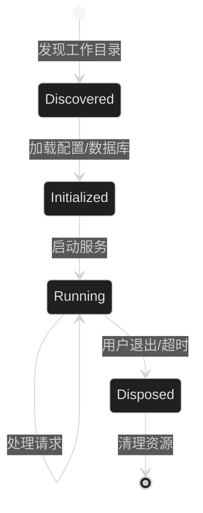

---

## 十八、核心数据流总结

### 18.1 一次完整对话的数据流

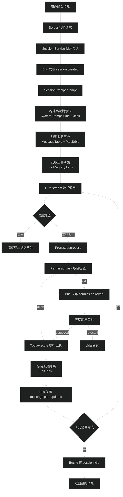

### 18.2 Effect 依赖注入树

```mermaid
---
config:
  theme: dark
---
graph TD
    ROOT[App Runtime]

    subgraph 基础层
    CONFIG[Config.Service]
    BUS[Bus.Service]
    FS[AppFileSystem.Service]
    HTTP[HttpClient]
    SPAWNER[ChildProcessSpawner]
    RIPGREP[Ripgrep.Service]
    end

    subgraph 能力层
    PLUGIN[Plugin.Service]
    PROVIDER[Provider.Service]
    MCP[MCP.Service]
    LSP[LSP.Service]
    SKILL[Skill.Service]
    AGENT[Agent.Service]
    PERM[Permission.Service]
    SNAP[Snapshot.Service]
    end

    subgraph 核心层
    SESS[Session.Service]
    STATUS[SessionStatus.Service]
    RUNSTATE[SessionRunState.Service]
    TRUNC[Truncate.Service]
    INSTR[Instruction.Service]
    SYSPROMPT[SystemPrompt.Service]
    COMPACT[SessionCompaction.Service]
    PROC[SessionProcessor.Service]
    LLM[LLM.Service]
    REVERT[SessionRevert.Service]
    SUMMARY[SessionSummary.Service]
    end

    subgraph 工具层
    REGISTRY[ToolRegistry.Service]
    TOOLS[15+ 内置工具]
    end

    subgraph 入口层
    PROMPT[SessionPrompt.Service]
    SERVER[Server]
    end

    ROOT --> CONFIG
    ROOT --> BUS
    ROOT --> FS

    CONFIG --> PLUGIN
    CONFIG --> PROVIDER
    CONFIG --> PERM
    BUS --> PLUGIN
    BUS --> PERM
    BUS --> STATUS

    PLUGIN --> REGISTRY
    PROVIDER --> REGISTRY
    MCP --> REGISTRY
    LSP --> REGISTRY
    SKILL --> REGISTRY
    AGENT --> REGISTRY
    PERM --> REGISTRY

    REGISTRY --> TOOLS

    CONFIG --> SESS
    SESS --> STATUS
    SESS --> RUNSTATE
    SESS --> INSTR
    SESS --> SYSPROMPT
    SESS --> COMPACT
    SESS --> PROC
    SESS --> LLM
    SESS --> REVERT
    SESS --> SUMMARY
    SESS --> TRUNC

    REGISTRY --> PROMPT
    SESS --> PROMPT
    SYSPROMPT --> PROMPT
    LLM --> PROMPT
    PROC --> PROMPT
    COMPACT --> PROMPT
    RUNSTATE --> PROMPT

    PROMPT --> SERVER

    style ROOT fill:#1a1a2e,stroke:#e94560,color:#fff
    style PROMPT fill:#16213e,stroke:#0f3460,color:#fff
    style SERVER fill:#16213e,stroke:#0f3460,color:#fff
    style REGISTRY fill:#0f3460,stroke:#e94560,color:#fff
    style BUS fill:#533483,stroke:#e94560,color:#fff
```

---

## 十九、Flag 特性开关（`src/flag/`）

**核心文件**: `flag/flag.ts`

通过环境变量控制功能开关：

| Flag | 默认值 | 作用 |
|------|--------|------|
| `OPENCODE_CLIENT` | `"cli"` | 客户端类型 |
| `OPENCODE_ENABLE_QUESTION_TOOL` | `false` | 启用 question 工具 |
| `OPENCODE_EXPERIMENTAL_LSP_TOOL` | `false` | 启用 LSP 工具 |
| `OPENCODE_EXPERIMENTAL_PLAN_MODE` | `false` | 启用计划模式 |
| `OPENCODE_EXPERIMENTAL_WORKSPACES` | `false` | 启用工作空间 |
| `OPENCODE_PURE` | `false` | 纯净模式（无外部插件） |
| `OPENCODE_DISABLE_CLAUDE_CODE_PROMPT` | `false` | 禁用 CLAUDE.md |
| `OPENCODE_SERVER_PASSWORD` | - | 服务器密码 |

---

## 二十、总结

### 20.1 架构亮点

1. **Effect 框架深度使用**: Layer/Service 依赖注入、Stream 流式处理、资源安全生命周期管理
2. **实例隔离设计**: `InstanceState` 实现了按工作目录的状态隔离，支持多项目并行
3. **事件驱动架构**: 双层 Bus 系统（实例级 PubSub + 全局 EventEmitter）
4. **插件化设计**: Hook 系统允许在关键节点注入自定义逻辑
5. **事件溯源**: Sync 系统实现可回放的事件流
6. **上下文压缩**: 自动检测 token 溢出并智能压缩历史

### 20.2 核心执行路径

```
用户请求 → Server Route → SessionPrompt → RunState(ensureRunning) →
  构建系统提示词 + 消息历史 + 工具列表 → LLM.stream(streamText) →
    流式响应 → [工具调用 → Processor → Permission → Tool.execute] →
    [上下文溢出 → Compaction 压缩] → 循环直到完成 →
  RunState(Idle) → 返回结果
```

### 20.3 关键设计模式

| 模式 | 应用位置 |
|------|---------|
| 依赖注入 (DI) | Effect Layer/Service 全局使用 |
| 状态机 | `Runner` 管理会话执行状态 |
| 事件溯源 | `Sync` 系统的 event log + projector |
| 发布-订阅 | `Bus` 的 PubSub + GlobalBus |
| 策略模式 | Provider 层的多模型适配 |
| 模板方法 | SystemPrompt 根据模型选择提示词 |
| 责任链 | Plugin 的 hook 触发链 |
| 代理模式 | MCP 工具代理外部服务 |
