# 从 opencode 源码讲透编程智能体设计难点

本文从当前 TypeScript 版 opencode 源码出发，解释“设计智能体”和“设计编程智能体”到底难在哪里。它不是泛泛地列概念，而是把每个难点映射到具体模块、调用链、代码结构和工程取舍。

> 说明：仓库里部分旧架构文档使用 Go 风格命名，例如 `main.go`、`internal/app`。当前代码主体在 `packages/opencode/src`，本文以当前源码为准。

## 0. 当前 opencode 的核心运行图

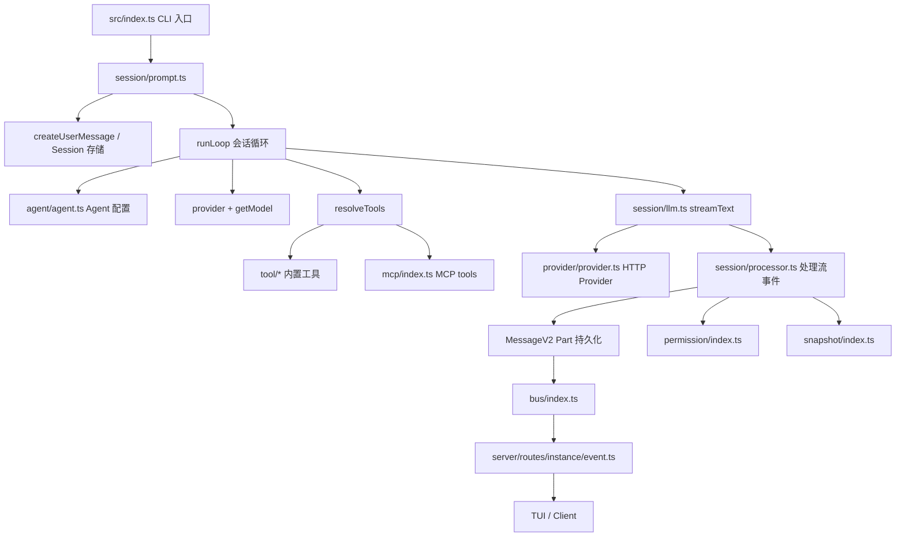

一次用户 prompt 的主路径：

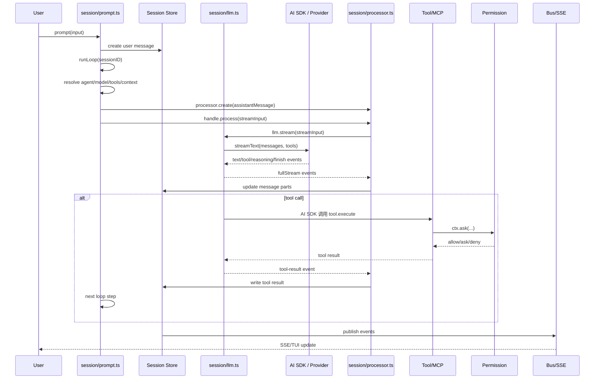

这张图说明一个关键事实：编程智能体不是“调用大模型 + 函数调用”这么简单。它更像一个带持久化、权限、工具、事件流、上下文压缩和文件快照的运行时。

## 1. 难点一：目标理解不是一句 prompt，而是要变成可执行状态

### 为什么难

用户说“帮我修一下”“实现这个功能”“看看为什么不行”，这些话本身不是可执行计划。编程智能体必须把它转成：

- 本次会话属于哪个 `sessionID`
- 使用哪个 agent
- 使用哪个 provider/model/variant
- 用户消息如何持久化
- 是否要跳过回复
- 本轮是否覆盖工具权限
- prompt parts 是否包含文件、agent 指令、结构化输出要求

### 一个具体例子

假设用户输入：

```text
opencode_debug 启动后日志只显示启动，后续 prompt/LLM/tool 流程看不到。帮我修一下，并打包安装。
```

人能理解这句话，但 runtime 不能直接执行这句话。runtime 必须把它拆成一组状态：

```ts
const input = {
  sessionID: "ses_123",
  messageID: "msg_456",
  agent: "build",
  model: {
    providerID: "getrouter",
    modelID: "gpt-5.4",
  },
  variant: undefined,
  parts: [
    {
      type: "text",
      text: "opencode_debug 启动后日志只显示启动，后续 prompt/LLM/tool 流程看不到。帮我修一下，并打包安装。",
    },
  ],
  tools: {
    bash: true,
    edit: true,
    read: true,
    grep: true,
  },
  noReply: false,
  format: { type: "text" },
}
```

这个对象不是为了“类型好看”，而是为了让后续每一步都有挂靠点：

| 字段 | 如果缺失会怎样 |
| --- | --- |
| `sessionID` | 后续消息、工具结果、权限审批、日志无法归属到同一会话 |
| `messageID` | assistant 回复、tool part、patch part 没有父子关系 |
| `agent` | 不知道使用 build、plan、explore 还是 subagent，也无法确定权限 |
| `model` | provider/model 无法固定，重放和排错困难 |
| `variant` | 同一 model 的推理档位、能力变体或 provider 特性无法复现 |
| `parts` | 无法表达文本、附件、文件、agent 指令、结构化输入 |
| `tools` | 无法单轮启用/禁用工具，例如临时禁止 edit 或 task |
| `noReply` | 无法支持“只写入消息、不触发模型”的系统操作 |
| `format` | 无法表达普通文本和 JSON schema 输出的差异 |

所以“目标理解”的第一步不是让模型推理，而是把自然语言编译成可执行状态。

这里容易误解。“目标理解”不是要求入口层猜出完整实现方案，也不是要求入口层替模型完成所有规划。入口层真正要做的是把用户话语转成一个可被 runtime 执行的最小闭包：谁说的、在哪个会话里说的、用什么 agent/model 处理、允许哪些工具、输入由哪些 part 组成、是否真的触发模型。至于“先读日志模块还是先跑命令”“要不要重编译安装”，这些可以留给后面的 agent loop 和工具调用逐步完成。

如果用老师批改作业的标准看，这一节要回答完整，至少要说清楚四层问题：

| 层次 | 要回答的问题 | opencode 对应机制 |
| --- | --- | --- |
| 语义层 | 用户到底要解决什么问题 | 用户文本、附件、agent/system prompt 进入 `parts` |
| 执行层 | 这句话怎样变成 runtime 可执行输入 | `PromptInput`、`createUserMessage`、`runLoop` |
| 状态层 | 执行过程如何恢复、追踪、订阅 | `sessionID`、`messageID`、MessageV2 parts、Bus/SSE |
| 约束层 | 哪些工具能用、用什么模型、何时不回复 | `agent`、`model`、`variant`、`tools`、`noReply`、`format` |

只讲“把 prompt 存起来再调用模型”是不完整的，因为它没有解释约束层和状态层；只讲“让模型做 plan”也不完整，因为它跳过了 runtime 为什么能追踪、恢复、授权和重放。

### 从自然语言到可执行状态

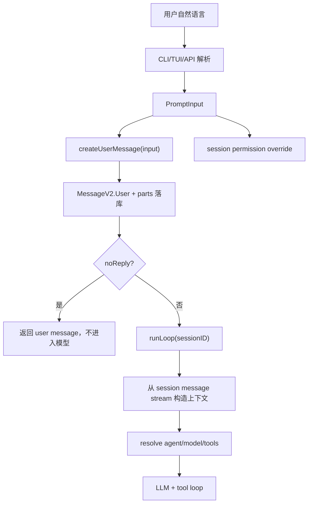

这里最关键的一句是：Agent loop 不直接消费原始 prompt，它消费的是 session message stream。也就是说，用户目标一旦进入 opencode，就变成了持久化事实，而不是临时字符串。

### opencode 源码落点

核心入口在 `packages/opencode/src/session/prompt.ts` 的 `prompt(input)`。它的输入类型由同一个文件里的 `PromptInput` 定义，实际字段包括：

```ts
export const PromptInput = z.object({
  sessionID: SessionID.zod,
  messageID: MessageID.zod.optional(),
  model: z.object({ providerID: ProviderID.zod, modelID: ModelID.zod }).optional(),
  agent: z.string().optional(),
  noReply: z.boolean().optional(),
  tools: z.record(z.string(), z.boolean()).optional(),
  format: MessageV2.Format.zod.optional(),
  system: z.string().optional(),
  variant: z.string().optional(),
  parts: z.array(...),
})
```

这个类型定义就是“目标理解”的第一道工程边界。CLI、TUI、HTTP API、task tool、subagent 入口最终都要把请求对齐到这类结构，而不是把自然语言字符串随手传给 provider。

关键逻辑：

```ts
const prompt = Effect.fn("SessionPrompt.prompt")(function* (input) {
  const session = yield* sessions.get(input.sessionID)
  yield* revert.cleanup(session)
  const message = yield* createUserMessage(input)
  yield* sessions.touch(input.sessionID)

  const permissions: Permission.Ruleset = []
  for (const [t, enabled] of Object.entries(input.tools ?? {})) {
    permissions.push({ permission: t, action: enabled ? "allow" : "deny", pattern: "*" })
  }
  if (permissions.length > 0) {
    session.permission = permissions
    yield* sessions.setPermission({ sessionID: session.id, permission: permissions })
  }

  if (input.noReply === true) return message
  return yield* loop({ sessionID: input.sessionID })
})
```

### 讲透

这段代码解决的是“用户输入进入运行时”的边界问题。它没有直接调用模型，而是先把用户输入落入 Session，再决定是否进入 loop。

这很重要，因为后面的所有东西都依赖这个事实：

- LLM 上下文来自 session message stream，不是临时变量。
- 权限可以按 session 覆盖，不是全局开关。
- `noReply` 支持只写入消息不触发模型，这对自动化、同步、重放很重要。

再结合上面的例子看：

1. `sessions.get(input.sessionID)` 找到当前会话边界，后续所有状态都挂在这个会话上。
2. `revert.cleanup(session)` 清理可能存在的回滚状态，避免旧状态污染新任务。
3. `createUserMessage(input)` 把自然语言和附件转成 `MessageV2.User` 及 parts。
4. `sessions.touch(input.sessionID)` 更新时间，TUI 会话列表和排序依赖它。
5. `input.tools` 被转成 session permission override，用于控制本轮工具可用性。
6. `noReply` 决定是否进入模型 loop。
7. `loop({ sessionID })` 只拿 sessionID，再从持久化消息里恢复上下文。

这就是为什么 opencode 能做到 TUI、非交互 run、subtask、MCP、skill 都走同一套 runtime。入口可以不同，但进入 runtime 后都是结构化 session 状态。

### 这个例子里真正发生了什么

继续用“日志只看到启动，后续 prompt/LLM/tool 流程看不到”这个例子。一个成熟的编程智能体不能只把这句话发给模型，而要在状态里保留这些事实：

| 用户话语里的信息 | 应该进入的 runtime 状态 | 后续用途 |
| --- | --- | --- |
| “opencode_debug” | text part + 当前工作区上下文 | 模型知道目标是 debug CLI，不是普通 opencode |
| “日志只显示启动” | text part | 引导模型查日志初始化和后续调用链 |
| “后续 prompt/LLM/tool 流程看不到” | text part | 引导模型检查 prompt、llm、processor、tool 执行路径 |
| “帮我修一下” | agent/task intent | 允许进入编辑和验证流程 |
| “并打包安装” | text part + tool permission | 后续需要 build/install 命令权限 |
| 当前会话 | `sessionID` | 所有消息、工具结果、日志归到同一条链路 |
| 本轮模型 | `model`/`variant` | 排查 provider 行为和复现输出 |
| 本轮工具权限 | `tools` 或 session permission | 决定能否 read/edit/bash/build |

这张表说明：自然语言里有些内容保持为文本即可，有些内容必须提升为 runtime 字段。如果全部都塞进字符串，系统就无法在模型之外做权限、恢复、订阅、重放和调试。

### 缺信息时应该怎么办

目标理解还包括“不确定时如何处理”。比如用户只说“帮我修一下日志”，但没有说明项目、命令、期望日志目录。入口层不应该假装已经理解一切，而要把确定事实先落库，把不确定性留给 agent loop：

```ts
const input = {
  sessionID,
  parts: [{ type: "text", text: "帮我修一下日志" }],
  agent: "build",
  tools: { read: true, grep: true, bash: true, edit: true },
}
await sessionPrompt.prompt(input)
```

然后 agent loop 通过工具逐步消除不确定性：

1. 先读项目结构和已有日志模块。
2. 再运行最小复现命令。
3. 如果命令需要危险权限，再走权限系统。
4. 如果仍缺关键信息，再向用户提问。

这比“入口层一次性猜完所有计划”更可靠。入口层负责形成可执行状态，loop 层负责在工具反馈中逐步收敛目标。

### 如果只做 model.chat(prompt)，会坏在哪里

```ts
const answer = await model.chat("帮我修一下日志问题")
```

这种写法看起来能跑 demo，但一进入编程智能体就会坏：

| 缺口 | 后果 |
| --- | --- |
| 没有 session | 无法恢复、无法订阅事件、无法把多轮工具结果串起来 |
| 没有 message id | tool result、patch、reasoning、text delta 无法挂靠 |
| 没有 agent | 不知道该用 build 还是 plan，也无法绑定权限和 step budget |
| 没有 model ref | 不能稳定复现，也无法解释为什么用了某个 provider |
| 没有 parts | 文件、图片、MCP resource、agent 指令只能混成字符串 |
| 没有 permission override | 不能单轮禁用危险工具或临时允许某个能力 |
| 没有 noReply | 无法做“只记录事件/同步状态/预写消息”的内部操作 |
| 没有持久化 | 进程中断后无法继续，也无法做 flow log 对照 |

### 它和后续难点的关系

难点一是所有后续模块的入口。如果这里没有把 prompt 变成可执行状态，后面这些能力都很难可靠实现：

- **工具调用**：tool call 需要 `sessionID/messageID/callID` 才能落成 part。
- **权限系统**：权限请求需要知道 session、tool、patterns、ruleset。
- **MCP**：外部工具结果要回写到同一条 assistant message。
- **Skill**：skill 加载要进入上下文，并受 agent permission 控制。
- **子任务**：task tool 需要 parent session 和子 session。
- **compaction**：压缩的是 session message stream，不是单个 prompt。
- **replay/debug**：日志要能从 prompt 追到 provider body 和工具结果。
- **TUI 更新**：UI 订阅的是 session/event，不是一个同步函数返回值。

### 如果你从 0 设计

不要写成：

```ts
const answer = await model.chat(userPrompt)
```

至少要写成：

```ts
const userMessage = await session.createUserMessage(prompt)
await session.applyPromptOverrides(prompt.options)
if (!prompt.noReply) await agentLoop.run(session.id)
```

更完整一点，可以把入口拆成三步：

```ts
const input = await parsePromptRequest(cliOrTuiPayload)
const message = await session.createUserMessage(input)
await session.applyRuntimeOverrides(input.sessionID, {
  tools: input.tools,
  format: input.format,
  agent: input.agent,
  model: input.model,
})
if (!input.noReply) await agentLoop.run(input.sessionID)
```

这才是“目标理解”的工程含义：不是让模型理解一句话，而是让 runtime 获得一份可执行、可追踪、可恢复、可授权的状态。

更工程化的最小实现可以长这样：

```ts
type PromptInput = {
  sessionID: string
  messageID?: string
  agent?: string
  model?: { providerID: string; modelID: string }
  variant?: string
  parts: Array<{ type: "text"; text: string } | { type: "file"; path: string }>
  tools?: Record<string, boolean>
  noReply?: boolean
  format?: { type: "text" } | { type: "json_schema"; schema: unknown }
}

async function prompt(input: PromptInput) {
  const session = await sessions.get(input.sessionID)
  await revert.cleanup(session)

  const userMessage = await messages.createUser({
    id: input.messageID ?? ids.message(),
    sessionID: input.sessionID,
    agent: input.agent ?? (await agents.default()),
    model: input.model ?? (await sessions.lastModel(input.sessionID)),
    variant: input.variant,
    parts: input.parts,
    format: input.format,
    tools: input.tools,
  })

  if (input.tools) {
    await sessions.setPermission(input.sessionID, toPermissionRules(input.tools))
  }

  await sessions.touch(input.sessionID)
  if (input.noReply) return userMessage
  return agentLoop.run({ sessionID: input.sessionID })
}
```

这个版本没有 opencode 的 Effect、Bus、processor、snapshot、MCP 复杂度，但保留了最重要的架构骨架：先把目标编译成状态，再让 loop 基于状态运行。

### 判断是否设计到位的检查清单

设计自己的 AI 代码助手时，可以用这份清单验收“目标理解”有没有做到位：

- 用户输入是否有稳定的 `sessionID` 和 `messageID`。
- 文本、文件、图片、子任务、agent 指令是否能用 `parts` 区分，而不是全部拼成字符串。
- agent、model、variant 是否被记录到 user message，方便复现和排错。
- 工具权限是否能按会话或按本轮覆盖，而不是全局开关。
- `noReply` 这类内部操作是否能只写状态、不触发模型。
- 结构化输出要求是否进入 `format`，而不是只靠 prompt 里一句“请返回 JSON”。
- agent loop 是否只依赖 session message stream，而不是依赖入口函数里的临时变量。
- 日志是否能从 `sessionID/messageID` 追到 provider 请求、tool call、tool result 和最终 assistant message。

做到这些，才算真正回答了“目标理解不是一句 prompt，而是要变成可执行状态”。否则只是把聊天 demo 包了一层 CLI，还没有进入编程智能体的工程形态。

## 2. 难点二：Agent Loop 必须知道什么时候继续、什么时候停

### 为什么难

Agent Loop 是编程智能体的“心跳”。它不是简单的：

```ts
while (true) {
  const answer = await model(messages)
  if (answer.done) break
}
```

真正的 loop 每一轮都要重新读取会话状态、判断历史消息是否已经完成、处理挂起的 subtask/compaction、生成 assistant message、调用 LLM、执行工具、把工具结果写回消息流，然后决定下一轮是否还要继续。

难点在于：模型的输出不是唯一真相，runtime 的结构化状态才是最终依据。模型可能：

- 直接回答完成
- 请求工具
- provider 返回 `stop`，但 assistant message 里其实有 tool calls
- 触发上下文压缩
- 触发 subtask
- 到达 agent 最大步数
- 中途被权限拒绝或用户取消
- 返回结构化输出
- 因上下文溢出要求 compact 后重试
- 在上一轮已经完成，但当前进程重入了 loop

如果停止条件写得粗糙，结果就是：

- 工具结果没回喂模型
- 模型反复调用同一个工具
- 已完成还继续消耗 token
- 中途失败但状态看起来像成功
- 用户新消息被历史 assistant finish 遮住
- 上下文溢出后直接失败，而不是压缩后继续
- 达到最大步数后继续放任工具调用，进入长循环

### opencode 源码落点

`session/prompt.ts` 的 `runLoop(sessionID)` 是核心。

它的骨架可以简化成：

```ts
let step = 0
while (true) {
  const msgs = await MessageV2.filterCompactedEffect(sessionID)
  const { lastUser, lastAssistant, lastFinished, tasks } = scan(msgs)

  if (alreadyFinished(lastUser, lastAssistant)) break

  step++
  const model = await getModel(lastUser.model.providerID, lastUser.model.modelID, sessionID)

  const task = tasks.pop()
  if (task?.type === "subtask") {
    await handleSubtask(...)
    continue
  }
  if (task?.type === "compaction") {
    const result = await compaction.process(...)
    if (result === "stop") break
    continue
  }
  if (isOverflow(lastFinished, model)) {
    await compaction.create(...)
    continue
  }

  const agent = await agents.get(lastUser.agent)
  const isLastStep = step >= (agent.steps ?? Infinity)
  const assistant = await createAssistantMessage(lastUser, agent, model)
  const result = await processor.process({ messages, tools, isLastStep })

  if (structuredOutputDone()) break
  if (result === "stop") break
  if (result === "compact") await compaction.create(...)
  continue
}
```

这段伪代码的重点不是语法，而是控制权归属：loop 每一轮都从 session message stream 恢复状态，而不是相信内存里的某个局部变量。

### 第一层判断：这轮是不是已经完成

opencode 在进入新 LLM 调用前，会先判断当前 session 是否已经有完成的 assistant：

```ts
const hasToolCalls =
  lastAssistantMsg?.parts.some((part) => part.type === "tool" && !part.metadata?.providerExecuted) ?? false

if (
  lastAssistant?.finish &&
  !["tool-calls"].includes(lastAssistant.finish) &&
  !hasToolCalls &&
  lastUser.id < lastAssistant.id
) {
  break
}
```

这段代码回答的是“是否需要再次调用模型”。四个条件缺一不可：

| 条件 | 含义 | 如果漏掉会怎样 |
| --- | --- | --- |
| `lastAssistant?.finish` | assistant 已经有结束标记 | 没结束就停，会截断工具或文本流 |
| `finish !== "tool-calls"` | 不是 provider 明确要求继续工具调用 | 工具调用没回喂就停止 |
| `!hasToolCalls` | message parts 里也没有未处理 tool part | provider 误报 `stop` 时会漏执行工具 |
| `lastUser.id < lastAssistant.id` | assistant 确实在最后一个 user 之后 | 用户发了新消息却被旧 assistant finish 拦住 |

这里最值得学的是：停止条件不能只看一个字段。普通聊天可以相信 `finish_reason=stop`，编程智能体不行。因为工具调用、provider-executed tool、历史消息顺序、用户新消息，都可能改变“是否完成”的真实含义。

### 第二层判断：有没有挂起的 runtime 任务

进入 LLM 之前，opencode 会先处理 `subtask` 和 `compaction`：

```ts
const task = tasks.pop()

if (task?.type === "subtask") {
  yield* handleSubtask({ task, model, lastUser, sessionID, session, msgs })
  continue
}

if (task?.type === "compaction") {
  const result = yield* compaction.process({
    messages: msgs,
    parentID: lastUser.id,
    sessionID,
    auto: task.auto,
    overflow: task.overflow,
  })
  if (result === "stop") break
  continue
}
```

这说明 loop 不是“模型专用循环”，而是“会话任务调度器”。有些轮次根本不会调用模型，而是先把 runtime 内部任务处理掉。

| pending task | 为什么要优先处理 | 处理后为什么 `continue` |
| --- | --- | --- |
| `subtask` | 子任务结果需要先汇总回父会话 | 消息流变了，要重新扫描 lastUser/lastAssistant |
| `compaction` | 上下文压缩会改变可见历史 | 压缩后要用新 messages 重新判断 |
| overflow auto compaction | 不压缩会继续超上下文 | 创建 compaction part 后下一轮处理 |

如果这里不 `continue`，而是在同一轮继续向下调用 LLM，就会拿旧消息做推理，轻则重复，重则上下文错乱。

### 第三层判断：上下文是否已经溢出

opencode 在发现上一条完成消息 token 超限时，会创建自动 compaction：

```ts
if (
  lastFinished &&
  lastFinished.summary !== true &&
  (yield* compaction.isOverflow({ tokens: lastFinished.tokens, model }))
) {
  yield* compaction.create({ sessionID, agent: lastUser.agent, model: lastUser.model, auto: true })
  continue
}
```

这里的难点是：溢出不是普通错误，而是一种“需要改写历史再继续”的状态。如果直接失败，用户体验差；如果不压缩继续调模型，provider 可能报 context overflow；如果压缩后不重新进入 loop，模型仍然拿不到压缩后的上下文。

所以正确动作是三步：

1. 检测 `lastFinished.tokens` 是否对当前 model 溢出。
2. 写入 compaction task。
3. `continue`，让下一轮基于压缩后的 message stream 重跑。

### 第四层判断：最大步数不是杀进程，而是改变最后一轮输入

opencode 读取 agent 的步数限制：

```ts
const maxSteps = agent.steps ?? Infinity
const isLastStep = step >= maxSteps
```

然后在调用模型时，如果已经是最后一步，会追加 `MAX_STEPS` 提醒：

```ts
messages: [...modelMsgs, ...(isLastStep ? [{ role: "assistant" as const, content: MAX_STEPS }] : [])]
```

`MAX_STEPS` 的含义是：最大步数已到，接下来必须只用文本总结，不能再调用工具。需要注意，当前源码里的实现方式是把 `MAX_STEPS` 作为一条强约束消息追加到模型输入里，而不是在这一行直接把 `tools` map 清空。所以它更像“最后一步收束协议”，不是底层硬断路器。

这个设计不是简单 `if (step > max) throw Error`，原因是编程智能体即使到达上限，也应该给用户一个可读交代：

- 已经做了什么
- 还剩什么没做
- 下一步建议是什么
- 为什么不能继续工具调用

这比硬中断更适合 CLI/TUI 场景。硬中断只会留下半截工具状态；最后一轮文本总结能把状态收束给用户。

### 第五层判断：LLM 处理器返回后怎么决定下一步

真正调用模型后，opencode 根据 `handle.process(...)` 的结果和 assistant message 状态做判断：

```ts
if (structured !== undefined) {
  handle.message.structured = structured
  handle.message.finish = handle.message.finish ?? "stop"
  yield* sessions.updateMessage(handle.message)
  return "break" as const
}

const finished = handle.message.finish && !["tool-calls", "unknown"].includes(handle.message.finish)
if (finished && !handle.message.error) {
  if (format.type === "json_schema") {
    handle.message.error = new MessageV2.StructuredOutputError({
      message: "Model did not produce structured output",
      retries: 0,
    }).toObject()
    yield* sessions.updateMessage(handle.message)
    return "break" as const
  }
}

if (result === "stop") return "break" as const
if (result === "compact") {
  yield* compaction.create({
    sessionID,
    agent: lastUser.agent,
    model: lastUser.model,
    auto: true,
    overflow: !handle.message.finish,
  })
}
return "continue" as const
```

这段逻辑把“模型完成了没有”拆成多个信号：

| 信号 | 动作 | 原因 |
| --- | --- | --- |
| `structured !== undefined` | 写入 structured，`break` | 结构化输出已经通过工具捕获，任务完成 |
| `format=json_schema` 但没 structured | 写错误，`break` | 用户要求结构化输出，普通文本不合格 |
| `result === "stop"` | `break` | processor 明确认为本轮完成 |
| `result === "compact"` | 创建 compaction，`continue` | 需要压缩后继续 |
| 其他情况 | `continue` | 可能有工具结果、未知 finish、下一轮任务 |

这也是 loop 难写的地方：`finish`、`result`、`structured`、`error` 都只是局部信号，必须组合判断。

### 完整状态机

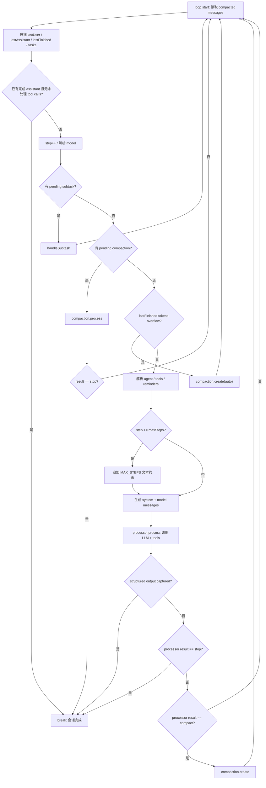

从这张图可以看出，`break` 只有少数明确出口；大多数路径都是 `continue`，因为编程智能体的中间状态必须回到消息流再判断一次。

### 用一个真实任务走一遍

继续用“修 opencode_debug 日志，打包安装”的例子：

1. 第 1 轮 loop 读取 user message，发现还没有 assistant finish，于是继续。
2. 没有 pending subtask/compaction，也没 overflow，创建 assistant message。
3. 解析 agent、model、tools，把日志问题、项目上下文、工具 schema 发给模型。
4. 模型调用 read/grep/bash 等工具，processor 把 tool call 和 tool result 写成 parts。
5. 因为出现 tool calls，loop 不能停，必须 `continue`，让工具结果回到下一轮模型输入。
6. 第 2 轮 loop 重新读取 message stream，此时上下文里已经有工具结果。
7. 模型根据工具结果决定修改文件，调用 edit/bash。
8. 修改完成后，模型返回最终文本，`finish=stop` 且无未处理 tool calls。
9. `lastUser.id < lastAssistant.id` 成立，loop `break`，返回最后 assistant。

如果第 5 步错误停止，模型永远看不到工具结果；如果第 8 步错误继续，就会无意义地多跑一轮甚至重复工具调用。

### 为什么 `lastUser.id < lastAssistant.id` 很关键

这个条件看起来像细节，其实是防止“旧完成状态覆盖新用户输入”。

假设历史是：

```text
user-100: 帮我修日志
assistant-200: 已修复，finish=stop
user-300: 再帮我把日志时间改成北京时间
```

如果 loop 只看 `lastAssistant.finish=stop` 就停止，那么 `user-300` 永远不会被处理。`lastUser.id < lastAssistant.id` 要求最后一个 assistant 必须比最后一个 user 更新，才能说明它回答的是当前最新用户消息。

这是编程智能体里很常见的 bug：历史里确实有一个完成回复，但它不是对最新输入的回复。

### 为什么不能只看 provider finish reason

不同 provider 对 tool call 的 finish 行为并不一致。有的会返回 `tool-calls`，有的可能返回 `stop`，但消息里已经包含工具调用。opencode 所以额外检查：

```ts
part.type === "tool" && !part.metadata?.providerExecuted
```

这里还排除了 `providerExecuted`，因为有些平台会在 provider 内部完成工具调用，不需要 opencode 再 re-loop 执行一次。

判断逻辑可以理解为：

| provider finish | message parts | opencode 应该做什么 |
| --- | --- | --- |
| `stop` | 没有 tool part | 可以停 |
| `stop` | 有未处理 tool part | 不能停，要继续 |
| `tool-calls` | 有 tool part | 继续 |
| `stop` | 只有 providerExecuted tool part | 可以停或按 provider 结果处理 |
| `unknown` | 不确定 | 倾向继续或交给 processor 结果判断 |

这就是“结构化消息状态优先于 provider 单字段”的设计原则。

### 从 0 设计建议

不要写成：

```ts
while (true) {
  const res = await model.chat(messages)
  if (res.finishReason === "stop") break
  if (res.toolCalls.length) await runTools(res.toolCalls)
}
```

至少要把 loop 写成状态机：

```ts
async function runLoop(sessionID: string) {
  let step = 0

  while (true) {
    const messages = await session.readVisibleMessages(sessionID)
    const state = scanLoopState(messages)

    if (state.doneForLatestUser) return state.lastAssistant

    step++
    const model = await resolveModel(state.lastUser.model)

    if (state.pendingSubtask) {
      await runSubtask(state.pendingSubtask)
      continue
    }

    if (state.pendingCompaction || isOverflow(state.lastFinished, model)) {
      const result = await compact(sessionID, state)
      if (result === "stop") return await session.lastAssistant(sessionID)
      continue
    }

    const agent = await resolveAgent(state.lastUser.agent)
    const assistant = await session.createAssistantMessage({
      sessionID,
      parentID: state.lastUser.id,
      agent: agent.name,
      model,
    })

    const result = await processor.process({
      assistant,
      messages: addMaxStepReminder(messages, step, agent.steps),
      tools: await resolveTools(agent, state.lastUser.tools),
    })

    if (result.kind === "stop") return assistant
    if (result.kind === "compact") await enqueueCompaction(sessionID)
  }
}
```

`scanLoopState` 至少要产出这些字段：

```ts
type LoopState = {
  lastUser: UserMessage
  lastAssistant?: AssistantMessage
  lastFinished?: AssistantMessage
  pendingSubtask?: SubtaskPart
  pendingCompaction?: CompactionPart
  hasUnhandledToolCalls: boolean
  doneForLatestUser: boolean
}
```

### 判断是否设计到位的检查清单

设计自己的 AI 代码助手时，可以用这份清单验收 Agent Loop：

- loop 是否每轮都从持久化 session message stream 重新读取状态。
- 停止条件是否同时考虑 `finish`、未处理 tool calls、用户/assistant 顺序。
- provider 返回 `stop` 但消息里有 tool calls 时，是否仍会继续。
- provider 内部已执行的 tool call 是否避免重复执行。
- subtask、compaction 这类 runtime task 是否优先于新 LLM 调用。
- context overflow 是否能创建 compaction 并重新进入 loop。
- 达到最大步数时是否给用户总结，而不是直接崩溃或沉默退出。
- 结构化输出是否有专门完成路径和错误路径。
- tool result 写回后是否一定重新进入 loop，让模型看到结果。
- 权限拒绝、用户取消、processor error 是否能落到 assistant message，而不是丢成进程异常。
- loop 是否有清晰的 `break` 出口和 `continue` 出口，避免隐藏死循环。
- 日志是否打印 `sessionID`、`step`、`assistantMessageID`、`result`、`finish`、`toolCount`、`maxSteps`。

做到这些，才算真正讲清楚“Agent Loop 必须知道什么时候继续、什么时候停”。否则只是一个聊天 while 循环，不能支撑真实的编程智能体。

## 3. 难点三：上下文不是拼字符串，而是多来源事实的压缩和排序

### 为什么难

普通聊天 demo 常见写法是：

```ts
const prompt = [
  systemPrompt,
  previousMessages.join("\n"),
  userPrompt,
].join("\n\n")
const answer = await model.chat(prompt)
```

这在编程智能体里很快会坏。因为代码助手的上下文不是一段文本，而是一组来源不同、可信度不同、生命周期不同、成本不同的事实。它至少包括：

- 用户消息
- 历史 assistant/tool parts
- 当前环境
- agent prompt
- skills 描述
- project instructions
- 文件内容
- 工具结果
- compaction summary
- subtask result
- provider/model 能力
- 图片、PDF、目录、文本文件
- synthetic reminder
- 结构化输出约束

上下文太少，模型会瞎猜；上下文太多，会超限或成本爆炸。

更麻烦的是，这些事实不能随便排序。比如：

- 环境信息应该比历史消息更稳定，适合放 system。
- 用户最新消息必须比旧 assistant 回复更重要。
- 工具结果必须跟 tool call 对上，否则 provider 会报协议错误。
- 被压缩的旧历史不能继续原样出现，否则压缩没有意义。
- 大图片在 compaction 时可能要降级成占位文本，否则永远压不动。
- 旧工具输出可以清理正文，但要保留“曾经有这个工具结果”的结构痕迹。

所以“上下文管理”不是拼字符串，而是一个事实治理系统：采集、分层、排序、转换、压缩、裁剪、注入、重放。

### opencode 源码落点

在 `session/prompt.ts`，进入 LLM 前会做四件事：

```ts
if (step > 1 && lastFinished) {
  for (const m of msgs) {
    if (m.info.role !== "user" || m.info.id <= lastFinished.id) continue
    for (const p of m.parts) {
      if (p.type !== "text" || p.ignored || p.synthetic) continue
      if (!p.text.trim()) continue
      p.text = [
        "<system-reminder>",
        "The user sent the following message:",
        p.text,
        "",
        "Please address this message and continue with your tasks.",
        "</system-reminder>",
      ].join("\n")
    }
  }
}

yield* plugin.trigger("experimental.chat.messages.transform", {}, { messages: msgs })

const [skills, env, instructions, modelMsgs] = yield* Effect.all([
  sys.skills(agent),
  Effect.sync(() => sys.environment(model)),
  instruction.system().pipe(Effect.orDie),
  MessageV2.toModelMessagesEffect(msgs, model),
])
const system = [...env, ...(skills ? [skills] : []), ...instructions]
```

这段代码说明上下文不是一个来源：

| 来源 | 代码入口 | 放到哪里 |
| --- | --- | --- |
| 运行环境 | `sys.environment(model)` | system |
| skill 列表 | `sys.skills(agent)` | system |
| 项目/用户指令 | `instruction.system()` | system |
| 会话历史 | `MessageV2.toModelMessagesEffect(msgs, model)` | model messages |
| 插件改写 | `experimental.chat.messages.transform` | 进入 provider 前的 messages |
| 多轮提醒 | `<system-reminder>` 注入 user text part | model messages |

真正调用 processor 时再组合：

```ts
const result = yield* handle.process({
  user: lastUser,
  agent,
  permission: session.permission,
  sessionID,
  system,
  messages: [...modelMsgs, ...(isLastStep ? [{ role: "assistant" as const, content: MAX_STEPS }] : [])],
  tools,
  model,
})
```

也就是说，opencode 把“稳定规则”和“对话事实”分开传：

- `system` 承载环境、skill、instructions、结构化输出约束。
- `messages` 承载用户、assistant、工具结果、文件、压缩摘要。
- `tools` 承载当前轮可调用能力。
- `permission` 承载工具执行边界。

### 系统环境不是聊天内容

系统环境在 `session/system.ts`：

```ts
environment(model) {
  const project = Instance.project
  return [[
    `You are powered by the model named ${model.api.id}. The exact model ID is ${model.providerID}/${model.api.id}`,
    `Here is some useful information about the environment you are running in:`,
    `<env>`,
    `  Working directory: ${Instance.directory}`,
    `  Workspace root folder: ${Instance.worktree}`,
    `  Is directory a git repo: ${project.vcs === "git" ? "yes" : "no"}`,
    `  Platform: ${process.platform}`,
    `  Today's date: ${new Date().toDateString()}`,
    `</env>`,
  ].join("\n")]
}
```

这些信息不能混进用户消息里。原因是它们不是用户意图，而是 runtime 事实。如果把它们拼进 user prompt，模型可能把它们当成用户要求的一部分；放 system 里则更像“运行约束”。

### Skill 不是一次性全加载

`sys.skills(agent)` 只放 skill 列表和描述：

```ts
skills(agent) {
  if (Permission.disabled(["skill"], agent.permission).has("skill")) return
  const list = yield* skill.available(agent)
  return [
    "Skills provide specialized instructions and workflows for specific tasks.",
    "Use the skill tool to load a skill when a task matches its description.",
    Skill.fmt(list, { verbose: true }),
  ].join("\n")
}
```

这里的设计很重要：system 里放“有哪些 skill、什么时候用”，而不是把每个 skill 全文都塞进去。真正需要时再让模型调用 `skill` 工具加载完整内容。这样可以避免两个问题：

- 上下文启动成本过高。
- 不相关 skill 干扰当前任务。

### MessageV2 才是上下文主干

会话历史不是字符串数组，而是 `MessageV2.WithParts[]`。每条消息有 `info` 和 `parts`：

```ts
type WithParts = {
  info: User | Assistant
  parts: Part[]
}

type Part =
  | TextPart
  | FilePart
  | ToolPart
  | ReasoningPart
  | SubtaskPart
  | CompactionPart
  | PatchPart
  | SnapshotPart
  | AgentPart
```

这就是为什么“上下文不是拼字符串”。因为不同 part 有不同语义：

| part | 进入模型时的语义 | 为什么不能简单拼接 |
| --- | --- | --- |
| `text` | 用户/assistant 文本 | 需要保留 role 和 ignored/synthetic 标记 |
| `file` | 附件或文件 | 可能是媒体、普通文本、目录，不同 provider 支持不同 |
| `tool` | tool call + tool result | 必须和 toolCallId 对齐，不能只是文本 |
| `reasoning` | 模型推理片段 | 需要 provider metadata 和兼容处理 |
| `subtask` | 子任务入口/结果 | 需要触发 runtime 调度 |
| `compaction` | 压缩请求/摘要锚点 | 需要改变历史可见范围 |
| `patch/snapshot` | 文件变更事实 | 需要用于 UI、恢复、diff，而不一定全量喂模型 |

### part 到 provider message 的转换

`MessageV2.toModelMessagesEffect(msgs, model)` 做真正的转换。用户消息里：

```ts
if (msg.info.role === "user") {
  const userMessage: UIMessage = { id: msg.info.id, role: "user", parts: [] }
  result.push(userMessage)
  for (const part of msg.parts) {
    if (part.type === "text" && !part.ignored) {
      userMessage.parts.push({ type: "text", text: part.text })
    }
    if (part.type === "file" && part.mime !== "text/plain" && part.mime !== "application/x-directory") {
      if (options?.stripMedia && isMedia(part.mime)) {
        userMessage.parts.push({ type: "text", text: `[Attached ${part.mime}: ${part.filename ?? "file"}]` })
      } else {
        userMessage.parts.push({ type: "file", url: part.url, mediaType: part.mime, filename: part.filename })
      }
    }
    if (part.type === "compaction") {
      userMessage.parts.push({ type: "text", text: "What did we do so far?" })
    }
  }
}
```

这段逻辑体现了几个上下文治理规则：

- `ignored` 文本不进模型。
- `text/plain` 和目录文件已经在别处转成文本，因此这里跳过 file part。
- compaction part 会变成“到目前为止做了什么”的压缩请求。
- `stripMedia` 时媒体文件降级成占位文本，避免压缩模型被大媒体拖死。

assistant 消息里，tool part 会被转成 provider 能理解的 tool output：

```ts
if (part.type === "tool" && part.state.status === "completed") {
  const outputText = part.state.time.compacted
    ? "[Old tool result content cleared]"
    : truncateToolOutput(part.state.output, options?.toolOutputMaxChars)

  assistantMessage.parts.push({
    type: ("tool-" + part.tool) as `tool-${string}`,
    state: "output-available",
    toolCallId: part.callID,
    input: part.state.input,
    output: outputText,
  })
}
```

这说明工具结果不是“追加一段 stdout 文本”。它必须保留：

- tool 名称
- toolCallId
- 输入参数
- 输出或错误
- 是否 providerExecuted
- provider metadata

否则下一轮模型无法把工具结果和上一轮 tool call 对起来。

### 一个具体例子

假设用户说：

```text
opencode_debug 启动后日志只显示启动，后续 prompt/LLM/tool 流程看不到。帮我修一下，并打包安装。
```

几轮后，上下文可能长成这样：

```text
system:
  env: 当前目录、git repo、平台、日期、模型
  skills: 可用 skill 列表
  instructions: AGENTS.md / 用户指令 / agent prompt

messages:
  user:
    text: 修日志并打包安装
  assistant:
    text: 我先检查日志模块
    tool: grep(input="FlowLog|trace.info", output="packages/opencode/src/...")
    tool: read(input="packages/opencode/src/session/prompt.ts", output="...")
  assistant:
    tool: edit(input=..., output="Success. Updated...")
    tool: bash(input="bun typecheck", output="...")
  user:
    text: 对了，日志时间时区不对
  assistant:
    text: 我会修正时间格式...
```

如果你把这些简单拼成一段文本，会丢掉三个关键关系：

1. 哪些是 system 约束，哪些是用户目标。
2. 哪个工具输出对应哪个 tool call。
3. 哪些历史已经被 compaction 替代，哪些最近 turns 必须保留原文。

opencode 的做法是保留结构，直到最后一刻再转换成 provider message。

### 压缩不是摘要一下，而是选择 head 和 tail

上下文压缩的核心在 `session/compaction.ts`。它不是把整段历史粗暴总结，而是先选择哪些历史进入 summary，哪些最近历史保留原文：

```ts
const limit = input.cfg.compaction?.tail_turns ?? DEFAULT_TAIL_TURNS
const budget = preserveRecentBudget({ cfg: input.cfg, model: input.model })
const all = turns(input.messages)
const recent = all.slice(-limit)
```

默认策略是：

- 最近若干 turn 尽量保留原文。
- 更早的 head 进入 summary。
- 如果最近 turn 太大，就尝试从 turn 中间切出 tail。
- 如果没有可保留 tail，就全部走 summary。

`preserveRecentBudget` 还会按模型上下文窗口分配近期保留预算：

```ts
return (
  input.cfg.compaction?.preserve_recent_tokens ??
  Math.min(MAX_PRESERVE_RECENT_TOKENS, Math.max(MIN_PRESERVE_RECENT_TOKENS, Math.floor(usable(input) * 0.25)))
)
```

这就是“排序”的含义：不是所有历史平等。最近 turn 的操作、错误和用户修正，通常比很早之前的寒暄更重要。

### 压缩摘要也有固定结构

opencode 的 summary prompt 要求固定 Markdown 结构：

```text
## Goal
## Constraints & Preferences
## Progress
### Done
### In Progress
### Blocked
## Key Decisions
## Next Steps
## Critical Context
## Relevant Files
```

这比“总结一下对话”可靠，因为编程任务最怕丢：

- 用户约束
- 已做改动
- 未完成事项
- 关键错误
- 文件路径
- 下一步

好的 compaction 不是压缩成短文，而是把可继续工作的状态压缩成结构化交接单。

### 旧工具输出会被清理，但结构还在

`compaction.prune` 会回头扫描旧工具结果：

```ts
if (part.type !== "tool") continue
if (part.state.status !== "completed") continue
if (PRUNE_PROTECTED_TOOLS.includes(part.tool)) continue
if (part.state.time.compacted) break loop
const estimate = Token.estimate(part.state.output)
...
part.state.time.compacted = Date.now()
yield* session.updatePart(part)
```

之后 `toModelMessagesEffect` 会把旧工具输出替换成：

```ts
"[Old tool result content cleared]"
```

这点非常关键：它没有删除 tool part，也没有假装工具没发生过。它只是清理高成本输出正文，保留工具调用结构。这样模型还能知道“曾经跑过这个工具”，但不会反复携带几万字符输出。

### 已完成 compaction 如何影响可见历史

`MessageV2.filterCompactedEffect(sessionID)` 会过滤已被压缩的旧历史：

```ts
export function filterCompacted(msgs: Iterable<WithParts>) {
  const result = [] as WithParts[]
  const completed = new Set<string>()
  let retain: MessageID | undefined
  for (const msg of msgs) {
    result.push(msg)
    if (retain) {
      if (msg.info.id === retain) break
      continue
    }
    if (msg.info.role === "user" && completed.has(msg.info.id)) {
      const part = msg.parts.find((item): item is CompactionPart => item.type === "compaction")
      if (!part) continue
      if (!part.tail_start_id) break
      retain = part.tail_start_id
      if (msg.info.id === retain) break
      continue
    }
    if (msg.info.role === "assistant" && msg.info.summary && msg.info.finish && !msg.info.error) {
      completed.add(msg.info.parentID)
    }
  }
  result.reverse()
  return result
}
```

读起来绕，但它解决的是这个问题：

```text
旧历史 A
旧历史 B
user(compaction request)
assistant(summary=true)
近期 tail turn 1
近期 tail turn 2
最新 user
```

进入下一轮模型时，不应该再把 A/B 全量塞进去，而应该看到：

```text
assistant summary
近期 tail turn 1
近期 tail turn 2
最新 user
```

这就是“压缩替代历史”，不是“在原历史后面追加一个摘要”。如果摘要和原历史同时存在，就会又贵又容易冲突。

### Provider 能力也会影响上下文形态

`toModelMessagesEffect` 里还有 provider 能力判断：

```ts
const supportsMediaInToolResults = (() => {
  if (model.api.npm === "@ai-sdk/anthropic") return true
  if (model.api.npm === "@ai-sdk/openai") return true
  if (model.api.npm === "@ai-sdk/amazon-bedrock") return true
  if (model.api.npm === "@ai-sdk/google") {
    const id = model.api.id.toLowerCase()
    return id.includes("gemini-3") && !id.includes("gemini-2")
  }
  return false
})()
```

如果 provider 不支持 tool result 里的媒体附件，opencode 会把媒体提取成额外 user message。这说明上下文排序还受 provider 协议影响。不是“同一份 messages 发给所有模型”，而是“同一份 MessageV2 事实，根据模型能力转换成不同 provider prompt”。

### 多轮中插入 system-reminder 的原因

当 `step > 1 && lastFinished` 时，opencode 会把新 user text 包成：

```text
<system-reminder>
The user sent the following message:
...
Please address this message and continue with your tasks.
</system-reminder>
```

这解决的是一个实际问题：在长工具循环里，用户可能中途又发消息。如果这条消息只是普通 text，模型可能把它当成历史聊天，继续执行旧计划。包成 reminder 后，模型更容易意识到这是“继续任务时必须处理的新用户输入”。

### 从 0 设计建议

不要写成：

```ts
const context = [
  systemPrompt,
  ...messages.map((m) => `${m.role}: ${m.content}`),
  toolOutputs.join("\n"),
].join("\n\n")
```

至少要拆成四层：

```ts
type RuntimeContext = {
  system: string[]
  messages: ModelMessage[]
  tools: ToolSet
  permissions: PermissionRules
}

async function buildRuntimeContext(sessionID: string, model: Model, agent: Agent): Promise<RuntimeContext> {
  const visible = await session.filterCompacted(sessionID)
  const transformed = await plugins.transformMessages(visible)

  return {
    system: [
      buildEnvironment(model),
      await buildSkillIndex(agent),
      ...(await loadInstructions()),
    ].filter(Boolean),
    messages: await toModelMessages(transformed, model, {
      stripMedia: false,
      toolOutputMaxChars: undefined,
    }),
    tools: await resolveTools(agent),
    permissions: await resolvePermissions(sessionID, agent),
  }
}
```

compaction 也不要只写：

```ts
const summary = await model.summarize(allMessages)
messages = [summary, latestUser]
```

更合理的是：

```ts
async function compact(messages: MessageWithParts[], model: Model) {
  const previousSummary = findLatestCompletedSummary(messages)
  const { head, tailStartID } = await selectHeadAndTail(messages, {
    tailTurns: 2,
    preserveRecentTokens: Math.floor(model.usableInputTokens * 0.25),
  })

  const summary = await summarize({
    previousSummary,
    messages: stripMediaAndTruncateToolOutput(head),
    template: COMPILABLE_TASK_STATE_TEMPLATE,
  })

  await saveCompactionSummary(summary)
  await markTailStart(tailStartID)
  await pruneOldToolOutputs(messages)
}
```

### 判断是否设计到位的检查清单

设计自己的 AI 代码助手时，可以用这份清单验收上下文系统：

- 是否把 `system`、`messages`、`tools`、`permissions` 分开，而不是拼成一个 prompt。
- 是否有结构化 message part，而不是只有 role/content 字符串。
- tool result 是否保留 toolCallId、输入、输出、错误和 provider metadata。
- ignored/synthetic text 是否有明确规则，避免不该进模型的文本污染上下文。
- 文件和媒体是否按 provider 能力转换，而不是一刀切。
- 最近用户输入是否在长 loop 中被显式提醒模型处理。
- compaction 是否保留最近 tail turns，而不是把所有历史都摘要掉。
- summary 是否有固定结构，能恢复目标、约束、进度、阻塞、文件和下一步。
- 已完成 compaction 是否真的替代旧历史，而不是摘要和原文同时存在。
- 旧工具输出是否能清理正文但保留结构痕迹。
- context overflow 是否根据 model usable tokens 判断，而不是写死一个全局长度。
- 日志是否能分别打印 system、modelMessages、tool output truncation、compaction selection 和 summary 结果。

做到这些，才算真正讲清楚“上下文不是拼字符串，而是多来源事实的压缩和排序”。否则模型看起来能聊天，但一旦进入长任务、工具循环、附件、MCP、子任务和压缩，就会失控。

### 设计示例

一个最小但正确的上下文构建器应该像这样：

```ts
const [skills, env, instructions, modelMsgs] = yield* Effect.all([
  sys.skills(agent),
  Effect.sync(() => sys.environment(model)),
  instruction.system().pipe(Effect.orDie),
  MessageV2.toModelMessagesEffect(msgs, model),
])
const system = [...env, ...(skills ? [skills] : []), ...instructions]
```

关键不是这几行代码本身，而是它们背后的边界：环境、技能、指令、历史消息分别生成，最后组合。只要这个边界保住，后续你要加 MCP resource、代码索引、RAG、视觉输入、团队记忆，都能在合适层插入，而不是继续往一个巨型 prompt 字符串里塞。

## 4. 难点四：Provider 差异会污染 Agent 逻辑，必须隔离

### 为什么难

表面上，所有大模型调用都像这样：

```ts
await model.generate({
  system,
  messages,
  tools,
  temperature,
})
```

但真实工程里，不同 provider 的差异会从四个方向污染 Agent：

1. 请求参数不同。
2. 消息格式不同。
3. 工具协议不同。
4. 流式事件和错误行为不同。

不同模型 API 在这些地方都可能不同：

- system prompt 放哪里
- tool schema 支持程度
- reasoning 参数格式
- max token 字段
- tool call 格式
- 是否支持 temperature
- 是否支持 OpenAI Responses API
- 是否是 LiteLLM/GitLab workflow 代理
- 是否支持图片、PDF、音频、视频输入
- providerOptions 应该放在 `openai`、`anthropic`、`bedrock`、`gateway` 还是自定义 namespace
- prompt cache 的字段名是 `promptCacheKey`、`prompt_cache_key`、`cacheControl` 还是 `cachePoint`
- tool call id 是否允许特殊字符
- assistant tool_use 后是否允许再跟文本
- 空字符串 message 是否会被拒绝

如果业务 loop 直接处理这些差异，会很快变成一坨 if/else。

更严重的是，一旦 provider 差异泄漏到 Agent Loop，Agent 就不再是“会话状态机”，而变成“供应商协议状态机”。后果是：

- 新增一个 provider 要改 Agent Loop。
- 修一个 provider bug 可能影响所有模型。
- 工具权限、compaction、structured output 这些 runtime 语义会被 provider 细节绑死。
- 日志里看不清是 Agent 决策错了，还是 provider adapter 转换错了。

所以难点四的核心不是“怎么支持很多模型”，而是“怎么让 Agent 永远只面对统一语义，把供应商差异关在 adapter 层”。

### opencode 源码落点

核心边界在两处：

- `session/llm.ts`：把 Agent runtime 输入转换成 AI SDK `streamText` 调用。
- `provider/transform.ts`：处理 provider/model 级消息和参数差异。

Agent Loop 传给 LLM 的 `StreamInput` 是统一语义：

```ts
export type StreamInput = {
  user: MessageV2.User
  sessionID: string
  parentSessionID?: string
  model: Provider.Model
  agent: Agent.Info
  permission?: Permission.Ruleset
  system: string[]
  messages: ModelMessage[]
  small?: boolean
  tools: Record<string, Tool>
  retries?: number
  toolChoice?: "auto" | "required" | "none"
}
```

这里没有 OpenAI/Anthropic/Gemini 分支。Agent Loop 只表达：

- 本轮用户是谁
- 用哪个 model
- system/messages 是什么
- tools 是什么
- toolChoice 是什么
- permission 是什么

至于这些语义如何变成供应商请求，是 `session/llm.ts` 和 `ProviderTransform` 的责任。

### 参数差异：先合并成统一 options，再映射到 providerOptions

在 `session/llm.ts`，opencode 先构造基础参数，再按层级合并：

```ts
const base = input.small
  ? ProviderTransform.smallOptions(input.model)
  : ProviderTransform.options({
      model: input.model,
      sessionID: input.sessionID,
      providerOptions: item.options,
    })

const options = pipe(
  base,
  mergeDeep(input.model.options),
  mergeDeep(input.agent.options),
  mergeDeep(variant),
)
```

这是一条非常重要的优先级链：

```text
provider/model 默认参数
  < model.options
  < agent.options
  < variant options
```

它解决的是“同一个模型在不同 agent 或 variant 下应该有不同参数”的问题。例如：

- 普通 agent 用默认 reasoning effort。
- summary/标题生成这种 small call 降低 reasoning。
- 某个 agent 想覆盖 temperature/topP。
- 用户选了 model variant，需要覆盖 provider 参数。

如果这些逻辑散落在 Agent Loop 里，loop 会充满 `if model is gpt-5 then reasoningEffort=...`。opencode 把它们放到 `ProviderTransform.options(...)` 和合并链里。

然后真正传给 AI SDK 前，再映射成 providerOptions：

```ts
const providerOptions = ProviderTransform.providerOptions(input.model, params.options)
```

`provider/transform.ts` 里处理 namespace：

```ts
export function providerOptions(model: Provider.Model, options: { [x: string]: any }) {
  if (model.api.npm === "@ai-sdk/gateway") {
    const i = model.api.id.indexOf("/")
    const rawSlug = i > 0 ? model.api.id.slice(0, i) : undefined
    const slug = rawSlug ? (SLUG_OVERRIDES[rawSlug] ?? rawSlug) : undefined
    const gateway = options.gateway
    const rest = Object.fromEntries(Object.entries(options).filter(([k]) => k !== "gateway"))
    ...
    return result
  }

  const key = sdkKey(model.api.npm) ?? model.providerID
  if (model.api.npm === "@ai-sdk/azure") {
    return { openai: options, azure: options }
  }
  return { [key]: options }
}
```

这说明 provider 参数不是简单 `{ ...options }`。同一个 `reasoningEffort`、`cacheControl`、`thinkingConfig`，在不同 SDK 下可能要放到不同 namespace。

### 默认参数差异：集中在 ProviderTransform.options

`ProviderTransform.options(...)` 里有大量 provider/model 特例：

```ts
if (input.model.providerID === "openai" || input.model.api.npm === "@ai-sdk/openai") {
  result["store"] = false
}

if (input.model.api.npm === "@ai-sdk/azure") {
  result["store"] = true
  result["promptCacheKey"] = input.sessionID
}

if (input.model.api.npm === "@openrouter/ai-sdk-provider") {
  result["usage"] = { include: true }
}

if (input.model.api.id.includes("gpt-5") && !input.model.api.id.includes("gpt-5-chat")) {
  result["reasoningEffort"] = "medium"
  if (input.model.api.npm === "@ai-sdk/openai" || input.model.api.npm === "@ai-sdk/azure") {
    result["reasoningSummary"] = "auto"
  }
}
```

这些不是业务逻辑，而是 provider 协议适配。它们必须集中管理，原因是：

- `reasoningSummary` 有些 OpenAI-compatible proxy 不认识。
- Google thinking 用 `thinkingConfig`。
- OpenRouter/Gateway 需要 usage/caching 路由参数。
- Azure 和 OpenAI 的缓存字段并不完全一致。
- 某些模型默认要开 thinking，否则拿不到 reasoning_content。

Agent 不应该知道这些。Agent 只应该说“我要这个 model”，adapter 决定请求怎么写。

### system prompt 放置差异

`session/llm.ts` 先把系统提示词合并：

```ts
const system: string[] = []
system.push(
  [
    ...(input.agent.prompt ? [input.agent.prompt] : SystemPrompt.provider(input.model)),
    ...input.system,
    ...(input.user.system ? [input.user.system] : []),
  ].filter((x) => x).join("\n"),
)
```

但最终 messages 怎么放，要看 provider：

```ts
const messages = isOpenaiOauth
  ? input.messages
  : isWorkflow
    ? input.messages
    : [
        ...system.map((x): ModelMessage => ({ role: "system", content: x })),
        ...input.messages,
      ]
```

OpenAI OAuth 特殊处理：

```ts
if (isOpenaiOauth) {
  options.instructions = system.join("\n")
}
```

GitLab workflow 也特殊：

```ts
if (language instanceof GitLabWorkflowLanguageModel) {
  workflowModel.systemPrompt = system.join("\n")
}
```

这说明“system prompt 放哪里”不是 Agent Loop 的职责。Agent Loop 只传 `system: string[]`，LLM adapter 决定它应该变成：

- `messages[].role = "system"`
- `options.instructions`
- workflow model 的 `systemPrompt`
- 或其他 provider 特定字段

### 消息格式差异：ProviderTransform.message

最终消息转换发生在 `wrapLanguageModel` middleware：

```ts
model: wrapLanguageModel({
  model: language,
  middleware: [{
    async transformParams(args) {
      if (args.type === "stream") {
        args.params.prompt = ProviderTransform.message(args.params.prompt, input.model, options)
      }
      return args.params
    },
  }],
})
```

`ProviderTransform.message(...)` 做了多类转换。

第一类：过滤 provider 不支持的附件输入：

```ts
function unsupportedParts(msgs: ModelMessage[], model: Provider.Model): ModelMessage[] {
  return msgs.map((msg) => {
    if (msg.role !== "user" || !Array.isArray(msg.content)) return msg
    const filtered = msg.content.map((part) => {
      if (part.type !== "file" && part.type !== "image") return part
      const modality = mimeToModality(mime)
      if (!modality) return part
      if (model.capabilities.input[modality]) return part
      return {
        type: "text",
        text: `ERROR: Cannot read ${name} (this model does not support ${modality} input). Inform the user.`,
      }
    })
    return { ...msg, content: filtered }
  })
}
```

这避免了一个常见问题：用户传了图片，但当前模型不支持图片。如果直接发 provider，可能报 API error；adapter 把它转成文本错误，让模型能向用户解释。

第二类：清理 Anthropic/Bedrock 不接受的空消息：

```ts
if (model.api.npm === "@ai-sdk/anthropic" || model.api.npm === "@ai-sdk/amazon-bedrock") {
  msgs = msgs
    .map((msg) => {
      if (typeof msg.content === "string") {
        if (msg.content === "") return undefined
        return msg
      }
      ...
    })
    .filter((msg): msg is ModelMessage => msg !== undefined && msg.content !== "")
}
```

第三类：修正 Claude toolCallId 字符限制：

```ts
if (model.api.id.includes("claude")) {
  const scrub = (id: string) => id.replace(/[^a-zA-Z0-9_-]/g, "_")
  ...
  return { ...part, toolCallId: scrub(part.toolCallId) }
}
```

第四类：修正 Anthropic tool_use 和文本顺序问题。源码注释明确说 Anthropic 会拒绝某些 shape：

```ts
// Anthropic rejects assistant turns where tool_use blocks are followed by non-tool
// content, e.g. [tool_use, tool_use, text]
```

这些都不应该进入 Agent Loop。Agent Loop 不应该关心 Claude 是否允许 tool id 里有特殊字符，也不应该关心某个 provider 是否接受空字符串。

### 缓存差异：同一个语义，不同字段

ProviderTransform 还会根据 provider 加缓存控制：

```ts
function applyCaching(msgs: ModelMessage[], model: Provider.Model): ModelMessage[] {
  const system = msgs.filter((msg) => msg.role === "system").slice(0, 2)
  const final = msgs.filter((msg) => msg.role !== "system").slice(-2)

  const providerOptions = {
    anthropic: { cacheControl: { type: "ephemeral" } },
    openrouter: { cacheControl: { type: "ephemeral" } },
    bedrock: { cachePoint: { type: "default" } },
    openaiCompatible: { cache_control: { type: "ephemeral" } },
    copilot: { copilot_cache_control: { type: "ephemeral" } },
  }
  ...
}
```

缓存是统一语义：“这些 system/final messages 值得缓存”。但 provider 字段完全不同。隔离层负责把统一语义翻译成 provider 字段。

### 工具协议差异：Loop 看到统一 tools，adapter 处理供应商怪癖

Agent Loop 只传 `tools`。但 `session/llm.ts` 里要处理 provider 特例。

LiteLLM/Bedrock/GitHub Copilot 代理在历史里有 tool calls 但本轮 tools 为空时可能拒绝请求，所以 opencode 注入 `_noop`：

```ts
if (
  (isLiteLLMProxy || input.model.providerID.includes("github-copilot")) &&
  Object.keys(tools).length === 0 &&
  hasToolCalls(input.messages)
) {
  tools["_noop"] = tool({
    description: "Do not call this tool. It exists only for API compatibility and must never be invoked.",
    inputSchema: jsonSchema({ type: "object", properties: { reason: { type: "string" } } }),
    execute: async () => ({ output: "", title: "", metadata: {} }),
  })
}
```

这很典型：这是 provider/proxy 的协议兼容问题，不是 Agent 任务逻辑。Agent 不应该知道“有历史 tool call 时必须带一个 dummy tool”。

GitLab workflow 又是另一种工具协议：工具执行发生在 workflow service 的 WebSocket 流里，所以 adapter 要把 workflow 的 tool call 接回 opencode 工具系统：

```ts
workflowModel.toolExecutor = async (toolName, argsJson, requestID) => {
  const t = tools[toolName]
  if (!t || !t.execute) return { result: "", error: `Unknown tool: ${toolName}` }
  const result = await t.execute(JSON.parse(argsJson), {
    toolCallId: requestID,
    messages: input.messages,
    abortSignal: input.abort,
  })
  return { result: output, metadata: result?.metadata, title: result?.title }
}
```

注意这里仍然没有绕过 opencode 的工具系统。workflow provider 的 tool call 最终还是执行 `tools[toolName].execute`，权限、metadata、输出回写仍保持 runtime 语义。

### 权限差异：workflow approval 也要映射回 opencode Permission

GitLab workflow 的审批不是普通 AI SDK tool call，所以 adapter 还要把它桥接到 opencode permission：

```ts
workflowModel.approvalHandler = Instance.bind(async (approvalTools) => {
  const id = PermissionID.ascending()
  await bridge.promise(
    perm.ask({
      id,
      sessionID: SessionID.make(input.sessionID),
      permission: "workflow_tool_approval",
      patterns: uniquePatterns,
      metadata: { tools: approvalTools },
      always: uniquePatterns,
      ruleset: [],
    }),
  )
  return { approved: true }
})
```

这体现了隔离层的另一条原则：provider 可以有自己的审批机制，但用户体验和运行时记录仍然要回到统一 Permission 系统。

### 流式事件差异：统一交给 processor

`session/llm.ts` 最终调用 AI SDK：

```ts
return streamText({
  temperature: params.temperature,
  topP: params.topP,
  topK: params.topK,
  providerOptions,
  activeTools: Object.keys(tools).filter((x) => x !== "invalid"),
  tools,
  toolChoice: input.toolChoice,
  maxOutputTokens: params.maxOutputTokens,
  abortSignal: input.abort,
  headers: requestHeaders,
  messages,
  model: wrapLanguageModel(...),
})
```

上层 processor 看到的是 AI SDK `fullStream` 事件，而不是各 provider 原生 HTTP chunk。这让 processor 可以统一处理：

- `text-delta`
- `reasoning`
- `tool-call`
- `tool-result`
- `finish`
- `error`

如果 processor 直接接 OpenAI SSE、Anthropic SSE、Gemini stream、workflow WebSocket，它就会变成 provider adapter，职责会崩。

### 一个具体例子

假设用户用 `gpt-5.4` provider 跑：

```text
帮我修 opencode_debug 日志，并打包安装。
```

Agent Loop 只需要产生统一输入：

```ts
{
  system: ["agent prompt + env + instructions"],
  messages: [user, assistant/tool history],
  tools: { read, grep, edit, bash },
  toolChoice: "auto",
  model: "getrouter/gpt-5.4",
}
```

如果换成 OpenAI 官方、OpenRouter、Azure、Anthropic、Gemini、GitLab workflow，Agent Loop 不应该改。变化应该只发生在 adapter：

| 差异 | adapter 处理 |
| --- | --- |
| OpenAI OAuth 不把 system 放 messages | 写入 `options.instructions` |
| Gateway 要拆 `gateway` 和 upstream provider options | `ProviderTransform.providerOptions` |
| Claude tool id 不允许特殊字符 | `ProviderTransform.message` scrub |
| Anthropic 不接受空 content | `normalizeMessages` 过滤 |
| 模型不支持图片 | `unsupportedParts` 转成文本错误 |
| LiteLLM 历史有 tool call 但本轮没 tools 会报错 | 注入 `_noop` |
| GitLab workflow 工具调用走 WebSocket | `workflowModel.toolExecutor` 桥接 |
| Azure provider options 路径不稳定 | 同时写 `openai` 和 `azure` |

这样 debug 时也能分层判断：

- 如果 Agent 选错工具，是 Agent/Prompt 问题。
- 如果 tool result 没回写，是 processor/tool 问题。
- 如果请求被 provider 拒绝，是 adapter/ProviderTransform 问题。
- 如果参数无效，是 options/providerOptions 映射问题。

### 反例：Provider 分支污染 Agent Loop

不要在 agent loop 里写：

```ts
if (model.id.includes("gpt-5")) {
  options.reasoningEffort = "medium"
  options.reasoningSummary = "auto"
}

if (model.id.includes("claude")) {
  messages = scrubClaudeToolIds(messages)
  messages = reorderAnthropicToolUse(messages)
}

if (provider.id.includes("litellm") && hasToolCalls(messages) && Object.keys(tools).length === 0) {
  tools._noop = makeNoopTool()
}

const result = await streamText({ messages, tools, options })
```

这种写法短期能跑，长期一定失控。因为 Agent Loop 本来应该只决定“下一步是否继续、用哪些工具、如何处理会话状态”，却开始承担 provider 协议转换。最后任何 provider bug 都会变成 Agent bug。

应该写：

```ts
const streamInput = {
  user,
  sessionID,
  model,
  agent,
  system,
  messages,
  tools,
  toolChoice,
}

const events = llm.stream(streamInput)
```

然后在 LLM adapter 内部做：

```ts
const base = ProviderTransform.options({ model, sessionID, providerOptions })
const options = mergeProviderModelAgentVariantOptions(base, model, agent, variant)
const providerOptions = ProviderTransform.providerOptions(model, options)
const providerMessages = ProviderTransform.message(messages, model, options)
return streamText({ messages: providerMessages, providerOptions, tools })
```

### 分层图

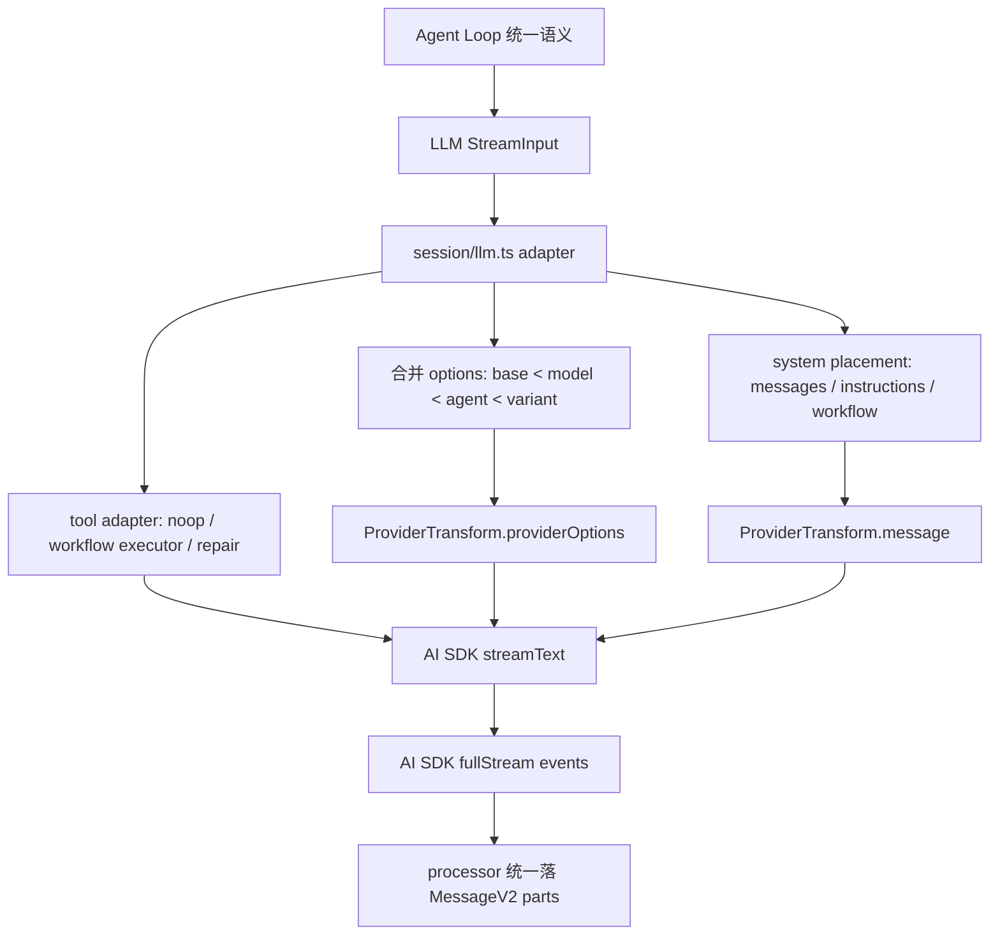

这张图的关键是单向依赖：Agent Loop 依赖 LLM 统一接口，LLM adapter 依赖 ProviderTransform，ProviderTransform 才知道供应商细节。不要让箭头倒过来。

### 从 0 设计建议

不要让每个 provider 实现一个完整 Agent。应该设计三层：

```ts
type AgentRequest = {
  sessionID: string
  system: string[]
  messages: ModelMessage[]
  tools: ToolSet
  model: ModelRef
  toolChoice?: "auto" | "required" | "none"
}

type ProviderAdapter = {
  buildOptions(request: AgentRequest): ProviderOptions
  transformMessages(messages: ModelMessage[], model: ModelRef): ProviderMessage[]
  stream(request: AgentRequest): AsyncIterable<UnifiedStreamEvent>
}

type UnifiedStreamEvent =
  | { type: "text-delta"; text: string }
  | { type: "reasoning"; text: string; metadata?: unknown }
  | { type: "tool-call"; callID: string; name: string; input: unknown }
  | { type: "tool-result"; callID: string; output: unknown }
  | { type: "finish"; reason: string; usage?: TokenUsage }
  | { type: "error"; error: unknown }
```

Agent Loop 只使用 `AgentRequest` 和 `UnifiedStreamEvent`。ProviderAdapter 内部再处理：

```ts
class OpenAIAdapter implements ProviderAdapter {
  buildOptions(req) {
    return {
      openai: {
        store: false,
        reasoningEffort: req.model.reasoning ? "medium" : undefined,
        promptCacheKey: req.sessionID,
      },
    }
  }
}

class AnthropicAdapter implements ProviderAdapter {
  transformMessages(messages, model) {
    return applyCaching(scrubToolIds(removeEmptyMessages(messages)), model)
  }
}
```

这样你以后新增 provider，是加 adapter，不是改 Agent Loop。

### 判断是否设计到位的检查清单

设计自己的 AI 代码助手时，可以用这份清单验收 provider 隔离：

- Agent Loop 是否完全不知道 OpenAI/Anthropic/Gemini 的请求字段。
- provider/model 默认参数是否集中在一个 transform/options 层。
- 参数合并是否有清晰优先级：provider default、model、agent、variant、runtime。
- system prompt 放置是否由 adapter 决定，而不是 Agent Loop 到处拼。
- providerOptions namespace 是否集中映射，而不是调用处手写。
- 消息格式修正是否集中处理，例如空消息、tool id、unsupported media、tool_use 顺序。
- 工具协议兼容是否在 adapter 层，例如 `_noop`、workflow executor、tool repair。
- provider 特有审批是否桥接回统一 Permission 系统。
- 上层 processor 是否只消费统一 stream event，而不是 provider 原生 chunk。
- 日志是否同时打印统一输入和转换后的 provider prompt/options，方便定位问题属于 Agent 还是 adapter。
- 新增 provider 是否只需要加 provider 配置和 transform 分支，而不用改 Agent Loop。

做到这些，才算真正讲清楚“Provider 差异会污染 Agent 逻辑，必须隔离”。否则多模型支持越多，Agent 核心越脆。

## 5. 难点五：工具不是函数，它是带权限、schema、截断、元数据的动作

### 为什么难

普通 function calling 示例通常只写：

```ts
weather(city)
```

但编程智能体的工具有真实副作用：

- 读文件
- 改文件
- 执行 shell
- 联网
- 调 MCP
- 创建子任务
- 加载 skill

每个工具都需要 schema、权限、上下文、取消、输出截断和消息回写。

### opencode 源码落点

工具抽象在 `tool/tool.ts`：

```ts
export type Context = {
  sessionID: SessionID
  messageID: MessageID
  agent: string
  abort: AbortSignal
  callID?: string
  messages: MessageV2.WithParts[]
  metadata(input: { title?: string; metadata?: M }): Effect.Effect<void>
  ask(input: Omit<Permission.Request, "id" | "sessionID" | "tool">): Effect.Effect<void>
}
```

工具包装中做了参数校验和输出截断：

```ts
toolInfo.execute = (args, ctx) => {
  yield* Effect.try({
    try: () => toolInfo.parameters.parse(args),
    catch: (error) => new Error(`The ${id} tool was called with invalid arguments...`),
  })
  const result = yield* execute(args, ctx)
  const truncated = yield* truncate.output(result.output, {}, agent)
  return { ...result, output: truncated.content, metadata: { ...result.metadata, truncated: truncated.truncated } }
}
```

### 讲透

这个设计把工具调用变成了“受控动作”：

- `parameters.parse(args)` 保证模型参数错了能反馈给模型修正。
- `ctx.ask(...)` 让工具自己声明需要什么权限。
- `metadata(...)` 可以把工具执行标题、状态写回 message part。
- `abort` 支持用户取消。
- `truncate.output` 防止工具输出塞爆上下文。

### 设计示例

```ts
const tool: Tool = {
  id: "edit",
  parameters: EditSchema,
  execute(args, ctx) {
    yield* ctx.ask({ permission: "edit", patterns: [args.file], always: [args.file] })
    yield* applyPatch(args)
    return { title: args.file, output: "edited", metadata: {} }
  },
}
```

## 6. 难点六：MCP 接入不是“多几个工具”，而是外部能力边界

### 为什么难

MCP 工具来自外部 server，风险和不确定性更高：

- schema 可能不规范
- server 可能断连
- remote MCP 可能需要 OAuth
- tool name 可能冲突
- 返回内容可能是 text/image/resource
- timeout 和 progress 语义不同

### opencode 源码落点

`mcp/index.ts` 中将 MCP tool 转成 AI SDK dynamicTool：

```ts
function convertMcpTool(mcpTool, client, timeout) {
  const schema = {
    ...(inputSchema as JSONSchema7),
    type: "object",
    properties: inputSchema.properties ?? {},
    additionalProperties: false,
  }

  return dynamicTool({
    description: mcpTool.description ?? "",
    inputSchema: jsonSchema(schema),
    execute: async (args) => client.callTool({ name: mcpTool.name, arguments: args || {} }, CallToolResultSchema, {
      resetTimeoutOnProgress: true,
      timeout,
    }),
  })
}
```

在 `session/prompt.ts` 中执行 MCP 工具前会请求权限：

```ts
yield* ctx.ask({ permission: key, metadata: {}, patterns: ["*"], always: ["*"] })
const result = yield* Effect.promise(() => execute(args, opts))
```

### 讲透

opencode 没有把 MCP 工具当成本地可信函数。它通过两层隔离：

1. MCP 层把外部工具转成统一 `Tool`
2. Prompt 层执行前仍走 `ctx.ask`

这说明 MCP 是能力扩展点，但不是权限绕过点。

### MCP 返回内容处理

`session/prompt.ts` 对 MCP result 做了归一化：

- `text` 拼成输出
- `image` 转成 file attachment
- `resource.text` 拼入输出
- `resource.blob` 转成 attachment
- 输出再走 truncate

这解决了“工具结果如何进入模型上下文”的问题。

## 7. 难点七：Skill 不是插件，它是按需注入的行为说明

### 为什么难

Skill 介于 prompt 和 tool 之间：

- 它不是直接执行的工具
- 它会改变模型行为
- 它可能附带脚本、参考文件
- 它需要权限，否则模型可能随意加载大量外部指令

### opencode 源码落点

`session/system.ts` 暴露可用 skills：

```ts
skills(agent) {
  if (Permission.disabled(["skill"], agent.permission).has("skill")) return
  const list = yield* skill.available(agent)
  return [
    "Skills provide specialized instructions and workflows for specific tasks.",
    "Use the skill tool to load a skill when a task matches its description.",
    Skill.fmt(list, { verbose: true }),
  ].join("\n")
}
```

`tool/skill.ts` 加载 skill 前要权限：

```ts
yield* ctx.ask({
  permission: "skill",
  patterns: [params.name],
  always: [params.name],
  metadata: {},
})
```

### 讲透

Skill 的难点是“行为注入的边界”。如果所有 skill 全部塞入 system prompt，会浪费上下文并污染模型行为；如果完全不提示可用 skill，模型又不知道可以加载。

opencode 的折中是：

- system 里只列可用 skill 摘要
- 需要时模型调用 `skill` 工具加载完整内容
- 加载动作走权限系统

### 设计示例

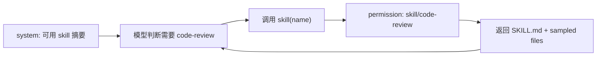

## 8. 难点八：权限系统不能只是 allow/deny，要支持 ask、always 和会话级覆盖

### 为什么难

编程智能体会做副作用操作。权限系统要同时支持：

- 默认允许安全读
- 默认询问危险写
- 用户本次允许一次
- 用户总是允许同类操作
- 用户拒绝后中断相关 pending 请求
- agent 自带权限和 session 权限合并
- 通配符 pattern

### opencode 源码落点

`permission/index.ts` 的 `ask(input)`：

```ts
for (const pattern of request.patterns) {
  const rule = evaluate(request.permission, pattern, ruleset, approved)
  if (rule.action === "deny") return yield* new DeniedError(...)
  if (rule.action === "allow") continue
  needsAsk = true
}

if (!needsAsk) return

const deferred = yield* Deferred.make()
pending.set(id, { info, deferred })
yield* bus.publish(Event.Asked, info)
return yield* Deferred.await(deferred)
```

用户回复在 `reply(input)`：

```ts
if (input.reply === "reject") {
  yield* Deferred.fail(existing.deferred, new RejectedError())
  // 同 session 其他 pending 也拒绝
}

if (input.reply !== "once") {
  approved.push({ permission: existing.info.permission, pattern, action: "allow" })
}
```

### 讲透

这里最关键的是 `Deferred`。权限请求不是同步弹窗，而是一个可等待的异步事件：

- Tool 执行在 `Deferred.await` 暂停
- UI 通过 Bus 收到 `permission.asked`
- 用户点击 approve/reject 后调用 permission reply route
- Deferred 被 succeed/fail
- Tool 继续或失败

### 权限流程图

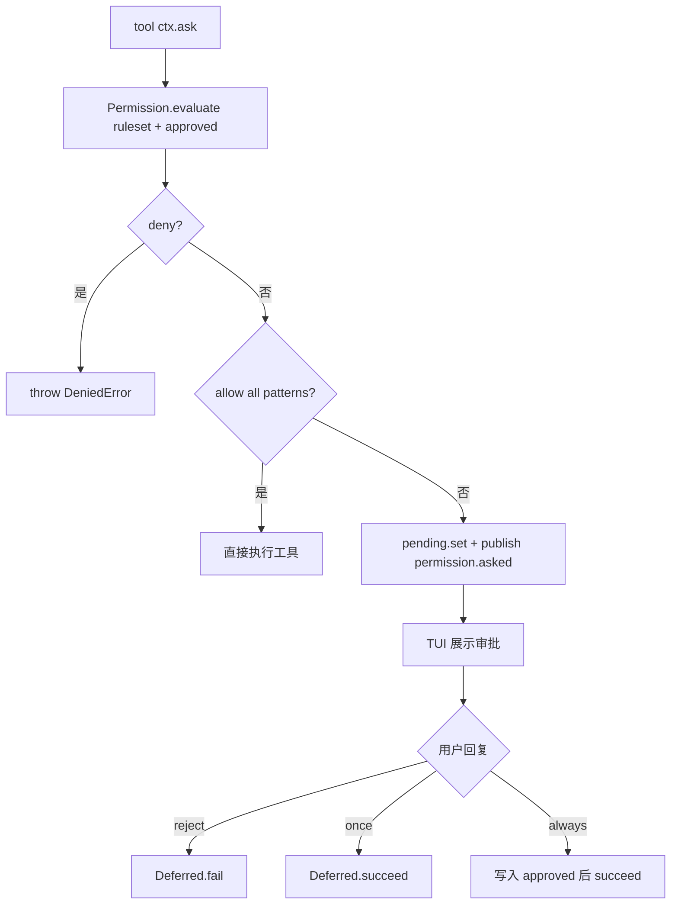

## 9. 难点九：不同 Agent 不是不同名字，而是模型、权限、prompt、步数的组合

### 为什么难

Agent role 如果只是 system prompt，很容易越权。比如 explore agent 理应只读，但如果它仍能 edit，就不是 explore。

### opencode 源码落点

`agent/agent.ts` 中 `Info`：

```ts
export const Info = z.object({
  name: z.string(),
  mode: z.enum(["subagent", "primary", "all"]),
  permission: Permission.Ruleset.zod,
  model: z.object({ modelID, providerID }).optional(),
  prompt: z.string().optional(),
  options: z.record(z.string(), z.any()),
  steps: z.number().int().positive().optional(),
})
```

内置 agent 示例：

```ts
explore: {
  permission: Permission.merge(
    defaults,
    Permission.fromConfig({
      "*": "deny",
      grep: "allow",
      glob: "allow",
      list: "allow",
      bash: "allow",
      webfetch: "allow",
      websearch: "allow",
      codesearch: "allow",
      read: "allow",
    }),
    user,
  ),
  mode: "subagent",
}
```

### 讲透

opencode 的 agent 是能力边界，不只是人格设定。一个 agent 包含：

- `permission`: 它能做什么
- `model`: 它用什么模型
- `prompt`: 它怎么思考/行动
- `steps`: 它最多跑多久
- `mode`: primary 还是 subagent

这就是编程智能体设计里的“角色即策略”。

### 从 0 设计建议

```ts
type AgentRole = {
  prompt: string
  model: ModelRef
  permissions: Ruleset
  allowedTools: string[]
  maxSteps: number
}
```

不要只写：

```ts
const role = "你是代码审查员"
```

## 10. 难点十：子任务不是开新聊天，而是父子 Session 和权限继承

### 为什么难

多 Agent/子任务要解决：

- 子 agent 用什么模型
- 子任务结果怎么回到父会话
- 子任务能不能再创建子任务
- 子任务能不能写 todo
- 用户取消父任务时子任务是否取消
- 如何 resume 旧子任务

### opencode 源码落点

`tool/task.ts`：

```ts
const nextSession =
  session ??
  (yield* sessions.create({
    parentID: ctx.sessionID,
    title: params.description + ` (@${next.name} subagent)`,
    permission: [
      ...(canTodo ? [] : [{ permission: "todowrite", pattern: "*", action: "deny" }]),
      ...(canTask ? [] : [{ permission: id, pattern: "*", action: "deny" }]),
    ],
  }))
```

调用子任务：

```ts
const result = yield* ops.prompt({
  messageID,
  sessionID: nextSession.id,
  model,
  agent: next.name,
  tools: {
    ...(canTodo ? {} : { todowrite: false }),
    ...(canTask ? {} : { task: false }),
  },
  parts,
})
```

### 讲透

TaskTool 没有简单 `spawnAgent(prompt)`。它创建或恢复一个子 session，并显式写入：

- `parentID`
- 子 agent 类型
- 子 session 权限限制
- 子任务结果包装成 `<task_result>`

这让子任务变成可追踪、可恢复、可取消的运行单元。

### 子任务流程图

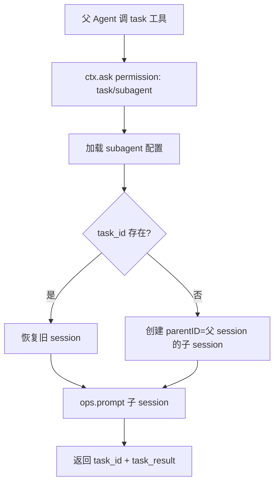

## 11. 难点十一：模型流事件必须落成结构化 Message Part

### 为什么难

模型流里可能出现：

- text-start/text-delta/text-end
- reasoning-start/reasoning-delta/reasoning-end
- tool-input-start/tool-call/tool-result/tool-error
- start-step/finish-step
- error/finish

如果只把最终文本保存下来，调试和恢复都很差。

### opencode 源码落点

`session/processor.ts` 的 `handleEvent(value)`。

文本流：

```ts
case "text-start":
  ctx.currentText = { type: "text", text: "", time: { start: Date.now() } }
  yield* session.updatePart(ctx.currentText)

case "text-delta":
  ctx.currentText.text += value.text
  yield* session.updatePartDelta({ field: "text", delta: value.text })

case "text-end":
  ctx.currentText.time = { start, end }
  yield* session.updatePart(ctx.currentText)
```

工具流：

```ts
case "tool-input-start":
  yield* session.updatePart({ type: "tool", state: { status: "pending", input: {}, raw: "" } })

case "tool-call":
  yield* updateToolCall(value.toolCallId, (match) => ({
    ...match,
    state: { ...match.state, status: "running", input: value.input },
  }))
```

### 讲透

这是一种 event-sourcing 风格。模型流不是直接写成字符串，而是逐步变成 message parts。

好处：

- TUI 可以实时显示
- 工具状态可见
- 中断后可以看到 partial state
- patch/diff 可以挂到 step 上
- reasoning 和 text 可以分开

## 12. 难点十二：工具调用完成和消息状态一致性很难

### 为什么难

一个工具调用有多个状态：

- 模型开始组织工具输入
- 工具参数生成完成
- 工具开始执行
- 工具输出 metadata/title
- 工具完成或失败
- 输出写入消息
- 下一轮模型读取工具结果

任何一步失败都会留下半成品状态。

### opencode 源码落点

`session/processor.ts`：

```ts
const completeToolCall = Effect.fn(function* (toolCallID, output) {
  const match = yield* readToolCall(toolCallID)
  if (!match || match.part.state.status !== "running") return
  yield* session.updatePart({
    ...match.part,
    state: {
      status: "completed",
      input: match.part.state.input,
      output: output.output,
      metadata: output.metadata,
      title: output.title,
      time: { start: match.part.state.time.start, end: Date.now() },
    },
  })
  yield* settleToolCall(toolCallID)
})
```

异常处理：

```ts
const failToolCall = Effect.fn(function* (toolCallID, error) {
  yield* session.updatePart({
    ...match.part,
    state: { status: "error", input, error: errorMessage(error), time: { start, end } },
  })
  yield* settleToolCall(toolCallID)
})
```

### 讲透

这里要避免一个误解：`session/processor.ts` 不是所有工具的直接执行者。真实路径是 `session/llm.ts` 调用 AI SDK `streamText`，AI SDK 根据模型 tool call 触发 `session/prompt.ts` 中注册的 `tool.execute`，工具执行完成后再以 `tool-result` 事件回到 processor。processor 的核心职责是把工具输入、运行中、完成、失败这些状态落成 `MessageV2.ToolPart.state`。

opencode 把工具状态写在 `MessageV2.ToolPart.state` 中，而不是只存在内存里。这让 UI、日志、恢复都能知道工具到底卡在哪。

从 0 设计时，工具状态至少要有：

```ts
type ToolState =
  | { status: "pending"; raw: string }
  | { status: "running"; input: unknown; startedAt: number }
  | { status: "completed"; input: unknown; output: string; endedAt: number }
  | { status: "error"; input: unknown; error: string; endedAt: number }
```

## 13. 难点十三：避免死循环不能靠提示词，要靠运行时检测

### 为什么难

模型可能重复：

- 调同一个工具
- 用同样参数
- 得到同样错误
- 再次尝试同样工具

提示词说“不要循环”不可靠，必须有运行时防护。

### opencode 源码落点

`session/processor.ts`：

```ts
const DOOM_LOOP_THRESHOLD = 3
const recentParts = parts.slice(-DOOM_LOOP_THRESHOLD)

if (
  recentParts.length === DOOM_LOOP_THRESHOLD &&
  recentParts.every(
    (part) =>
      part.type === "tool" &&
      part.tool === value.toolName &&
      part.state.status !== "pending" &&
      JSON.stringify(part.state.input) === JSON.stringify(value.input),
  )
) {
  const agent = yield* agents.get(ctx.assistantMessage.agent)
  yield* permission.ask({
    permission: "doom_loop",
    patterns: [value.toolName],
    sessionID: ctx.assistantMessage.sessionID,
    metadata: { tool: value.toolName, input: value.input },
    always: [value.toolName],
    ruleset: agent.permission,
  })
}
```

### 讲透

opencode 的做法不是直接 kill，而是转成权限事件 `doom_loop`。这很巧妙：

- 默认 agent 配置里 `doom_loop: ask`
- 用户可以决定继续还是停
- 这个事件进入同一套权限和 UI 机制

### 从 0 设计

```ts
if (sameToolSameInputRepeated(3)) {
  await permission.ask({ permission: "doom_loop", patterns: [toolName] })
}
```

死循环防护应该在 processor 层，因为这里能看到真实工具 part 历史。

## 14. 难点十四：上下文溢出要自动压缩，而不是直接失败

### 为什么难

编程任务很容易超上下文：

- 大文件
- 长日志
- 多轮工具结果
- 多 agent 子任务
- MCP 返回资源

如果直接报错，长任务无法完成。

### opencode 源码落点

`session/overflow.ts`：

```ts
export function usable(input) {
  const reserved =
    input.cfg.compaction?.reserved ?? Math.min(COMPACTION_BUFFER, ProviderTransform.maxOutputTokens(input.model))
  return input.model.limit.input
    ? Math.max(0, input.model.limit.input - reserved)
    : Math.max(0, context - ProviderTransform.maxOutputTokens(input.model))
}

export function isOverflow(input) {
  if (input.cfg.compaction?.auto === false) return false
  const count = input.tokens.total || input.tokens.input + input.tokens.output + input.tokens.cache.read + input.tokens.cache.write
  return count >= usable(input)
}
```

在 `session/prompt.ts` loop 中：

```ts
if (lastFinished && lastFinished.summary !== true && (yield* compaction.isOverflow({ tokens: lastFinished.tokens, model }))) {
  yield* compaction.create({ sessionID, agent: lastUser.agent, model: lastUser.model, auto: true })
  continue
}
```

### 讲透

opencode 不是等 provider 报 context overflow 才处理。它根据上一轮 token usage 预测是否要 compaction。

这体现了一个重要思想：上下文管理是 agent runtime 的职责，不是 provider 错误处理的附属品。

### 压缩流程

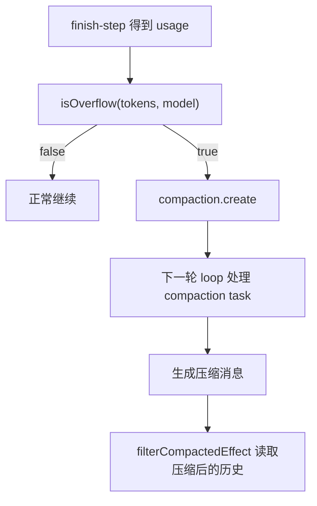

## 15. 难点十五：文件修改必须可追踪、可 diff、可恢复

### 为什么难

编程智能体会改工作区。用户最怕：

- 不知道改了什么
- 改坏了不能回退
- 工具中途失败导致半改状态
- UI 只显示“完成”，但没有 diff

### opencode 源码落点

`session/processor.ts` 在 step 开始和结束跟踪 snapshot：

```ts
case "start-step":
  if (!ctx.snapshot) ctx.snapshot = yield* snapshot.track()
  yield* session.updatePart({ type: "step-start", snapshot: ctx.snapshot })

case "finish-step":
  yield* session.updatePart({ type: "step-finish", snapshot: yield* snapshot.track(), tokens, cost })
  if (ctx.snapshot) {
    const patch = yield* snapshot.patch(ctx.snapshot)
    if (patch.files.length) {
      yield* session.updatePart({ type: "patch", hash: patch.hash, files: patch.files })
    }
  }
```

### 讲透

这不是普通日志，而是把文件变化作为 message part 挂到 assistant step 上。这样 UI 可以展示“这一轮模型造成了哪些文件变化”。

从 0 设计时，应至少实现：

```ts
const before = await snapshot.track()
await runTools()
const after = await snapshot.track()
const patch = await snapshot.diff(before, after)
await session.addPart({ type: "patch", patch })
```

## 16. 难点十六：工具输出要截断，但不能丢失可追踪性

### 为什么难

`npm test`、`rg`、编译日志、MCP resource 都可能非常长。全部塞回模型会导致：

- 上下文爆炸
- 成本高
- 重要信息被稀释

但简单截断又会导致 debug 信息丢失。

### opencode 源码落点

`tool/tool.ts` 中统一截断：

```ts
const truncated = yield* truncate.output(result.output, {}, agent)
return {
  ...result,
  output: truncated.content,
  metadata: {
    ...result.metadata,
    truncated: truncated.truncated,
    ...(truncated.truncated && { outputPath: truncated.outputPath }),
  },
}
```

MCP 工具也在 `session/prompt.ts` 中走 truncate：

```ts
const truncated = yield* truncate.output(textParts.join("\n\n"), {}, input.agent)
const metadata = {
  ...result.metadata,
  truncated: truncated.truncated,
  ...(truncated.truncated && { outputPath: truncated.outputPath }),
}
```

### 讲透

关键不是“截断”，而是 metadata 中保留 `outputPath`。这让模型看到摘要，人类或后续工具仍能找到完整输出。

## 17. 难点十七：TUI/客户端不能直接操控业务对象，必须事件驱动

### 为什么难

如果 UI 直接读写 agent 内部状态，会导致：

- 状态同步困难
- headless 模式难做
- 多客户端难支持
- 中途事件丢失难 debug

### opencode 源码落点

`bus/index.ts`：

```ts
function publish(def, properties) {
  const payload = { type: def.type, properties }
  if (ps) yield* PubSub.publish(ps, payload)
  yield* PubSub.publish(s.wildcard, payload)
  GlobalBus.emit("event", { directory, project, workspace, payload })
}
```

SSE route 在 `server/routes/instance/event.ts`：

```ts
const unsub = Bus.subscribeAll((event) => {
  q.push(JSON.stringify(event))
  if (event.type === Bus.InstanceDisposed.type) stop()
})
```

### 讲透

opencode 的 UI 消费的是事件，不是业务对象引用。Session/Permission/Processor 发生变化后 publish，TUI 通过 SSE 订阅。

这带来一个重要能力：同一套 runtime 可以支持 CLI、TUI、HTTP API、外部控制面。

## 18. 难点十八：错误恢复要区分 retry、halt、compact、stop

### 为什么难

模型调用失败不一定都该停止：

- 网络失败可以 retry
- context overflow 应该 compact
- 权限拒绝可能 stop，也可能继续
- 用户 abort 应该清理状态
- 工具错误应写入 tool part

### opencode 源码落点

`session/processor.ts`：

```ts
Effect.retry(SessionRetry.policy(...))
Effect.catch(halt)
Effect.ensuring(cleanup())

if (ctx.needsCompaction) return "compact"
if (ctx.blocked || ctx.assistantMessage.error) return "stop"
return "continue"
```

`halt(e)`：

```ts
if (MessageV2.ContextOverflowError.isInstance(error)) {
  ctx.needsCompaction = true
  yield* bus.publish(Session.Event.Error, { sessionID: ctx.sessionID, error })
  return
}
ctx.assistantMessage.error = error
yield* bus.publish(Session.Event.Error, { sessionID, error })
```

### 讲透

这说明 agent processor 的返回值不是“成功/失败”，而是控制 loop 的信号：

- `continue`: 继续下一轮
- `compact`: 创建/处理压缩任务
- `stop`: 结束

从 0 设计时，建议错误处理也返回控制信号，而不是到处 throw。

## 19. 难点十九：模型参数来自 provider、model、agent、variant 多层合并

### 为什么难

同一模型在不同 agent 下可能需要不同参数：

- planner 低温、少工具
- executor 允许工具、低 verbosity
- title/summary 用 hidden agent
- 某个 provider 需要特殊 options
- 用户配置覆盖默认值

### opencode 源码落点

`session/llm.ts`：

```ts
const options = pipe(
  base,
  mergeDeep(input.model.options),
  mergeDeep(input.agent.options),
  mergeDeep(variant),
)
```

采样参数也通过 plugin hook：

```ts
const params = yield* plugin.trigger("chat.params", context, {
  temperature,
  topP,
  topK,
  maxOutputTokens,
  options,
})
```

### 讲透

参数合并顺序就是系统治理规则。谁覆盖谁，决定最终模型行为。

建议明确写成：

```text
provider defaults < model options < agent options < variant options < runtime override
```

## 20. 难点二十：编程智能体需要“观察文件变化”，不是只观察模型输出

### 为什么难

模型可能说“我修改了文件”，但实际没改；也可能工具改了文件但模型没提。可靠系统不能只信文本。

### opencode 源码落点

`SessionSummary.summarize` 会基于 snapshot diff 写 session summary：

```ts
const diffs = yield* computeDiff({ messages: all })
yield* sessions.setSummary({
  summary: {
    additions: diffs.reduce((sum, x) => sum + x.additions, 0),
    deletions: diffs.reduce((sum, x) => sum + x.deletions, 0),
    files: diffs.length,
  },
})
yield* bus.publish(Session.Event.Diff, { sessionID, diff: diffs })
```

### 讲透

这让“完成了什么”有事实依据。最终答复可以基于 diff，而不是模型自述。

## 21. 难点二十一：权限默认值体现产品哲学

### 为什么难

默认权限太宽，危险；太窄，难用。不同 agent 应该不同。

### opencode 源码落点

`agent/agent.ts` 默认权限：

```ts
const defaults = Permission.fromConfig({
  "*": "allow",
  doom_loop: "ask",
  external_directory: { "*": "ask", ...whitelistedDirs },
  question: "deny",
  plan_enter: "deny",
  plan_exit: "deny",
  read: {
    "*": "allow",
    "*.env": "ask",
    "*.env.*": "ask",
    "*.env.example": "allow",
  },
})
```

plan agent 禁止大多数 edit：

```ts
plan: {
  permission: Permission.merge(defaults, Permission.fromConfig({
    edit: {
      "*": "deny",
      ".opencode/plans/*.md": "allow",
    },
  })),
}
```

### 讲透

这说明权限不是安全模块单独决定的，而是 agent role 的一部分。Plan 模式不是靠提示词“请不要编辑”，而是权限上禁止编辑。

## 22. 难点二十二：Shell 工具安全不是一个正则能解决的

### 为什么难

Shell 命令有复杂语法：

- `rm file`
- `find . -delete`
- `git clean -fd`
- `$(...)`
- 重定向
- PowerShell alias
- 环境变量展开
- 相对路径/绝对路径

### opencode 源码落点

`tool/bash.ts` 使用 tree-sitter 解析命令，并维护文件相关命令集合：

```ts
const FILES = new Set(["rm", "cp", "mv", "mkdir", "touch", "chmod", "chown", "cat", ...])

function commands(node: Node) {
  return node.descendantsOfType("command").filter((child): child is Node => Boolean(child))
}

function expand(text: string, cwd: string, shell: string) {
  return unquote(text)
    .replace(/\$(HOME|PWD|PSHOME)/gi, ...)
}
```

### 讲透

这说明 shell 权限不能只看字符串包含 `rm`。你至少需要：

- 解析命令 AST
- 识别文件操作命令
- 展开 HOME/PWD
- 判断 external_directory
- 处理 dynamic expression
- 给用户展示 command description

## 23. 难点二十三：模型生成 tool 参数会错，系统要能修

### 为什么难

模型可能：

- tool name 大小写错
- 参数 schema 不满足
- 参数放错字段
- 调用不存在工具

### opencode 源码落点

`session/llm.ts`：

```ts
async experimental_repairToolCall(failed) {
  const lower = failed.toolCall.toolName.toLowerCase()
  if (lower !== failed.toolCall.toolName && tools[lower]) {
    return { ...failed.toolCall, toolName: lower }
  }
  return {
    ...failed.toolCall,
    input: JSON.stringify({ tool: failed.toolCall.toolName, error: failed.error.message }),
    toolName: "invalid",
  }
}
```

`tool/tool.ts` 参数校验失败时给模型可读错误：

```ts
`The ${id} tool was called with invalid arguments... Please rewrite the input...`
```

### 讲透

工具参数错误不应该直接 crash。它是模型-工具协议的一部分，应反馈给模型修正。

## 24. 难点二十四：Reasoning/思维链要结构化处理，而不是简单打印

### 为什么难

现代模型可能返回 reasoning events。编程智能体要处理它们，但不能把内部推理和最终答案混在一起。

### opencode 源码落点

`session/processor.ts`：

```ts
case "reasoning-start":
  ctx.reasoningMap[value.id] = { type: "reasoning", text: "", time: { start: Date.now() } }
  yield* session.updatePart(ctx.reasoningMap[value.id])

case "reasoning-delta":
  ctx.reasoningMap[value.id].text += value.text
  yield* session.updatePartDelta({ field: "text", delta: value.text })

case "reasoning-end":
  ctx.reasoningMap[value.id].time = { ...ctx.reasoningMap[value.id].time, end: Date.now() }
  yield* session.updatePart(ctx.reasoningMap[value.id])
```

### 讲透

opencode 把 reasoning 作为独立 part。这样 UI 可以选择展示/隐藏，日志可以追踪，最终 answer 不会被 reasoning 污染。

从 0 设计时，建议使用“结构化工作记录”和 evidence，而不是依赖模型输出完整隐藏思维链。

## 25. 难点二十五：可观测性必须覆盖 prompt、context、provider、tool、permission

### 为什么难

用户说“日志看不懂”时，通常是因为日志只显示启动或 HTTP 错误，没有串起完整链路。

### opencode 当前增强点

当前分支已经加入了 `FlowLog`，在这些点打中文日志：

- `src/index.ts`: 进程启动
- `cli/cmd/tui/worker.ts`: worker 启动
- `session/prompt.ts`: 收到 prompt、解析模型、生成 LLM 输入、处理器返回
- `session/llm.ts`: 参数组装、最终消息、streamText、provider transform、文本增量
- `provider/provider.ts`: HTTP 请求/响应
- `session/processor.ts`: tool、text、finish、halt

### 讲透

对编程智能体来说，日志必须能回答：

```text
用户输入是什么？
进入哪个 session？
选了哪个 agent/model？
system 和 model messages 是什么？
给 provider 的真实 HTTP body 是什么？
模型返回了哪些流事件？
工具参数是什么？
权限是否询问？
工具输出是什么？
最终 message parts 怎么落库？
```

如果这些串不起来，就无法 debug “为什么 agent 这样做”。

## 26. 难点二十六：Plugin Hook 让系统可扩展，但也增加边界复杂度

### 为什么难

插件可以改变：

- chat params
- headers
- messages
- tool execute before/after
- text complete

这很强，但也意味着行为来源更多。

### opencode 源码落点

`session/llm.ts`：

```ts
const params = yield* plugin.trigger("chat.params", context, defaults)
const { headers } = yield* plugin.trigger("chat.headers", context, { headers: {} })
```

`session/prompt.ts`：

```ts
yield* plugin.trigger("experimental.chat.messages.transform", {}, { messages: msgs })
yield* plugin.trigger("tool.execute.before", context, { args })
yield* plugin.trigger("tool.execute.after", context, output)
```

### 讲透

插件系统让 agent runtime 可扩展，但必须配合 trace。否则你不知道一个参数到底是 config、agent 还是 plugin 改的。

## 27. 难点二十七：状态持久化要支持中断和重放

### 为什么难

编程任务可能持续很久，中途会：

- TUI 关闭
- 网络失败
- 工具被 abort
- 用户切换会话
- 子任务未完成

如果状态只在内存里，恢复不了。

### opencode 源码落点

虽然本文不展开 SQL 表，但从调用可以看到：

- `sessions.updateMessage(msg)`
- `sessions.updatePart(part)`
- `sessions.updatePartDelta(...)`
- `sessions.setPermission(...)`
- `sessions.setSummary(...)`

这些都说明 message、part、permission、summary 是持久化事实。

### 讲透

编程智能体的 session store 不只是聊天记录，它是执行日志、UI 状态、恢复点和审计记录。

## 28. 难点二十八：用户体验上要平衡“自动执行”和“请求确认”

### 为什么难

问太多，用户烦；不问，危险。

opencode 的设计不是让模型问“我可以吗？”，而是：

- 模型照常请求工具
- 工具调用 `ctx.ask`
- Permission 系统根据规则自动 allow/deny/ask
- UI 展示确认

这比让模型在自然语言里问权限可靠。

### 源码证据

`session/prompt/gpt.txt` 中也强调不要问“Should I proceed?”，而权限由工具确认对话承担。`tool` 执行上下文中的 `ask` 是真正的权限入口。

## 29. 难点二十九：编程智能体必须尊重项目和用户已有改动

### 为什么难

真实工作区可能是 dirty 的。智能体不能随便 reset、checkout、覆盖文件。

### opencode 源码相关设计

opencode 通过几层降低风险：

- prompt 规则要求不要覆盖用户改动
- bash 工具对文件操作做权限检查
- snapshot 记录每一步 patch
- permission 对危险操作 ask/deny
- edit 类工具统一映射为 `edit` 权限

### 讲透

单靠提示词不够。真正可靠的设计要把“保护用户改动”落到：

- Git status 检查
- Patch 粒度编辑
- 文件快照
- 权限系统
- 最终 diff 展示

## 30. 难点三十：最终回答必须基于验证证据，而不是模型自信

### 为什么难

模型容易说“已完成”，但可能：

- 没跑测试
- 测试失败没读输出
- 只改了部分文件
- 引入类型错误

### opencode 的支撑能力

opencode 本身提供：

- shell 工具运行测试
- snapshot diff 记录改动
- session summary 统计文件增删
- flow log 追踪工具和模型事件
- agent prompt 约束 final answer 报告验证

### 从 0 设计建议

最终答复生成前应该收集：

```ts
const evidence = {
  changedFiles: await snapshot.diff(),
  tests: await testRuns.latest(),
  errors: await session.errors(),
  toolCalls: await session.toolSummary(),
}
```

然后再让模型基于 evidence 写最终总结。

## 31. Review 补充一：Effect Layer 和 InstanceState 是隐藏的架构难点

### 为什么需要补

前文讲了 Session、Tool、Permission，但还没讲 opencode 很重要的一层：Effect 的 `Context.Service`、`Layer` 和 `InstanceState`。如果从 0 开发代码助手，很容易把所有服务做成全局 singleton，最后多 workspace、多 session、测试隔离都会很痛苦。

### opencode 源码落点

大量模块都使用这种形式：

```ts
export class Service extends Context.Service<Service, Interface>()("@opencode/SessionProcessor") {}

export const layer = Layer.effect(
  Service,
  Effect.gen(function* () {
    const session = yield* Session.Service
    const snapshot = yield* Snapshot.Service
    const permission = yield* Permission.Service
    return Service.of({ create })
  }),
)
```

有状态服务常用 `InstanceState.make`：

```ts
const state = yield* InstanceState.make<State>(
  Effect.fn("Bus.state")(function* (ctx) {
    const wildcard = yield* PubSub.unbounded()
    return { wildcard, typed: new Map() }
  }),
)
```

### 讲透

这解决的是“同一进程内多个项目/工作区怎么隔离”的问题。一个 CLI 代码助手不一定只服务一个目录：TUI、server、子任务、workspace 都可能并存。

如果用全局变量：

```ts
const sessions = new Map()
const permissions = new Map()
```

很快会遇到：

- A 项目的事件发给 B 项目 UI
- 测试之间状态污染
- 子任务取消影响父任务外的 session
- 插件或 MCP client 生命周期无法清理

Effect Layer 的价值不是“函数式很酷”，而是让依赖和生命周期显式。

### 从 0 设计建议

即使不用 Effect，也要保留同等概念：

```ts
type RuntimeContext = {
  workspaceId: string
  services: {
    session: SessionService
    permission: PermissionService
    bus: EventBus
    tools: ToolRegistry
  }
  dispose(): Promise<void>
}
```

## 32. Review 补充二：Workspace / Instance 边界要比 cwd 更严格

### 为什么需要补

示例文档里说 `cwd` 要显式传入，这是对的，但源码里的边界比 `cwd` 更细：opencode 区分 `Instance.directory`、`Instance.worktree`、`Instance.project`、`Global.Path.*`。

### opencode 源码落点

`session/system.ts` 把这些信息注入模型：

```ts
`  Working directory: ${Instance.directory}`,
`  Workspace root folder: ${Instance.worktree}`,
`  Is directory a git repo: ${project.vcs === "git" ? "yes" : "no"}`,
```

`session/llm.ts` 对 opencode provider 带上项目和会话 header：

```ts
"x-opencode-project": Instance.project.id,
"x-opencode-session": input.sessionID,
"x-opencode-request": input.user.id,
```

`snapshot/index.ts` 的 snapshot gitdir 也按 project/worktree 隔离：

```ts
gitdir: path.join(Global.Path.data, "snapshot", ctx.project.id, Hash.fast(ctx.worktree))
```

### 讲透

`cwd` 是命令执行位置，`worktree` 是版本控制边界，`project.id` 是持久化和事件归属边界，`Global.Path.data` 是 opencode 自己的数据目录。把这些混为一谈会导致严重问题：

- 在子目录运行时把仓库根判断错
- snapshot 污染另一个项目
- 事件流无法区分 workspace
- 权限 pattern 错把外部目录当内部目录

### 从 0 设计建议

```ts
type WorkspaceContext = {
  directory: string
  worktree: string
  projectId: string
  dataDir: string
  logDir: string
}
```

所有工具都应该拿 `WorkspaceContext`，不要只拿 `cwd`。

## 33. Review 补充三：Prompt Injection 不只来自用户，也来自工具结果和仓库文件

### 为什么需要补

前文讲了权限和工具，但还没充分讲 prompt injection。代码助手的 prompt injection 来源比聊天机器人多：

- 用户 prompt
- README / AGENTS.md / 项目文档
- 代码注释
- 测试输出
- MCP resource
- 网页内容
- tool result 中夹带的“忽略之前指令”

### opencode 源码落点

opencode 的模型提示词里已经承认这个问题。例如多种 prompt 文件都提醒：

```text
Tool results and user messages may include <system-reminder> tags...
```

`session/prompt.ts` 也会在多轮继续时插入系统提醒：

```ts
p.text = [
  "<system-reminder>",
  "The user sent the following message:",
  p.text,
  "Please address this message and continue with your tasks.",
  "</system-reminder>",
].join("\n")
```

### 讲透

这类防护仍然主要是提示词层面的，不是完备安全边界。真正可靠的设计必须组合：

- 权限系统阻止高危工具被 prompt injection 直接触发
- Tool result 标记来源，不把外部内容当 system
- 文件内容进入上下文时保持引用边界
- 高危操作基于策略判断，而不是基于模型“我觉得安全”

### 从 0 设计建议

```ts
type ContextBlock = {
  source: "user" | "system" | "tool" | "file" | "mcp"
  trusted: boolean
  content: string
}
```

渲染上下文时保留来源：

```text
<file path="README.md" trusted="false">
...
</file>
```

不要把外部文件内容直接拼进 system prompt。

## 34. Review 补充四：并发和竞态是编程智能体的隐性复杂度

### 为什么需要补

文档已经讲了子任务和流事件，但并发竞态还不够。opencode 里有大量并发：

- tool calls 可能并行
- summary/title 后台 fork
- Bus 多订阅者
- snapshot 读写
- MCP tools 并发加载
- 文件 watcher

### opencode 源码落点

后台任务：

```ts
yield* title(...).pipe(Effect.ignore, Effect.forkIn(scope))
yield* summary.summarize(...).pipe(Effect.ignore, Effect.forkIn(scope))
```

processor cleanup 等待 tool call settle：

```ts
yield* Effect.forEach(
  Object.values(ctx.toolcalls),
  (call) => Deferred.await(call.done).pipe(Effect.timeout("250 millis"), Effect.ignore),
  { concurrency: "unbounded" },
)
```

MCP tools 收集：

```ts
Effect.forEach(connectedClients, ..., { concurrency: "unbounded" })
```

### 讲透

并发不是性能优化这么简单，它会影响一致性：

- 工具 A 和工具 B 同时改同一文件怎么办？
- summary 在消息还没稳定时读取怎么办？
- 用户取消时，正在运行的工具是否都能收到 abort？
- snapshot 记录的是哪个时间点？

opencode 用 Scope、Deferred、cleanup、snapshot step 来降低风险，但这仍然是编程智能体最容易出 bug 的地方。

### 从 0 设计建议

写工具时给每个工具声明资源锁：

```ts
type ToolPlan = {
  tool: string
  reads: string[]
  writes: string[]
}
```

调度时禁止并发写同一资源：

```ts
if (intersects(a.writes, b.writes) || intersects(a.writes, b.reads)) runSequentially()
```

## 35. Review 补充五：示例文档需要标明“教学简化”和“生产缺口”

### 为什么需要补

`docs/opencode-agent设计示例.md` 中很多代码是教学骨架，不是生产实现。例如：

- 最小 provider 没解析 SSE 流，只演示 Provider 接口边界。
- `read_file` 的路径检查如果只用 `startsWith(ctx.cwd)`，会把 `/repo2` 误判成 `/repo` 内部路径。
- shell 示例没有 AST 解析和权限细分，不能直接照搬到生产。
- Tool loop 示例没有处理工具并发、finish reason、compaction、abort 和 partial state。

### 应补充到示例文档的原则

示例文档开头应该明确：

```text
本文代码用于说明结构，不是安全完整实现。生产实现必须补：路径 canonicalization、权限审批、命令 AST 分析、流式协议解析、输出截断、取消、日志和测试。
```

### 对源码文档的影响

源码解析文档要承担“为什么教学示例不能直接生产化”的解释：opencode 多出来的复杂度不是过度设计，而是填这些生产缺口。

## 36. Review 补充六：opencode 仍有可继续增强的点

### 为什么需要补

只讲优点会让文档像宣传稿。更有价值的是指出它仍有哪些工程风险。

### 可增强点

| 方向 | 当前状态 | 可增强设计 |
| --- | --- | --- |
| 工具并发资源锁 | 有状态记录，但没有通用 read/write set 调度 | 工具声明读写资源，runtime 自动串并行 |
| Prompt injection | 主要靠 prompt、权限和边界标记 | 引入 untrusted context 类型和策略检查 |
| 最终验收 | 依赖 agent prompt 和用户/模型执行测试 | 引入 verifier role 和结构化验收结果 |
| 权限解释 | 有 permission ask 事件 | UI 展示更细的风险解释和 diff 预览 |
| Provider 回放 | 有 FlowLog/Trace | 增加可脱敏 replay bundle |
| 长任务恢复 | Session/Part 已持久化 | 对 running tool/subtask 增加恢复策略 |
| 子任务合并 | 有 parent session 和 task_result | 增加冲突检测和结果引用索引 |

### 讲透

这些不是小功能，而是代码助手从个人工具走向团队/生产环境时必须补齐的能力。

## 37. Review 补充七：最终回答阶段也应该是一个显式模块

### 为什么需要补

前文讲“最终回答必须基于验证证据”，但 opencode 当前更多靠 prompt 规则和运行时能力支撑，没有把 final answer 做成一个独立强约束模块。

### 建议设计

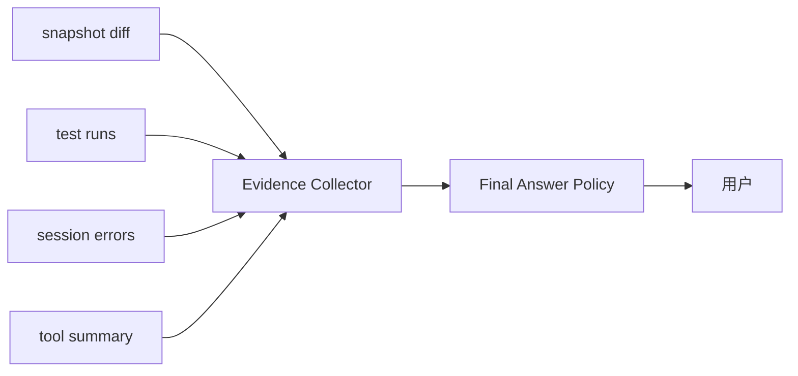

结构化证据：

```ts
type CompletionEvidence = {
  changedFiles: string[]
  testsRun: Array<{ command: string; passed: boolean; excerpt: string }>
  knownErrors: string[]
  skippedChecks: string[]
}
```

这样 final answer 就不是模型自由发挥，而是 Evidence Collector 的投影。

## 38. 一张总表：难点、opencode 模块、可借鉴设计

| 难点 | opencode 模块 | 可借鉴设计 |
| --- | --- | --- |
| prompt 进入运行时 | `session/prompt.ts` | 先落 session，再进入 loop |
| 停止条件 | `runLoop` | 不只看 finish reason，还看 tool parts |
| 上下文构建 | `session/system.ts`, `MessageV2` | env/skills/instructions/messages 分层 |
| provider 差异 | `session/llm.ts`, `ProviderTransform` | 差异集中在 adapter 层 |
| 工具抽象 | `tool/tool.ts` | schema、ctx、metadata、truncate |
| MCP | `mcp/index.ts` | 外部工具统一转换，执行前仍走权限 |
| Skill | `tool/skill.ts` | 摘要提示 + 按需加载 + 权限 |
| 权限 | `permission/index.ts` | allow/ask/deny + Deferred + Bus |
| Agent role | `agent/agent.ts` | prompt/model/permission/steps 组合 |
| 子任务 | `tool/task.ts` | parent session + 子权限 + 可 resume |
| 流事件 | `session/processor.ts` | event -> message part |
| 工具状态 | `processor.completeToolCall` | pending/running/completed/error |
| 死循环 | `doom_loop` | runtime 检测 + 权限询问 |
| 上下文溢出 | `session/overflow.ts`, `compaction` | 根据 usage 主动压缩 |
| 文件变化 | `snapshot`, `summary` | step snapshot + patch part |
| 输出截断 | `tool/truncate` | 截断内容 + outputPath |
| UI 解耦 | `bus/index.ts`, SSE | 事件驱动 |
| 错误恢复 | `processor.process` | retry/halt/compact/stop |
| 参数治理 | `agent options`, `variant` | 多层 merge |
| 可观测性 | `Trace`, `FlowLog` | 串起完整链路 |
| 依赖生命周期 | `Context.Service`, `Layer`, `InstanceState` | 服务依赖和 workspace 状态显式化 |
| Workspace 边界 | `Instance`, `Global.Path`, `snapshot` | 区分 cwd/worktree/project/data |
| Prompt injection | prompt files, permission, context tags | 外部内容标记来源，权限兜底 |
| 并发竞态 | `Effect.forkIn`, `Deferred`, `Scope` | 后台任务和工具状态要可清理 |
| 最终验收 | prompt + snapshot + shell | 建议演进为 Evidence Collector |

## 39. 如果你自己开发 AI 代码助手，最小闭环应该怎么做

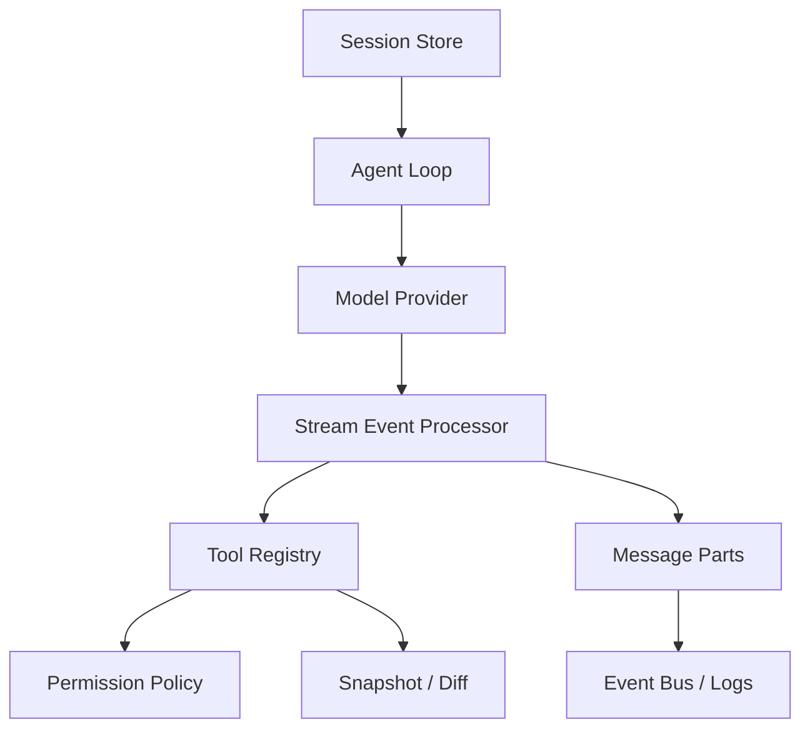

最小必做：

1. `SessionStore`: 保存 user/assistant/tool parts。
2. `ModelProvider`: 屏蔽 provider 差异。
3. `AgentLoop`: 处理 continue/stop/tool/compact。
4. `ToolRegistry`: 统一本地工具和 MCP 工具。
5. `PermissionPolicy`: 工具执行前统一检查。
6. `EventProcessor`: 把模型流事件落成结构化 part。
7. `Snapshot`: 文件变更可 diff。
8. `TraceLog`: 能还原完整链路。

不要一开始就做：

- 复杂多 agent 调度
- 花哨 UI
- 长期记忆
- 自动重构大工程

先把“单轮 prompt -> 工具 -> 文件修改 -> 测试 -> diff -> final”跑稳。

## 40. 最值得学习的 opencode 设计

### 40.1 把一切副作用动作工具化

无论是 bash、edit、MCP、skill、task，都通过工具、权限和消息 part 进入运行时。processor 负责记录和推进状态，工具执行本身由 AI SDK 调用注册好的 `execute` 完成。

### 40.2 把模型输出事件化

不是等模型完成后才处理，而是流式事件实时转成 message part。这让 UI、取消、工具状态都可实现。

### 40.3 把权限做成运行时协议

权限不是 prompt 约束，而是 Deferred + Bus + UI 的协议。

### 40.4 把 Agent 做成策略集合

Agent = prompt + model + permissions + options + steps，而不是一个名字。

### 40.5 把调试链路打穿

`Trace` 和 `FlowLog` 的价值在于让你能从“用户输入”一直追到“provider HTTP body”和“工具结果”。

## 41. 最容易踩的坑

| 坑 | 后果 | 对应解法 |
| --- | --- | --- |
| 直接 model.chat(prompt) | 无法恢复、无法追踪 | Session + MessageV2 |
| 靠提示词控制权限 | 模型可能越权 | Tool ctx.ask + Permission |
| 只保存最终文本 | 工具/推理/错误不可见 | Message Part |
| 只看 finish reason | 漏执行 tool call | 检查 tool parts |
| 工具输出全塞上下文 | 上下文爆炸 | truncate + outputPath |
| 没有 step budget | 死循环 | agent.steps + doom_loop |
| UI 直接读内部状态 | 难复用难调试 | Bus + SSE |
| provider 差异散落 | 难维护 | ProviderTransform |
| 子任务只开新 prompt | 难恢复难权限控制 | parent session |
| 没有 snapshot | 用户不信任改动 | patch part + diff |
| 把 cwd 当唯一边界 | 路径逃逸、项目状态污染 | directory/worktree/project 分离 |
| 忽略 prompt injection | 工具结果或文件内容劫持模型 | untrusted context + permission |
| 工具并发无资源锁 | 同时写文件导致冲突 | read/write set 调度 |

## 42. 结论

设计编程智能体的难点不是“会不会调模型”，而是能否构建一个可靠的运行时：

- 用户意图要进入可持久化状态
- 模型输出要变成结构化事件
- 工具调用要受权限和 schema 约束
- 文件变化要可追踪
- 上下文要能压缩
- provider 差异要隔离
- 死循环要运行时检测
- UI 要事件驱动
- 日志要能还原全链路

opencode 的源码价值就在这里：它展示了一个编程智能体从“聊天机器人”进化成“代码运行时”的关键结构。
