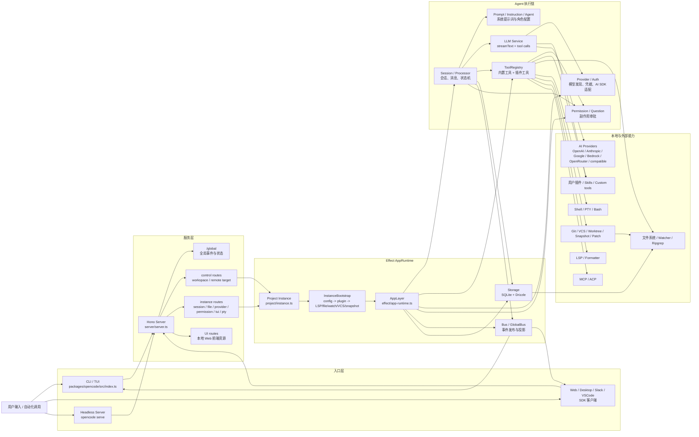

本文说明 opencode 仓库中的主要包、运行时边界和核心调用链路。

## Monorepo 总览

```mermaid
flowchart TB
  User["用户 / 开发者"]

  subgraph Clients[客户端入口]
    CLI["opencode CLI / TUI<br/>packages/opencode/src/index.ts"]
    WebApp["Solid Web 应用<br/>packages/app"]
    Desktop["Tauri 桌面应用<br/>packages/desktop"]
    Electron["Electron 桌面应用<br/>packages/desktop-electron"]
    Slack["Slack 机器人<br/>packages/slack"]
    VSCode["VSCode SDK / 扩展<br/>sdks/vscode"]
  end

  subgraph Core[核心运行时 packages/opencode]
    Server["Hono HTTP/WebSocket 服务<br/>src/server"]
    Routes["API 路由<br/>instance / control / global / ui"]
    Project["项目 / 实例<br/>src/project"]
    Session["会话引擎<br/>src/session"]
    LLM["LLM 流式调用<br/>src/session/llm.ts"]
    Tools["工具注册表<br/>bash/read/write/edit/grep/glob/task"]
    Provider["模型 Provider 层<br/>OpenAI / Anthropic / Gemini / OpenRouter"]
    Permission["权限 / 问答<br/>src/permission src/question"]
    Plugin["插件系统<br/>src/plugin + @opencode-ai/plugin"]
    Config["配置 / Agent / Skill<br/>src/config src/agent src/skill"]
    Bus["事件总线 / Projector<br/>src/bus src/server/projectors.ts"]
    Storage["SQLite + Drizzle 存储<br/>src/storage + sql schema"]
    Git["Git / VCS / 快照 / Patch<br/>src/git src/project/vcs src/snapshot src/patch"]
    LSP["LSP / 文件 / Watcher / 格式化<br/>src/lsp src/file src/format"]
    MCP["MCP / ACP 集成<br/>src/mcp src/acp"]
  end

  subgraph Shared[共享包]
    SDK["@opencode-ai/sdk<br/>packages/sdk/js"]
    UI["@opencode-ai/ui<br/>packages/ui"]
    SharedPkg["@opencode-ai/shared<br/>packages/shared"]
    Script["@opencode-ai/script<br/>packages/script"]
  end

  subgraph WebSite[官网与控制台]
    Website["Astro 官网 / 文档<br/>packages/web"]
    ConsoleApp["控制台应用<br/>packages/console/app"]
    ConsoleCore["Console Core / Resource / Mail / Function<br/>packages/console"]
  end

  subgraph External[外部系统]
    AIProviders["AI Provider<br/>OpenAI / Anthropic / Google / Bedrock"]
    FS["本地文件系统 / Shell / PTY"]
    GitRemote["GitHub / GitLab"]
    Cloud["Cloudflare / SST / Auth / Stripe"]
  end

  User --> CLI
  User --> WebApp
  User --> Desktop
  User --> Electron
  User --> Slack
  User --> VSCode

  CLI --> Server
  WebApp --> SDK
  Desktop --> WebApp
  Electron --> WebApp
  Slack --> SDK
  VSCode --> SDK

  SDK --> Server
  Server --> Routes
  Routes --> Project
  Routes --> Session
  Routes --> Permission
  Routes --> Bus

  Project --> Config
  Project --> Plugin
  Project --> LSP
  Project --> Git
  Project --> Storage
  Project --> Bus

  Session --> LLM
  Session --> Tools
  Session --> Storage
  Session --> Permission
  Session --> Bus

  LLM --> Provider
  LLM --> Plugin
  Provider --> AIProviders

  Tools --> FS
  Tools --> Git
  Tools --> LSP
  Tools --> MCP
  Tools --> Plugin
  Tools --> Config

  Storage --> FS
  Git --> FS
  Git --> GitRemote
  LSP --> FS

  WebApp --> UI
  WebApp --> SharedPkg
  CLI --> SharedPkg
  Server --> SharedPkg
  Server --> SDK
  Server --> Script

  Website --> Server
  Website --> Cloud
  ConsoleApp --> ConsoleCore
  ConsoleApp --> UI
  ConsoleApp --> Cloud
```

## 核心运行时链路

图例注释：横向顺序表示一次请求从入口到副作用执行的大致方向；`Effect AppRuntime` 是服务装配边界，`Agent 执行链` 是一次会话消息的核心控制流，`本地与外部能力` 表示工具或 Provider 最终触达的系统边界。

这张图对应当前 `packages/opencode/src` 的主要运行路径：CLI 入口负责参数解析和本地启动，服务层统一暴露 Hono API，项目实例通过 `Instance` 绑定目录上下文，Effect `AppLayer` 装配会话、Provider、工具、权限、存储和事件总线。模型调用发生在 `session/llm.ts`，工具集合由 `tool/registry.ts` 汇总内置工具、插件工具和用户自定义工具。

## 主要边界

`packages/opencode` 是核心运行时。它包含 CLI/TUI 入口、本地服务、会话引擎、工具执行、模型 Provider 抽象、权限、配置、存储、Git 集成、LSP 集成、MCP/ACP 支持和插件加载。

`packages/app` 是 SolidJS Web 客户端。它通过 `@opencode-ai/sdk` 调用核心服务，并复用 `@opencode-ai/ui` 中的共享 UI 组件。

`packages/desktop` 和 `packages/desktop-electron` 是桌面壳，复用 Web 应用。Tauri 包通过生成的 bindings 调用核心命令和订阅事件。

`packages/sdk/js` 提供 JavaScript SDK 和生成的 opencode API 客户端。Web 应用、Slack 集成以及其他 SDK 消费方依赖它访问核心服务。

`packages/web` 包含公开官网和文档。`packages/console/*` 包含托管控制台应用以及相关云端包。

## 运行时链路

1. 用户从 CLI/TUI、Web 应用、桌面应用、Slack 机器人或 SDK 消费方进入系统。
2. 基于 SDK 的客户端调用核心运行时暴露的 Hono 服务。
3. API 路由进入项目实例，并转发给会话、权限、文件、Provider 和控制平面等服务。
4. 会话引擎负责组装提示词、解析工具、流式输出 LLM 结果、持久化状态并发布事件。
5. 工具与本地文件系统、Shell、PTY、Git、LSP、MCP 服务、插件和项目配置交互。
6. Provider 层把请求适配到 OpenAI、Anthropic、Google、Bedrock、OpenRouter 以及兼容 Provider 等外部模型 API。
